# Programmazione Concorrente e Multithreading

## La Concorrenza
È nota la definizione di processo come un programma in esecuzione e, nel caso dei linguaggi di programmazione compilati, presenta nella sezione "Text" il codice sorgente e nella sezione "Data" la parte di Stack e Heap. È evidente che un qualsiasi sistema per funzionare correttamente deve consentire la convivenza di più processi che eseguono compiti diversi. A tal proposito viene in aiuto un concetto fondamentale per i sistemi informatici moderni. 

La **Concorrenza** è una condizione di un sistema in cui più attività sono attive e non ordinate *(vecchia definizione fino al 1970)*. Se pianificate in modo equo, possono essere descritte come attività che avanzano logicamente contemporaneamente *(aggiunta legata al C++)*.

In pratica nei sistemi multiprocesso il sistema operativo si occupa di schedulare i processi affinché condividano l'utilizzo della CPU alternando il loro accesso a quest'ultima. Questa metodologia avvenendo a frequenze elevatissime darà l'impressione che tutti i processi girino in parallelo. 

<figure class="fig-float center" style="width: 80%;">
  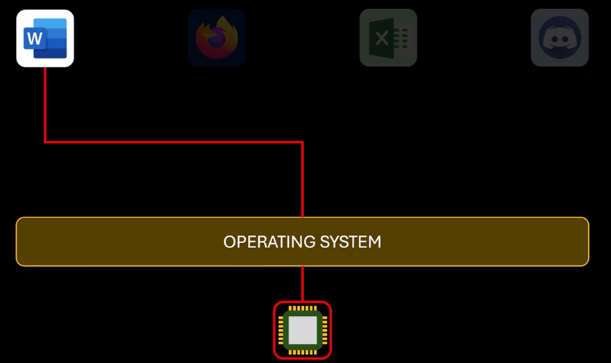
  <figcaption class="fig-caption">Esecuzione multi-processo su singolo core.</figcaption>
</figure>

La concorrenza però non ha il solo scopo di rendere le applicazioni che girano sui sistemi estremamente fluide, ma anche ottimizzare appieno l'utilizzo della CPU. Nell'esempio in figura se il processo sta svolgendo una operazione di I/O, la CPU rimane inutilizzata. 

<figure class="fig-float center" style="width: 80%;">
  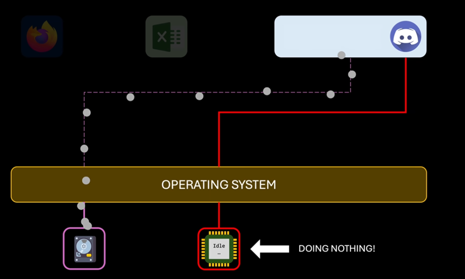
  <figcaption class="fig-caption">CPU inutilizzata durante operazione I/O.</figcaption>
</figure>

Tramite la concorrenza è possibile rilasciare la CPU che sta svolgendo tale operazione per occuparsi nel frattempo di altri processi. 

<figure class="fig-float center" style="width: 80%;">
  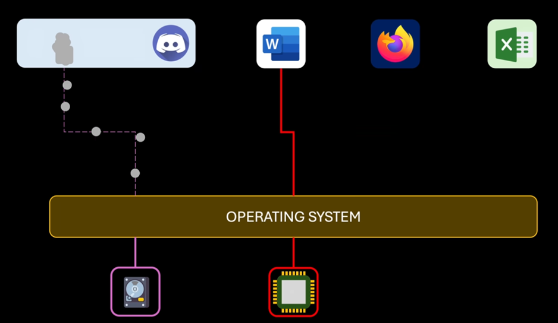
  <figcaption class="fig-caption">Utilizzo ottimizzato della CPU durante operazione I/O.</figcaption>
</figure>

### Definizione di Thread e Programmazione SingleThread
Fino a questo momento è stato dato per scontato che il processo sia una entità atomica, quando in realtà è un involucro complesso con una propria area di memoria di competenza e il vero motore che esegue il compito per cui è stato avviato, ovvero il thread. 

Un **Thread** è il più piccolo flusso di esecuzione che può essere gestito in maniera indipendente da uno scheduler di un sistema operativo. Quando viene istanziato un thread, il sistema operativo crea un'entità di esecuzione a basso livello dotata del proprio stack e del proprio program counter. Lo scheduler dell'OS gestisce questa entità attraverso cinque stati logici fondamentali:

* **New (Nuovo)**: Il thread è in fase di creazione e allocazione delle risorse da parte del kernel.
* **Ready (Pronto)**: Il thread è pronto per eseguire, ma è in coda in attesa che lo scheduler gli assegni un core della CPU.
* **Running (In Esecuzione)**: Il thread ha ottenuto il controllo di un core e sta eseguendo attivamente le sue istruzioni.
* **Blocked / Waiting (In Attesa)**: Il thread è temporaneamente sospeso. Succede quando invoca funzioni come <code>std::this_thread::sleep_for()</code>, quando attende un Mutex o un'operazione di I/O. In questo stato non consuma cicli di CPU.
* **Terminated (Terminato)**: Il thread ha completato l'esecuzione della sua funzione principale. Le sue risorse computazionali vengono rilasciate, ma i suoi metadati rimangono in memoria finché il thread padre non lo "raccoglie" (tramite join).

La **Programmazione SingleThread** è un modello di programmazione nel quale ciascun processo è caratterizzato da un singolo <u>sequenziale</u> e <u>deterministico</u> flusso di lavoro. Ogni istruzione viene eseguita una alla volta, nell'ordine in cui è stata scritta, e il risultato è sempre prevedibile e riproducibile. Nel seguente esempio prima si esegue la somma, poi la moltiplicazione ed infine si visualizza il risultato. L'ordine di esecuzione e il risultato sono sempre identici ad ogni run del programma.

```cpp
#include <iostream>

int somma(int a, int b) { return a + b; }
int moltiplica(int a, int b) { return a * b; }

int main() 
{
    int a = 5, b = 3;
    int s = somma(a, b);         // eseguito per primo
    int m = moltiplica(a, b);    // eseguito dopo
    std::cout << s << " " << m << " "; // eseguito per ultimo
}
```
I vantaggi di questo approccio sono:
* **Semplicità**: il codice è facile da scrivere, leggere e ragionare — non esistono accessi concorrenti né problemi di sincronizzazione.
* **Determinismo**: dato lo stesso input, il programma produce sempre lo stesso output nello stesso ordine.
* **Debugging semplice**: i bug sono riproducibili e lo stack trace riflette esattamente la sequenza di esecuzione.

A questo punto però potrebbe sorgere il quesito di quali siano gli svantaggi di questo approccio di programmazione visto i suoi punti di forza. Considerando il caso in figura, anche sfruttando la concorrenza, le istruzioni delle due funzioni interne al processo in blu in figura non possono essere eseguite contemporaneamente. Bisogna ricordare infatti che ciascun processo è dotato di un Program Counter che funziona da segnalibro per la CPU in modo che, quando ritornerà a lavorare su quel processo sarà da dove ripartire. Purtroppo però in questo scenario avendo a disposizione un solo flusso di esecuzione, quest'ultimo non può lavorare contemporaneamente ad entrambe le funzioni. 

<figure class="fig-float center" style="width: 80%;">
  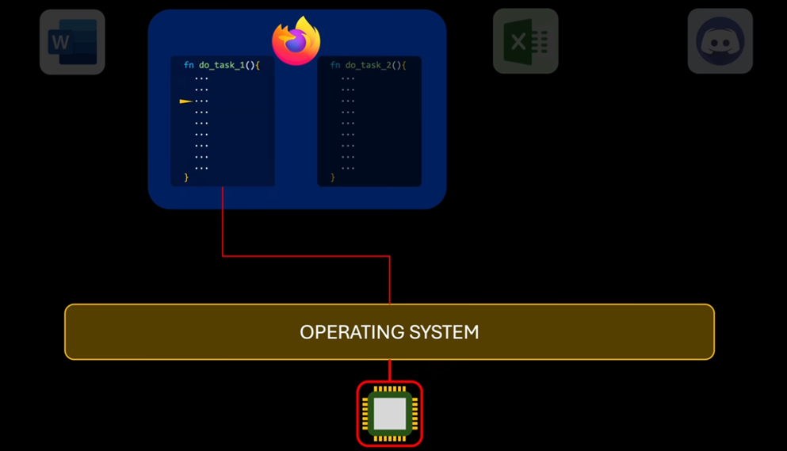
  <figcaption class="fig-caption">Esecuzione sequenziale single-thread di un processo.</figcaption>
</figure>

Una possibile soluzione potrebbe essere ripartire le funzioni in due processi separati ed adoperare l'inter process communication. Tuttavia non sempre questa soluzione è ottimale e in taluni casi i codici da svolgere in modo concorrente sono così correlati tra loro che risulta semplicemente sbagliato metterli in due processi differenti.

<figure class="fig-float center" style="width: 80%;">
  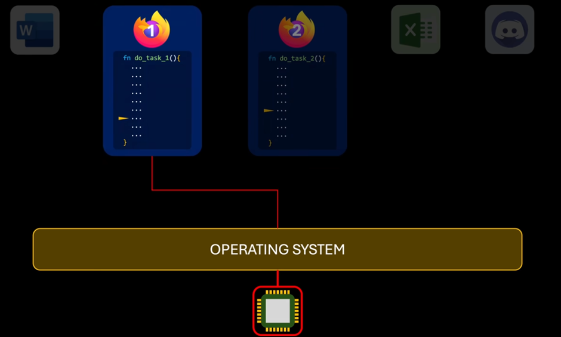
  <figcaption class="fig-caption">Processo ripartito.</figcaption>
</figure>

Consideriamo ora un altro esempio più realistico e concreto. Si suppone di avere un server che sulla porta 3000 offre come servizio ai client la possibilità di ricevere la foto profilo dell'utente. L'interazione a singolo utente sarà del tipo accettazione della richiesta da parte del client, processo per reperire l'immagine dal disco ed infine invio. Queste operazioni vengono eseguite in sequenza e tendenzialmente quella di durata più lunga è quella di elaborazione dell'immagine. 

<figure class="fig-float center" style="width: 80%;">
  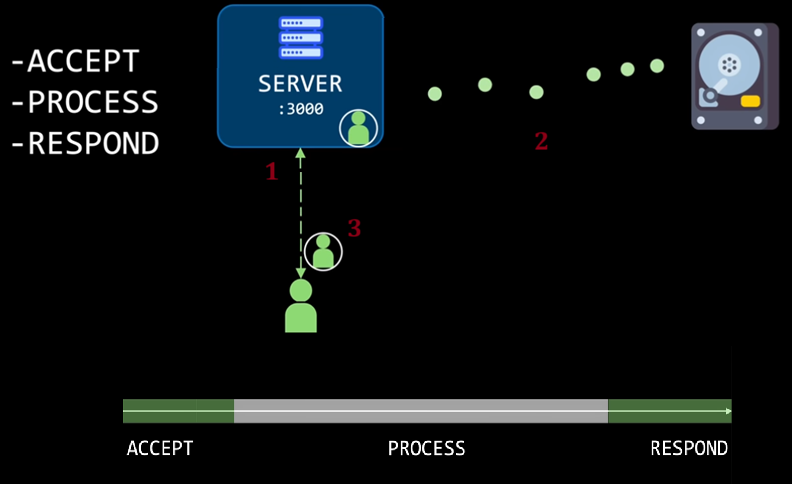
  <figcaption class="fig-caption">Esempio di recupero foto profilo a singolo utente caso single-thread.</figcaption>
</figure>

Con un approccio single-thread il server presenterà un processo che uno per volta servirà le richieste di tutti i suoi utenti. Il problema è che questo approccio non scala bene con l'aumentare del numero di utenti. Infatti operazioni che a singolo utente possono durare poche centinaia di millisecondi, cominceranno ad avere durate via via sempre più grandi con l'aumentare del carico sul server.

<figure class="fig-float center" style="width: 80%;">
  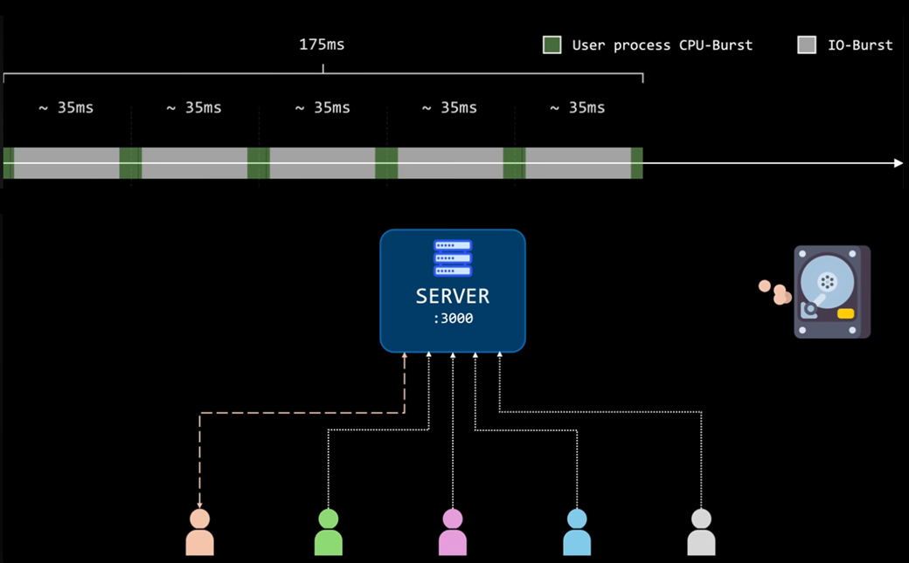
  <figcaption class="fig-caption">Esempio di recupero foto profilo multi-utente caso single-thread.</figcaption>
</figure>

L'approccio impiegato in passato era costruire un processo principale che ascolta le richieste dei clienti. All'arrivo di una richiesta tale processo invoca altri processi che eseguono l'elaborazione delle immagini profili.

<figure class="fig-float center" style="width: 80%;">
  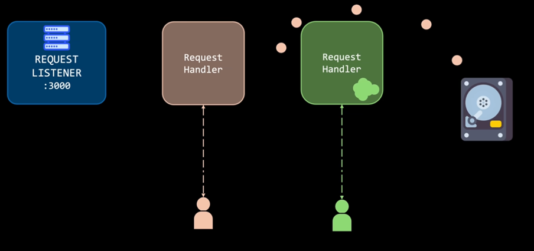
  <figcaption class="fig-caption">Esempio di recupero foto profilo multi-utente caso multiprocesso.</figcaption>
</figure>

Sebbene questo approccio ci consenta di sfruttare la concorrenza tra processi e migliori notevolmente la situazione iniziale, non è ancora l'ideale per differenti motivi:
* Creare un gran numero di processi con altrettanti spazi di indirizzamento isolati non consente un uso ottimale della memoria;
* Creare un gran numero di processi separati richiede complessi meccanismi di inter process communication tra quest'ultimi e il nodo server centrale;
* Creare processi non è un'operazione gratuita, infatti per il sistema operativo richiede tempo e sforzo. Nella seguente immagine si può osservare come la creazione di un nuovo processo ha richiesto un certo arco di tempo e risorse di calcolo.

<figure class="fig-float center" style="width: 80%;">
  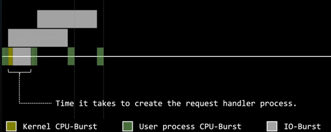
  <figcaption class="fig-caption">Costo computazionale per creare nuovi processi.</figcaption>
</figure>

Gli esempi mostrati evidenziano diversi limiti della programmazione single-thread:
* **Sottoutilizzo della CPU**: su un processore multicore un programma single-thread occupa un solo core, lasciando gli altri completamente inutilizzati.
* **Blocco su operazioni lente**: un'operazione di I/O, una chiamata di rete o un calcolo intensivo bloccano l'intero programma finché non completano — nessun altro lavoro può procedere nel frattempo.
* **Scalabilità limitata**: all'aumentare del carico di lavoro l'unica soluzione è rendere il singolo thread più veloce, il che ha un limite fisico invalicabile.

È necessario dunque un nuovo paradigma di programmazione che ci consenta di utilizzare il principio della concorrenza anche all'interno dell'ambito di un singolo processo.

### Programmazione Multithreading
Il **Multithreading** è una tecnica di programmazione in cui l'esecuzione di un programma viene suddivisa in più thread che operano simultaneamente e condividono la medesima area di memoria, consentendo così di sfruttare appieno l'architettura multicore della CPU.

Riprendendo la struttura tipica di un processo, il quale sarà costituito dall'area contenente il codice sorgente, spazio di indirizzamento, un PID, un program counter, un set di registri.

<figure class="fig-float center" style="width: 80%;">
  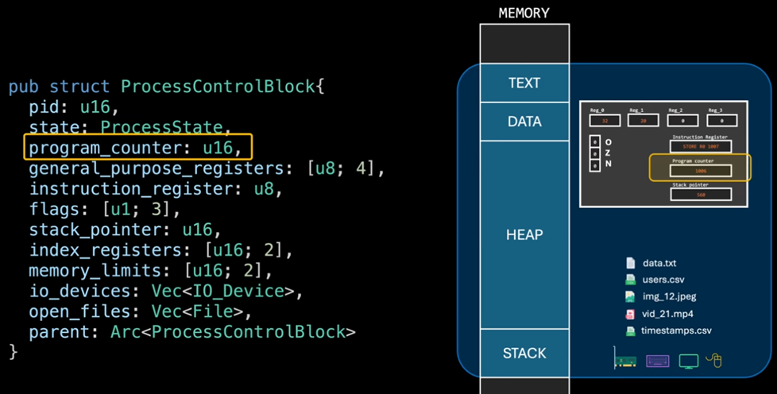
  <figcaption class="fig-caption">Struttura tipica di un processo.</figcaption>
</figure>

La limitazione è che un singolo program counter non abilita la programmazione concorrente all'interno di un dato processo. Se però internamente al processo creiamo dei singoli thread ciascuno dei quali con il proprio program counter, ecco che la CPU sarà in grado di capire quale istruzione di quei dati flussi di lavoro aveva lasciato in sospeso. 

<figure class="fig-float center" style="width: 80%;">
  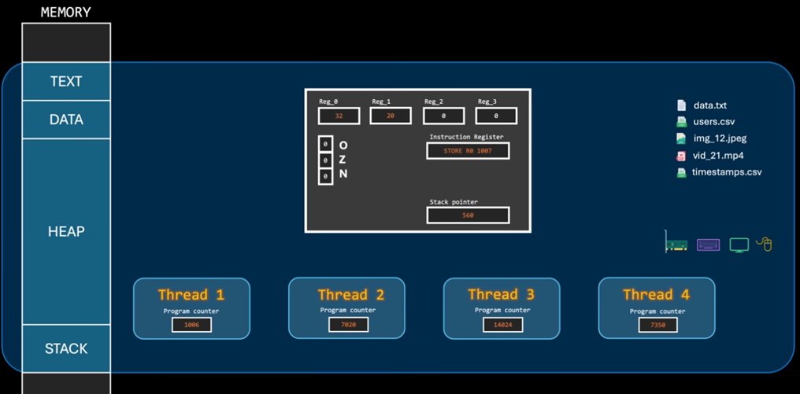
  <figcaption class="fig-caption">Multithread process.</figcaption>
</figure>

Grazie a questa strategia software siamo in grado di impiegare la programmazione multithreading per creare più flussi di lavoro concorrenti nell'ambito di un singolo processo.

<figure class="fig-float center" style="width: 80%;">
  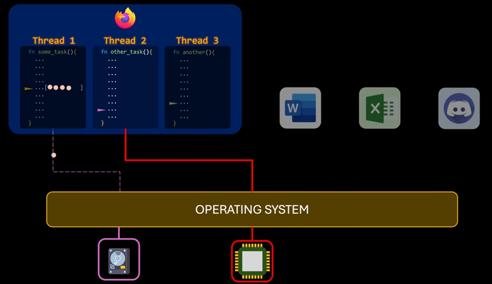
  <figcaption class="fig-caption">Esempio di multithreading.</figcaption>
</figure>

È bene però evidenziare che i thread, sebbene condividano lo stesso spazio di indirizzamento del processo a cui appartengono, non possono condividere uno stato della CPU come può fare nativamente un processo. Motivo per cui, in maniera analoga ai processi, anche i thread dovranno presentare oltre ad un program counter anche un set di registri, flag e accumulatori. Uno degli elementi più interessanti è un puntatore ad uno stack che solitamente è utilizzato come mezzo efficiente e veloce per accedere alle variabili locali. Nel caso dei thread ciascuno di essi avrà una porzione di stack assegnata al proprio flusso di lavoro. Purtroppo però, visto che l'intero spazio di indirizzamento del processo è condiviso tra i thread, nulla può impedire ad uno di essi di invadere lo stack di un altro. Proprio per questa ragione i meccanismi di sincronizzazione dei thread circa lo stack separato sono implementati a livello hardware. 

<figure class="fig-float center" style="width: 80%;">
  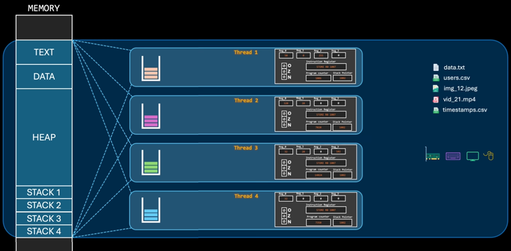
  <figcaption class="fig-caption">Struttura interna dei thread.</figcaption>
</figure>

A questo punto nel nostro sistema avremo la convivenza sia di thread figli del medesimo processo sia di processi che parlano fra loro mediante inter process communication.

<figure class="fig-float center" style="width: 80%;">
  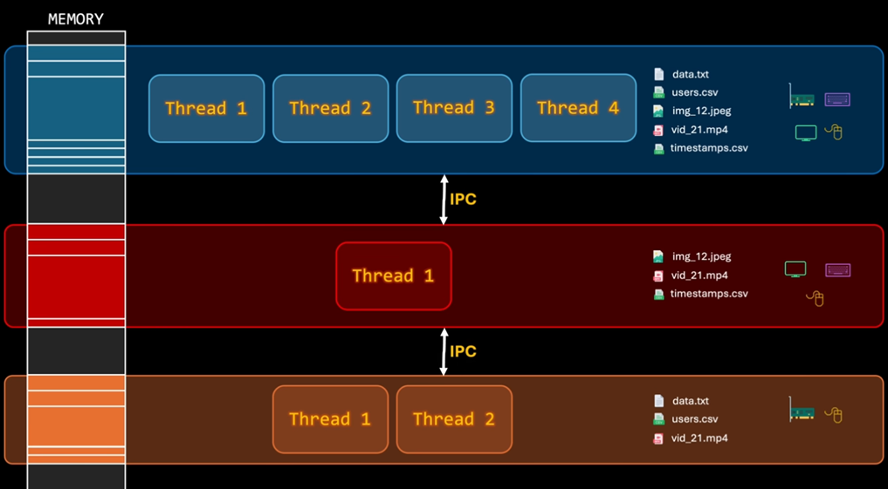
  <figcaption class="fig-caption">Multithread e multiprocess.</figcaption>
</figure>

Questa distinzione tra thread e processi potrebbe portare in prima battuta ad una rivisitazione delle strutture di controllo di queste due tipologie di entità. Invece, l'approccio impiegato nel kernel Linux è di utilizzare per entrambi la medesima struttura denominata come **Task**, astraendo dal concetto di thread o processo. 

<figure class="fig-float center" style="width: 80%;">
  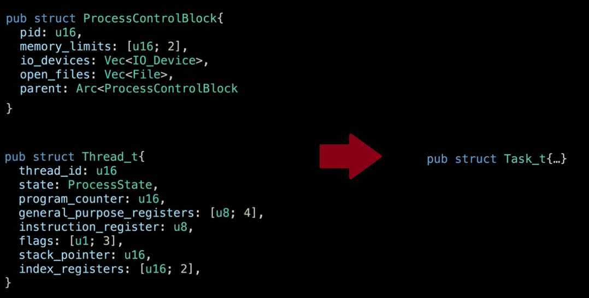
  <figcaption class="fig-caption">Struttura di controllo di thread e processi come task.</figcaption>
</figure>

Grazie a questo approccio molti sistemi operativi quando creano un nuovo processo vi associano un **Main Thread** che contiene il flusso principale che a sua volta è in grado di avviare thread secondari.

<figure class="fig-float center" style="width: 80%;">
  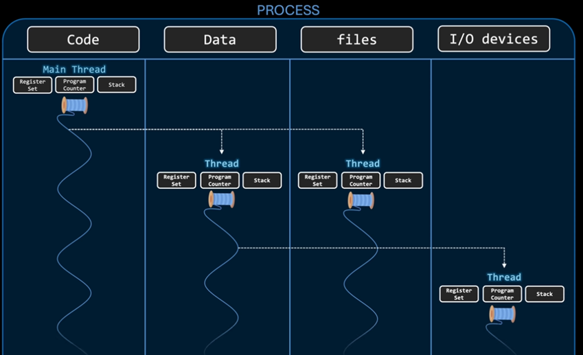
  <figcaption class="fig-caption">Main thread che avvia thread secondari.</figcaption>
</figure>

Si delinea così una situazione come quella mostrata in figura. 

<figure class="fig-float center" style="width: 80%;">
  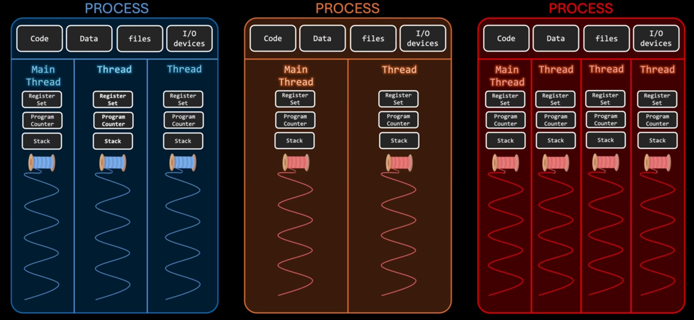
  <figcaption class="fig-caption">Processi con un main thread e thread secondari.</figcaption>
</figure>

Riprendendo l'esempio del server che fornisce le immagini profilo ai client, ad ogni richiesta di questi ultimi il thread principale creerà tanti thread quante sono le richieste.

<figure class="fig-float center" style="width: 80%;">
  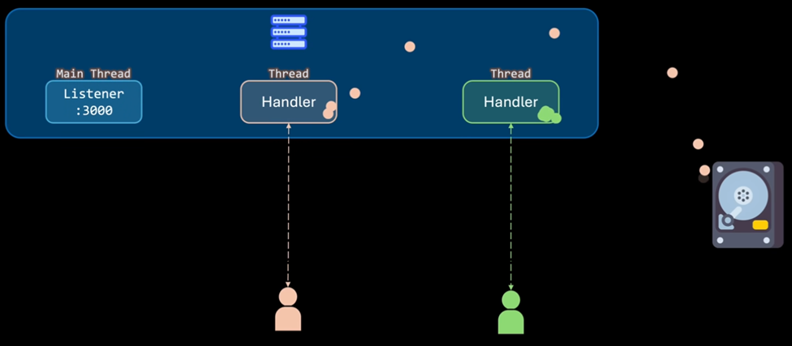
  <figcaption class="fig-caption">Esempio delle immagini profilo da server in caso multithread.</figcaption>
</figure>

E nel caso multithreading, l'apertura di un nuovo thread è notevolmente meno onerosa che creare un nuovo processo.

<figure class="fig-float center" style="width: 80%;">
  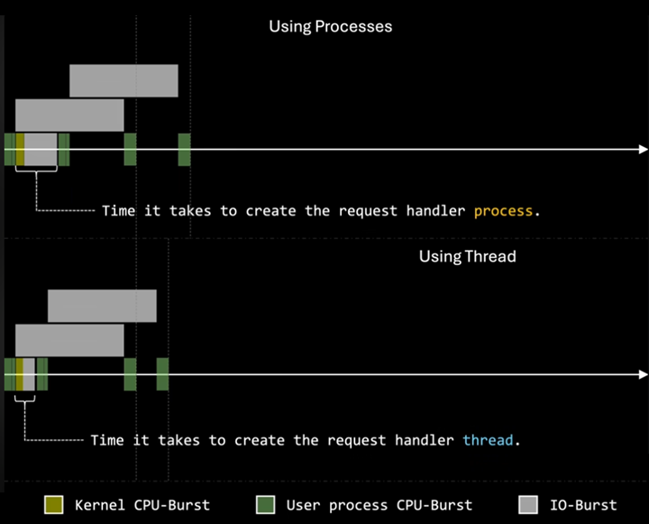
  <figcaption class="fig-caption">Costo temporale di creare nuovi thread.</figcaption>
</figure>

Per concludere questa panoramica sulla programmazione multithreading si vuole evidenziare un aspetto cruciale dei thread. I thread, seppure come si vedrà nella loro implementazione in C++ potrebbe sembrare il contrario, <u>non sono</u> una funzione e non contengono codice ma al contrario puntano al codice mediante il proprio Program Counter. Questo significa che diversi thread possono puntare alla stessa porzione di codice. Non a caso nell'esempio del server che fornisce le immagini profilo, i diversi thread puntano tutti al codice che accetta, processa e restituisce i dati necessari indipendentemente da chi ha inviato la richiesta. Questo puntamento multiplo alla sezione Text da parte di più thread è tra l'altro sicuro perché non sono aree in cui essi possono scrivere. 

<figure class="fig-float center" style="width: 80%;">
  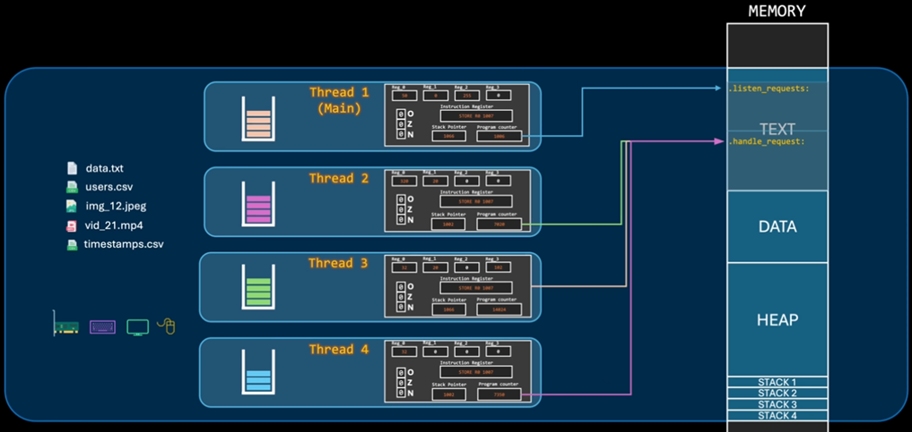
  <figcaption class="fig-caption">Thread che punta al codice.</figcaption>
</figure>

### Problemi del Multithreading e Programmazione Parallela
Nei precedenti paragrafi è stato mostrato come anzitutto grazie alla concorrenza siamo in grado di evitare che task di breve durata debbano attendere tempi troppo lunghi per essere eseguiti dalla CPU.

<figure class="fig-float center" style="width: 80%;">
  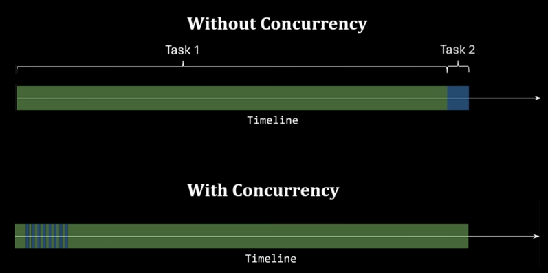
  <figcaption class="fig-caption">Esecuzione di due processi senza e con concorrenza.</figcaption>
</figure>

Con il multithreading abbiamo abilitato la CPU ad eseguire più attività nel medesimo processo in modo da ottimizzare in modo significativo l'utilizzo della CPU. 

<figure class="fig-float center" style="width: 80%;">
  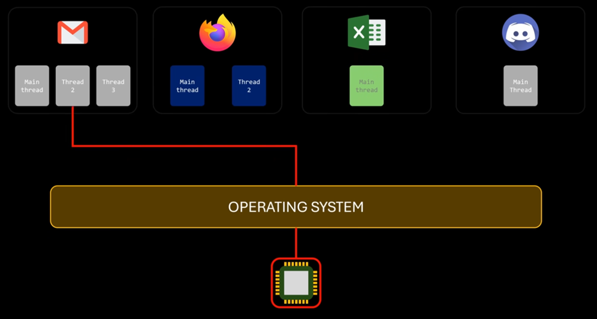
  <figcaption class="fig-caption">Multithreading nei processi.</figcaption>
</figure>

Questo nuovo paradigma di programmazione, pur portando con sé un importante aumento di prestazioni delle nostre applicazioni, non è esente da nuove tipologie di criticità assenti nei vecchi paradigmi. Alcuni dei problemi più noti sono:
* **Deadlock**: si verifica quando due o più thread rimangono bloccati indefinitamente perché ciascuno è in attesa di una risorsa condivisa detenuta dall'altro, creando un ciclo di attesa da cui nessuno può uscire.
* **Race condition**: si verifica quando più thread accedono simultaneamente a dati condivisi e almeno uno di essi li modifica, causando risultati imprevedibili o errati.
* **Starvation**: si verifica quando un thread non riesce ad accedere alle risorse condivise perché altri thread continuano ad avere la priorità, impedendogli di progredire nella propria esecuzione.

Questi problemi verranno affrontati mediante apposite tecniche e stratagemmi nei successivi capitoli. 

Altro problema, meno critico di quelli prima citati, ma comunque significativo è che il multithreading non migliora le prestazioni in modo assoluto. Negli scenari con un numero elevatissimo di processi con altrettanti thread, l'overhead di sincronizzazione o gli accessi frequenti a risorse condivise possono addirittura penalizzare le performance. Risultato di ciò: le applicazioni, nonostante le elevatissime frequenze di lavoro della CPU, appariranno poco fluide e molto lente. 

<figure class="fig-float center" style="width: 80%;">
  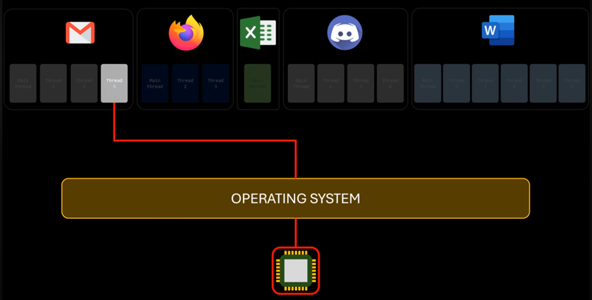
  <figcaption class="fig-caption">Il multithreading è limitato nel numero di attività che può eseguire in modo concorrente.</figcaption>
</figure>

In prima battuta si potrebbe pensare di costruire metodologie di accesso intelligente alla CPU. Tuttavia, anche qui ci sono delle importanti limitazioni oltre a dover costruire complesse strategie di CPU scheduling. In questo caso l'idea più banale è semplicemente aumentare la forza lavoro passando a CPU multicore, motherboard con più CPU o, meno di frequente, combinare entrambe per ottenere potere di calcolo massimo. Questa importante modifica hardware abilita un nuovo concetto di programmazione.

<figure class="fig-float center" style="width: 80%;">
  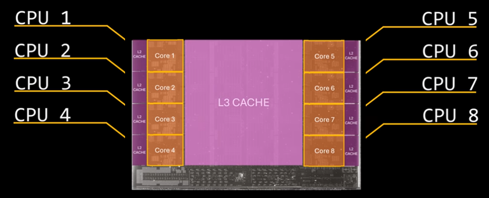
  <figcaption class="fig-caption">CPU multicore.</figcaption>
</figure>

<figure class="fig-float center" style="width: 80%;">
  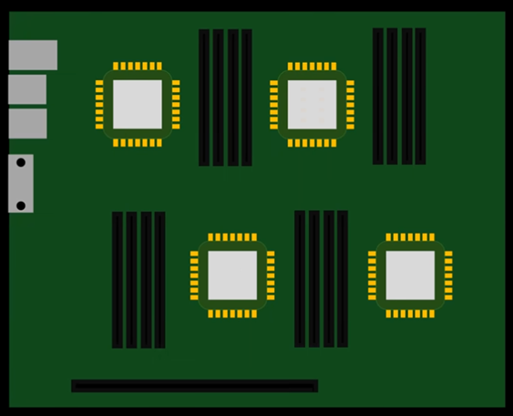
  <figcaption class="fig-caption">Scheda madre multi processore.</figcaption>
</figure>

**Definizione - Parallelismo**: una condizione di un sistema in cui più attività avanzano effettivamente contemporaneamente.

Nella seguente immagine sono mostrate le differenze tra i concetti di concorrenza, parallelismo e la loro combinazione. Nei contesti moderni infatti abbiamo l'impiego di concorrenza e parallelismo in modo da avere il meglio dei due mondi.

<figure class="fig-float center" style="width: 80%;">
  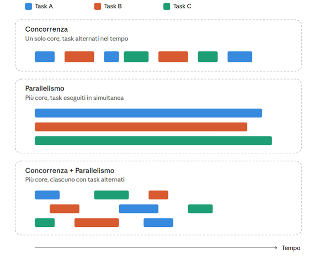
  <figcaption class="fig-caption">Concorrenza e parallelismo.</figcaption>
</figure>

Per apprezzare questa definizione consideriamo di avere una applicazione che presenta 8 thread. Nel caso di una CPU single-core la concorrenza gestisce lo scheduling dei thread:

<figure class="fig-float center" style="width: 80%;">
  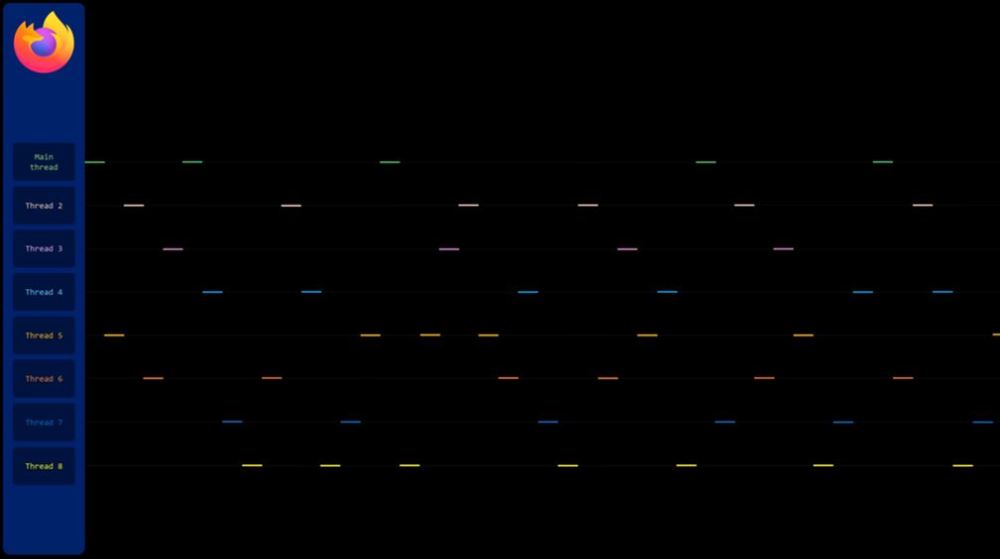
  <figcaption class="fig-caption">Concorrenza nel caso di una applicazione con 8 thread.</figcaption>
</figure>

Nel caso del parallelismo si ottiene questo risultato in cui i tratti di esecuzione dei diversi thread vengono eseguiti da uno dei quattro core di cui è dotata la CPU.

<figure class="fig-float center" style="width: 80%;">
  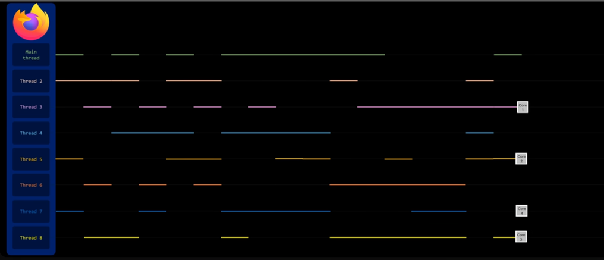
  <figcaption class="fig-caption">Concorrenza e parallelismo nel caso di una applicazione con 8 thread.</figcaption>
</figure>

Poiché le due immagini viste poc'anzi sono valutate sulla base del tempo di esecuzione dei thread non si apprezzano le differenze tra i due paradigmi. 

<figure class="fig-float center" style="width: 80%;">
  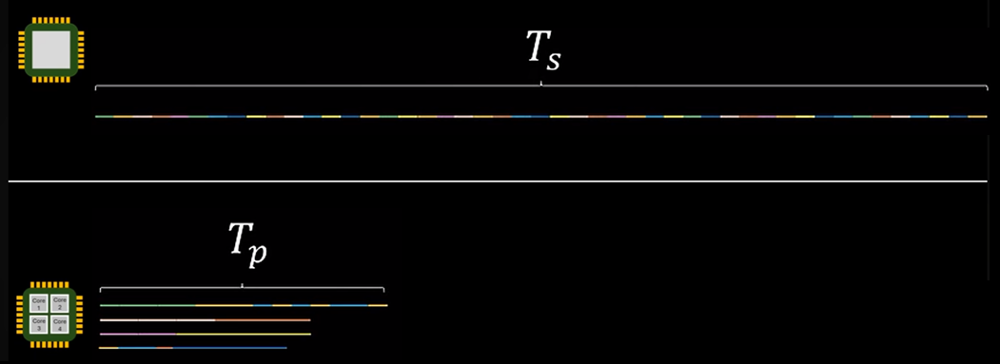
  <figcaption class="fig-caption">Concorrenza e parallelismo nel caso di una applicazione con 8 thread dal punto di vista dei core.</figcaption>
</figure>

Esistono inoltre due forme di parallelismo:
1. **Parallelismo dei Data**: si basa sulla distribuzione di insiemi degli stessi dati e sull'esecuzione delle medesime operazioni sui core.
2. **Parallelismo dei Task**: si concentra sulla distribuzione dei task ai diversi core. Per esempio ricercare il minimo, il massimo, la media e il valore 101 in un array. L'array è il medesimo e sarà reso disponibile a tutti i core ma ciascuno sarà associato ad una certa attività.

<figure class="fig-float center" style="width: 80%;">
  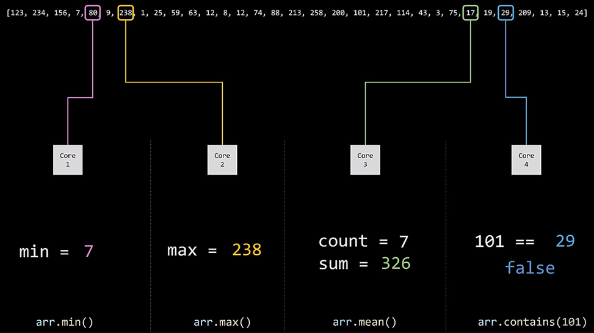
  <figcaption class="fig-caption">Attività di ricerca del minimo, massimo, calcolo del valor medio e del valore 101 in un array.</figcaption>
</figure>

Grazie all'introduzione del concetto di parallelismo risulta ancora più ideale avere come thread le unità di lavoro fondamentali, i quali saranno associati ai core di cui la CPU è composta. Il programmatore in questo caso dovrà gestire esclusivamente la concorrenza perché sarà poi il sistema operativo a gestire il parallelismo.

<figure class="fig-float center" style="width: 80%;">
  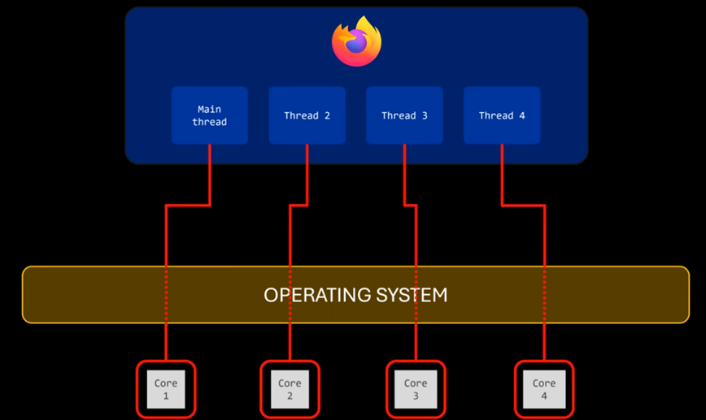
  <figcaption class="fig-caption">Core assegnati ai thread.</figcaption>
</figure>

Per concludere, è bene evidenziare che:
* Il numero di core è fisso, per cui se ci sono N core fino ad N attività possono essere eseguite in parallelo.
* I thread competono per le risorse per cui anche rispettando la regola precedente non è detto che effettivamente i task verranno eseguiti in parallelo perché in ogni caso il sistema operativo cerca di distribuire in modo equo l'utilizzo delle risorse ed in particolare la CPU. Questo spiega perché in una attività di parallelismo di ricerca di numeri pari in un array, pur ripartendo la base di dati sui diversi core si ottengono tempi di calcolo differenti:

<figure class="fig-float center" style="width: 80%;">
  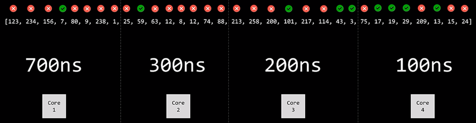
  <figcaption class="fig-caption">Ricerca dei numeri pari caso parallelo con tempi di esecuzione differenti.</figcaption>
</figure>

### Best Practices

Nell'odierno ambiente di calcolo multi-core, il multithreading in C++ è diventato una competenza chiave per la creazione di applicazioni performanti e reattive. La libreria standard C++, a partire da C++11, offre un solido supporto per il multithreading tramite componenti come <code>std::thread</code>, <code>std::mutex</code>, <code>std::lock_guard</code> e <code>std::condition_variable</code>. Questi strumenti consentono agli sviluppatori di creare e gestire thread, sincronizzare l'accesso alle risorse condivise e costruire sistemi concorrenti che utilizzano in modo efficiente i core della CPU. 

Nel linguaggio comune spesso si possono confondere processi e thread, che tuttavia sono oggetti piuttosto differenti che si riflettono nei concetti di multithreading e multiprocessing. Un thread è stato definito come il più piccolo flusso di lavoro schedulabile dal sistema operativo. Differenti thread possono comunicare molto facilmente tramite memoria condivisa, con tutti i relativi problemi di condivisione e sincronizzazione. Un processo invece è un oggetto più complesso che può presentare al suo interno differenti thread e richiede dunque molto più risorse e meccanismi di comunicazione con altri processi noti come IPC (*Inter-Process Communication*). Un processo è dunque un flusso totalmente indipendente da altri processi e dunque il suo crash non nuoce a quest'ultimi contrariamente a quanto avviene per i thread facenti parte del medesimo processo.

<figure class="fig-float center" style="width: 80%;">
  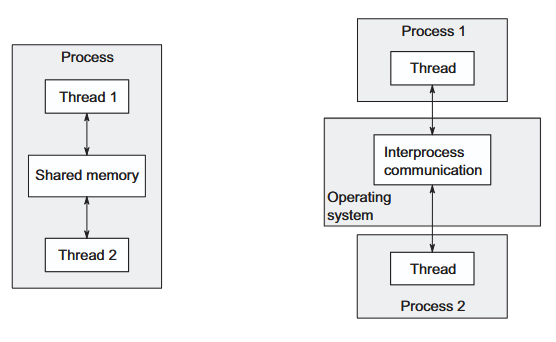
  <figcaption class="fig-caption">Comparazione di comunicazione nel caso multithreading e multiprocessing.</figcaption>
</figure>

<figure class="fig-float center" style="width: 80%;">
  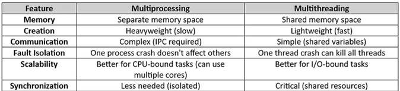
  <figcaption class="fig-caption">Differenze tra multithreading e multiprocessing.</figcaption>
</figure>

Per questi motivi conviene usare il multithreading per:

* Le attività sono limitate dall'I/O (rete, operazioni su disco)
* È necessaria una comunicazione rapida tra le attività
* L'efficienza della memoria è importante
* Si sta lavorando all'interno di una singola applicazione

mentre il multiprocessing per:

* Le attività sono limitate dalla CPU e possono trarre vantaggio da più core
* È necessario un forte isolamento tra le attività
* Si sta coordinando tra programmi separati
* La stabilità è fondamentale (un crash non dovrebbe influire sugli altri processi)

Quando si adotta il paradigma del multithreading conviene seguire le seguenti linee guida:

* **Ridurre al minimo i dati condivisi**: minore è la quantità di dati condivisi tra i thread, minori saranno i problemi di sincronizzazione.
* **Preferisci i wrapper RAII**: usa sempre <code>std::lock_guard</code> o <code>std::unique_lock</code> invece di utilizzare direttamente i mutex per bloccare/sbloccare i dati.
* **Evita i deadlock**: acquisisci sempre più lock nello stesso ordine tra i thread.
* **Considera la sicurezza dei thread in fase di progettazione**: è molto più difficile implementarla in seguito.
* **Usa i pool di thread**: creare e distruggere thread è un'operazione costosa; riutilizzali quando possibile.
* **Considera il parallelismo basato su task**: astrazioni di livello superiore come <code>std::async</code> possono semplificare il codice.

In conclusione, il multithreading in C++ consente agli sviluppatori di creare applicazioni efficienti e reattive, abilitando la vera concorrenza. Tuttavia, introduce una complessità che richiede una solida comprensione del comportamento dei thread, dei meccanismi di sincronizzazione e un'attenta progettazione. Sebbene il C++ moderno offra funzionalità e astrazioni avanzate per il threading, le principali sfide della programmazione concorrente, come le race condition e i deadlock, persistono. Dare priorità alla correttezza e alla chiarezza del codice rispetto alle micro-ottimizzazioni e non esitare a sfruttare costrutti di livello superiore quando semplificano la progettazione e migliorano la manutenibilità.

---

## Thread Management

In principio i programmatori che sviluppavano codice in C++ per essere abilitati alla programmazione multithreading dovevano adoperare lavorare in stile C mediante thread POSIX (comunemente chiamati PThreads), arrivando così a soluzioni difficili da manutenere e debuggare. A partire però dall'avvento di C++11 è stato introdotto in C++ la libreria standard <code>std::thread</code> che non solo introduceva i thread anche in questo linguaggio ma oggetti più particolari come i mutex, le condition variables e i task. Il C++17 ha introdotto poi un notevole salto in avanti per la libreria <code>std::thread</code> attraverso gli algoritmi paralleli e il C++20 aggiunge costrutti e coroutine sempre più fini e avanzate.

<figure class="fig-float center" style="width: 80%;">
  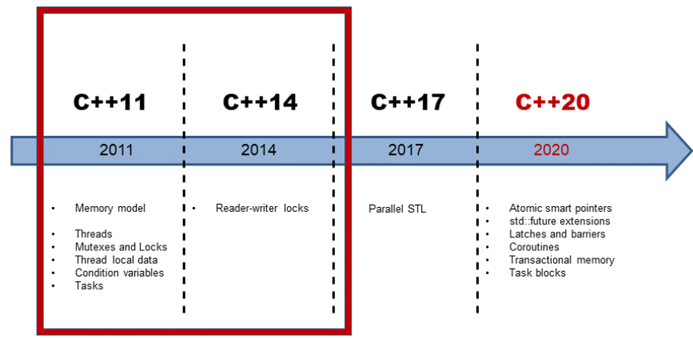
  <figcaption class="fig-caption">Evoluzione della libreria standard std::thread.</figcaption>
</figure>

### Creare un Thread

L'<code>std::thread</code> è la classe wrapper della STL che controlla il thread reale gestito dal kernel del sistema operativo. In virtù di tale definizione è bene evidenziare che <u>i cicli di vita del thread reale e del std::thread sono interconnessi ma non coincidono tra loro</u>.

La creazione di un <code>std::thread</code> si realizza definendo un nome e passando come argomento un *callable*, quindi una funzione, una lambda, functor con tutti i relativi parametri di input di quest'ultimi.
E' importante osservare che il thread parte **immediatamente** alla costruzione dell'oggetto.

```cpp
std::thread thread_name(callable);
```

Di seguito sono elencati i diversi modi in cui è possibile creare un thread mediante diversi tipi di *callable*:

A. **Funzione Libera**: Rappresenta l'approccio più lineare e tradizionale, ereditato dallo stile di programmazione procedurale.

```cpp
#include <thread>
#include <iostream>

void lavoro(int id) {
    std::cout << "Thread " << id << "\n";
}

// Inizializzazione del thread passando la funzione libera e il suo argomento
std::thread t1(lavoro, 42);
t1.join();
```

B. **Espressione Lambda**: È la forma di gran lunga più comune e utilizzata a partire dallo standard C++11, poiché consente di definire il compito direttamente *in-place* senza inquinare il namespace globale.

```cpp
#include <thread>
#include <iostream>

// Creazione del thread con una lambda catturata a runtime
std::thread t2([](int id) {
    std::cout << "Lambda " << id << "\n";
}, 7);
t2.join();
```

C. **Metodo Membro di un'Istanza di Classe**: Permette di delegare l'esecuzione a un metodo non statico di un oggetto. In questo scenario, è tassativo passare l'indirizzo del metodo come primo argomento e l'indirizzo dell'istanza specifica (<code>&w</code>) come secondo parametro, prima di elencare gli eventuali argomenti del metodo.

```cpp
#include <thread>

struct Worker {
    void esegui(int n) { /* ... */ }
};

Worker w;
std::thread t3(&Worker::esegui, &w, 10);
t3.join();
```

D. **Funtore (Oggetto Funzionale)**: Si realizza passando un'istanza di una classe o struttura che implementa l'overload dell'operatore di chiamata di funzione <code>operator()</code>.

```cpp
#include <thread>

struct Functor {
    void operator()(int n) { /* ... */ }
};

// Il thread accetta un'istanza temporanea del funtore costruita rvalue
std::thread t4(Functor{}, 5);
t4.join();
```

E. **Funzione Membro Statica**
A differenza dei metodi d'istanza, le funzioni statiche appartengono alla classe in sé e non a un oggetto specifico. Di conseguenza, non richiedono il passaggio di alcun puntatore a un'istanza per essere invocate.

```cpp
#include <thread>
#include <iostream>

class MyClass {
public:
    void f1(int num) {
        std::cout << num << std::endl;
    }

    // Funzione statica: non ha accesso al puntatore 'this'
    static void f2(int num) {
        std::cout << num << std::endl;
    }
}; 

// Sintassi pulita senza la necessita' di passare un'istanza di MyClass
std::thread t5(&MyClass::f2, 7);
t5.join();
```

In tutte le casistiche analizzate potrebbe saltare all'occhio l'utilizzo della funzione <code>join()</code>. Questa funzione mette in attesa il programma chiamante del thread (per esempio un <code>main</code>) affinché proceda solo quando il thread ha concluso la sua esecuzione. Le ragioni di questo aspetto e i relativi casi particolari saranno trattati nel dettaglio in un apposito sottoparagrafo relativo all'unione o separazione dei flussi di esecuzione.

```cpp
thread_name.join();
```

Infine, per prevenire anomalie in fase di compilazione, è fondamentale analizzare una celebre ambiguità sintattica del linguaggio nota nella letteratura informatica come **C++'s most vexing parse** (la scomposizione più seccante). Il C++ eredita dal linguaggio C una regola grammaticale ambigua in virtù della quale qualsiasi costrutto che il compilatore possa interpretare come una dichiarazione di funzione verrà sistematicamente interpretato come tale, a scapito di una dichiarazione di variabile o di un'istanza di un oggetto. 

Per comprendere la genesi di questo problema, si consideri la definizione di un oggetto funzionale (*funtore*) espressa nel listato seguente. Seguendo l'approccio standard, l'architettura prevede l'inizializzazione esplicita di una variabile d'istanza da sottomettere successivamente al costruttore del thread:

```cpp
class background_task {
public:
    void operator()() const {
        do_something();
        do_something_else();
    }
};

background_task f;
std::thread my_thread(f); // Nessuna ambiguita' sintattica
```
Qualora il programmatore decidesse di contrarre il codice passando direttamente un oggetto temporaneo (*rvalue*) anonimo attraverso la sintassi tradizionale:

```cpp
std::thread my_thread(background_task());
```

Il compilatore non identificherà la nascita di un nuovo thread lavoratore, bensì interpreterà la riga come la definizione formale di un prototipo di funzione. Nello specifico, l'istruzione viene parsata nel modo seguente:

```cpp
// Il compilatore interpreta la riga come una dichiarazione di funzione
std::thread my_thread(background_task (*)(void));
```

Questa scomposizione evidenzia che, anziché allocare un flusso concorrente, si sta dichiarando una funzione globale denominata <code>my_thread</code>, il cui valore di ritorno è un oggetto <code>std::thread</code> e il cui unico parametro di input è un puntatore a una funzione che non accetta argomenti (<code>void</code>) e restituisce un'istanza di tipo <code>background_task</code>. 

Per risolvere radicalmente questa ambiguità, oltre alla già menzionata tecnica basata sulle variabili nominali, lo standard mette a disposizione due soluzioni sintattiche alternative:

```cpp
// Soluzione 1: L'uso di parentesi extra rompe il pattern della firma di funzione
std::thread my_thread((background_task()));

// Soluzione 2: La Uniform Initialization tramite graffe impedisce l'ambiguita'
std::thread my_thread{background_task()};
```

Mentre l'adozione delle doppie parentesi tonde forza il compilatore a valutare l'argomento interno come un'espressione di valore, l'adozione della *Uniform Initialization* tramite parentesi graffe (introdotta a partire da C++11) rappresenta la soluzione più moderna e idiomatica, poiché la grammatica del C++ vieta tassativamente l'uso delle graffe per la dichiarazione dei parametri di una funzione. E' da notare infine che questo problema non può avvenire in alcun modo quando stiamo impiegando le Lambda expression poiché la sintassi <code>[]{}</code> evita qualsiasi tipo di ambiguità. 

### Tipizzazione e Passaggio dei Parametri

Un aspetto architetturale di fondamentale importanza, comune a tutte le forme di *callable* sopra elencate, riguarda la gestione del valore di ritorno. È bene notare che, sebbene la funzione che svolge il lavoro del thread possa essere tipizzata e quindi fornire un valore di ritorno non-<code>void</code>, quest'ultimo verrà irrevocabilmente scartato dall'infrastruttura di <code>std::thread</code> e non sarà più utilizzabile nel flusso principale. 

Questa limitazione deriva direttamente dal design dei sistemi operativi sottostanti (come i thread POSIX su Linux o le API Win32 su Windows), i quali prevedono che la funzione di ingresso di un thread sia rigidamente tipizzata per restituire un tipo primitivo di stato (solitamente un intero o un puntatore generico <code>void*</code>). Quando <code>std::thread</code> incapsula il *callable* fornito dall'utente, esegue internamente un'operazione di cancellazione del tipo (*type erasure*) e ignora sistematicamente l'istruzione di <code>return</code>. Di conseguenza, qualora si renda necessario recuperare un valore calcolato da un thread secondario, il programmatore è costretto a ricorrere al passaggio di variabili per riferimento esplicito o, in un'ottica più moderna, al paradigma basato sui task descritto nelle sezioni successive.

Altro aspetto da evidenziare è il passaggio degli argomenti ai thread. Nell'utilizzo degli <code>std::thread</code> il comportamento di default è che tutti gli argomenti sono passati alla memoria del thread **per valore** e quindi copiati. Se volessimo passare oggetti per riferimento il programma non compilerebbe a meno che non si utilizzino <code>std::ref</code> per riferimenti modificabili oppure <code>std::cref</code> per riferimenti costanti. 

```cpp
void incrementa(int& valore) {
    valore += 1;
}

int x = 0;
std::thread t(incrementa, std::ref(x));
t.join();
// x == 1
```

> **Warning:** Il riferimento deve rimanere valido per tutta la durata del thread. Passare un riferimento a una variabile locale che esce dallo scope prima del join produce *undefined behavior*.

E' da notare che se l'argomento non è copiabile (es. <code>std::unique_ptr</code>), devi spostarlo esplicitamente:

```cpp
std::thread t(elabora, std::move(ptr));
```

Infine anche <code>std::thread</code> è **move-only**, quindi non è copiabile, ma è spostabile. La ownership del thread sottostante si trasferisce con il move.

```cpp
std::thread crea_thread() {
    return std::thread([]() { /* lavoro */ });
}

std::thread t = crea_thread(); // move da return value
t.join();

// Spostamento esplicito
std::thread t1(lavoro);
std::thread t2 = std::move(t1);
// t1.joinable() == false, t2.joinable() == true
t2.join();
```

### Funzioni di Utilità

Una volta avviato un thread, la libreria mette a disposizione una serie di funzioni globali e statiche per monitorare l'hardware del sistema o per influenzare il comportamento del thread che le sta eseguendo in quel preciso istante. 

Le funzioni legate all'azione diretta sul thread corrente sono racchiuse all'interno del namespace <code>std::this_thread</code>. La seguente tabella ne riassume le principali caratteristiche operative:

| Funzione | Descrizione Operativa |
| :--- | :--- |
| <code>std::this_thread::get_id()</code> | Restituisce un identificativo univoco (<code>std::thread::id</code>) del thread corrente. |
| <code>std::this_thread::yield()</code> | Suggerisce allo scheduler di sospendere il thread corrente per cedere il core ad altri flussi. |
| <code>std::this_thread::sleep_for(dur)</code> | Blocca l'esecuzione del thread per un intervallo di tempo specificato (es. millisecondi). |
| <code>std::this_thread::sleep_until(tp)</code> | Blocca l'esecuzione del thread fino a un punto temporale preciso (*time point*). |
| <code>std::thread::hardware_concurrency()</code> | Funzione statica che restituisce un'approssimazione del numero di core logici disponibili. |

Mentre le funzioni del namespace <code>this_thread</code> agiscono esclusivamente sul flusso che le invoca dall'interno (un thread non può forzare un altro thread a dormire o a cedere la CPU), la funzione statica <code>std::thread::hardware_concurrency()</code> è accessibile da qualsiasi punto del codice. Quest'ultima è di fondamentale importanza nelle applicazioni industriali per determinare dinamicamente il numero ottimale di thread da spawnare, evitando i fenomeni di *oversubscription* (ovvero creare più thread rispetto ai core fisici disponibili, appesantendo lo scheduler del sistema operativo).

Il seguente esempio mostra un utilizzo combinato di queste funzioni di utilità:

```cpp
#include <iostream>
#include <thread>
#include <chrono>

int main() {
    // Interrogazione dell'hardware di sistema
    std::cout << "Core logici disponibili: "
              << std::thread::hardware_concurrency() << "\n";

    // Avvio di un thread secondario
    std::thread t([]() {
        std::cout << "ID del thread secondario: " 
        << std::this_thread::get_id() << "\n";
        
        // Sospensione controllata per 200 millisecondi
        std::this_thread::sleep_for(std::chrono::milliseconds(200));
        
        // Rilascio volontario del core allo scheduler dell'OS
        std::this_thread::yield(); 
    });

    t.join();
    return 0;
}
```

### Unione dei Flussi di Esecuzione

Il corretto utilizzo dei thread non si esaurisce con il loro avvio e con il preciso passaggio dei parametri. Un secondo fattore cruciale è la gestione della convergenza dei flussi di esecuzione concorrenti rispetto al programma principale che li ha generati. Nelle sezioni precedenti si è dato per scontato l'utilizzo della funzione <code>join()</code>, la quale assolve proprio a questo compito, ma è fondamentale analizzarne in dettaglio il meccanismo operativo e le possibili alternative. Si distinguono, pertanto, due strategie di gestione duali:

A. **Unione dei Flussi (Joining)**: Si utilizza la funzione <code>join()</code> per governare la convergenza dei thread, un'operazione che assolve simultaneamente a due compiti fondamentali:

- Il primo è di natura temporale e riguarda la sincronizzazione: la chiamata a <code>join()</code> blocca l'esecuzione del flusso principale finché il thread secondario non ha terminato interamente il proprio compito. Qualora quest'ultimo abbia già concluso il suo lavoro, il chiamante non subirà alcun rallentamento e proseguirà la sua esecuzione normalmente.
- Il secondo compito, altrettanto cruciale, riguarda la gestione della memoria. La funzione <code>join()</code> rappresenta infatti una vera e propria operazione di bonifica per il sistema operativo: comunica esplicitamente al kernel che l'esecuzione del thread è terminata, consentendo il rilascio definitivo e la deallocazione di tutte le risorse hardware e software che gli erano state assegnate, come lo stack di memoria locale e i relativi metadati di gestione del sistema.

```cpp
int main() {
    std::thread t([]() {
        std::this_thread::sleep_for(std::chrono::seconds(3));
        std::cout << "Thread finito\n";
    });
    t.join(); // il main si blocca qui per 3 secondi
    std::cout << "Main finito\n"; // stampato DOPO il thread
}
```

B. **Separazione dei Flussi (Detaching)**: Si utilizza la funzione <code>detach()</code> per troncare esplicitamente il legame tra l'oggetto <code>std::thread</code> e il flusso di esecuzione reale. Questa strategia agisce in modo duale rispetto al <code>join()</code>: anziché sincronizzare i thread, rilascia il thread secondario in background, consentendo al thread principale di proseguire immediatamente con le istruzioni successive senza subire alcuna attesa. 

Il thread distaccato diventa a tutti gli effetti un processo autonomo sullo sfondo (spesso definito *daemon thread*). Da quel momento in poi, la responsabilità della gestione e della deallocazione delle sue risorse viene delegata interamente al sistema operativo, il quale si occuperà di terminare il thread non appena quest'ultimo avrà concluso la propria funzione o al momento della chiusura dell'intera applicazione.

```cpp
#include <iostream>
#include <thread>
#include <chrono>

int main() {
    std::thread t([]() {
        std::this_thread::sleep_for(std::chrono::seconds(3));
        std::cout << "Thread secondario finito\n"; 
        // Nota: potrebbe non fare in tempo a stampare
    });

    // Scollegamento immediato: il controllo passa all'OS
    t.detach(); 

    // Il main prosegue all'istante senza attendere i 3 secondi di sleep
    std::cout << "Main finito\n"; 
}
```

Le differenze tra i due approcci sono molteplici: la prima da citare riguarda la sicurezza circa la lettura dei risultati da parte del programma chiamante che è garantita nel caso del <code>join()</code> ma non certamente nel caso del <code>detach()</code>. Altro problema notevole sono le **Dangling reference**: infatti l'intero passato <u>per riferimento</u> al thread distaccato verrebbe distrutto al termine del main.

```cpp
int main() {
    int locale = 42;

    std::thread t([&locale]() {         // cattura per riferimento
        std::this_thread::sleep_for(std::chrono::seconds(2));
        std::cout << "locale" << "\n"; // stampato SUBITO
    });

    t.detach();
}
```

Ultimo aspetto da evidenziare è che il risultato di <code>joinable()</code> assume significati differenti. Nel caso del <code>join()</code> ci dice infatti se il thread è finito e le risorse sono state rilasciate, invece nel <code>detach()</code> ci informa se il thread si è già distaccato dal flusso principale. 

In definitiva, tendenzialmente viste le criticità del <code>detach()</code> si usa quasi sempre il <code>join()</code> nei casi in cui l'obiettivo è ricevere risultati dai thread, accedere ai dati locali, ecc. Si relega invece il <code>detach()</code> a casi specifici di task indipendenti (logging, heartbeat, pulizia cache), in cui il thread non accede mai a dati del programma chiamante o compiti di cui non interessa quando terminino.

Il linguaggio C++ non fornisce uno strumento per conoscere in quale specifico stato del sistema operativo si trovi un thread (ovvero se sia in *Running*, *Blocked*, ecc.); mette invece a disposizione il metodo booleano <code>t.joinable()</code>. 

Un oggetto <code>std::thread</code> si definisce **joinable** (<code>true</code>) se è associato a un thread hardware reale che è stato avviato e per il quale non è ancora stata completata un'operazione di unione (<code>join()</code>) o di separazione (<code>detach()</code>). Seppur con un nome parzialmente controintuitivo, che potrebbe far pensare a un indicatore dello stato di avanzamento del codice, questa funzione specifica in realtà un'unica informazione: se il thread conserva una responsabilità pendente verso il sistema operativo a causa di risorse allocate e non ancora rilasciate.

La seguente tabella mostra come le transizioni di stato del sistema operativo e le azioni sul codice C++ si riflettono sul valore restituito da <code>joinable()</code>:

| Azione nel Codice C++ | Stato Oggetto C++ | <code>joinable()</code> | Stato Thread (OS) |
| :--- | :--- | :--- | :--- |
| <code>std::thread t;</code> | Non inizializzato | <code>false</code> | Non esiste |
| <code>std::thread t(funzione);</code> | Attivo (Inizializzato) | <code>true</code> | New &rarr; Ready &rarr; Running |
| Il thread finisce i calcoli | Attivo (Inizializzato) | <code>true</code> | **Terminated** (ma non deallocato) |
| <code>t.join();</code> | Rilasciato | <code>false</code> | Distrutto e rimosso dall'OS |
| <code>t.detach();</code> | Scollegato | <code>false</code> | Gestito autonomamente dall'OS |
| <code>t2 = std::move(t1);</code> | Spostato (<code>t1</code> vuoto) | <code>false</code> (<code>t1</code>) / <code>true</code> (<code>t2</code>) | Invariato (il controllo passa a <code>t2</code>) |

Come evidenziato nella tabella, un dettaglio cruciale che spesso trae in inganno è lo stato in cui il thread ha concluso i suoi calcoli ma il codice non ha ancora invocato la funzione <code>join()</code>. Per il Sistema Operativo quel thread si trova nello stato **Terminated** (ha concluso la sua funzione e non consuma cicli di CPU), eppure per l'oggetto C++ risulta ancora **<code>joinable() == true</code>**. 

Questo accade perché il C++ esige che il programmatore chiami esplicitamente <code>join()</code> per "raccogliere" i metadati superstiti dal kernel ed eseguire la bonifica finale della memoria. Di conseguenza, prima di chiamare la funzione <code>join()</code> è sempre caldamente consigliato verificare che il thread sia effettivamente unibile mediante il metodo <code>joinable()</code>.

Se l'oggetto <code>std::thread</code> esce dallo scope ed entra nel suo distruttore mentre <code>joinable()</code> è ancora <code>true</code>, il runtime del C++ invocherà immediatamente <code>std::terminate()</code>, provocando l'aborto istantaneo dell'applicazione. Nello specifico, in caso di mancata gestione del ciclo di vita del thread, si verificherebbe la seguente catena di eventi:

1. Il thread <code>t</code> viene avviato e inizia l'esecuzione dei suoi compiti in parallelo;
2. Il thread principale (<code>main</code>) prosegue autonomamente e raggiunge l'istruzione <code>return 0</code>;
3. Prima di completare l'uscita, il runtime distrugge le variabili locali dello scope, incluso l'oggetto <code>t</code>;
4. Il distruttore di <code>t</code> esegue il controllo interno e rileva che <code>joinable() == true</code>;
5. Viene invocata la funzione <code>std::terminate()</code> (definita nell'header <code><exception></code>), la quale chiama al suo interno <code>std::abort()</code> interrompendo bruscamente il programma;
6. Nello standard error (<code>stderr</code>) viene stampato il messaggio di crash: *"terminate called without an active exception"*.

Il vincolo imposto dal distruttore comporta un serio rischio: se il codice compreso tra la creazione del thread e la sua chiamata a <code>join()</code> dovesse lanciare un'eccezione, il flusso interromperebbe la sequenza lineare saltando l'unione. L'oggetto verrebbe distrutto durante lo *stack unwinding* con lo stato <code>joinable</code> ancora attivo, facendo crashare l'intero programma e mascherando l'eccezione originaria.

La soluzione idiomatica in C++17 per garantire l'unione in qualsiasi scenario consiste nell'applicare il pattern RAII (*Resource Acquisition Is Initialization*) mediante l'utilizzo di un wrapper di sicurezza, comunemente chiamato <code>ThreadGuard</code>.

```cpp
class ThreadGuard {
    std::thread& t_;
public:
    explicit ThreadGuard(std::thread& t) : t_(t) {}
    
    ~ThreadGuard() {
        // Il distruttore del wrapper mette in sicurezza il thread
        if (t_.joinable()) {
            t_.join();
        }
    }
    
    // Si disabilitano copia e assegnamento per impedire doppie gestioni
    ThreadGuard(const ThreadGuard&) = delete;
    ThreadGuard& operator=(const ThreadGuard&) = delete;
};

void funzione_che_puo_lanciare() {
    std::thread t(lavoro);
    ThreadGuard guard(t); 
    // Il join e ora garantito anche in caso di eccezione
    
    // ... codice che potrebbe sollevare eccezioni ...
    // Se un'eccezione viene lanciata, lo stack unwinding distrugge 'guard' 
    // e il suo distruttore chiama t.join() in sicurezza.
}
```

> **Tip (C++20):** A partire dallo standard C++20, questa problematica viene risolta nativamente introducendo la classe <code>std::jthread</code>. Questo nuovo oggetto eredita l'interfaccia di <code>std::thread</code> ma implementa internamente il pattern RAII, eseguendo il <code>join()</code> automatico nel proprio distruttore e aggiungendo il supporto alla cancellazione cooperativa.

### Gestione dei Thread Moderni

Il C++20 ha introdotto due novità che hanno portato a un notevole salto di qualità nello sviluppo multithreading, risolvendo due severe lacune nella gestione dei thread introdotti in C++11:

* **Joining thread (`std::jthread`)**: rappresenta l'evoluzione in chiave RAII (*Resource Acquisition Is Initialization*) di `std::thread`. Gli `std::thread` originari violavano infatti il principio RAII: se un oggetto `std::thread` veniva distrutto mentre si trovava ancora in uno stato *joinable* (ovvero con il thread hardware sottostante attivo e senza chiamate esplicite a `join()` o `detach()`), il runtime invocava forzatamente `std::terminate()`. Questo comportamento provocava il crash immediato dell'applicazione e costringeva i programmatori a gestire manualmente le `join()` all'interno di blocchi `try-catch` o tramite wrapper personalizzati. `std::jthread` sana questa lacuna: se l'oggetto è ancora *joinable* al momento dell'uscita dallo scope, il suo distruttore invoca automaticamente il metodo `join()`, bloccando il flusso chiamante fino alla terminazione naturale del thread lavoratore ed evitando qualsiasi arresto anomalo.

* **Cooperative Cancellation**: è un meccanismo di interruzione **cooperativo** e thread-safe per arrestare l'esecuzione di un thread, che risolve la storica mancanza di un protocollo standardizzato per l'interruzione dei flussi. Prima di C++20, arrestare un thread richiedeva l'implementazione di flag booleani globali personalizzati protetti da mutex, oppure l'uso di primitive distruttive dipendenti dal sistema operativo (come `pthread_cancel` su sistemi POSIX). Queste ultime interrompevano il flusso in modo asimmetrico e violento, impedendo il corretto rilascio dei lock o l'esecuzione dei distruttori delle variabili locali (*stack unwinding*), lasciando l'applicazione in uno stato inconsistente. La cancellazione cooperativa è strutturata su tre componenti fondamentali localizzate nell'header `<stop_token>`:

  * **`std::stop_source`**: Rappresenta l'entità che emette la richiesta di interruzione. Tramite il metodo `request_stop()`, notifica la volontà di arrestare l'esecuzione dei task associati.
  * **`std::stop_token`**: È l'endpoint passivo di lettura consegnato al thread lavoratore. Consente di verificare periodicamente, tramite il metodo `stop_requested()`, se una sorgente ha emesso una richiesta di stop.
  * **`std::stop_callback`**: Permette di registrare una funzione di callback che verrà invocata istantaneamente e in modo asincrono nel momento esatto in cui viene attivata la richiesta di stop, ideale per sbloccare operazioni di I/O o attese su variabili di condizione.

La caratteristica distintiva di `std::jthread` è l'integrazione nativa di questo framework. Quando si istanzia un `std::jthread` passando una funzione che accetta un `std::stop_token` come primo argomento, il runtime provvede automaticamente a generare e iniettare il token nel flusso parallelo. Inoltre, il distruttore di `std::jthread` esegue implicitamente una sequenza a due stadi: prima invoca `request_stop()` per segnalare la richiesta di interruzione al task, e subito dopo esegue la `join()` per attenderne la chiusura pulita.

Di seguito viene riportato un esempio completo che dimostra la robustezza di `std::jthread` nella gestione automatica dello scope e nell'interruzione sicura di un flusso computazionale.

```cpp
#include <iostream>
#include <thread>
#include <chrono>

// Funzione lavoratrice: il runtime inietta automaticamente lo stop_token
void compito_periodico(std::stop_token token) {
    std::cout << "[Worker] Thread avviato.\n";

    // Il thread verifica periodicamente se e' stato richiesto l'arresto
    while (!token.stop_requested()) {
        std::cout << "[Worker] Elaborazione dati in corso...\n";
        std::this_thread::sleep_for(std::chrono::milliseconds(400));
    }

    // Avviene lo stack unwinding regolare: i distruttori locali vengono invocati
    std::cout << "[Worker] Richiesta di stop intercettata. Rilascio risorse e chiusura pulita.\n";
}

int main() {
    std::cout << "[Main] Avvio del programma.\n";

    {
        // 1. Creazione dello jthread: non serve gestire manualmente il ciclo di vita
        std::jthread jt(compito_periodico);

        // Il thread principale esegue altre operazioni in parallelo
        std::this_thread::sleep_for(std::chrono::seconds(1));

        std::cout << "[Main] Uscita dallo scope interno dello jthread.\n";
        // 2. Al raggiungimento di questa parentesi graffa, il distruttore di jt:
        //    a) Invochera' automaticamente jt.request_stop()
        //    b) Invochera' automaticamente jt.join()
    } 

    std::cout << "[Main] Programma terminato con successo senza crash.\n";
    return 0;
}
```

---

## Data Races e Protezione dei Dati

Il potenziale della programmazione concorrente si esprime quando più thread cooperano per risolvere un problema comune condividendo porzioni di memoria, come variabili globali o strutture dati passate per riferimento. Tuttavia, l'accesso simultaneo ai dati in lettura e scrittura, se non regolamentato, introduce la più severa criticità hardware del multithreading: la corsa ai dati.

Una **Data Race** è un'anomalia legata all'accesso fisico alla memoria. Essa si verifica a livello hardware e di compilatore quando due o più thread accedono contemporaneamente alla stessa cella di memoria, e si manifestano tassativamente queste tre condizioni:

* *Accesso condiviso*: almeno due thread puntano alla medesima variabile.
* *Almeno una scrittura*: almeno uno dei thread coinvolti modifica il valore della variabile.
* *Assenza di sincronizzazione*: non viene implementato alcun meccanismo hardware o software per ordinare sequenzialmente gli accessi.

Lo standard C++ stabilisce che la presenza di una singola data race produce un **Undefined Behavior** (comportamento indefinito). Poiché i compilatori moderni ottimizzano il codice assumendo che il programmatore abbia garantito l'assenza di conflitti in memoria, la violazione di questo assunto permette al compilatore di generare codice macchina stravolto (ad esempio riordinando le istruzioni hardware o eliminando interi blocchi di controllo logico ritenuti ridondanti), provocando corruzioni silenziose dei dati o crash totalmente imprevedibili. Poiché le data race sono generalmente sensibili ai tempi di esecuzione, spesso possono scomparire completamente quando l'applicazione viene eseguita con il debugger, poiché il debugger influisce sui tempi di esecuzione del programma, anche se solo leggermente. 

Per comprendere la natura asincrona di una Data Race, si consideri il seguente frammento di codice non sincronizzato:

```cpp
#include <iostream>
#include <thread>

// Risorsa condivisa vulnerabile
int contatore = 0; 

void incrementa() {
    for (int i = 0; i < 100000; i++)
        contatore++;
}

int main() 
{
    std::thread t1(incrementa);
    std::thread t2(incrementa);
    t1.join();
    t2.join();

    // Ci si aspetta 200000, ma l'output e' imprevedibile
    std::cout << contatore << " "; 
    return 0;
}
```

Il motivo di questa inconsistenza risiede nel fatto che operazioni apparentemente atomiche nel codice sorgente high-level (come l'incremento <code>contatore++</code>) richiedono in realtà tre istruzioni assembly/CPU distinte:

1. **Lettura**: il valore viene copiato dalla RAM a un registro del processore.
2. **Modifica**: il valore all'interno del registro viene incrementato di una unità.
3. **Scrittura**: il nuovo valore viene riscritto dal registro alla cella di RAM originaria.

L'interleaving (sovrapposizione) inconsapevole di queste istruzioni tra più core porta inevitabilmente alla sovrascrittura distruttiva dei dati e alla perdita di calcolo.

Per eradicare le data race si applica il principio della mutua esclusione, garantendo che un solo thread alla volta possa accedere alla sezione critica del codice. La libreria standard offre diverse soluzioni organizzate secondo tre paradigmi differenti:

A. **Soluzioni basate su Lock Software Esclusivi Non RAII**
B. **Soluzioni basate su Lock Software Esclusivi RAII**
C. **Soluzioni basate su Lock Software Condivisi**
D. **Soluzione basata su Contatori di Permessi (<code>std::semaphore</code>)**

### Mutua Esclusione con Lock Software Esclusivi Non RAII
Le **Soluzioni basate su Lock Software Esclusivi** prevedono l'interruzione dell'esecuzione di un certo flusso di lavoro per impedire l'accesso a una risorsa già detenuta da un altro thread. In altre parole questi strumenti di mutua esclusione <u>inibiscono l'accesso</u> (lettura e scrittura) alla risorsa condivisa. Di seguito oltre al meccanismo esclusivo fondamentale sono elencate anche le sue varianti specializzate per esigenze di controllo temporale e ricorsione:

a. **`std::mutex`**: introdotto in C++11 rappresenta l'astrazione fondamentale di un meccanismo di mutua esclusione utilizzato per garantire l'accesso esclusivo a una risorsa condivisa. Quando un thread acquisisce il mutex, tutti gli altri thread che tentano di acquisirlo rimangono bloccati finché il primo non lo rilascia. L'oggetto non è copiabile né spostabile (*non-copyable*, *non-movable*) e il suo costruttore di default non richiede parametri.

La classe mette a disposizione i metodi `lock()`, che blocca il thread chiamante fino all'acquisizione del mutex, `try_lock()`, che tenta un'acquisizione non bloccante restituendo immediatamente l'esito dell'operazione, e `unlock()`, che rilascia il mutex consentendo ad altri thread di acquisirlo.

```cpp
#include <mutex>
#include <thread>
#include <iostream>

std::mutex mtx;
int shared_data = 0;

void increment() {
    mtx.lock(); 
    ++shared_data;
    mtx.unlock();
}

int main() {
    std::thread t1(increment);
    std::thread t2(increment);
    t1.join(); t2.join();
    std::cout << "Final value: " << shared_data << std::endl;
    return 0;
}
```

b. **`std::timed_mutex` (C++11)**: Estende `std::mutex` introducendo il blocco temporizzato tramite i metodi:
   - `try_lock_for(duration)`: Tenta l'acquisizione attendendo al massimo per l'intervallo temporale specificato (es. `std::chrono::milliseconds(100)`).
   - `try_lock_until(timepoint)`: Tenta l'acquisizione fino al raggiungimento di un istante di tempo assoluto.
   Offre una via di mezzo tra l'attesa indefinita di `lock()` e il tentativo istantaneo di `try_lock()`, utilissimo per prevenire deadlock in sistemi tempo-reale.

c. **`std::recursive_mutex` (C++11)**: Permette allo **stesso thread** che ha già acquisito il mutex di invocarne nuovamente la `lock()` senza generare un auto-deadlock. 
   - **Meccanismo**: Mantiene un contatore interno delle acquisizioni. Per rendere nuovamente disponibile il mutex ad altri thread, il thread proprietario deve eseguire un numero di chiamate a `unlock()` pari a quello delle `lock()` effettuate.
   - **Casi d'uso**: Indispensabile nell'implementazione di funzioni ricorsive o quando metodi pubblici protetti da mutex chiamano internamente altri metodi della stessa classe che ri-acquisiscono lo stesso mutex.
   - **Nota di attenzione**: Il limite massimo di ri-acquisizioni annidate dipende dall'implementazione; il superamento di tale soglia comporta il lancio di un'eccezione `std::system_error`.

d. **`std::recursive_timed_mutex` (C++11)**: Combina le funzionalità di un mutex ricorsivo con quel

L'utilizzo diretto di queste primitive è fortemente sconsigliato. Se, per qualsiasi motivo (ad esempio una dimenticanza nel codice, un `return` anticipato o il lancio di un'eccezione), non viene invocato `unlock()`, il mutex rimane permanentemente acquisito, impedendo agli altri thread di accedere alla risorsa condivisa e causando un possibile **deadlock**.

La gestione manuale del mutex è particolarmente pericolosa in presenza del meccanismo di gestione delle eccezioni del C++ (*stack unwinding*). Quando un'eccezione viene propagata all'esterno di una sezione critica, il runtime distrugge automaticamente tutti gli oggetti locali presenti sullo stack fino a raggiungere un opportuno blocco `catch`. Se il mutex è stato acquisito mediante una chiamata esplicita a `lock()`, la corrispondente chiamata a `unlock()` non viene eseguita, lasciando il mutex bloccato e rendendo la risorsa inaccessibile agli altri thread.

Particolare attenzione deve essere posta anche quando un `std::mutex` è un membro di una classe. Se durante la costruzione dell'oggetto viene sollevata un'eccezione, il distruttore della classe non viene eseguito; vengono invece distrutti automaticamente soltanto i membri che erano stati costruiti con successo, tra cui il mutex se la sua costruzione era già terminata. Questo comportamento è gestito correttamente dal linguaggio e non richiede accorgimenti particolari.

Diversamente, durante la distruzione dell'oggetto è responsabilità del programmatore garantire che il mutex non sia più detenuto da alcun thread. Lo standard C++ prevede infatti che la distruzione di un `std::mutex` ancora acquisito produca **comportamento indefinito** (*Undefined Behavior*). Per questo motivo, prima della deallocazione dell'oggetto, è necessario assicurarsi che tutte le sezioni critiche siano terminate e che nessun thread possieda ancora il mutex.

**RAII (Resource Acquisition Is Initialization)**

### Mutua Esclusione con Lock Software Esclusivi RAII
I problemi dei meccanismi di mutua esclusione non RAII vengono risolti dalle loro varianti RAII, le più comuni tra i quali ci sono  `std::lock_guard` o `std::unique_lock` o `std::scoped_lock`, le quali acquisiscono automaticamente il mutex nel costruttore e lo rilasciano nel distruttore, garantendo il corretto rilascio della risorsa anche in presenza di eccezioni o uscite anticipate dalla funzione.

A. <code>std::lock_guard</code> (C++11): È un wrapper RAII rigido e leggero, similmente al mutex non è copiabile né spostabile. Assicura che un mutex venga automaticamente rilasciato non appena il wrapper esce dal proprio ambito di validità (*scope*). I parametri sono:

* <code>mutex_type& mtx</code>: il mutex da gestire ed è un parametro obbligatorio.
* <code>std::adopt_lock_t</code>: Indica che il thread corrente ha già acquisito il lock sul mutex prima della costruzione del wrapper; il costruttore eviterà quindi di chiamare <code>lock()</code>.

Dunque si istanzia all'inizio della sezione critica passando al costruttore il mutex di riferimento, dopodiché sarà il distruttore ad occuparsi di invocare automaticamente all'uscita dello scope (anche in caso di eccezioni), la funzione di unlock. Non possiede metodi per forzare uno sblocco manuale anticipato.

```cpp
#include <iostream>
#include <thread>
#include <mutex>

int contatore = 0;
std::mutex mtx;

void incrementa() 
{
    for (int i = 0; i < 100000; i++) 
    {
        // Il lock viene acquisito nel costruttore
        std::lock_guard<std::mutex> lock(mtx);
        contatore++; 
    } // lock esce dallo scope: rilascio garantito dal distruttore
}

int main() 
{
    std::thread t1(incrementa);
    std::thread t2(incrementa);
    t1.join(); t2.join();

    // Restituisce sempre 200000
    std::cout << contatore << " "; 
}
```

B. <code>std::unique_lock</code> (C++11): È un wrapper RAII avanzato a semantica esclusiva. Offre la stessa sicurezza di <code>std::lock_guard</code> ma garantisce completa flessibilità, consentendo lock posticipati, tentativi a tempo e sblocchi manuali ripetuti. È esclusivamente spostabile (*move-only*), consentendo il trasferimento della proprietà del lock tra funzioni o thread. I parametri da fornire sono:

* <code>mutex_type& mtx</code>: Il mutex da associare (obbligatorio).
* <code>std::defer_lock_t</code> (opzionale): Non acquisisce il lock nel costruttore; l'acquisizione avverrà manualmente in seguito.
* <code>std::try_to_lock_t</code> (opzionale): Tenta di acquisire il lock tramite <code>try_lock()</code> senza bloccarsi se la risorsa è occupata.
* <code>std::adopt_lock_t</code> (opzionale): Assume che il mutex sia già stato bloccato dal thread corrente.

Indispensabile in accoppiata con <code>std::condition_variable</code> per i meccanismi di notifica. Fornisce i metodi <code>lock()</code>, <code>unlock()</code> e <code>owns_lock()</code> per ispezionare o modificare dinamicamente lo stato di acquisizione della risorsa.

```cpp
#include <mutex>
#include <iostream>

std::mutex mtx;

void complex_operation() 
{
    // Associa il mutex senza bloccarlo immediatamente
    std::unique_lock<std::mutex> lock(mtx, std::defer_lock);
    
    // ... Operazioni preliminari non critiche fuori dal lock ...
    
    lock.lock(); // Inizio sezione critica
    std::cout << "Esecuzione protetta
";
    lock.unlock(); // Rilascio anticipato per massimizzare il parallelismo
    
    // ... Altre operazioni non critiche ...
}
```

C. <code>std::scoped_lock</code> (C++17): È l'evoluzione moderna e variadic di <code>std::lock_guard</code>. È progettato per acquisire simultaneamente un numero arbitrario di mutex evitando scenari di deadlock dovuti a ordini di blocco incrociati. È la scelta predefinita e raccomandata dal C++17 per l'acquisizione di uno o più mutex, rimpiazzando di fatto <code>std::lock_guard</code>. Applica internamente un algoritmo di prevenzione del deadlock simile a <code>std::lock</code>. Accetta un elenco variabile di mutex da bloccare contemporaneamente (<code>std::scoped_lock lock(mtxA, mtxB, ...)</code>). Grazie al meccanismo di CTAD (*Class Template Argument Deduction*) di C++17, non è necessario specificare esplicitamente i tipi dei mutex tra parentesi angolari.

```cpp
#include <mutex>
#include <thread>

std::mutex mtxA;
std::mutex mtxB;

void safe_transfer() 
{
    // Blocca entrambi i mutex contemporaneamente senza generare deadlock
    std::scoped_lock lock(mtxA, mtxB); 
    // Sezione critica che coinvolge entrambe le risorse protette
}

int main() 
{
    std::thread t1(safe_transfer);
    std::thread t2(safe_transfer);
    t1.join(); t2.join();
    return 0;
}
```

Nell'impiego di questo tipo di soluzioni per la mutua esclusione è fortemente consigliato applicare un particolare principio noto come Critical Section Minimization, ovvero il mutex dovrebbe rimanere nello stato bloccato per il minor tempo strettamente necessario. Il rispetto di questa regola prevede talvolta di adoperare degli scope locali mediante le parentesi graffe. Le parentesi graffe { ... } creano uno scope artificiale per forzare la distruzione del lock_guard non appena la modifica dei dati condivisi è completata, garantendo che il lock sia libero prima di notificare altri thread o eseguire altro lavoro. Nel seguente codice ad esempio se dopo il lock_guard devo eseguire operazioni di notifica versi altri thread, quest'ultimi cercando di prendere il mutex lo troveranno bloccato. 

```cpp
std::lock_guard<std::mutex> lock(mtx);
ready = true;
// Eseguo operazioni di notiiva ad altri tread <-- IL MUTEX È ANCORA BLOCCATO QUI!
```

Impiegando lo scope locale con le graffe tale scenario viene evitato perché uscito da quest'ultimo il mutex viene rilasciato.

```cpp
{
    std::lock_guard<std::mutex> lock(mtx);
    ready = true;
}
// Eseguo operazioni di notiiva ad altri tread <-- IL MUTEX VIENE RILASCIATO SUBITO QUI!
```

Infine, un'ultima peculiarità da evidenziare è che gli std::mutex e le sue varianti  (utilizzati come argomento nei lock RAII), quando definiti come attributi di una classe, devono essere marcati come mutable qualora sia necessario utilizzarli all'interno di metodi qualificati come const. Senza questa accortezza verrà generato un errore di compilazione, poiché si starebbe tentando di invocare una funzione membro non-const (ovvero la lock() del mutex) all'interno di un metodo const. Le funzioni lock() e unlock(), di fatto, modificano lo stato interno del mutex e di conseguenza dell'istanza della classe, violando la const-correctness fisica. L'utilizzo della parola chiave mutable fornisce al compilatore il permesso esplicito di modificare tale attributo anche all'interno di contesti const. Le uniche eccezioni per cui non è necessario specificare mutable si verificano se l'std::mutex è dichiarato come static (appartenendo quindi alla classe e non alla singola istanza), oppure se la classe non prevede alcun metodo const. Il medesimo discorso si ripropone identicamente anche per gli std::shared_mutex analizzati nel seguito.

### Mutua Esclusione con Lock Software Condivisi

Le **Soluzioni basate su Lock Software Condivisi** prevedono l'impiego degli `std::shared_lock` in combinazione con un `std::shared_mutex` (introdotto nello standard C++17) per realizzare un pattern di accesso concorrente del tipo *Multiple Readers, Single Writer*. A differenza delle primitive di mutua esclusione tradizionali — come `std::lock_guard` o `std::unique_lock` applicati a uno `std::mutex` standard, i quali impongono un blocco rigorosamente **esclusivo** a qualsiasi thread a prescindere dall'operazione eseguita, i lock condivisi introducono una distinzione semantica fondamentale tra operazioni di sola lettura ed operazioni di modifica:

- **Accesso Condiviso (Sola Lettura)**: Più thread lettori possono acquisire simultaneamente uno `std::shared_lock` sullo stesso `std::shared_mutex`. Fintanto che non vi sono thread in fase di scrittura, la lettura concorrente avviene in parallelo senza alcuna attesa o serializzazione tra i lettori, massimizzando il throughput su architetture multi-core.
- **Accesso Esclusivo (Scrittura)**: Quando un thread deve modificare la risorsa condivisa, richiede un accesso esclusivo incapsulando il medesimo `std::shared_mutex` all'interno di uno `std::unique_lock`. L'acquisizione dell'accesso esclusivo viene sospesa finché tutti gli `std::shared_lock` attualmente attivi non sono stati completamente rilasciati; viceversa, l'esistenza di un lock esclusivo in corso inibisce qualsiasi nuova acquisizione di lock (sia condivisi che esclusivi).

Questo approccio garantisce la protezione assoluta contro le *data race*, ottimizzando drasticamente le prestazioni nei contesti applicativi ad alta frequenza di lettura e bassa frequenza di modifica (*read-heavy workloads*).

```cpp
#include <iostream>
#include <shared_mutex>
#include <thread>
#include <vector>
#include <string>

class RegistroDati 
{
private:
    std::string messaggio_condiviso = "Stato Iniziale";
    mutable std::shared_mutex mutex_registro;

public:
    // Operazione di Lettura: Molti thread possono accedere contemporaneamente
    std::string leggi() const 
    {
        // Shared Lock (Read-Lock): Non blocca altri lettori
        std::shared_lock<std::shared_mutex> lock(mutex_registro);
        return messaggio_condiviso;
    }

    // Operazione di Scrittura: Un solo thread alla volta, blocca tutti i lettori e scrittori
    void aggiorna(const std::string& nuovo_messaggio) 
    {
        // Exclusive Lock (Write-Lock): Attende il rilascio di tutti i Read-Lock
        std::unique_lock<std::shared_mutex> lock(mutex_registro);
        messaggio_condiviso = nuovo_messaggio;
    }
};

int main() {
    RegistroDati registro;

    // Lambda per simulare la lettura (Reader Thread)
    auto lettore = [&registro](int id) {
        std::string dati = registro.leggi();
        std::cout << "[Lettore " << id << "] Lettura eseguita: " << dati << "\n";
    };

    // Lambda per simulare la scrittura (Writer Thread)
    auto scrittore = [&registro](const std::string& nuovo_valore) {
        registro.aggiorna(nuovo_valore);
        std::cout << "[Scrittore] Registro aggiornato a: " << nuovo_valore << "\n";
    };

    // Creazione di thread concorrenti
    std::thread t1(lettore, 1);
    std::thread t2(lettore, 2);
    std::thread t3(scrittore, "Nuovo Stato Concorrente");
    std::thread t4(lettore, 3);

    t1.join();
    t2.join();
    t3.join();
    t4.join();

    return 0;
}
```

Come gli std::mutex, anche gli std::shared_mutex quando utilizzati come attributi di una classe dotata di metodi const è necessario targarla come mutable.


### Mutua Esclusione con Contatore di Permessi
La  **Soluzione basata su Contatori di Permessi (<code>std::semaphore</code>)** (C++20) è uno strumento di sincronizzazione basato su un contatore interno non negativo che rappresenta la disponibilità di permessi d'accesso. A differenza dei mutex, non ha il concetto di "owner" (proprietà): un qualsiasi thread può incrementare o decrementare il contatore.

* <code>std::counting_semaphore<LeastMaxValue></code>: Richiede l'indicazione del valore massimo teorico del contatore come parametro template, e il valore di inizializzazione iniziale nel costruttore (<code>sem{valore}</code>).
* <code>std::binary_semaphore</code>: Alias di <code>std::counting_semaphore<1></code>, ideale per la mutua esclusione di base o la sincronizzazione uno-a-uno.

Fornisce i metodi <code>acquire()</code> per decrementare il contatore (bloccando il chiamante se il contatore è zero) e <code>release(ptrdiff_t update = 1)</code> per incrementare il valore del contatore di una o più unità, sbloccando i thread in attesa. È la scelta ottimale per limitare gli accessi simultanei a pool di risorse fisiche (throttling) e per coordinare lo scambio di segnali tra thread diversi.

```cpp
#include <iostream>
#include <thread>
#include <semaphore>

int contatore = 0;
// Inizializzato a 1: consente un solo accesso alla volta
std::binary_semaphore sem{1}; 

void incrementa() {
    for (int i = 0; i < 100000; i++) {
        sem.acquire(); // Decrementa a 0. Se gia' 0, sospende il thread
        contatore++;   // Sezione critica
        sem.release(); // Incrementa a 1, svegliando eventuali thread
    }
}

int main() {
    std::thread t1(incrementa);
    std::thread t2(incrementa);
    t1.join(); t2.join();
    std::cout << contatore << "
"; // Restituisce sempre 200000
}
```

Realizzando un semplice confronto tra i mutex e gli atomic risulta evidente che i primi mostrano un overhead di tipo sistemico decisamente più rilevante rispetto ai secondi. Quando un thread si scontra con un mutex bloccato, la CPU non potendo procedere deve fare un Context Switch. Il sistema operativo interviene, salva lo stato del thread corrente, lo mette in coda di attesa e carica un altro thread. Questo richiede il passaggio tra User Space (spazio utente) e Kernel Space (spazio di sistema), un'operazione che costa migliaia di cicli di clock. Dall'altra parte gli atomic presentano un overhead più spiccato sulla parte hardware e in particolare di tipo Bus/Cache. Con <code>std::atomic</code>, non c'è alcun cambio di contesto o intervento del sistema operativo. I thread rimangono tutti attivi in User Space. L'overhead qui è dovuto alla contesa sul bus di memoria. Quando un core esegue un'operazione atomica (come un incremento), deve invalidare la linea di cache di tutti gli altri core che contengono quella variabile (protocollo di coerenza della cache). Gli altri core dovranno quindi ricaricare il dato aggiornato dalla memoria o dalla cache di livello superiore.

Un dettaglio cruciale di questa analisi è osservare come cambiano le performance quando aumenti il numero di thread concorrenti:

A. Con pochi thread (Bassa Contesa): l'atomic distrugge il mutex con differenze prestazionali abissali (spesso l'atomica è 10 volte più veloce). Questo perché il mutex paga comunque il prezzo fisso delle chiamate alle funzioni di lock/unlock, anche se non c'è nessuno in coda.
B. Con tantissimi thread (Alta Contesa - Sopra il numero di core fisici): la situazione diventa interessante. All'aumentare esponenziale dei thread, anche le performance delle atomiche iniziano a degradare bruscamente. Questo fenomeno si chiama Cache Thrashing o Bus Lock: i core della CPU spendono più tempo a rimbalzarsi l'un l'altro la proprietà della linea di cache che a fare calcoli reali. Tuttavia, l'atomica rimarrà quasi sempre più efficiente del mutex, il quale affogherebbe il sistema in milioni di Context Switch.

Un errore molto diffuso nel C++ concorrente è considerare <code>std::atomic</code> come una semplice alternativa ad alte prestazioni per sostituire <code>std::mutex</code>. In realtà, le due componenti rispondono a esigenze ben diverse.

In primo luogo, non tutti i tipi di <code>std::atomic</code> sono automaticamente privi di blocchi (lock-free): l'unica garanzia assoluta dello standard riguarda <code>std::atomic_flag</code>, mentre per gli altri tipi la gestione dipende dalle specifiche della piattaforma e dalle dimensioni del dato (per strutture grandi, il compilatore potrebbe comunque inserire dei lock interni).

Tuttavia, il problema concettuale più rilevante è che <code>std::atomic</code> non protegge gli invarianti di classe. Gli atomici garantiscono infatti che i singoli accessi a una variabile siano esenti da data-race, ma non rendono atomica una sequenza di operazioni.

Un classico esempio è il pattern "check-then-act" (controlla e poi agisci), come l'incremento di un contatore entro un certo limite massimo. Se la lettura del valore corrente e la successiva scrittura avvengono tramite due istruzioni atomiche distinte, due thread concorrenti possono comunque leggere lo stesso valore iniziale, superare entrambi il controllo del limite e sovrascrivere l'uno il risultato dell'altro, violando la logica del programma.

## Race Conditions e Sincronizzazione Temporale

### Definizione di Race Conditions

Garantire l'integrità della memoria interdicendo le Data Races non è sufficiente a decretare la correttezza di un algoritmo parallelo. Quando la criticità si sposta dalla protezione strutturale dei dati al coordinamento cronologico delle operazioni, subentra una patologia di natura logica.

Una **Race Condition** (condizione di corsa) è un difetto architetturale che risiede nella logica sequenziale del programma. Essa si manifesta quando l'output o il comportamento dell'applicazione dipende strettamente e imprevedibilmente dall'ordine di pianificazione con cui lo scheduler del sistema operativo decide di alternare l'esecuzione dei thread. 

È importante evidenziare che, seppur collegati, una race condition <u>non è</u> una data race. Purtroppo spesso questi due concetti vengono confusi tra loro (in alcune lingue hanno anche la medesima traduzione), tuttavia a differenza della data race, in una race condition il codice può essere perfettamente protetto da mutex (escludendo qualsiasi comportamento indefinito in memoria), ma produrre comunque un **risultato logicamente errato** poiché i thread compiono le proprie scelte algoritmiche con un tempismo sfasato. Riassumendo, a volte le race condition sono causate da data race o viceversa, ma questa relazione non è biunivoca e quindi i due problemi non sono la medesima cosa.

Per apprezzare al meglio questa differenza consideriamo l'esempio di un prelievo da un conto dove ciascuno presenta 100$. Partendo dal caso single-thread tutto procede senza intoppi e il risultato sarà che il primo conto avrà 180 e il secondo 20.

1. Per prelevare denaro, deve esserci abbastanza denaro nel conto.
2. Se c'è abbastanza denaro disponibile, l'importo verrà prima prelevato dal vecchio conto e poi aggiunto al nuovo. Avvengono due trasferimenti di denaro.
3. Uno dal conto1 al conto2 e viceversa. Ogni invocazione di transferMoney avviene dopo l'altra. Si tratta di una sorta di transazione che stabilisce un ordine complessivo.

```cpp
#include <iostream>

struct Account{                                  // 1
  int balance{100};
};

void transferMoney(int amount, Account&amp; from, Account&amp; to){
  if (from.balance >= amount){                  // 2
    from.balance -= amount;                    
    to.balance += amount;
  }
}

int main()
{
  Account account1;
  Account account2;

  transferMoney(50, account1, account2);         // 3
  transferMoney(130, account2, account1);
  
  std::cout << "account1.balance: " << account1.balance << std::endl;
  std::cout << "account2.balance: " << account2.balance << std::endl;
  
  std::cout << std::endl;

}
```

Nella realtà però queste azioni avvengono in maniera concorrente, per cui è necessario passare al caso multithread. In questo scenario purtroppo si ha sia una data race che una race condition in quanto:

1. Gli argomenti di una funzione, eseguita da un thread, devono essere spostati o copiati per valore. Se un riferimento come <code>account1</code> o <code>account2</code> deve essere passato alla funzione del thread, è necessario racchiuderlo in un wrapper di riferimento come <code>std::ref</code>. A causa dei thread <code>t1</code> e <code>t2</code>, si verifica una condizione di race condition sul saldo del conto nella funzione <code>transferMoney</code>.
2. Ma dov'è la race condition? Per renderla visibile, ho messo i thread in pausa per un breve periodo.
3. Il valore letterale integrato <code>1ns</code> nell'espressione <code>std::this_thread::sleep_for(1ns)</code> rappresenta un nanosecondo. Nel post, Raw e Cooked sono i dettagli dei nuovi valori letterali integrati. Li abbiamo a disposizione per le durate temporali da C++14.

E come potete vedere, solo la prima funzione <code>transferMoney</code> è stata eseguita. La seconda non è stata eseguita perché il saldo era troppo basso. Il motivo è che il secondo prelievo è avvenuto prima che il primo trasferimento di denaro fosse completato. Ecco la nostra race condition.

```cpp
#include <functional>
#include <iostream>
#include <thread>

struct Account{
  int balance{100};
};
                                                      // 2
void transferMoney(int amount, Account&amp; from, Account&amp; to){
  using namespace std::chrono_literals;
  if (from.balance >= amount){
    from.balance -= amount;  
    std::this_thread::sleep_for(1ns);                 // 3
    to.balance += amount;
  }
}

int main(){
  
  std::cout << std::endl;

  Account account1;
  Account account2;
                                                        // 1
  std::thread thr1(transferMoney, 50, std::ref(account1), std::ref(account2));
  std::thread thr2(transferMoney, 130, std::ref(account2), std::ref(account1));
  
  thr1.join();
  thr2.join();

  std::cout << "account1.balance: " << account1.balance << std::endl;
  std::cout << "account2.balance: " << account2.balance << std::endl;
  
  std::cout << std::endl;

}
```

E come vedete, è stata eseguita solo la prima funzione, <code>transferMoney</code>. La seconda non è stata effettuata perché il saldo era troppo basso. Il motivo è che il secondo prelievo è avvenuto prima che il primo trasferimento di denaro fosse completato. Ecco quindi la nostra condizione di gara (race condition).

Risolvere la date race sui dati è relativamente semplice. Le operazioni sul saldo devono essere protette. Io l'ho fatto con una variabile atomica. Ovviamente, la variabile atomica non risolve la race condition, ma elimina solo la condizione di gara sui dati.

```cpp
// accountThreadAtomic.cpp

#include <atomic>
#include <functional>
#include <iostream>
#include <thread>

struct Account{
  std::atomic<int> balance{100};
};

void transferMoney(int amount, Account&amp; from, Account&amp; to){
  using namespace std::chrono_literals;
  if (from.balance >= amount){
    from.balance -= amount;  
    std::this_thread::sleep_for(1ns);
    to.balance += amount;
  }
}

int main(){
  
  std::cout << std::endl;

  Account account1;
  Account account2;
  
  std::thread thr1(transferMoney, 50, std::ref(account1), std::ref(account2));
  std::thread thr2(transferMoney, 130, std::ref(account2), std::ref(account1));
  
  thr1.join();
  thr2.join();

  std::cout << "account1.balance: " << account1.balance << std::endl;
  std::cout << "account2.balance: " << account2.balance << std::endl;
  
  std::cout << std::endl;

}
```

Tali considerazione evidenziano la forte necessità di sincronizzare le azioni che i thread svolgono. Per queste ragioni la libreria standard del C++ offre differenti soluzioni al problema comune della Race Condition:
* Condition Variables
* Future e Promise
* Latch e Barriers
Come verrà mostrano nei successivi sotto-paragrafi ciascuna di queste soluzioni, in aggiunta, risolvono problemi specifici che determinano il loro campo applicativo.

### Condition Variables
Tipici casi di sincronizzazione tra i thread richiedono che essi svolgano i propri compiti solo se avviene una determinata condizione. Sarà perciò auscicabile avere a disposizione un meccanismo di sincronizzazione orientato agli eventi. Per esempio, si può voler che un thread cominci a lavorare solo quando un altro thread ha scatenato un certo evento. 

Per capire meglio questo contesto immaginiamo di essere un passeggero di un treno che deve viaggiare per lungo tempo prima di arrivare a destinazione. Per essere certi di non perdere la fermata dovrebbe controllare costantemente la stazione corrente e, seppur siamo certi di arrivare a destinazione, ci arriveremo oltremodo stanchi. In alternativa si potrebbe pensare di impostare una sveglia, ma il treno potrebbe essere in ritardo e quindi ci sveglieremmo in anticipo o viceversa la sveglia non suona e perdiamo la fermata. L'ideale sarebbe avere qualcuno che sveglia il passeggiero all'arrivo delle fermata. 

Ritornando al contesto dei thread, il **Busy Waiting** è la pratica di controllare constantemente una certa condizione (un flag booleano di attività o altri tipi di condizioni) per poter svolgere il suo compito. Considerando, per esempio, il caso di un thread produttore e uno consumatore, un caso di busy waiting si realizza con un ciclo while in cui si controlla periodicamente se la coda riempita dal produttore è vuota. La presenza del mutex, pur risolvendo problemi di data race, non aiuta in alcun modo circa l'elevato consumo della CPU dovuta all'attività del thread consumatore che deve monitorare lo stato della memoria a ciclo continuo all'interno di un'attesa attiva. Questo comportamento causa un inutile dispendio energetico e rallenta drasticamente il sistema, sottraendo preziose risorse di calcolo al thread produttore che deve effettivamente svolgere il lavoro di inserimento.

```cpp
while (true) 
{
    std::lock_guard<std::mutex> lock(mtx); 
    if (!coda.empty()) { 
        auto dato = coda.front(); 
        coda.pop(); 
        break; 
    }
}
```

Come nell'esempio del viaggiatore si potrebbe pensare di usare un surrogato di una sveglia, quindi uno sleep_for per non sprecare tempo di elaborazione. Tuttavia, come nelle metafora impiegata la taratura del tempo di attesa non è banale. Per queste ragioni, la libreria standard fornisce un utile strumento di basso livello che risolve sia la Race Condition che quello della busy waiting.

Le **Condition Variables** sono lo strumento, introdotto da C++11 con l'header <code>condition_variable</code>, utilizzato per consentire a un thread di attendere il mutamento di una condizione logica a consumo di risorse nullo. Esse permettono a un flusso di sospendere la propria esecuzione entrando in uno stato passivo di blocco (*Blocked*), liberando l'hardware finché un altro thread non invia una notifica esplicita di avvenuta modifica dei dati. In effetti può essere inteso come un segnale che abiliti la sincronizzazione 1-a-1 oppure 1-a-molti ed è riutilizzabile all'infinito. 

L'oggetto std::condition_variable coopera <u>obbligatoriamente ed esclusivamente</u> con l'std::unique_lock. Il suo utilizzo si articola in tre fasi fondamentali:

1. Acquisizione del Lock: Il thread in attesa acquisisce il mutex tramite un wrapper std::unique_lock.
2. Sospensione del Thread: Si invoca la funzione cv.wait(lock). Questa operazione rilascia il mutex ed elide il thread in modo atomico, mettendolo in pausa passiva.
3. Notifica: Un <u>altro thread</u> modifica la risorsa condivisa e risveglia i thread in attesa mediante cv.notify_one() (sveglia un singolo thread) oppure cv.notify_all() (sveglia tutti i thread in coda).
A causa del comportamento dei kernel dei sistemi operativi e dei timing di esecuzione dei thread, l'attesa passiva lineare può essere soggetta a due anomalie temporali duali:

* **Spurious Wakeup**: Il thread si risveglia dallo stato di blocco anche in assenza di una chiamata reale a notify.
* **Lost Wakeup**: Se il thread mittente invia la notifica (notify_one / notify_all) prima che il thread ricevente sia effettivamente arrivato ad addormentarsi su wait(), il segnale va perso e il ricevente rischia di bloccarsi all'infinito.

Entrambe queste criticità si annullano sistematicamente fornendo alla funzione wait() un predicato logico booleano (esprimibile tramite una funzione lambda). Grazie al predicato:

* In caso di Spurious Wakeup, il thread risvegliato valuta il predicato; trovando pronto == false, rigetta il risveglio e torna immediatamente a dormire a consumo zero di CPU.
* In caso di Lost Wakeup, se la notifica è arrivata in anticipo portando pronto a true, il thread ricevente valuta il predicato prima di addormentarsi e, trovandolo già soddisfatto, non entra nemmeno in stato di blocco, proseguendo dritto nell'esecuzione.La seguente riga è architetturalmente equivalente a un <code>while (!pronto) { cv.wait(lock); }</code>:

```cpp
cv.wait(lock, []{ return pronto; });
// Equivalente architetturale a: while (!pronto) { cv.wait(lock); }
```

Il seguente blocco mostra un esempio completo di utilizzo della condition_variable:

```cpp
#include <iostream>
#include <thread>
#include <mutex>
#include <condition_variable>

std::mutex mtx;
std::condition_variable cv;
bool ready = false;

void worker() 
{
    std::unique_lock<std::mutex> lock(mtx);
    cv.wait(lock, [] { return ready; }); // Wait until ready becomes true
    std::cout << "Worker thread proceeding after signal.
";
}

void main_thread() 
{
    // Simulate some work
    std::this_thread::sleep_for(std::chrono::seconds(1)); 
    {
        std::lock_guard<std::mutex> lock(mtx);
        ready = true;
        std::cout << "Main thread set ready = true.";
    }
    // Notify one waiting thread
    cv.notify_one(); 
}

int main() 
{
    std::thread t1(worker);       // Start worker thread
    std::thread t2(main_thread);  // Start main thread

    t1.join();
    t2.join();

    std::cout << "Main function finished.";
    return 0;
}
```

La classe std::condition_variable offre le massime prestazioni possibili poiché dialoga direttamente con le primitive di attesa del sistema operativo, ma impone un vincolo ferreo: funziona solo ed esclusivamente con std::unique_lock<std::mutex>.

Esistono tuttavia scenari architetturali in cui questo vincolo risulta limitante. Si pensi ai contesti Reader-Writer descritti in precedenza, in cui un thread desidera attendere una notifica mentre detiene un lock condiviso di sola lettura (std::shared_lock<std::shared_mutex>), oppure a sistemi che utilizzano meccanismi di locking personalizzati (es. custom spinlocks). Per rispondere a queste esigenze, lo standard mette a disposizione <code>std::condition_variable_any</code>. A differenza della versione standard, std::condition_variable_any può operare con qualsiasi tipo di lock, a patto che questo soddisfi il concetto di BasicLockable (ovvero esponga i metodi .lock() e .unlock()).

```cpp
// Esempio d'uso con std::shared_lock
std::shared_mutex sharedMtx;
// Ammette qualsiasi tipologia di Lock
std::condition_variable_any cvAny; 
bool datiPronti = false;

void lettore() 
{
    // Acquisiamo un lock condiviso (in lettura)
    std::shared_lock<std::shared_mutex> lock(sharedMtx);
    
    // Impossibile con std::condition_variable, perfettamente valido con cvAny:
    cvAny.wait(lock, [] { return datiPronti; });
    
    std::cout << "Dati letti in sicurezza in modalità condivisa.\n";
}
```

L'elevata flessibilità di std::condition_variable_any si paga in termini di overhead computazionale. Non potendo fare affidamento sulle primitive native del kernel legate a un mutex specifico, questa classe implementa un'astrazione software più complessa per gestire il rilascio e la ri-acquisizione del lock generico durante le fasi di wait. Di conseguenza, presenta un leggero degrado delle prestazioni rispetto alla versione standard.

Per concludere, la buona pratica impone di utilizzare la std::condition_variable come scelta predefinita in tutti i contesti standard (std::mutex + std::unique_lock). Si riserva l'utilizzo di std::condition_variable_any esclusivamente ai casi in cui la logica dell'applicazione richieda inderogabilmente lock condivisi (std::shared_lock) o tipi di lock personalizzati.

### Future e Promise

#### Il Paradigma dei Task

Nelle sezioni precedenti è stato adottato un paradigma incentrato sul "chi" deve eseguire il lavoro, ovvero i `std::thread`. Spesso, tuttavia, il coordinamento necessario per impiegare direttamente i thread (passaggio di callable e parametri, gestione obbligatoria di `join()` o `detach()`, sincronizzazione manuale con mutex) supera la complessità del compito stesso. Non sono rari i casi in cui l'obiettivo consiste semplicemente nell'eseguire un calcolo complesso in background e recuperarne il risultato in un secondo momento. Queste considerazioni spingono verso un paradigma orientato al **"cosa"** calcolare anziché al **"chi"** lo calcola parlando perciò di taks. La **Programmazione Asincrona** pone l'idea di utilizzare il paradigma Produttore-Consumatore per separare a livello architetturale chi produce il risultato da chi lo consuma. Da C++11 con l'header `<future>` sono stati perciò introdotti due elementi legati tra loro da un canale di comunicazione asincrono unidirezionale:

* **<code>std::promise<T></code> (Il Produttore)**: Rappresenta l'endpoint di input del canale. È l'oggetto mediante il quale il thread lavoratore si impegna ad assicurare un valore di tipo <code>T</code> (o un'eccezione), memorizzandolo nel canale non appena disponibile tramite uno dei seguenti metodi

    - **`set_value(valore)`:** Memorizza il risultato nel canale e notifica il consumatore.
    - **`set_exception(std::current_exception())`:** Trasmette un'eccezione intercettata nel thread secondario, consentendo di riproiettarla al consumatore.

* **<code>std::future<T></code> (Il Consumatore)**: Rappresenta l'endpoint di output (lettura) del medesimo canale. È l'oggetto detenuto dal thread principale (o da qualsiasi flusso consumatore) per riscattare il valore promesso. Per interagire con lo stato condiviso e recuperare il dato, `std::future` offre due metodi fondamentali:

    - **`get()` (Lettura Bloccante):**
    * Sospende l'esecuzione del thread chiamante in uno stato di attesa passiva finché il dato non è disponibile.
    * Se il task ha generato un'eccezione tramite la `promise`, `.get()` la solleva nuovamente nel contesto del thread chiamante.
    * **Nota di Sicurezza:** Può essere invocato **una sola volta**. Dopo la lettura, lo stato condiviso viene consumato e l'oggetto `std::future` diventa invalido.

    - **`wait_for(durata)` (Interrogazione Non Bloccante con Timeout):**
    * Consente di verificare lo stato del task senza bloccarsi indefinitamente, impostando un tempo massimo di attesa (es. `std::chrono::milliseconds(500)`).
    * Restituisce un enum `std::future_status` che descrive lo stato del calcolo allo scadere dell'intervallo:
        * `std::future_status::ready`: Il task ha terminato l'esecuzione. Il risultato è pronto per essere prelevato tramite `.get()` senza alcun blocco.
        * `std::future_status::timeout`: Il tempo massimo è trascorso ma il task è ancora in esecuzione in background. Il thread chiamante può proseguire ed effettuare altro lavoro.
        * `std::future_status::deferred`: Il task è stato configurato per una valutazione "pigra" (lazy) e non è ancora iniziato; verrà eseguito solo all'invocazione esplicita di `.get()`.

#### Astrazioni di Alto Livello: `std::async` e `std::packaged_task`

Per evitare la gestione manuale della coppia `std::promise` / `std::future`, lo standard C++ mette a disposizione due costrutti di livello superiore:

* <code>std::async</code>: la funzione globale std::async presenta due parametri principali:

    - Politica di Lancio (Opzionale): primo argomento facoltativo una maschera di bit che definisce il comportamento di esecuzione:

        a. **<code>std::launch::async</code> (Esecuzione Parallela Reale)**: Impone al runtime di creare immediatamente un nuovo thread hardware (o di prelevarlo da un pool interno) per eseguire il task in parallelo.
        b. **<code>std::launch::deferred</code> (Valutazione Pigra o Lazy Evaluation)**: Inibisce la creazione di thread concorrenti. Il task viene congelato e la sua esecuzione viene posticipata al momento esatto in cui il consumatore invoca esplicitamente il metodo <code>get()</code> (o <code>wait()</code>). In questo caso, il calcolo viene eseguito in modo sincrono **all'interno dello stesso thread chiamante**.

        Configurare esplicitamente la policy è una *best practice* fondamentale, poiché il comportamento di default (<code>std::launch::async | std::launch::deferred</code>) è demandato all'arbitrio del compilatore e dello scheduler, introducendo pericolosi elementi di indeterminismo.

    - Callable (Mandatorio): la funzione da eseguire seguita dai relativi parametri, similmente a come si fa per gli std::thread.

    Un'importante specifica di <code>std::async</code> riguarda la gestione automatica delle eccezioni. Se la funzione asincrona lancia un'eccezione durante la sua esecuzione, questa non interrompe bruscamente il programma (come accadrebbe in un thread standard non catturato), ma viene intercettata, serializzata e memorizzata nello stato condiviso. Nel momento in cui il thread consumatore invocherà il metodo <code>get()</code>, l'eccezione verrà sollevata nuovamente nel contesto del thread chiamante, permettendo una gestione centralizzata degli errori.

    Di seguito si riporta un esempio completo volto a dimostrare l'interazione tra le diverse componenti del modello basato su task, evidenziando il meccanismo di cattura delle eccezioni e il controllo temporale tramite le policy di lancio.

    ```cpp
    #include <iostream>
    #include <future>
    #include <thread>
    #include <chrono>
    #include <stdexcept>

    int calcolo_complesso(int fattore) {
        std::cout << "[Task] Avvio calcolo sul thread ID: " << std::this_thread::get_id() << "\n";
        std::this_thread::sleep_for(std::chrono::seconds(2)); // Simula latenza
        
        if (fattore < 0) {
            throw std::invalid_argument("Il fattore di calcolo non puo' essere negativo!");
        }
        
        return fattore * 42;
    }

    int main() {
        std::cout << "[Main] Thread principale ID: " << std::this_thread::get_id() << "\n";

        // 1. Lancio con policy std::launch::async
        std::future<int> futuro_risultato = std::async(std::launch::async, calcolo_complesso, 10);

        std::cout << "[Main] Il task e' in esecuzione. Eseguo altre computazioni...\n";
        std::this_thread::sleep_for(std::chrono::milliseconds(500)); 

        // get() blocca il main fino al completamento del task
        int risultato = futuro_risultato.get();
        std::cout << "[Main] Risultato ricevuto: " << risultato << "\n\n";

        // 2. Propagazione delle eccezioni attraverso il future
        std::future<int> futuro_fallimentare = std::async(std::launch::async, calcolo_complesso, -1);

        try {
            int valore_invalido = futuro_fallimentare.get();
        } 
        catch (const std::invalid_argument& e) {
            std::cerr << "[Main] Eccezione intercettata con successo: " << e.what() << "\n";
        }

        return 0;
    }
    ```

- <code>std::package_task</code>: Wrapper per qualsiasi elemento eseguibile (funzioni, lambda, std::bind), impacchetta un callable collegando automaticamente il suo valore di ritorno a un std::future. A differenza di std::async, non avvia alcun thread: consente di disaccoppiare la preparazione del compito dalla sua effettiva esecuzione, rendendolo il componente perfetto per la costruzione di Scheduler e Thread Pool.

    ```cpp
    #include <iostream>
    #include <future>
    #include <thread>

    int countdown(int from, int to) {
        for (int i = from; i != to; --i) {
            std::cout << i << "\n";
        }
        return from - to;
    }

    int main() {
        // 1. Impacchettamento del task (firma int(int, int))
        std::packaged_task<int(int, int)> task(countdown);
        
        // 2. Estrazione del future PRIMA di eseguire il task
        std::future<int> result = task.get_future();

        // 3. Assegnazione dell'esecuzione a un thread dedicato
        std::thread t(std::move(task), 10, 0);

        // 4. Recupero del risultato al termine del calcolo
        std::cout << "Il countdown e' durato " << result.get() << " secondi.\n";
        t.join();

        return 0;
    }
    ```

#### Letture Multiple: `std::shared_future`

Un dettaglio fondamentale sulla sicurezza del codice riguarda il ciclo di vita del `future`: la funzione `get()` può essere invocata **una sola volta**. Dopo la lettura, lo stato condiviso viene consumato e l'oggetto `std::future` diventa invalido. Qualora più thread debbano monitorare lo stesso risultato asincrono, si utilizza **`std::shared_future`**, il quale è copiabile e consente letture multiple e concorrenti del medesimo dato di ritorno.

Di seguito un esempio in cui più thread consumatori attendono il medesimo risultato da un singolo `shared_future`:

```cpp
#include <iostream>
#include <future>
#include <thread>
#include <vector>

void worker(int id, std::shared_future<int> sfut) {
    // Tutti i thread si bloccano in attesa dello stesso dato condiviso
    int valore = sfut.get(); 
    std::cout << "[Worker " << id << "] Ricevuto valore condiviso: " << valore << "\n";
}

int main() {
    std::promise<int> prom;
    
    // Convertiamo il future standard (move-only) in uno shared_future (copiabile)
    std::shared_future<int> sfut = prom.get_future().share();

    std::vector<std::thread> threads;
    for (int i = 1; i <= 3; ++i) {
        // Passiamo una copia di 'sfut' a ciascun thread
        threads.emplace_back(worker, i, sfut); 
    }

    std::cout << "[Main] Elaborazione in corso...\n";
    std::this_thread::sleep_for(std::chrono::milliseconds(500));

    // Impostando il valore sulla promise, sblocchiamo TUTTI i thread contemporaneamente
    prom.set_value(100);

    for (auto& t : threads) {
        t.join();
    }

    return 0;
}
```

### Latch e Barriers

Nelle sezioni precedenti sono state analizzate le primitive di sincronizzazione dedicate a eventi individuali (Condition Variables) e al trasferimento asincrono di dati da punto a punto (Future e Promise). Tuttavia, in scenari di calcolo ad elevate prestazioni, algoritmi vettoriali o simulazioni numeriche a componenti parallele, emerge una necessità architetturale differente: la sincronizzazione temporale di gruppo (pattern Fork-Join o Barrier Synchronization).

Si consideri un algoritmo suddiviso in fasi sequenziali di calcolo (es. la simulazione fisica del movimento di $N$ particelle). Ogni fase richiede che $N$ thread eseguano parallelamente il proprio compito locale. Tuttavia, la Fase 2 non può avere inizio finché tutti gli $N$ thread non hanno completato integralmente la Fase 1, in quanto i dati della seconda fase dipendono dai risultati globali della prima.Senza strumenti specifici, per coordinare questa dipendenza temporale occorrerebbe ripiegare su due strategie ampiamente inefficienti:Riconfigurazione Continua dei Thread: Distruggere i thread al termine della Fase 1 eseguendo la .join() nel thread principale e riallocarli per la Fase 2. Questo approccio introduce un overhead inaccettabile legato alla creazione/distruzione continua di thread di sistema.Cicli di Condition Variables: Utilizzare una std::condition_variable abbinata a un contatore atomico e un mutex. Questa soluzione impone un'eccessiva contesa sul mutex globale da parte di tutti gli $N$ thread, degradando drasticamente la scalabilità al crescere dei core hardware.Per risolvere nativamente la coordinazione di gruppi di thread a consumo nullo di CPU, il C++20 ha introdotto nell'header <latch> e <barrier> due primitive dedicate: std::latch e std::barrier.

* std::latch (Contatore Monouso)Introduciuto in C++20, std::latch rappresenta un contatore alla rovescia di tipo monouso (single-use). Esso viene inizializzato con un valore intero $N$ pari al numero di eventi (o thread) che si intendono attendere.I thread coordinati decrementano il contatore chiamando il metodo count_down(). Il thread che desidera fermarsi e attendere che il contatore raggiunga lo zero invoca la funzione bloccante wait(). È inoltre disponibile la funzione atomica combinata arrive_and_wait(), che decrementa il contatore ed entra contestualmente in stato di attesa.Tipo di Comunicazione: Sincronizzazione Molti-a-Molti (o Molti-a-Uno), dove tutti i thread partecipanti decrementano e attendono che la soglia comune sia raggiunta.Caratteristica Chiave: È monouso. Una volta che il contatore raggiunge lo zero, la "porta" (latch) rimane permanentemente aperta e l'oggetto non può più essere ripristinato o riutilizzato.
```cpp
#include <iostream>
#include <thread>
#include <vector>
#include <latch>

void inizializzazione_worker(int id, std::latch& punto_di_avvio) {
    std::cout << "[Thread " << id << "] Inizializzazione risorse in corso...\n";
    std::this_thread::sleep_for(std::chrono::milliseconds(100 * id)); // Simula lavoro
    
    // Decrementa il contatore e blocca l'esecuzione finche' tutti non sono giunti qui
    punto_di_avvio.arrive_and_wait(); 
    
    // Questo punto viene superato da TUTTI i thread nello stesso momento
    std::cout << "[Thread " << id << "] Avvio elaborazione concorrente!\n";
}

int main() {
    const int NUM_THREAD = 4;
    std::latch punto_di_avvio(NUM_THREAD); // Contatore inizializzato a 4
    std::vector<std::thread> threads;

    for (int i = 0; i < NUM_THREAD; ++i) {
        threads.emplace_back(inizializzazione_worker, i, std::ref(punto_di_avvio));
    }

    for (auto& t : threads) {
        t.join();
    }
}
```

* std::barrier (Sincronizzazione di Gruppo Riutilizzabile e a Fasi)Introduciuta anch'essa in C++20, std::barrier risolve il limite di monouso del latch. È una barriera di sincronizzazione ciclica progettata per algoritmi iterativi articolati in più passaggi sequenziali.Quando tutti gli $N$ thread hanno invocato il metodo arrive_and_wait(), la barriera si completa, sblocca simultaneamente tutti i thread e ripristina automaticamente il contatore iniziale per la fase o iterazione successiva.Inoltre, std::barrier accetta un parametro opzionale al costruttore: una funzione callable (Completion Step). Tale funzione viene eseguita in modo completamente thread-safe da un singolo thread del gruppo nel momento esatto in cui l'ultimo thread arriva alla barriera, prima che l'intero gruppo venga sbloccato per la fase successiva.Tipo di Comunicazione: Sincronizzazione Molti-a-Molti Ciclica (a Fasi).Caratteristica Chiave: È riutilizzabile all'infinito per un numero arbitrario di cicli e supporta l'esecuzione di una funzione di coordinamento intermedia ad ogni completamento di fase.


```cpp
#include <iostream>
#include <thread>
#include <vector>
#include <barrier>

const int NUM_THREAD = 3;

// Completion Step: eseguito da UN SOLO thread al termine di ogni fase
auto azione_di_completamento = []() noexcept {
    static int fase = 1;
    std::cout << ">>> FASE " << fase++ << " COMPLETATA DA TUTTI I THREAD. Unione dati... <<<\n";
};

// Barriera riutilizzabile inizializzata con il numero di thread e il completion step
std::barrier barriera_fasi(NUM_THREAD, azione_di_completamento);

void elaborazione_a_fasi(int id) {
    // FASE 1
    std::cout << "[Thread " << id << "] Esecuzione calcolo Fase 1...\n";
    std::this_thread::sleep_for(std::chrono::milliseconds(50 * (id + 1)));
    
    // Punto di sincronizzazione 1: attendiamo che tutti finiscano la Fase 1
    barriera_fasi.arrive_and_wait();

    // FASE 2
    std::cout << "[Thread " << id << "] Esecuzione calcolo Fase 2...\n";
    std::this_thread::sleep_for(std::chrono::milliseconds(50 * (id + 1)));

    // Punto di sincronizzazione 2: la barriera si riutilizza automaticamente!
    barriera_fasi.arrive_and_wait();
}

int main() {
    std::vector<std::thread> threads;

    for (int i = 0; i < NUM_THREAD; ++i) {
        threads.emplace_back(elaborazione_a_fasi, i);
    }

    for (auto& t : threads) {
        t.join();
    }

    return 0;
}
```

### Gestione e Prevenzione degli Stalli

La protezione delle risorse condivise tramite meccanismi di mutua esclusione introduce il rischio di anomalie legate alla coordinazione dei flussi. Quando più thread competono per l'acquisizione di un insieme di lock multipli, l'applicazione può incorrere in stalli irreversibili o in cicli infiniti di computazione improduttiva. Queste patologie prendono il nome di **Deadlock** (stallo statico) e **Livelock** (stallo dinamico).

Un **Deadlock** si verifica quando due o più thread rimangono bloccati a tempo indeterminato, ciascuno in attesa di una risorsa attualmente detenuta da un altro thread nel medesimo gruppo. Dal punto di vista sistemistico, i thread coinvolti entrano in uno stato passivo di sospensione (*Blocked*), azzerando il consumo di CPU ma congelando permanentemente l'avanzamento del programma.

Nel 1971, l'informatico Edward G. Coffman Jr. formalizzò i requisiti matematici che governano questa anomalia. Un Deadlock può manifestarsi se e solo se si verificano contemporaneamente **tutte e quattro le condizioni di Coffman**:

1. **Mutua Esclusione (*Mutual Exclusion*)**: Almeno una risorsa deve essere detenuta in modalità non condivisibile (un solo thread alla volta può utilizzarla).
2. **Possesso e Attesa (*Hold and Wait*)**: Un thread deve detenere attivamente almeno una risorsa e, contestualmente, richiedere l'accesso a un'altra risorsa che è attualmente occupata da un secondo thread.
3. **Impossibilità di Prelazione (*No Preemption*)**: Le risorse non possono essere sottratte a forza ai thread che le detengono; possono essere rilasciate solo volontariamente dal flusso che le ha acquisite.
4. **Attesa Circolare (*Circular Wait*)**: Deve esistere una catena chiusa di thread ($T_1, T_2, \dots, T_n$) in cui $T_1$ attende una risorsa detenuta da $T_2$, $T_2$ attende una risorsa detenuta da $T_3$, e $T_n$ attende una risorsa detenuta da $T_1$.

Per comprendere la declinazione pratica di un'attesa circolare, si consideri il classico scenario non sincronizzato illustrato nel listato seguente.

```cpp
#include <iostream>
#include <thread>
#include <mutex>
#include <chrono>

std::mutex mtxA;
std::mutex mtxB;

void thread_uno() {
    // Il Thread 1 acquisisce prima A, poi tenta di acquisire B
    std::lock_guard<std::mutex> lockA(mtxA);
    std::this_thread::sleep_for(std::chrono::milliseconds(50)); // Forza l'interleaving
    std::lock_guard<std::mutex> lockB(mtxB); // Rimarra' bloccato qui se il Thread 2 ha gia' preso B
    
    std::cout << "[Thread 1] Operazione completata.\n";
}

void thread_due() {
    // Il Thread 2 acquisisce prima B, poi tenta di acquisire A (Inversione dell'ordine)
    std::lock_guard<std::mutex> lockB(mtxB);
    std::this_thread::sleep_for(std::chrono::milliseconds(50));
    std::lock_guard<std::mutex> lockA(mtxA); // Rimarra' bloccato qui se il Thread 1 ha gia' preso A
    
    std::cout << "[Thread 2] Operazione completata.\n";
}

int main() {
    std::thread t1(thread_uno);
    std::thread t2(thread_due);
    t1.join(); t2.join(); // L'applicazione non raggiungera' mai la fine, bloccandosi in un Deadlock
    return 0;
}
```

Il Livelock rappresenta la controparte dinamica del Deadlock. In questo scenario, i thread coinvolti non si addormentano, ma rimangono in uno stato attivo (Runnable). Essi modificano continuamente il proprio stato interno nel tentativo di risolvere il conflitto, ma lo fanno in modo perfettamente sincronizzato e simmetrico, impedendo di fatto qualsiasi progresso logico.Una metafora classica è rappresentata da due persone che si incontrano in un corridoio stretto e tentano di scostarsi per farsi passare: se entrambe si spostano contemporaneamente verso sinistra, poi verso destra, e poi ancora verso sinistra, rimarranno bloccate davanti all'altra all'infinito pur continuando a muoversi. Nei sistemi software, il Livelock si genera spesso quando si implementano algoritmi di recupero dal Deadlock troppo ingenui: i thread rilevano che non possono acquisire un secondo lock, rilasciano il primo, attendono un istante e ci riprovano, ripetendo la sequenza all'infinito e saturando la CPU al 100%.

L'approccio ingegneristico più efficace per combattere il Deadlock consiste nello spezzare la quarta condizione di Coffman: l'Attesa Circolare. Se si impone un ordine globale rigido e immutabile nell'acquisizione delle risorse (ad esempio, stabilendo che il mutex $A$ debba sempre precedere il mutex $B$), lo stallo diventa matematicamente impossibile.Qualora l'architettura del software renda complesso garantire un ordine manuale dei lock, la libreria standard mette a disposizione degli algoritmi di prevenzione integrati:

* std::lock (C++11): È una funzione globale che accetta un numero variabile di mutex. Utilizza internamente un algoritmo di prevenzione dei deadlock (basato sulla tecnica del 'a la carte locking o sul rilascio/riacquisizione condizionale) per acquisire tutti i lock passati in modo atomico, garantendo l'assenza di stalli a prescindere dall'ordine in cui i parametri vengono passati. L'adozione di std::lock richiede comunque il rilascio manuale o l'adozione del flag std::adopt_lock all'interno di std::lock_guard.
* std::scoped_lock (C++17): Rappresenta la soluzione definitiva e idiomatica del C++ moderno. È un wrapper RAII multi-lock che sfrutta la deduzione dei parametri template (CTAD). All'atto della sua istanziazione, invoca l'algoritmo di prevenzione dei deadlock di std::lock per acquisire in sicurezza tutti i mutex passati e ne garantisce il rilascio automatico non appena l'oggetto esce dallo scope, blindando l'applicazione.Il listato che segue mostra la risoluzione formale del problema precedentemente analizzato applicando le direttive di C++17.

```cpp
#include <iostream>
#include <thread>
#include <mutex>

std::mutex mtxA;
std::mutex mtxB;

void thread_uno_sicuro() {
    // std::scoped_lock acquisisce mtxA e mtxB in modo atomico evitando attese circolari
    std::scoped_lock lock(mtxA, mtxB); 
    
    std::cout << "[Thread 1] Sezione critica eseguita in sicurezza.\n";
} // Rilascio automatico e simultaneo di entrambi i mutex

void thread_due_sicuro() {
    // Anche invertendo l'ordine dei parametri, l'algoritmo interno impedisce lo stallo
    std::scoped_lock lock(mtxB, mtxA); 
    
    std::cout << "[Thread 2] Sezione critica eseguita in sicurezza.\n";
} // Rilascio automatico

int main() {
    std::thread t1(thread_uno_sicuro);
    std::thread t2(thread_due_sicuro);
    t1.join(); t2.join();
    
    std::cout << "[Main] Programma terminato correttamente.\n";
    return 0;
}
```

## Pattern di Concorrenza

### Pattern di Sincronizzazione dei Dati
Questa sezione esamina i principali pattern focalizzati sulla protezione, la coerenza e lo scambio sicuro delle informazioni tra thread:

* **Pattern Monitor**: L'incapsulamento dello stato condiviso, del mutex e delle condition variable all'interno di una singola struttura thread-safe.
* **Bounded Buffer (Producer-Consumer)**: La gestione dei flussi di dati tramite buffer a capacità limitata, con meccanismi di blocco e notifica condizionale.
* **Reader-Writer Lock**: L'ottimizzazione degli accessi concorrenti garantendo letture simultanee arbitrarie e scritture in mutua esclusione (`std::shared_mutex`).

#### Pattern Monitor

Il **Pattern Monitor** (introdotto da C.A.R. Hoare e Per Brinch Hansen) è uno dei pilastri fondamentali della sincronizzazione ad alto livello basata su lock. Rappresenta un modello architetturale che incapsula lo stato condiviso, la mutua esclusione e la sincronizzazione condizionale all'interno di un'unica struttura dati thread-safe, garantendo che solo un thread alla volta possa manipolarne i componenti interni.

In C++ il Monitor non è un costrutto nativo fornito da una parola chiave dedicata del linguaggio (come avviene invece in Java con synchronized o in C#), ma si implementa combinando tre elementi chiave all'interno di una classe: uno stato privato con le relative invarianti di classe, un mutex (std::mutex) per garantire l'accesso esclusivo ai dati, e una o più condition variable (std::condition_variable) per consentire la sospensione e il risveglio dei thread in base allo stato del monitor.

L'esecuzione di qualsiasi operazione all'interno di un Monitor segue un flusso logico ben definito. All'invocazione di un metodo pubblico, il thread acquisisce prima di tutto il mutex tramite RAII (usando std::unique_lock). Subito dopo viene verificato il predicato logico che determina se l'operazione può procedere in sicurezza: se la condizione non è soddisfatta (ad esempio se si tenta di estrarre un dato da una coda vuota), il thread invoca .wait() sulla condition variable. Questa chiamata rilascia atomicamente il mutex e pone il thread in stato di sospensione, evitando l'overhead del busy-waiting. Non appena un altro thread modifica lo stato del monitor rendendolo valido, segnala il cambiamento tramite .notify_one() o .notify_all(), permettendo al thread sospeso di risvegliarsi, riacquisire il mutex e completare l'operazione.

Un aspetto critico nell'implementazione del pattern riguarda la gestione dei risvegli spuri (spurious wakeups). Quando un thread viene sbloccato dalla condition variable, è fondamentale non assumere mai che lo stato sia diventato idoneo tramite un semplice controllo condizionale if. È sempre necessario rivalutare il predicato all'interno di un ciclo while (o passando una funzione lambda al metodo .wait()), poiché il thread potrebbe essersi risvegliato a causa di notifiche hardware spurie o potrebbe essere stato preceduto da un altro thread concorrente nell'acquisizione del lock. Inoltre, l'adozione dei wrapper RAII per la gestione del mutex garantisce la tolleranza alle eccezioni (exception safety): se l'elaborazione interna lancia un'eccezione, il mutex viene rilasciato automaticamente dal distruttore dello smart lock, prevenendo situazioni di deadlock.

Il Pattern Monitor rappresenta la pietra angolare da cui derivano quasi tutti gli altri pattern di concorrenza ad alto livello. Strutture come il Bounded Buffer (la coda thread-safe a dimensione limitata) ne costituiscono l'applicazione diretta più immediata. A loro volta, sistemi più complessi come i Thread Pool utilizzano internamente una coda basata su Monitor per sincronizzare i task tra thread produttori e worker, mentre l'Active Object sfrutta una Message Queue basata su Monitor per disaccoppiare l'invocazione di un metodo dal thread che ne eseguirà effettivamente il lavoro.
C++

```cpp
#include <mutex>
#include <condition_variable>
#queue>
#cstddef>

template <typename T>
class MonitorQueue
{
private:
    std::queue<T> queue_;
    const std::size_t capacity_;
    
    mutable std::mutex mutex_;
    std::condition_variable not_full_;
    std::condition_variable not_empty_;

public:
    explicit MonitorQueue(std::size_t capacity)
        : capacity_(capacity) {}

    void push(T value)
    {
        std::unique_lock<std::mutex> lock(mutex_);
        
        // Attesa condizionale con verifica del predicato (gestisce i risvegli spuri)
        not_full_.wait(lock, [this]() { 
            return queue_.size() < capacity_; 
        });

        queue_.push(std::move(value));
        not_empty_.notify_one();
    }

    T pop()
    {
        std::unique_lock<std::mutex> lock(mutex_);
        
        not_empty_.wait(lock, [this]() { 
            return !queue_.empty(); 
        });

        T value = std::move(queue_.front());
        queue_.pop();
        not_full_.notify_one();

        return value;
    }
};
```

#### Bounded Buffer

Il paradigma Produttore-Consumatore, analizzato precedentemente sotto il profilo del coordinamento temporale, trova la sua massima espressione ingegneristica nell'implementazione di un **Bounded Buffer** (buffer limitato). Nei sistemi software reali, la memoria non è una risorsa infinita. Se un thread produttore estremamente veloce inserisse elementi in una coda senza alcun vincolo di capacità, e il thread consumatore fosse più lento nel processarli, la coda subirebbe una crescita indefinita, conducendo rapidamente all'esaurimento della memoria dinamica dell'applicazione (*Out of Memory crash*).

Per scongiurare questa vulnerabilità si progetta una struttura dati strutturalmente delimitata, in cui il flusso dei thread viene regolato da una doppia barriera di sincronizzazione.

Un **Bounded Buffer** è una coda thread-safe dotata di una capacità massima prestabilita ($N$). Questa limitazione fisica introduce una simmetria speculare nelle condizioni di sincronizzazione dei flussi:

* **Condizione di Coda Vuota (*Underflow*)**: Se la coda contiene $0$ elementi, il thread consumatore non può procedere. Deve sospendere la propria esecuzione ed entrare in uno stato di attesa passiva, liberando la CPU finché un produttore non inserisce almeno un elemento.
* **Condizione di Coda Piena (*Overflow*)**: Se la coda contiene esattamente $N$ elementi, il thread produttore non può inserire ulteriore lavoro. Deve bloccarsi e attendere passivamente finché un consumatore non preleva almeno un elemento, ripristinando lo spazio necessario.

Per implementare questa architettura in modo robusto, la classe deve incapsulare un singolo mutex per proteggere l'integrità della struttura dati interna (come un <code>std::queue</code>), ma deve disporre di distinte variabili di condizione: una per notificare la presenza di elementi (<code>cv_not_empty</code>) e una per notificare la presenza di slot liberi (<code>cv_not_full</code>). L'utilizzo di una sola variabile di condizione esporrebbe il sistema al rischio di risvegli inefficienti o, nel peggiore dei casi, a stalli logici in cui i produttori svegliano altri produttori anziché i consumatori.

Per garantire l'utilizzo di questa struttura all'interno di sistemi ad alte prestazioni, la classe deve supportare la semantica di spostamento (*Move Semantics*) tramite <code>std::move</code>. Questo minimizza l'overhead di copia di oggetti pesanti durante le fasi di inserimento ed estrazione dal buffer.

Di seguito si riporta l'implementazione completa e robusta di una classe <code>ThreadSafeQueue</code> conforme allo standard C++17.

```cpp
#include <iostream>
#include <queue>
#include <thread>
#include <mutex>
#include <condition_variable>
#include <chrono>

template <typename T>
class ThreadSafeQueue {
public:
    // Il costruttore fissa rigidamente la capacita' massima del buffer
    explicit ThreadSafeQueue(size_t max_capacity) : capacity(max_capacity) {}

    // Inserimento nel buffer (Operazione del Produttore)
    void push(T&amp;&amp; value) {
        std::unique_lock<std::mutex> lock(mtx);

        // Condizione di Overflow: se la coda e' piena, il produttore si addormenta
        cv_not_full.wait(lock, [this]() { return queue.size() < capacity; });

        // Inserimento sicuro mediante move semantics
        queue.push(std::move(value));

        // Sincronizzazione: notifica un consumatore in attesa di dati
        cv_not_empty.notify_one();
    }

    // Estrazione dal buffer (Operazione del Consumatore)
    T pop() {
        std::unique_lock<std::mutex> lock(mtx);

        // Condizione di Underflow: se la coda e' vuota, il consumatore si addormenta
        cv_not_empty.wait(lock, [this]() { return !queue.empty(); });

        // Estrazione del dato in cima alla coda (FIFO)
        T value = std::move(queue.front());
        queue.pop();

        // Sincronizzazione: notifica un produttore bloccato per buffer pieno
        cv_not_full.notify_one();

        return value;
    }

    // Metodi di ispezione dello stato (Thread-Safe)
    size_t size() {
        std::lock_guard<std::mutex> lock(mtx);
        return queue.size();
    }

private:
    std::queue<T> queue;                  // La struttura dati sottostante (non thread-safe)
    const size_t capacity;                // Limite fisico di capacita' (N)
    
    std::mutex mtx;                       // Mutex di sincronizzazione interna
    std::condition_variable cv_not_empty; // Variabile di condizione per gestire l'Underflow
    std::condition_variable cv_not_full;  // Variabile di condizione per gestire l'Overflow
};

// === Scenario di Test: Pipeline ad alta frequenza ===
void produttore(ThreadSafeQueue<int>&amp; coda) {
    for (int i = 1; i <= 10; ++i) {
        std::this_thread::sleep_for(std::chrono::milliseconds(100)); // Produce rapidamente
        std::cout << "[Produttore] Inserimento dato: " << i << std::endl;
        coda.push(std::move(i));
    }
}

void consumatore(ThreadSafeQueue<int>&amp; coda) {
    for (int i = 1; i <= 10; ++i) {
        std::this_thread::sleep_for(std::chrono::milliseconds(400)); // Consuma lentamente
        int dato = coda.pop();
        std::cout << "[Consumatore] Estratto e processato dato: " << dato << std::endl;
    }
}

int main() {
    // Istanziazione di una coda thread-safe con capacita' limitata a soli 3 slot
    ThreadSafeQueue<int> buffer_limitato(3);

    std::thread t1(produttore, std::ref(buffer_limitato));
    std::thread t2(consumatore, std::ref(buffer_limitato));

    t1.join();
    t2.join();

    return 0;
}
```

#### Reader-Writer Lock

I meccanismi di mutua esclusione analizzati finora (come <code>std::mutex</code>) applicano una politica di accesso simmetrica e rigidamente conservativa: un solo thread alla volta può accedere alla sezione critica, a prescindere dal tipo di operazione che deve compiere. Sebbene questa rigidità sia indispensabile quando si modificano i dati, essa risulta inutilmente penalizzante in scenari ad accesso asimmetrico. Se più thread necessitano esclusivamente di leggere una struttura dati senza apportarvi modifiche, essi non corrono il rischio di generare Data Race e potrebbero teoricamente operare in parallelo. 

Per ottimizzare queste architetture, note come scenari **Many-Readers / Single-Writer** (molti lettori, un singolo scrittore), si adotta il pattern dei **Reader-Writer Lock** (lock per lettori-scrittori).

Casi d'Uso e la Semantica di Accesso Condiviso
Il Reader-Writer lock introduce un'astrazione di sincronizzazione asimmetrica basata su due livelli di granularità dell'accesso:

* **Accesso Condiviso (*Shared/Reader Lock*)**: Più thread lettori possono acquisire simultaneamente il medesimo lock, a condizione che non vi sia uno scrittore attivo o in attesa. Questa concorrenza in lettura sblocca il parallelismo hardware della CPU, incrementando drasticamente il throughput del sistema.
* **Accesso Esclusivo (*Exclusive/Writer Lock*)**: Un thread scrittore richiede l'accesso esclusivo e distruttivo alla sezione critica. Quando lo scrittore detiene il lock, nessun altro thread (sia esso lettore o scrittore) può accedere alla risorsa condivisa.

Il tipico caso d'uso industriale di questa struttura è rappresentato dai sistemi di memorizzazione in cache o dalle tabelle di instradamento di rete (*routing tables*). In queste architetture, i dati vengono ispezionati continuamente da centinaia di thread al secondo (operazione di lettura ad alta frequenza), ma vengono aggiornati solo sporadicamente, ad esempio una volta al minuto (operazione di scrittura a bassa frequenza).

Il Rischio Sistemistico: Writer Starvation
La progettazione di un Reader-Writer lock espone l'algoritmo a una severa vulnerabilità logica denominata **Writer Starvation** (inedia dello scrittore). Se il sistema sperimenta un flusso ininterrotto e sovrapposto di thread lettori, il contatore dei lock condivisi attivi non scenderà mai a zero. Di conseguenza, un thread scrittore che richiede l'accesso esclusivo rimarrà bloccato a tempo indeterminato in attesa che la risorsa si svuoti, subendo una progressiva degradazione temporale.

Per mitigare questa patologia, le implementazioni industriali dei sistemi operativi applicano politiche di priorità variabili. Ad esempio, quando uno scrittore si mette in coda per richiedere un lock esclusivo, l'algoritmo blocca preventivamente l'ingresso a tutti i nuovi lettori successivi, forzando lo svuotamento graduale dei lettori correnti e garantendo allo scrittore di poter eseguire il proprio compito entro un tempo deterministico.

Implementazione tramite `std::shared_mutex` e `std::shared_lock`
Il C++ standard ha formalizzato questo pattern introducendo l'oggetto primitivo <code>std::shared_mutex</code> (C++17) nell'header <code><shared_mutex></code>. La gestione di questo mutex asimmetrico avviene sfruttando in modo combinato due diversi wrapper RAII:

1. **<code>std::lock_guard</code> (o <code>std::scoped_lock</code>)**: Utilizzato dai thread **scrittori**. Invoca internamente il metodo <code>lock()</code> del mutex, richiedendone l'acquisizione in modalità esclusiva.
2. **<code>std::shared_lock</code> (C++14)**: Utilizzato dai thread **lettori**. È un wrapper RAII simmetrico a <code>lock_guard</code> ma configurato per invocare il metodo <code>lock_shared()</code>, garantendo la coesistenza simultanea di più lettori nello stesso blocco di codice.

Di seguito viene mostrato lo schema implementativo corretto di un database in-memory protetto mediante l'uso di <code>std::shared_mutex</code>.

```cpp
#include <iostream>
#include <shared_mutex>
#include <thread>
#include <vector>
#include <string>
#include <map>
#include <chrono>

class SafeAnagrafica {
public:
    // Operazione di Lettura: molti lettori possono invocare questo metodo in parallelo
    std::string get_indirizzo(const std::string&amp; nome) {
        // std::shared_lock acquisisce il mutex in modalita' CONDIVISA (Shared)
        std::shared_lock<std::shared_mutex> lock(rw_mutex);
        
        std::this_thread::sleep_for(std::chrono::milliseconds(50)); // Simula tempo di lettura
        auto it = database.find(nome);
        return (it != database.end()) ? it->second : "Utente Non Trovato";
    } // Rilascio automatico del lock condiviso

    // Operazione di Scrittura: un solo scrittore alla volta esegue questo metodo in modo esclusivo
    void aggiorna_utente(const std::string&amp; nome, const std::string&amp; nuovo_indirizzo) {
        // std::lock_guard acquisisce il mutex in modalita' ESCLUSIVA (Exclusive)
        std::lock_guard<std::shared_mutex> lock(rw_mutex);
        
        std::this_thread::sleep_for(std::chrono::milliseconds(200)); // Simula calcolo di scrittura
        database[nome] = nuovo_indirizzo;
    } // Rilascio automatico del lock esclusivo

private:
    std::map<std::string, std::string> database; // Struttura dati interna condivisa
    std::shared_mutex rw_mutex;                  // Il Reader-Writer Lock primitivo
};

void lettore(SafeAnagrafica&amp; anagrafica, const std::string&amp; target, int id) {
    auto inizio = std::chrono::high_resolution_clock::now();
    std::string res = anagrafica.get_indirizzo(target);
    auto fine = std::chrono::high_resolution_clock::now();
    
    std::chrono::duration<double, std::milli> tempo = fine - inizio;
    std::cout << "[Lettore " << id << "] Ricerca per " << target << " completata in " 
              << tempo.count() << " ms. Risultato: " << res << "
";
}

void scrittore(SafeAnagrafica&amp; anagrafica, const std::string&amp; nome, const std::string&amp; indirizzo) {
    std::cout << "[Scrittore] Avvio aggiornamento critico...
";
    anagrafica.aggiorna_utente(nome, indirizzo);
    std::cout << "[Scrittore] Database aggiornato con successo.
";
}

int main() {
    SafeAnagrafica anagrafica;
    anagrafica.aggiorna_utente("Mario Rossi", "Via Roma 10, Milano");

    // Lancio simultaneo di 3 thread lettori
    std::thread l1(lettore, std::ref(anagrafica), "Mario Rossi", 1);
    std::thread l2(lettore, std::ref(anagrafica), "Mario Rossi", 2);
    std::thread l3(lettore, std::ref(anagrafica), "Mario Rossi", 3);

    // Lancio di 1 thread scrittore concorrente
    std::thread s1(scrittore, std::ref(anagrafica), "Mario Rossi", "Corso Buenos Aires 42, Milano");

    l1.join(); l2.join(); l3.join();
    s1.join();

    return 0;
}
```

---


### Pattern Esecutivi e Architetturali
Questa sezione analizza i pattern dedicati alla gestione dei flussi di controllo, alla pianificazione dei task e all'organizzazione dei thread all'interno dell'applicazione:

* **Thread Pool**: L'infrastruttura per il riciclo dei thread worker e la gestione efficiente delle code di lavoro.
* **Active Object**: Il disaccoppiamento tra l'invocazione di un metodo e la sua effettiva esecuzione tramite *Message Queue* e thread privato dedicato.
* **Scheduler di Task**: Le strategie di pianificazione e bilanciamento del carico tra i core della CPU (es. FIFO, Priorità, Work-Stealing).
* **Interruzione dei Thread (Cancellazione Cooperativa)**: Il meccanismo coordinato per inviare segnali di arresto sicuro a thread in esecuzione o bloccati in attesa, garantendo una terminazione controllata (graceful termination) e la salvaguardia dello stato delle risorse tramite RAII ed eccezioni dedicate.

#### Thread Pool

Un **Thread Pool** è un'astrazione architetturale che disaccoppia la definizione di un lavoro dalla scelta del thread che lo eseguirà.

Sulla base delle nozioni apprese finora, potrebbe sorgere la tentazione di lanciare un nuovo thread per ogni task che si presenta. Sebbene questo approccio sia lineare, presenta gravi limiti di scalabilità nelle applicazioni enterprise o ad alte prestazioni. Bisogna ricordare infatti che la creazione, la gestione e la distruzione di un thread non sono operazioni a costo zero: richiedono una chiamata di sistema (*system call*) al kernel, l'allocazione di uno stack di memoria dedicato (tipicamente da 1 a 8 Megabyte) e l'inizializzazione dei registri hardware. Se un'applicazione dovesse generare un nuovo thread per ogni singola richiesta asincrona (ad esempio, per gestire ogni pacchetto di rete in arrivo su un server), l'overhead di allocazione e il costo del cambio di contesto (*context switching*) degraderebbero rapidamente las prestazioni della CPU, portando il sistema all'esaurimento delle risorse.

Per comprendere intuitivamente come superare questo limite, si può ricorrere a un semplice scenario quotidiano: quello di un'azienda i cui dipendenti svolgono prevalentemente lavoro d'ufficio ma devono talvolta effettuare delle trasferte presso clienti o fornitori. Sarebbe estremamente costoso e poco efficiente acquistare e assegnare un veicolo privato a ogni singolo dipendente per uscite saltuarie; è decisamente più razionale istituire un *car pool*, ossia un parco auto condiviso di dimensioni contenute. Quando un dipendente deve svolgere una trasferta, preleva un veicolo disponibile, esegue il compito e infine lo riconsegna all'azienda, rendendolo nuovamente fruibile per i colleghi. Se tutte le auto sono momentaneamente occupate, l'attività viene messa in attesa fino a quando un veicolo non si libera.

In questa analogia, i veicoli rappresentano i **thread** e le trasferte i **task** da eseguire. Traslando questa metafora nel codice C++, la struttura generale di un Thread Pool completo si consolida attorno a tre elementi chiave che cooperano sinergicamente:

* **Worker Threads**: Un insieme di thread hardware stabili, allocati una sola volta in fase di avvio del pool. Questi thread non muoiono mai durante il ciclo di vita dell'infrastruttura; rimangono costantemente in attesa, pronti a risvegliarsi non appena viene immesso del lavoro.
* **Work Queue**: Una struttura dati condivisa (tipicamente basata su `std::queue`) che memorizza temporaneamente i compiti sottomessi in attesa di essere presi in carico da un worker libero. I compiti vengono incapsulati all'interno di oggetti polimorfici generici come `std::function<void()>`.
* **Meccanismi di Sincronizzazione**: Un mutex (`std::mutex`) e una variabile di condizione (`std::condition_variable`) necessari per rendere la coda dei task strettamente *thread-safe* e per coordinare i segnali di sveglia tra il thread produttore (che inserisce il lavoro) e i thread consumatori (i worker).

Nel seguito l'obiettivo sarà procedere per passi di complessità implementativa crescente, partendo da una forma basilare (in cui alcuni di questi componenti saranno volutamente semplificati) per arrivare gradualmente a un'architettura robusta, performante e avanzata.

La forma più semplice di Thread Pool prevede di avere un numero fisso di worker thread, stabilito tipicamente dal metodo `std::thread::hardware_concurrency()`, che eseguono i diversi compiti. Il primo elemento fondamentale è la presenza di una coda thread-safe e di una classe di supporto RAII per la gestione dei thread:

```cpp
template<typename T>
class threadsafe_queue;

class join_threads
{
    std::vector<std::thread>& threads;

    public:
        explicit join_threads(std::vector<std::thread>& threads_) :
            threads(threads_)
        {}

        ~join_threads()
        {
            for (unsigned long i = 0; i < threads.size(); ++i)
            {
                if (threads[i].joinable())
                {
                    threads[i].join();
                }
            }
        }
};
```
Ora la classe `thread_pool` è dotata di quattro attributi:

- done: Un flag atomico (std::atomic_bool) che segnala a tutti i thread lavoratori quando il pool deve arrestarsi.
- work_queue: Una coda thread-safe contenente oggetti std::function<void()>. Questo incapsula qualsiasi callable (funzioni libere, espressioni lambda, oggetti funtori) che non accetta parametri e non restituisce valori.
- threads: Un contenitore std::vector<std::thread> che ospita le istanze dei thread worker fisici.
- joiner: Un wrapper RAII (come la classe join_threads) che accoglie il riferimento al vettore dei thread. Il suo compito è garantire che, in fase di distruzione o in caso di eccezione, venga invocato il metodo .join() su ogni thread attivo.

L'ordine di dichiarazione dei membri all'interno della classe è critico per garantire la corretta sequenza di distruzione (che avviene sempre in ordine inverso rispetto alla dichiarazione). I membri done e work_queue devono essere dichiarati prima di threads, che a sua volta precede joiner. In questo modo, quando l'oggetto viene distrutto, joiner attende la chiusura dei thread prima che la coda dei task o il flag done vengano deallocati.

Il costruttore determina la dimensione del pool interrogando l'hardware sottostante tramite std::thread::hardware_concurrency(), allocando un numero di worker pari al totale di core logicamente disponibili. La fase di avvio è racchiusa all'interno di un blocco try-catch per garantire la sicurezza in presenza di eccezioni (exception safety). Se la creazione di uno dei thread fallisce (ad esempio per esaurimento delle risorse di sistema), il blocco catch imposta done = true e ri-solleva l'eccezione. A questo punto, il distruttore del membro joiner entra in azione prima di abbandonare lo stack, attendendo la terminazione pulita di tutti i thread già avviati fino a quel momento ed evitando memory leak o chiamate a std::terminate. Alla distruzione dell'oggetto thread_pool, il distruttore imposta semplicemente il flag done a true. I thread worker completeranno la verifica nel ciclo while(!done) e usciranno dal metodo worker_thread, consentendo a joiner di eseguire il join di ciascun flusso di esecuzione in modo controllato. Per quanto riguarda, il metodo privato worker_thread rappresenta la funzione principale eseguita in background da ciascun worker. Il thread esegue un ciclo continuo finché il flag atomico done rimane impostato a false:

1. Tenta di estrarre un task dalla coda condivisa tramite work_queue.try_pop(task).
2. Se l'estrazione ha esito positivo, il thread esegue immediatamente l'operazione invocando task().
3. Se la coda risulta temporaneamente vuota, il thread rilascia il controllo del processore invocando std::this_thread::yield(). Questo permette al sistema operativo di pianificare altri flussi di esecuzione anziché consumare cicli di CPU in un'attesa rigida.

Infine, il metodo template submit(FunctionType f) consente la somministrazione dei compiti. E' da ntoare che il callable passato dall'esterno viene convertito implicitamente in un'istanza di std::function<void()> e inserito nella work_queue in modo thread-safe tramite il metodo push. Questo permette al client di inviare al pool qualsiasi tipo di callable (funzioni libere, espressioni lambda, oggetti funtori) accettando argomenti variabili e catturando dinamicamente il valore di ritorno sotto forma di <code>std::future</code>, integrando così il modello basato su task analizzato in precedenza.

```cpp
#include <iostream>
#include <vector>
#include <thread>
#include <atomic>
#include <functional>
#include <memory>

#include "join_threads.hpp"

class thread_pool
{
    public:
        thread_pool() :
            done(false),
            joiner(threads)
        {
            unsigned const thread_count = std::thread::hardware_concurrency();

            try
            {
                for (unsigned i = 0; i < thread_count; ++i)
                {
                    threads.push_back(
                        std::thread(&thread_pool::worker_thread, this)
                    );
                }
            }
            catch (...)
            {
                // Se la creazione di un thread fallisce, segnala l'arresto agli altri 
                // e lascia che joiner si occupi della ripulitura tramite RAII
                done = true;
                throw;
            }
        }

        ~thread_pool()
        {
            done = true;
        }

        template<typename FunctionType>
        void submit(FunctionType f)
        {
            work_queue.push(std::function<void()>(f));
        }
    private:
        std::atomic_bool done;
        threadsafe_queue<std::function<void()>> work_queue;
        std::vector<std::thread> threads;
        join_threads joiner;

        void worker_thread()
        {
            while (!done)
            {
                std::function<void()> task;
                
                if (work_queue.try_pop(task))
                {
                    task();
                }
                else
                {
                    std::this_thread::yield();
                }
            }
        }
};
```

Per la gran parte delle applicazione questa semplice implementazione del thread pool risulterà essere sufficiente, in particolar modo se i task sono completamente indipendententi, non eseguono operazioni bloccanti e non restituiscono valori. Quando però subentrano questi scenari l'approccio adottato presenta due fondamentali problemi:

- L'assenza di sincronizzazione diretta comporta che non è dato sapere quando il task ha finito. Il thread principale infatti non ha un automatismo per assicurarsi che il task sia terminato prima di poter procedere con il proprio codice. Per abilitare questo elemento sarebbe necessario impiegare esternamente al thread pool mutex, condition variabiables da applicare ad ogni singolo task rendendo più complicata l'intera applicazione. 
- L'assenza dei valori di ritorno del task. Molti algoritmi algoritmi paralleli (come parallel_accumulate, dove sommiamo porzioni di un array) richiedono che ciascun sotto-task restituisca un risultato. Allo stato attuale ciò non è possibile in quanto adottiamo le std::function<void()>.

L'approccio migliore da utilizzare è quello di accentrare tutta la complessità dentro il Thread Pool rendendolo "Waitable" (supporto ai task di cui si può attendere il risultato) e restituendo un std::future<T>. Tuttavia, c'è un problema di compatibilità tra i tipi di C++ in quanto std::packaged_task è un tipo Move-Only (non si può copiare, si può solo spostare con std::move), mentre la nostra coda del primo Thread Pool usava std::function<void()>. La libreria standard impone che i callable memorizzati dentro std::function siano copiabili (CopyConstructible). Quindi C++ rifiuta di inserire un std::packaged_task in un std::function. E' necessario quindi creare una classe wrapper `function_wrapper` basata sul pattern Type Erasure che è in grado di contenere tipi Move-Only come std::packaged_task. 

```cpp
class function_wrapper
{
    struct impl_base
    {
        virtual void call() = 0;
        virtual ~impl_base() = default;
    };

    std::unique_ptr<impl_base> impl;

    template<typename F>
    struct impl_type : impl_base
    {
        F f;
        impl_type(F&& f_) : f(std::move(f_)) {}
        void call() override { f(); }
    };

public:
    function_wrapper() = default;

    template<typename F>
    function_wrapper(F&& f) :
        impl(std::make_unique<impl_type<F>>(std::move(f)))
    {}

    void operator()()
    {
        if (impl)
        {
            impl->call();
        }
    }

    // Abilita la sola semantica di spostamento (Move semantics)
    function_wrapper(function_wrapper&& other) noexcept :
        impl(std::move(other.impl))
    {}

    function_wrapper& operator=(function_wrapper&& other) noexcept
    {
        impl = std::move(other.impl);
        return *this;
    }

    // Disabilita la copia (Copy semantics)
    function_wrapper(const function_wrapper&) = delete;
    function_wrapper(function_wrapper&) = delete;
    function_wrapper& operator=(const function_wrapper&) = delete;
};
```

Grazie a function_wrapper, possiamo aggiornare la struttura del Thread Pool fornendo una funzione submit() in grado di accettare funzioni con qualsiasi tipo di ritorno e restituire un std::future. Analizzando il funzionamento interno della nuova submit, notiamo come il primo passo sia ricavare a tempo di compilazione il tipo di ritorno del callable f mediante std::result_of. Una volta identificato questo tipo, la funzione viene incapsulata in un std::packaged_task, l'oggetto fondamentale che si occuperà di gestire la sincronizzazione, la scrittura del valore di ritorno e l'eventuale propagazione delle eccezioni. Prima di inviare il task alla coda, estraiamo il std::future collegato tramite la chiamata a task.get_future(). A questo punto il task viene spostato nella work_queue usando std::move, consentendo la conversione implicita nel nostro function_wrapper. Infine, il metodo restituisce il future al chiamante: il thread principale potrà così proseguire con le sue elaborazioni e, solo nel momento in cui ne avrà effettivo bisogno, invocare il metodo .get() sul future per attendere la conclusione del lavoro e prelevarne il risultato.

```cpp
class thread_pool
{
    std::atomic<bool> done;
    thread_safe_queue<function_wrapper> work_queue;
    std::vector<std::thread> threads;
    join_threads joiner;

    void worker_thread()
    {
        while (!done)
        {
            function_wrapper task;
            if (work_queue.try_pop(task))
            {
                task();
            }
            else
            {
                std::this_thread::yield();
            }
        }
    }

public:
    thread_pool() : done(false), joiner(threads)
    {
        unsigned const thread_count = std::thread::hardware_concurrency();
        try
        {
            for (unsigned i = 0; i < thread_count; ++i)
            {
                threads.push_back(std::thread(&thread_pool::worker_thread, this));
            }
        }
        catch (...)
        {
            done = true;
            throw;
        }
    }

    ~thread_pool()
    {
        done = true;
    }

    template<typename FunctionType>
    std::future<typename std::result_of<FunctionType()>::type> submit(FunctionType f)
    {
        // 1. Deduce il tipo restituito dalla chiamata a f()
        typedef typename std::result_of<FunctionType()>::type result_type;

        // 2. Wrappa la funzione f in un packaged_task
        std::packaged_task<result_type()> task(std::move(f));

        // 3. Estrae il future legato al task prima di spostarlo
        std::future<result_type> res(task.get_future());

        // 4. Inserisce il task nella coda spostandone la proprietà
        work_queue.push(std::move(task));

        // 5. Restituisce il future al chiamante
        return res;
    }
};
```
Per comprendere appieno i benefici del nuovo Thread Pool con task di cui si può attendere il risultato, è utile analizzare l'implementazione dell'algoritmo `parallel_accumulate`. Rispetto alle versioni precedenti della funzione, dove eravamo costretti a gestire manualmente la creazione dei thread, la sincronizzazione e la raccolta dei vettori di `std::future`, l'integrazione del Thread Pool semplifica drasticamente il codice.

```cpp
template<typename Iterator, typename T>
T parallel_accumulate(Iterator first, Iterator last, T init)
{
    unsigned long const length = std::distance(first, last);
    if (!length)
        return init;

    unsigned long const block_size = 25;
    unsigned long const num_blocks = (length + block_size - 1) / block_size;

    std::vector<std::future<T>> futures(num_blocks - 1);
    thread_pool pool;

    Iterator block_start = first;
    for (unsigned long i = 0; i < (num_blocks - 1); ++i)
    {
        Iterator block_end = block_start;
        std::advance(block_end, block_size);
        futures[i] = pool.submit([=] {
            return accumulate_block<Iterator, T>()(block_start, block_end);
        });
        block_start = block_end;
    }

    T last_result = accumulate_block<Iterator, T>()(block_start, last);
    T result = init;

    for (unsigned long i = 0; i < (num_blocks - 1); ++i)
    {
        result += futures[i].get();
    }
    result += last_result;
    return result;
}
```

Analizzando la struttura di questa implementazione, la prima differenza sostanziale riguarda la filosofia di suddivisione del lavoro: non ci si basa più sul numero di thread hardware disponibili, ma sul numero di blocchi da elaborare (num_blocks). Per sfruttare al massimo la scalabilità del Thread Pool, l'algoritmo suddivide l'insieme dei dati nella dimensione minima di blocco per cui valga la pena eseguire un calcolo concorrente (nell'esempio fissata a 25 elementi). Se nel pool sono presenti pochi thread, ciascuno di essi processerà più blocchi in sequenza; al contrario, su architetture con un numero elevato di core hardware, la quantità di blocchi gestiti in parallelo crescerà automaticamente senza dover modificare la logica dell'applicazione.

Il flusso dell'algoritmo procede inviando ciascun blocco di dati al pool tramite pool.submit(), il quale restituisce immediatamente un std::future<T> che viene salvato nel vettore dei risultati parziali. Una volta accodati i sotto-task, il thread principale non rimane inattivo: si fa carico dell'elaborazione dell'ultimo blocco di dati rimasto. Successivamente, attraverso un ciclo sui futures, il thread principale invoca il metodo .get() per raccogliere i risultati parziali e sommarli. Qualora un sotto-task non abbia ancora terminato la propria esecuzione, la chiamata a .get() sospende il thread chiamante in un'attesa efficiente fino al completamento.

Un aspetto critico da considerare nell'uso di questo approccio riguarda la scelta della dimensione del blocco. La sottomissione di un compito a un Thread Pool comporta infatti un overhead intrinseco dovuto alla sincronizzazione della coda, all'incapsulamento della funzione e alla gestione del valore di ritorno tramite std::future. Se la dimensione del blocco viene scelta troppo piccola, i costi di gestione del pool supereranno i benefici del parallelismo, portando il codice a girare più lentamente rispetto alla versione sequenziale a singolo thread.

Assumendo una dimensione di blocco adeguata, il Thread Pool libera lo sviluppatore da tutta la gestione di basso livello: non occorre impacchettare manualmente i task, memorizzare oggetti std::thread o invocare la .join(). Inoltre, la sicurezza in presenza di eccezioni è garantita in modo trasparente, poiché qualsiasi eccezione sollevata durante l'elaborazione di un blocco viene catturata dal std::packaged_task e ri-sollevata quando il thread principale invoca .get().

Questo schema si rivela estremamente efficace per problemi di calcolo parallelo costituiti da task indipendenti. Tuttavia, mostra forti limiti quando si lavora con task che dipendono dall'esito di altri task anch'essi sottomessi allo stesso pool, scenario che richiede ulteriori ottimizzazioni per evitare condizioni di stallo.

Il modello di Thread Pool analizzato finora funziona in modo eccellente quando i task sottomessi sono del tutto indipendenti tra loro. Tuttavia, la situazione cambia radicalmente quando i compiti dipendono dall'esito di altri task inviati allo stesso pool.

Un esempio classico di questa problematica è l'algoritmo di ordinamento rapido Quicksort parallelo. Il principio dell'algoritmo consiste nel dividere i dati in due sotto-insiemi rispetto a un elemento perno (pivot) e poi ordinare ricorsivamente le due metà prima di ricombinarle. Per rendere parallelo l'algoritmo, occorre fare in modo che le chiamate ricorsive sfruttino la concorrenza disponibile.

Quando in precedenza si utilizzava std::async per eseguire le chiamate ricorsive, il runtime gestiva la concorrenza in modo dinamico, eseguendo il task su un nuovo thread o invocandolo in modo sincrono al momento della chiamata a .get(). Con un Thread Pool statico, invece, il numero di thread fisici a disposizione è fisso e limitato.

Se applicassimo ingenuamente il nostro Thread Pool a un Quicksort ricorsivo, incorreremmo quasi certamente in una condizione di deadlock. Ogni livello di ricorsione sottometterebbe un nuovo sotto-task alla coda e si metterebbe in attesa bloccante del suo completamento tramite .get(). Se tutti i thread del pool finiscono per essere occupati da task che attendono il risultato di sotto-task non ancora eseguiti, il sistema va in stallo: nessun thread è libero per prelevare ed eseguire i sotto-task rimasti in coda, e di conseguenza i task principali rimarranno in attesa all'infinito.

Per risolvere questo problema, il Thread Pool deve essere modificato per consentire a un thread in attesa di continuare a lavorare, prelevando ed eseguendo altri task pendenti dalla coda condivisa invece di rimanere inattivo.


La soluzione più semplice per abilitare questo comportamento consiste nell'estrarre la logica di prelievo ed esecuzione dei task dal ciclo del worker thread, rendendola una funzione pubblica del Thread Pool denominata run_pending_task.

```cpp
void thread_pool::run_pending_task()
{
    function_wrapper task;
    if(work_queue.try_pop(task))
    {
        task();
    }
    else
    {
        std::this_thread::yield();
    }
}
```

La funzione run_pending_task tenta di prelevare un compito dalla work_queue tramite try_pop. Se un task è presente, lo esegue immediatamente sul thread chiamante; in caso contrario, invoca std::this_thread::yield per cedere temporaneamente il controllo allo scheduler del sistema operativo, evitando di consumare la CPU a vuoto.

Di conseguenza, il metodo worker_thread del pool viene semplicemente riscritto in questo modo:

```cpp
void thread_pool::worker_thread()
{
    while(!done)
    {
        run_pending_task();
    }
}
```

Con questa nuova funzionalità a disposizione, l'implementazione del Quicksort parallelo diventa estremamente lineare. L'intera gestione complessa dei thread e dello stack di dati viene delegata al Thread Pool.

```cpp
template<typename T>
struct sorter
{
    thread_pool pool;

    std::list<T> do_sort(std::list<T>& chunk_data)
    {
        if(chunk_data.empty())
        {
            return chunk_data;
        }

        std::list<T> result;
        result.splice(result.begin(), chunk_data, chunk_data.begin());
        T const& partition_val = *result.begin();

        typename std::list<T>::iterator divide_point =
            std::partition(chunk_data.begin(), chunk_data.end(),
                [&](T const& val){ return val < partition_val; });

        std::list<T> new_lower_chunk;
        new_lower_chunk.splice(new_lower_chunk.end(),
            chunk_data, chunk_data.begin(), divide_point);

        std::future<std::list<T>> new_lower =
            pool.submit(std::bind(&sorter::do_sort, this, std::move(new_lower_chunk)));

        std::list<T> new_higher(do_sort(chunk_data));

        result.splice(result.end(), new_higher);

        while(new_lower.wait_for(std::chrono::seconds(0)) == std::future_status::timeout)
        {
            pool.run_pending_task();
        }

        result.splice(result.begin(), new_lower.get());
        return result;
    }
};

template<typename T>
std::list<T> parallel_quick_sort(std::list<T> input)
{
    if(input.empty())
    {
        return input;
    }
    sorter<T> s;
    return s.do_sort(input);
}
```

L'algoritmo definisce una struttura di supporto, sorter, che racchiude un'istanza del Thread Pool e la funzione do_sort. Quando la funzione do_sort partiziona i dati attorno al pivot, sottomette il lavoro relativo al blocco inferiore (new_lower_chunk) al Thread Pool tramite pool.submit, sfruttando std::bind per legare il puntatore all'istanza corrente e spostare i dati tramite std::move. La chiamata a submit restituisce un std::future contenente il risultato dell'ordinamento parziale.

Nel frattempo, il thread corrente ordina direttamente il blocco superiore chiamando do_sort in modo ricorsivo. A questo punto, prima di unire i risultati, l'algoritmo non effettua un'attesa bloccante sul future del blocco inferiore. Entra invece in un ciclo while invocando wait_for con un timeout pari a zero secondi. Finché lo stato del future restituisce un timeout — ad indicare che il sotto-task non ha ancora terminato la sua esecuzione —, il thread chiama pool.run_pending_task().

In questo modo, invece di rimanere bloccato ad aspettare, il thread collabora all'elaborazione prelevando ed eseguendo altri task pendenti presenti nella coda del pool. Una volta completato il sotto-task, il ciclo termina e il thread può raccogliere il risultato con .get() e ricomporre la lista finale ordinata.

Rispetto alla gestione manuale dei thread, questo approccio riduce drasticamente la complessità del codice utente e previene il rischio di deadlock. Qualsiasi eccezione sollevata nei sotto-task viene propagata in modo sicuro attraverso il canale del future fino alla funzione chiamante.

Sebbene questa modifica risolva il problema fondamentale degli stalli tra task dipendenti, l'architettura presenta ancora dei margini di miglioramento sul piano delle prestazioni: ogni chiamata a submit e a run_pending_task accede continuamente alla medesima coda condivisa, generando un'elevata contesa di sincronizzazione tra i thread.

Ogni volta che un thread invoca submit() su una specifica istanza del Thread Pool, deve inserire un nuovo elemento nell'unica coda di lavoro condivisa. Allo stesso modo, i worker thread continuano a estrarre elementi da tale coda per eseguire i task. All'aumentare del numero di processori, la contesa su questa singola coda cresce in modo significativo, trasformandosi in un grave collo di bottiglia per le prestazioni. Anche adottando una coda lock-free per evitare l'attesa esplicita, il continuo trasferimento delle linee di cache tra i vari core (cache ping-pong) rappresenta un notevole spreco di cicli di clock.

Una strategia efficace per eliminare la contesa consiste nell'assegnare a ciascun thread una propria coda di lavoro locale. Ogni worker thread inserisce i nuovi task nella propria coda e attinge dalla coda globale del pool soltanto quando la propria coda locale risulta vuota. 

L'implementazione seguente sfrutta una variabile thread_local per fare in modo che ogni thread gestisca la propria coda locale accanto a quella globale condivisa.

```cpp
class thread_pool
{
    threadsafe_queue<function_wrapper> pool_work_queue;
    typedef std::queue<function_wrapper> local_queue_type;
    static thread_local std::unique_ptr<local_queue_type> local_work_queue;

    void worker_thread()
    {
        local_work_queue.reset(new local_queue_type);
        while(!done)
        {
            run_pending_task();
        }
    }

public:
    template<typename FunctionType>
    std::future<typename std::result_of<FunctionType()>::type> submit(FunctionType f)
    {
        typedef typename std::result_of<FunctionType()>::type result_type;
        std::packaged_task<result_type()> task(f);
        std::future<result_type> res(task.get_future());

        if(local_work_queue)
        {
            local_work_queue->push(std::move(task));
        }
        else
        {
            pool_work_queue.push(std::move(task));
        }
        return res;
    }

    void run_pending_task()
    {
        function_wrapper task;
        if(local_work_queue && !local_work_queue->empty())
        {
            task = std::move(local_work_queue->front());
            local_work_queue->pop();
            task();
        }
        else if(pool_work_queue.try_pop(task))
        {
            task();
        }
        else
        {
            std::this_thread::yield();
        }
    }

    // il resto della classe rimane invariato
};
```

Nell'architettura mostrata, la coda locale viene gestita tramite un std::unique_ptr per fare in modo che sia accessibile esclusivamente dai thread appartenenti al pool. L'inizializzazione avviene all'interno della funzione worker_thread prima di accedere al ciclo di elaborazione, e il distruttore del puntatore intelligente garantisce la corretta eliminazione della coda alla terminazione del thread.

Durante l'invocazione di submit(), il pool verifica se il thread chiamante possiede una coda locale. In caso affermativo, significa che il chiamante è un worker thread del pool e il task viene accodato nella sua coda locale; altrimenti, l'operazione viene instradata verso la coda globale del pool.

Un controllo analogo è presente in run_pending_task(), dove il thread controlla prima la presenza di task nella propria coda locale. Essendo gestita da un singolo thread, la coda locale può essere una semplice std::queue senza alcuna sincronizzazione interna. Soltanto se la coda locale risulta vuota, il thread tenta il prelievo dalla coda condivisa pool_work_queue.

Sebbene questo approccio riduca drasticamente la contesa, introduce il rischio di un bilanciamento altamente sbilanciato del carico (work imbalance). Se la distribuzione del lavoro è disomogenea, un thread può ritrovarsi sommerso di task nella propria coda mentre tutti gli altri rimangono completamente inattivi. Nel caso del Quicksort parallelo, ad esempio, solo il primo blocco di dati finirebbe nella coda globale, mentre tutte le chiamate ricorsive successive verrebbero accumulate nella coda locale del singolo worker thread che sta elaborando quel blocco, vanificando i benefici del parallelismo.

Per superare questa limitazione, si adotta la tecnica del Work Stealing (furto di lavoro), consentendo ai thread inattivi di prelevare task dalle code degli altri thread.


Affinché un thread privo di compiti possa prelevare lavoro dalla coda di un altro thread, è necessario che le code locali siano accessibili tra i thread. Questo richiede che ogni thread registri la propria coda presso il Thread Pool o ne riceva una direttamente all'atto della creazione, assicurando al contempo una corretta sincronizzazione per preservare le invarianti dei dati.

Un'implementazione ottimale prevederebbe una coda lock-free in grado di consentire al thread proprietario di spingere ed estrarre elementi ad un'estremità, lasciando agli altri thread la possibilità di "rubare" elementi dall'estremità opposta. Per illustrare il concetto in modo chiaro, si utilizza un'implementazione basata su std::mutex, ipotizzando che il furto di lavoro sia un evento poco frequente e che la contesa sia quindi minima.

```cpp
class work_stealing_queue
{
private:
    typedef function_wrapper data_type;
    std::deque<data_type> the_queue;
    mutable std::mutex the_mutex;

public:
    work_stealing_queue() {}
    work_stealing_queue(const work_stealing_queue& other) = delete;
    work_stealing_queue& operator=(const work_stealing_queue& other) = delete;

    void push(data_type data)
    {
        std::lock_guard<std::mutex> lock(the_mutex);
        the_queue.push_front(std::move(data));
    }

    bool empty() const
    {
        std::lock_guard<std::mutex> lock(the_mutex);
        return the_queue.empty();
    }

    bool try_pop(data_type& res)
    {
        std::lock_guard<std::mutex> lock(the_mutex);
        if(the_queue.empty())
        {
            return false;
        }
        res = std::move(the_queue.front());
        the_queue.pop_front();
        return true;
    }

    bool try_steal(data_type& res)
    {
        std::lock_guard<std::mutex> lock(the_mutex);
        if(the_queue.empty())
        {
            return false;
        }
        res = std::move(the_queue.back());
        the_queue.pop_back();
        return true;
    }
};
```

La classe work_stealing_queue incapsula una std::deque<function_wrapper> proteggendo gli accessi tramite un mutex. Le operazioni push() e try_pop() operano sulla testa della struttura (push_front e pop_front), trasformando la coda in una pila LIFO (Last-In, First-Out) per il thread proprietario. Questo comportamento migliora la località della cache, poiché i dati del task inserito più di recente hanno una maggiore probabilità di risiedere ancora nei registri di memoria veloce.

Inoltre, il comportamento LIFO si adatta perfettamente ad algoritmi ricorsivi come il Quicksort: elaborando prima l'ultimo blocco inserito, il thread completa le dipendenze locali necessarie al proprio ramo prima di passare a quelle di rami più distanti, riducendo l'occupazione totale dello stack. La funzione try_steal() opera invece sul fondo della struttura (pop_back), estraendo i task più vecchi e minimizzando le interferenze con il thread proprietario.

La classe Thread Pool completa con supporto al furto di lavoro si presenta come segue:

```cpp
class thread_pool
{
    typedef function_wrapper task_type;
    std::atomic_bool done;
    threadsafe_queue<task_type> pool_work_queue;
    std::vector<std::unique_ptr<work_stealing_queue>> queues;
    std::vector<std::thread> threads;
    join_threads joiner;

    static thread_local work_stealing_queue* local_work_queue;
    static thread_local unsigned my_index;

    void worker_thread(unsigned my_index_)
    {
        my_index = my_index_;
        local_work_queue = queues[my_index].get();
        while(!done)
        {
            run_pending_task();
        }
    }

    bool pop_task_from_local_queue(task_type& task)
    {
        return local_work_queue && local_work_queue->try_pop(task);
    }

    bool pop_task_from_pool_queue(task_type& task)
    {
        return pool_work_queue.try_pop(task);
    }

    bool pop_task_from_other_thread_queue(task_type& task)
    {
        for(unsigned i = 0; i < queues.size(); ++i)
        {
            unsigned const index = (my_index + i + 1) % queues.size();
            if(queues[index]->try_steal(task))
            {
                return true;
            }
        }
        return false;
    }

public:
    thread_pool() : done(false), joiner(threads)
    {
        unsigned const thread_count = std::thread::hardware_concurrency();
        try
        {
            for(unsigned i = 0; i < thread_count; ++i)
            {
                queues.push_back(std::unique_ptr<work_stealing_queue>(new work_stealing_queue));
            }
            for(unsigned i = 0; i < thread_count; ++i)
            {
                threads.push_back(std::thread(&thread_pool::worker_thread, this, i));
            }
        }
        catch(...)
        {
            done = true;
            throw;
        }
    }

    ~thread_pool()
    {
        done = true;
    }

    template<typename FunctionType>
    std::future<typename std::result_of<FunctionType()>::type> submit(FunctionType f)
    {
        typedef typename std::result_of<FunctionType()>::type result_type;
        std::packaged_task<result_type()> task(f);
        std::future<result_type> res(task.get_future());

        if(local_work_queue)
        {
            local_work_queue->push(std::move(task));
        }
        else
        {
            pool_work_queue.push(std::move(task));
        }
        return res;
    }

    void run_pending_task()
    {
        task_type task;
        if(pop_task_from_local_queue(task) ||
           pop_task_from_pool_queue(task) ||
           pop_task_from_other_thread_queue(task))
        {
            task();
        }
        else
        {
            std::this_thread::yield();
        }
    }
};
```

In questa versione del pool, il costruttore alloca un'istanza di work_stealing_queue per ogni thread e ne conserva il possesso all'interno del vettore globale queues. Ogni thread riceve il proprio indice identificativo, che utilizza per accedere al puntatore della propria coda locale e memorizzarlo nella variabile thread_local local_work_queue.

La funzione run_pending_task() tenta l'estrazione seguendo tre livelli di priorità descritti in sequenza: prima cerca nella propria coda locale tramite pop_task_from_local_queue(), poi nella coda condivisa globale mediante pop_task_from_pool_queue(), e infine tenta il furto da altri thread con pop_task_from_other_thread_queue().

La funzione pop_task_from_other_thread_queue() scorre l'elenco delle code di tutti gli altri worker thread nel pool. Per evitare che tutti i thread tentino di rubare nello stesso momento partendo dalla prima coda del vettore, ogni thread applica un offset al ciclo partendo dal thread successivo al proprio index, garantendo una distribuzione omogenea dei tentativi di furto ed evitando ulteriori colli di bottiglia.

#### Active Object

Il Pattern Active Object è un pattern architetturalmente avanzato progettato per disaccoppiare completamente l'invocazione di un metodo dalla sua effettivo thread di esecuzione. Nelle tradizionali architetture orientate agli oggetti, quando un thread chiama un metodo su un oggetto, l'elaborazione viene eseguita direttamente nel contesto esecutivo del chiamante (invocazione sincrona). L'Active Object trasforma questa dinamica rendendo ogni invocazione asincrona: il thread chiamante sottomette semplicemente una richiesta che viene incapsulata come messaggio ed inserita in una coda interna, mentre un thread dedicato appartenente all'Active Object preleva tali messaggi ed esegue il lavoro in modo sequenziale ed indipendente.

In C++, la struttura di un Active Object si compone di sei elementi fondamentali che lavorano in sinergia. L'Interfaccia Pubblica (o Proxy) espone i metodi che i client possono invocare; anziché eseguire la logica vera e propria, l'interfaccia costruisce un Oggetto Servizio/Richiesta (spesso sotto forma di std::packaged_task o closure std::function) e ne restituisce immediatamente una vista sul risultato futuro (std::future) al chiamante. Tale richiesta viene depositata in una Coda di Attivazione (Message Queue), una struttura dati thread-safe gestita tramite il Pattern Monitor. Sul lato opposto della coda opera lo Scheduler/Servante dell'Active Object, ovvero un thread privato dedicato che esegue un ciclo continuo prelevando una richiesta alla volta ed eseguendola sullo Stato Reale dell'Oggetto (Servant).

Questo disaccoppiatore offre enormi vantaggi in termini di semplificazione della concorrenza. Poiché lo stato interno del Servant viene manipolato esclusivamente dal thread privato dell'Active Object, non si verificano mai accessi simultanei allo stato da parte di più thread; di conseguenza, non è necessario applicare mutex interni per proteggere i membri dati della classe da Data Race. Il thread chiamante non rimane mai bloccato in attesa dell'elaborazione (se non quando sceglie esplicitamente di attendere il std::future), garantendo un'elevata reattività dell'applicazione. È un pattern ampiamente utilizzato nei sistemi embedded, nei server ad alte prestazioni, nei motori grafici e nelle interfacce utente per evitare di bloccare il thread principale (UI thread).


```cpp
#include <iostream>
#include <thread>
#include <mutex>
#include <condition_variable>
#include <queue>
#include <future>
#include <functional>
#include <memory>

class ActiveObject
{
private:
    // Coda di attivazione thread-safe (Monitor) per racchiudere le richieste
    std::queue<std::function<void()>> activation_queue_;
    std::mutex mutex_;
    std::condition_variable cv_;
    
    // Thread privato dedicato all'esecuzione sequenziale dei messaggi
    bool done_ = false;
    std::thread worker_thread_;

    // Loop interno eseguito dal thread privato
    void dispatch()
    {
        while (true)
        {
            std::function<void()> task;
            {
                std::unique_lock<std::mutex> lock(mutex_);
                cv_.wait(lock, [this]() { 
                    return !activation_queue_.empty() || done_; 
                });

                if (done_ && activation_queue_.empty())
                    return;

                task = std::move(activation_queue_.front());
                activation_queue_.pop();
            }
            // Esecuzione della richiesta sullo stato interno senza bisogno di lock
            task();
        }
    }

public:
    ActiveObject()
    {
        // Avvio del thread servante privato
        worker_thread_ = std::thread(&ActiveObject::dispatch, this);
    }

    ~ActiveObject()
    {
        {
            std::lock_guard<std::mutex> lock(mutex_);
            done_ = true;
        }
        cv_.notify_one();
        if (worker_thread_.joinable())
            worker_thread_.join();
    }

    // Interfaccia Pubblica (Proxy): accetta parametri e restituisce un std::future
    template <typename Func, typename... Args>
    auto enqueue(Func&& f, Args&&... args) 
        -> std::future<typename std::invoke_result<Func, Args...>::type>
    {
        using return_type = typename std::invoke_result<Func, Args...>::type;

        auto task = std::make_shared<std::packaged_task<return_type()>>(
            std::bind(std::forward<Func>(f), std::forward<Args>(args)...)
        );

        std::future<return_type> res = task->get_future();
        {
            std::lock_guard<std::mutex> lock(mutex_);
            activation_queue_.push([task]() { (*task)(); });
        }
        cv_.notify_one();
        return res;
    }
};
```

#### Scheduler di Task

Il **Pattern Scheduler di Task** gestisce le decisioni e le strategie con cui le unità di lavoro (task) vengono assegnate ed eseguite sui thread di elaborazione (come i worker di un Thread Pool). Mentre il Thread Pool si occupa dell'infrastruttura di base creando e riutilizzando i thread, lo Scheduler ne definisce l'intelligenza esecutiva, stabilendo l'ordine di priorità, il bilanciamento del carico tra le CPU e l'efficienza complessiva del sistema. L'obiettivo primario di uno Scheduler è ridurre l'inattività dei core, minimizzare l'overhead di commutazione di contesto (context switch) e massimizzare il throughput o la reattività delle lavorazioni.

In C++, la progettazione di uno Scheduler varia notevolmente in base alla strategia di pianificazione adottata per l'organizzazione della coda dei task:

* Scheduling FIFO (First-In, First-Out): È la strategia più semplice e comune. I task vengono elaborati esattamente nell'ordine in cui sono stati sottomessi. Utilizza una singola coda centralizzata sincronizzata e garantisce un'equità assoluta (fairness), anche se soffre del problema della latenza per task brevi accodati dietro a lavorazioni molto lunghe.
* Scheduling a Priorità (Priority-Based): I task vengono contrassegnati da un livello di urgenza. La coda dei task viene strutturata come un Heap (usando ad esempio std::priority_queue); lo Scheduler estrarrà ed eseguirà sempre prima i task a priorità più alta, indipendentemente dal loro ordine di arrivo.
* Work-Stealing Scheduling: Rappresenta la strategia di scheduling moderna più performante per architetture multi-core pesanti. Invece di condividere una singola coda centrale (che diventa rapidamente un punto di forte contesa tra i thread per l'acquisizione del lock), ogni worker thread possiede una propria coda locale di task a doppia estremità (Deque). Quando un thread genera nuovi sottotask li inserisce nella propria coda locale. Se un worker esaurisce i propri task, tenta di "rubare" (steal) il lavoro dal fondo della coda di un altro thread worker rimasto occupato.

L'algoritmo di Work-Stealing riduce drasticamente la contesa dei mutex, poiché solitamente ogni thread lavora sulla propria coda privata in modo Lock-Free dal lato superiore (push/pop), mentre il furto di task avviene dall'altra estremità (steal) riducendo le collisioni al minimo. Questa tecnica è la colonna portante dei moderni framework di parallelismo a task (come Intel TBB o OpenMP) ed è particolarmente efficace per algoritmi ricorsivi di tipo Divide-et-Impera.

```cpp
#include <iostream>
#include <vector>
#include <deque>
#include <thread>
#include <mutex>
#include <functional>
#include <atomic>

// Esempio concettuale di Coda Locale con capacità di Work-Stealing per uno Scheduler
class WorkStealingQueue
{
private:
    std::deque<std::function<void()>> deque_;
    mutable std::mutex mutex_;

public:
    WorkStealingQueue() = default;

    // Il proprietario della coda inserisce in cima (Push-Head)
    void push(std::function<void()> task)
    {
        std::lock_guard<std::mutex> lock(mutex_);
        deque_.push_front(std::move(task));
    }

    // Il proprietario della coda preleva in cima (Pop-Head)
    bool pop(std::function<void()>& task)
    {
        std::lock_guard<std::mutex> lock(mutex_);
        if (deque_.empty())
            return false;
        
        task = std::move(deque_.front());
        deque_.pop_front();
        return true;
    }

    // Un altro thread "ladrone" ruba dal fondo della coda (Steal-Tail)
    bool steal(std::function<void()>& task)
    {
        std::lock_guard<std::mutex> lock(mutex_);
        if (deque_.empty())
            return false;

        task = std::move(deque_.back());
        deque_.pop_back();
        return true;
    }
};
```

#### Interrupting Threads
In molte situazioni è desiderabile inviare un segnale a un thread a lunga esecuzione per comunicargli che è giunto il momento di arrestarsi. Ciò può verificarsi perché si tratta di un thread lavoratore appartenente a un Thread Pool in fase di smantellamento, perché il lavoro svolto è stato esplicitamente annullato dall'utente, o per una miriade di altre ragioni. Qualunque sia il motivo, l'idea di fondo è la medesima: è necessario inviare un segnale da un thread affinché un altro si arresti prima di raggiungere la naturale conclusione della propria elaborazione, e occorre farlo in modo tale da consentire a quel thread di terminare in maniera pulita e controllata (*graceful termination*), piuttosto che interromperlo brutalmente dall'esterno.

Si potrebbe potenzialmente progettare un meccanismo separato per ogni singolo caso in cui si presenti questa esigenza, ma risulterebbe un approccio ridondante. Un meccanismo comune non solo facilita la scrittura del codice in occasioni successive, ma permette anche di sviluppare funzioni interrompibili senza doversi preoccupare del contesto specifico in cui verranno utilizzate. Lo standard C++11 non fornisce un meccanismo nativo di questo tipo (sebbene sia stato poi introdotto in C++20 con `std::jthread`), ma è relativamente semplice e didattico costruirne uno personalizzato.

Considerando l'interfaccia esterna, ciò di cui si ha bisogno per un thread interrompibile è la medesima interfaccia fornita da `std::thread`, con l'aggiunta di una funzione esplicita `interrupt()`:

```cpp
class interruptible_thread {
public:
    template<typename FunctionType>
    interruptible_thread(FunctionType f);
    
    void join();
    void detach();
    bool joinable() const;
    void interrupt();
};
```

Internamente, è possibile utilizzare uno `std::thread` per gestire il flusso di esecuzione e una struttura dati personalizzata per gestire la richiesta di interruzione. 

Dal punto di vista del thread stesso, l'esigenza primaria è poter definire dei punti nel codice in cui dichiarare: *"Qui posso essere interrotto"*, ossia identificare un **punto di interruzione** (*interruption point*). Affinché questo meccanismo sia utilizzabile senza dover passare continuamente strutture dati aggiuntive lungo la catena di chiamate delle funzioni, deve consistere in una semplice funzione invocabile senza parametri: `interruption_point()`. 

Ciò implica che la struttura dati specifica per l'interruzione debba essere accessibile tramite una variabile `thread_local`, allocata e impostata all'avvio del thread. In questo modo, quando il thread invoca `interruption_point()`, la funzione controlla lo stato della struttura dati associata al thread corrente.

La necessità di questa variabile `thread_local` è il motivo principale per cui non è possibile utilizzare direttamente un istanza grezza di `std::thread`: il flag deve essere allocato in modo tale che sia l'istanza di `interruptible_thread` sia il nuovo thread avviato possano accedervi. È possibile ottenere questo risultato avvolgendo (*wrapping*) la funzione fornita dall'utente prima di passarla al costruttore di `std::thread`.

```cpp
class interrupt_flag {
public:
    void set();
    bool is_set() const;
};

inline thread_local interrupt_flag this_thread_interrupt_flag;

class interruptible_thread {
    std::thread internal_thread;
    interrupt_flag* flag{nullptr};

public:
    template<typename FunctionType>
    interruptible_thread(FunctionType f) {
        std::promise<interrupt_flag*> p;
        
        internal_thread = std::thread([f, &p]() {
            // Assegna la variabile thread_local della nuova risorsa
            p.set_value(&this_thread_interrupt_flag);
            f();
        });

        // Il thread chiamante attende che il puntatore al flag sia pronto
        flag = p.get_future().get();
    }

    void interrupt() {
        if (flag) {
            flag->set();
        }
    }
};
```

La funzione `f` fornita dall'utente viene catturata all'interno di una lambda function che mantiene anche un riferimento alla `std::promise` locale `p`. La lambda imposta il valore della promise all'indirizzo di `this_thread_interrupt_flag` (dichiarata `thread_local`) specifico del nuovo thread, prima di invocare l'esecuzione di `f()`. 

Il thread chiamante attende che il `future` associato alla promise diventi pronto e memorizza il puntatore ottenuto nella variabile membro `flag`. Sebbene la lambda sia in esecuzione sul nuovo thread e mantenga un riferimento a una variabile locale (`p`) dello stack del chiamante, non si verificano *dangling reference* poiché il costruttore di `interruptible_thread` rimane bloccato su `get()` finché `p` non è stata impostata ed elaborata dal nuovo thread.

La funzione `interrupt()` risulta quindi lineare: se si possiede un puntatore valido a un `interrupt_flag`, si imposta il flag segnalando la richiesta di arresto al thread associato.


L'impostazione del flag di interruzione è inefficace se il thread lavoratore non verifica se ne sia stata richiesta l'interruzione. Nel caso più semplice, questo controllo viene eseguito definendo la funzione `interruption_point()`, la quale viene posizionata nei punti sicuri del codice e solleva un'eccezione `thread_interrupted` qualora il flag risulti impostato:

```cpp
class thread_interrupted : public std::exception {};

void interruption_point() {
    if (this_thread_interrupt_flag.is_set()) {
        throw thread_interrupted();
    }
}
```

Questa funzione può essere inserita all'interno di cicli o lavorazioni a lunga durata:

```cpp
void foo() {
    while (!done) {
        interruption_point();
        process_next_item();
    }
}
```

Sebbene questo approccio funzioni per i calcoli intensivi, presenta un limite architetturale: i momenti migliori per interrompere un thread si verificano spesso quando questo è **sospeso in un'attesa bloccante**. In tale stato, il thread non è in esecuzione e non può invocare autonomamente `interruption_point()`. Risulta quindi necessario un meccanismo per gestire le attese in modo interrompibile.


Per gestire l'interruzione durante un'attesa bloccante su una `std::condition_variable`, occorre definire una funzione dedicata: `interruptible_wait()`.

L'approccio più intuitivo consisterebbe nel notificare la `condition_variable` non appena il flag di interruzione viene impostato, posizionando un `interruption_point()` subito dopo l'attesa. Tuttavia, per garantire il risveglio del thread interessato, l'impostazione del flag dovrebbe inviare una notifica a tutti i thread in attesa (`notify_all`). Gli altri thread gestirebbero la notifica alla stregua di un risveglio spurio (*spurious wakeup*). Per fare ciò, `interrupt_flag` deve poter memorizzare un puntatore alla `condition_variable` associata.

Un'implementazione ingenua di questo approccio potrebbe presentarsi così:

```cpp
// VERSIONE ERRATA / PROBLEMATICA
void interruptible_wait(std::condition_variable& cv, 
                        std::unique_lock<std::mutex>& lk) 
{
    interruption_point();
    this_thread_interrupt_flag.set_condition_variable(cv);
    cv.wait(lk);
    this_thread_interrupt_flag.clear_condition_variable();
    interruption_point();
}
```

Questo codice presenta due problematiche critiche:

1. **Eccezioni e RAII**: La chiamata a `std::condition_variable::wait()` può sollevare un'eccezione. In tal caso, l'uscita dalla funzione avverrebbe senza rimuovere l'associazione tra l' `interrupt_flag` e la variabile di condizione. Questo problema si risolve facilmente definendo una struttura RAII che rimuova l'associazione all'interno del proprio distruttore.
2. **Race Condition**: Se l'interruzione viene inviata subito dopo il primo `interruption_point()`, ma prima che il thread esegua `cv.wait(lk)`, la notifica inviata da `interrupt()` viene persa poiché il thread non è ancora effettivamente addormentato su `wait()`. Il thread entrerà quindi in `wait()` e rimarrà bloccato indefinitamente.

Per evitare che il thread venga notificato nell'intervallo tra l'ultimo controllo dell'interruzione e l'ingresso in `wait()`, si dovrebbe proteggere l'assegnazione della variabile di condizione con lo stesso mutex contenuto in `lk`. Tuttavia, ciò richiederebbe di passare un riferimento al mutex a un thread esterno (il thread che invoca `interrupt()`), il quale dovrebbe acquisire il lock senza conoscere lo stato di avanzamento del thread lavoratore, introducendo un elevato rischio di **deadlock** o di accesso a mutex già distrutti.

La soluzione più solida e sicura per ovviare alla *race condition* senza incorrere in deadlock consiste nell'impostare un timeout breve sull'attesa, sostituendo `wait()` con `wait_for()` (ad esempio con un intervallo di 1 millisecondo).

In questo modo si impone un limite temporale superiore alla durata dell'attesa prima che il thread verifichi nuovamente il flag di interruzione. Di seguito viene mostrata l'implementazione completa di `interrupt_flag` e delle relative funzioni di attesa interrompibile:

```cpp
class interrupt_flag {
    std::atomic<bool> flag{false};
    std::condition_variable* thread_cond{nullptr};
    std::mutex set_clear_mutex;

public:
    interrupt_flag() = default;

    void set() {
        flag.store(true, std::memory_order_relaxed);
        std::lock_guard<std::mutex> lk(set_clear_mutex);
        if (thread_cond) {
            thread_cond->notify_all();
        }
    }

    bool is_set() const {
        return flag.load(std::memory_order_relaxed);
    }

    void set_condition_variable(std::condition_variable& cv) {
        std::lock_guard<std::mutex> lk(set_clear_mutex);
        thread_cond = &cv;
    }

    void clear_condition_variable() {
        std::lock_guard<std::mutex> lk(set_clear_mutex);
        thread_cond = nullptr;
    }

    // Struttura RAII per la pulizia automatica del riferimento alla CV
    struct clear_cv_on_destruct {
        ~clear_cv_on_destruct() {
            this_thread_interrupt_flag.clear_condition_variable();
        }
    };
};

void interruptible_wait(std::condition_variable& cv, 
                        std::unique_lock<std::mutex>& lk) 
{
    interruption_point();
    this_thread_interrupt_flag.set_condition_variable(cv);
    interrupt_flag::clear_cv_on_destruct guard;
    
    interruption_point();
    cv.wait_for(lk, std::chrono::milliseconds(1));
    interruption_point();
}
```

Qualora sia presente un predicato da attendere, il timeout di 1 ms può essere integrato all'interno del ciclo del predicato stesso:

```cpp
template<typename Predicate>
void interruptible_wait(std::condition_variable& cv, 
                        std::unique_lock<std::mutex>& lk, 
                        Predicate pred) 
{
    interruption_point();
    this_thread_interrupt_flag.set_condition_variable(cv);
    interrupt_flag::clear_cv_on_destruct guard;

    while (!this_thread_interrupt_flag.is_set() && !pred()) {
        cv.wait_for(lk, std::chrono::milliseconds(1));
    }
    
    interruption_point();
}
```

Questa formulazione comporta una verifica del predicato più frequente rispetto a un'attesa tradizionale, ma consente di sostituire in modo trasparente e sicuro le normali chiamate a `cv.wait()` garantendo la piena reattività all'interruzione.

A differenza di std::condition_variable, la classe std::condition_variable_any può operare con qualsiasi tipo di lock e non soltanto con std::unique_lock<std::mutex>. Questa flessibilità permette di realizzare un meccanismo di interruzione privo delle race condition riscontrate in precedenza, senza dover ricorrere a un timeout.

Sfruttando la capacità di accettare lock personalizzati, è possibile costruire un tipo di lock dedicato che gestisca contemporaneamente sia il mutex interno set_clear_mutex dell'oggetto interrupt_flag, sia il lock fornito alla chiamata di attesa.

```cpp
class interrupt_flag {
    std::atomic<bool> flag{false};
    std::condition_variable* thread_cond{nullptr};
    std::condition_variable_any* thread_cond_any{nullptr};
    std::mutex set_clear_mutex;

public:
    interrupt_flag() = default;

    void set() {
        flag.store(true, std::memory_order_relaxed);
        std::lock_guard<std::mutex> lk(set_clear_mutex);
        if (thread_cond) {
            thread_cond->notify_all();
        } else if (thread_cond_any) {
            thread_cond_any->notify_all();
        }
    }

    template<typename Lockable>
    void wait(std::condition_variable_any& cv, Lockable& lk) {
        struct custom_lock {
            interrupt_flag* self;
            Lockable& lk;

            custom_lock(interrupt_flag* self_, std::condition_variable_any& cond, Lockable& lk_)
                : self(self_), lk(lk_) 
            {
                self->set_clear_mutex.lock();
                self->thread_cond_any = &cond;
            }

            void unlock() {
                lk.unlock();
                self->set_clear_mutex.unlock();
            }

            void lock() {
                std::lock(self->set_clear_mutex, lk);
            }

            ~custom_lock() {
                self->thread_cond_any = nullptr;
                self->set_clear_mutex.unlock();
            }
        };

        custom_lock cl(this, cv, lk);
        interruption_point();
        cv.wait(cl);
        interruption_point();
    }
};

template<typename Lockable>
void interruptible_wait(std::condition_variable_any& cv, Lockable& lk) {
    this_thread_interrupt_flag.wait(cv, lk);
}
```

La classe interna custom_lock acquisisce il lock sul mutex interno set_clear_mutex durante la costruzione e imposta il puntatore thread_cond_any affinché punti alla std::condition_variable_any ricevuta. Il riferimento al lock esterno Lockable (che deve essere già acquisito prima dell'invocazione) viene memorizzato per i passaggi successivi.

In questo modo è possibile verificare le interruzioni in sicurezza: se il flag di interruzione viene impostato in questo frangente, la segnalazione sarà avvenuta prima dell'acquisizione del lock su set_clear_mutex. Quando la variabile di condizione invoca la funzione unlock() all'interno di wait(), vengono rilasciati sia il lock esterno sia set_clear_mutex. Ciò consente a un thread esterno che intenda chiamare interrupt() di acquisire set_clear_mutex e notificare la variabile di condizione solo quando il thread lavoratore è effettivamente all'interno della chiamata wait().

Al termine dell'attesa (per notifica o per risveglio spurio), la variabile di condizione richiama la funzione lock(), la quale riacquisisce in modo atomico sia set_clear_mutex sia il lock esterno. Questo permette di controllare nuovamente eventuali interruzioni avvenute durante l'attesa prima che il distruttore di custom_lock azzeri il puntatore thread_cond_any e rilasci set_clear_mutex.

Mentre le variabili di condizione offrono meccanismi di notifica diretta, altre operazioni bloccanti (come l'acquisizione di mutex o l'attesa del completamento di un std::future) non permettono di intercettare il risveglio senza accedere ai loro componenti interni. Per queste chiamate è necessario riutilizzare l'approccio basato sul timeout iterativo visto per std::condition_variable.

In questi casi, la funzione interruptible_wait() viene sovraccaricata per eseguire un ciclo temporizzato. Di seguito viene mostrata l'implementazione per std::future:

```cpp
template<typename T>
void interruptible_wait(std::future<T>& uf) {
    while (!this_thread_interrupt_flag.is_set()) {
        if (uf.wait_for(std::chrono::milliseconds(1)) == std::future_status::ready) {
            break;
        }
    }
    interruption_point();
}
```

La funzione attende l'oggetto std::future a intervalli di 1 millisecondo fino a quando il risultato non diventa disponibile o fino all'impostazione del flag di interruzione. In un sistema con orologio ad alta risoluzione, la risposta all'interruzione avviene mediamente entro 0.5 millisecondi; tuttavia, la granularità effettiva dipende dai tick dell'orologio di sistema (ad esempio 15 ms su determinati sistemi operativi). Ridurre ulteriormente l'intervallo di timeout aumenta la reattività, ma incrementa anche il carico sulla CPU dovuto al frequente cambio di contesto (context switch).

Dal punto di vista del thread interrotto, la richiesta di arresto si manifesta sotto forma di eccezione thread_interrupted. Essendo un'eccezione a tutti gli effetti, può essere gestita tramite i tradizionali blocchi try/catch:

```cpp
try {
    do_something();
} catch (const thread_interrupted&) {
    handle_interruption();
}
```

Questo approccio consente di intercettare l'interruzione, ripulire lo stato locale e proseguire con l'esecuzione. In tal caso, un'eventuale successiva chiamata a interrupt() genererà una nuova eccezione al punto di interruzione successivo. Tale comportamento è utile se il thread deve eseguire una serie di task indipendenti, in cui l'annullamento di una singola unità di lavoro non deve impedire l'esecuzione delle successive.

Trattandosi di eccezioni, si applicano tutte le garanzie di exception safety: è necessario adottare l'idioma RAII per evitare resource leak e per mantenere le strutture dati coerenti durante lo srotolamento dello stack (stack unwinding).

Se un'eccezione thread_interrupted non viene catturata e risale al di fuori della funzione principale avviata da std::thread, il runtime invoca std::terminate(), provocando l'arresto imprevisto dell'intero programma. Per evitare di dover inserire manualmente un blocco catch(thread_interrupted) in ogni funzione sottomessa, la gestione dell'eccezione viene integrata direttamente nel wrapper del costruttore di interruptible_thread:

```cpp
template<typename FunctionType>
interruptible_thread::interruptible_thread(FunctionType f) {
    std::promise<interrupt_flag*> p;
    
    internal_thread = std::thread([f, &p]() {
        p.set_value(&this_thread_interrupt_flag);
        try {
            f();
        } catch (const thread_interrupted&) {
            // L'eccezione viene intercettata qui, consentendo la terminazione pulita del solo thread
        }
    });

    flag = p.get_future().get();
}
```

Un caso d'uso comune per il pattern di interruzione è la gestione dei thread in background che devono operare per l'intero ciclo di vita di un'applicazione (ad esempio un indicizzatore di file di un motore di ricerca locale). Alla chiusura dell'applicazione, questi thread devono essere arrestati in modo ordinato.

```cpp
std::mutex config_mutex;
std::vector<interruptible_thread> background_threads;

void background_thread(int disk_id) {
    while (true) {
        interruption_point();
        fs_change fsc = get_fs_changes(disk_id);
        if (fsc.has_changes()) {
            update_index(fsc);
        }
    }
}

void start_background_processing() {
    background_threads.emplace_back(background_thread, disk_1);
    background_threads.emplace_back(background_thread, disk_2);
}

int main() {
    start_background_processing();
    process_gui_until_exit();

    std::unique_lock<std::mutex> lk(config_mutex);

    // Fase 1: Invio del segnale di interruzione a tutti i thread
    for (unsigned i = 0; i < background_threads.size(); ++i) {
        background_threads[i].interrupt();
    }

    // Fase 2: Attesa della terminazione (join) di tutti i thread
    for (unsigned i = 0; i < background_threads.size(); ++i) {
        background_threads[i].join();
    }
}
```

Nel codice mostrato, i thread in background vengono avviati al boot dell'applicazione. Il thread principale gestisce l'interfaccia utente. Quando l'utente richiede la chiusura, la procedura di terminazione si articola in due cicli distinti:

1. Inizialmente viene inviata la richiesta interrupt() a tutti i thread registrati.
2. Successivamente viene eseguito il join() su ciascun thread per attendere la loro effettiva chiusura.

Inviare l'interruzione a tutti i thread prima di attenderne l'uscita tramite join() sfrutta al massimo il parallelismo: dopo aver ricevuto il segnale, i thread devono raggiungere il primo punto di interruzione disponibile ed eseguire i distruttori dello stack. Separando la fase di notifica da quella di attesa, tutti i thread elaborano l'interruzione in parallelo, riducendo il tempo complessivo di arresto dell'applicazione.

## Algoritmi Paralleli

Con l'introduzione dello standard C++17, la Libreria Standard ha integrato direttamente il concetto di esecuzione parallela per un'ampia selezione dei suoi algoritmi tradizionali (come std::sort, std::transform, std::find e std::reduce). Fino a C++14, la parallelizzazione di un'elaborazione su un intervallo di dati richiedeva la suddivisione manuale dell'intervallo e la gestione diretta di thread o task tramite un Thread Pool. C++17 astrae completamente questa complessità applicando il concetto di Execution Policy (politica di esecuzione).

Gli algoritmi della Libreria Standard integrano sovraccarichi (overload) che accettano come primo argomento un oggetto che specifica la politica di esecuzione desiderata. Ad esempio, per ordinare un vettore in parallelo è sufficiente passare la relativa policy:

```cpp
std::vector<int> my_data = { ... };
std::sort(std::execution::par, my_data.begin(), my_data.end());
```

L'indicazione di una politica di esecuzione come std::execution::par rappresenta un'autorizzazione concessa all'implementazione della libreria standard, non un obbligo tassativo. La libreria è libera di eseguire l'algoritmo su un singolo thread se valuta che le dimensioni del dataset o le risorse disponibili non giustifichino l'overhead del parallelismo.


#### Effetti generali dell'utilizzo di una Execution Policy

L'introduzione di una politica di esecuzione modifica profondamente alcune garanzie e comportamenti fondamentali rispetto alle versioni sequenziali classiche degli algoritmi.

* Complessità algoritmica:
Gli algoritmi paralleli possono eseguire un numero totale di operazioni fondamentale (confronti, scambi, invocazioni di oggetti callable) superiore rispetto alla controparte sequenziale. Questo avviene perché la divisione del lavoro tra più flussi richiede un overhead di partizionamento e coordinamento. La garanzia sulla complessità passa da un numero esatto di operazioni a una complessità asintotica O(N). Tuttavia, estendendo il lavoro su decine o centinaia di core, il tempo di esecuzione totale (elapsed time) risulta significativamente ridotto.

* Gestione delle eccezioni:
Se durante l'esecuzione di un algoritmo condotto tramite Execution Policy viene sollevata un'eccezione non gestita dall'utente (all'interno di un predicato o di una lambda), la libreria standard invoca immediatamente std::terminate. L'unica eccezione che un algoritmo parallelo può propagare verso l'esterno è std::bad_alloc, qualora la libreria non riesca ad allocare le risorse di memoria interne necessarie per supportare l'esecuzione parallela. Questo comportamento differisce nettamente dagli algoritmi sequenziali classici, i quali propagano le eccezioni sollevate dai callback dell'utente.

* Modalità e tempi di esecuzione:
La politica stabilisce quali agenti di esecuzione vengono impiegati (thread tradizionali, istruzioni vettoriali SIMD, thread GPU) e quali vincoli di ordinamento o interleave sussistono tra le singole operazioni dell'algoritmo.


#### Le Execution Policies standard

Le politiche di esecuzione sono definite nell'header <execution> come classi, ma l'utilizzo pratico avviene tramite tre oggetti istanziati direttamente dalla libreria: std::execution::seq, std::execution::par e std::execution::par_unseq. Gli sviluppatori non possono istanziare direttamente tali classi né definire politiche personalizzate.

* std::execution::seq (Sequenced Policy):
Forza la libreria ad eseguire tutte le operazioni sul medesimo thread che ha effettuato la chiamata. Non introduce parallelismo, ma applica le medesime regole generali delle policy in termini di eccezioni (chiamata a std::terminate in caso di eccezioni) e complessità. L'ordine di esecuzione degli elementi, pur rimanendo sequenziale e non sovrapposto, è indefinito e non garantito conforme all'ordine della versione senza policy. Di conseguenza, non ci si deve affidare a un ordine sequenziale specifico nell'elaborazione dei dati.

* std::execution::par (Parallel Policy):
Consente l'esecuzione parallela delle operazioni su più thread. Le operazioni possono essere ripartite tra il thread chiamante e un pool di thread gestito internamente dalla libreria. Su un singolo thread le operazioni mantengono un ordine indefinito ma non sovrapposto (non interleaved), mentre operazioni su thread distinti avvengono in parallelo. Questo vincolo impone che le funzioni callback, gli iteratori e i tipi di dati usati non generino Data Race. L'accesso a uno stato condiviso non sincronizzato genera Undefined Behavior, a meno che non si utilizzino costrutti di atomicità (std::atomic) o mutua esclusione (std::mutex).

* std::execution::par_unseq (Parallel Unsequenced Policy):
Garantisce la massima libertà di parallelizzazione e vettorializzazione alla libreria, imponendo al contempo i vincoli più stringenti per il codice utente. Le operazioni possono essere distribuite su più thread e, all'interno dello stesso thread, possono essere sovrapposte e interrotte (interleaved, ad esempio tramite istruzioni SIMD/vettoriali). Un'operazione può iniziare su un thread, proseguire su un secondo e terminare su un terzo. Per evitare Deadlock e Undefined Behavior, il codice fornito dall'utente non deve utilizzare alcuna forma di sincronizzazione (nessun mutex, nessuna variabile atomica, nessuna chiamata a funzioni che sincronizzano con altro codice). L'elaborazione deve operare strettamente sull'elemento corrente in modo isolato.

#### Analisi comparativa dei vincoli di sincronizzazione

Per comprendere l'impatto pratico delle Execution Policy, si consideri la necessità di popolare un vettore di interi con valori incrementali tramite std::for_each.

Nella versione sequenziale classica (senza policy), il ciclo incrementa in modo deterministico una variabile esterna:

```cpp
std::vector<int> v(1000);
int count = 0;
std::for_each(v.begin(), v.end(), [&](int& x) {
    x = ++count;
});
```

Utilizzando la policy std::execution::seq, l'operazione rimane thread-safe perché eseguita su un singolo thread, ma l'ordine dei valori all'interno del vettore non è più garantito sequenziale da 1 a 1000:

```cpp
std::for_each(std::execution::seq, v.begin(), v.end(), [&](int& x) {
    x = ++count;
});
```

Se si applica ingenuamente la policy std::execution::par allo stesso codice, si genera una Data Race (e quindi Undefined Behavior) sulla variabile count, in quanto invocata simultaneamente da più thread senza sincronizzazione:

```cpp
// UNDEFINED BEHAVIOR: Data race sulla variabile count
std::for_each(std::execution::par, v.begin(), v.end(), [&](int& x) {
    x = ++count;
});
```

Per rendere corretto l'uso di std::execution::par, occorre garantire la sincronizzazione tramite un tipo atomico:

```cpp
std::atomic<int> count{0};
std::for_each(std::execution::par, v.begin(), v.end(), [&](int& x) {
    x = ++count;
});
```

Tuttavia, con std::execution::par_unseq, anche l'uso di std::atomic incorre in Undefined Behavior, poiché l'interleaving delle istruzioni sullo stesso thread (vettorializzazione) vieta l'uso di qualsiasi primitiva di sincronizzazione, inclusi gli atomici:

```cpp
// UNDEFINED BEHAVIOR con par_unseq: Impossibile usare atomic o mutex
std::atomic<int> count{0};
std::for_each(std::execution::par_unseq, v.begin(), v.end(), [&](int& x) {
    x = ++count;
});
```

L'adozione delle politiche di esecuzione richiede pertanto una rigorosa valutazione della natura del calcolo: std::execution::par_unseq rappresenta la scelta ottimale per calcoli puramente matematici ed element-wise senza stato condiviso, std::execution::par per elaborazioni parallele che richiedono limitata sincronizzazione controllata, mentre std::execution::seq garantisce la conformità con il modello ad eccezioni rigido senza introduzione di multithreading.

#### Gli Algoritmi Paralleli della Libreria Standard

La quasi totalità degli algoritmi presenti negli header <algorithm> e <numeric> dispone di overload specifici che accettano una Execution Policy come primo argomento. La lista comprende le principali operazioni di ricerca, trasformazione, ordinamento e partizionamento (come std::find, std::transform, std::sort, std::fill, std::replace e molte altre).

Esistono tuttavia alcune eccezioni fondamentali. Algoritmi strettamente sequenziali come std::accumulate non dispongono di una controparte parallela diretta; al loro posto, la libreria standard offre forme generalizzate riprogettate per il calcolo parallelo, come std::reduce.

Per ogni algoritmo tradizionale, la versione parallela mantiene una firma analoga, con la sola aggiunta della politica di esecuzione all'inizio della lista dei parametri. Ad esempio, la funzione sequenziale std::sort:

```cpp
template<class RandomAccessIterator>
void sort(RandomAccessIterator first, RandomAccessIterator last);

diventa nella versione con Execution Policy:

template<class ExecutionPolicy, class RandomAccessIterator>
void sort(ExecutionPolicy&& exec, RandomAccessIterator first, RandomAccessIterator last);
```

#### Vincoli sugli Iteratori: Da Input/Output a Forward Iterator

Oltre all'aggiunta del parametro di esecuzione, l'introduzione delle politiche di esecuzione impone un cambio sostanziale nei requisiti dei tipi di iteratore accettati.

Se la versione sequenziale di un algoritmo permette l'uso di Input Iterator o Output Iterator, gli overload che accettano una Execution Policy richiedono tassativamente almeno Forward Iterator.

* Input Iterator e Output Iterator:
Sono iteratori a singolo passaggio (single-pass). La lettura o la scrittura invalida le copie dell'iteratore stesso, rendendo impossibile memorizzare una posizione precedente. Se un algoritmo parallelo usasse Input Iterator, tutti i thread dovrebbero serializzare l'accesso all'unico iteratore sorgente disponibile, annullando ogni beneficio del parallelismo.

* Forward Iterator (e categorie superiori):
Sono iteratori a più passaggi (multi-pass) che permettono di conservare copie valide e di accedere ripetutamente agli stessi elementi. Inoltre, la dereferenziazione di un Forward Iterator restituisce un riferimento reale al valore in memoria e non un oggetto proxy temporaneo.

La garanzia multi-pass consente ai singoli thread di ricevere copie distinte degli iteratori, di incrementarle in modo indipendente e di elaborare i rispettivi intervalli di dati in totale isolamento, senza invalidare le posizioni lette dagli altri thread del pool.

#### Sintesi delle Categorie di Iteratori in C++

Per comprendere l'impatto dei vincoli sugli algoritmi paralleli, si ricorda la gerarchia standard delle categorie di iteratori:

* Input Iterator:
Accesso a singolo passaggio per sola lettura. Tipico di stream da console o reti; l'incremento invalida le copie preesistenti.

* Output Iterator:
Accesso a singolo passaggio per sola scrittura. Utilizzato per l'invio di dati a file o inseritori di container; l'incremento invalida le copie preesistenti.

* Forward Iterator:
Accesso a più passaggi in un'unica direzione. Consente di conservare copie per fare riferimento a elementi precedenti e restituisce riferimenti reali agli oggetti.

* Bidirectional Iterator:
Estende i Forward Iterator aggiungendo la possibilità di scorrere la sequenza a ritroso (decremento).

* Random Access Iterator:
Estende i Bidirectional Iterator permettendo lo spostamento ad un elemento qualsiasi in tempo costante O(1) e l'uso dell'operatore di indicizzazione [].

Gli algoritmi paralleli richiedono almeno Forward Iterator per permettere la suddivisione indipendente dei dati, ma sfruttano le categorie superiori (Bidirectional e Random Access) quando disponibili per dividere l'intervallo di lavoro in blocchi di dimensione omogenea in modo efficiente.

#### Esempi Pratici di Utilizzo degli Algoritmi Paralleli

L'uso più immediato degli algoritmi paralleli è la gestione di cicli totalmente indipendenti su raccolte di dati (scenari di tipo Embarrassingly Parallel).

Se in passato si ricorreva a direttive del compilatore come OpenMP:

```cpp
#pragma omp parallel for
for (unsigned i = 0; i < v.size(); ++i) {
    do_stuff(v[i]);
}
```

con la Libreria Standard C++17 è possibile esprimere lo stesso concetto in modo nativo e portabile:

```cpp
std::for_each(std::execution::par, v.begin(), v.end(), do_stuff);
```

L'algoritmo suddivide l'intervallo tra i thread del pool gestito dalla libreria ed esegue do_stuff(x) su ogni elemento.

#### Selezione della Policy e Impatto sulla Sincronizzazione

La scelta della politica di esecuzione ideale dipende dai vincoli di sincronizzazione interni alle strutture dati elaborate.

* Utilizzo di std::execution::par con Sincronizzazione Interna:
Quando gli elementi della collezione gestiscono internamente la mutua esclusione (ad esempio tramite un std::mutex per ogni elemento), l'uso di std::execution::par è corretto e sicuro, poiché ciascun thread esegue chiamate distinte senza sovrapposizione di istruzioni sullo stesso thread:

```cpp
class X {
    mutable std::mutex m;
    int data{0};
public:
    void increment() {
        std::lock_guard<std::mutex> guard(m);
        ++data;
    }
};

void increment_all(std::vector<X>& v) {
    std::for_each(std::execution::par, v.begin(), v.end(), [](X& x) {
        x.increment();
    });
}
```

In questo contesto, sostituire std::execution::par con std::execution::par_unseq genererebbe Comportamento Indefinito (Undefined Behavior). L'uso di mutua esclusione o atomici è espressamente vietato con par_unseq a causa della possibile sovrapposizione e vettorializzazione (interleaving) delle istruzioni sullo stesso thread.

* Utilizzo di std::execution::par_unseq con Sincronizzazione Esterna:
Per poter sfruttare la massima parallelizzazione offerta da std::execution::par_unseq, occorre rimuovere ogni meccanismo di sincronizzazione interno alle singole operazioni. La protezione del contenitore viene spostata all'esterno della chiamata parallela:

```cpp
class Y {
    int data{0};
public:
    void increment() {
        ++data;
    }
};

class ProtectedY {
    std::mutex m;
    std::vector<Y> v;
public:
    void lock() { m.lock(); }
    void unlock() { m.unlock(); }
    std::vector<Y>& get_vec() { return v; }
};

void increment_all(ProtectedY& data) {
    std::lock_guard<ProtectedY> guard(data);
    auto& v = data.get_vec();
    std::for_each(std::execution::par_unseq, v.begin(), v.end(), [](Y& y) {
        y.increment();
    });
}
```

Rimuovendo i mutex interni sui singoli elementi, la lambda risulta priva di stato e di sincronizzazione, soddisfacendo appieno i requisiti di std::execution::par_unseq.


#### Caso di Studio Realistico: Conteggio delle Visite a un Sito Web tramite std::transform_reduce

Un'applicazione pratica e complessa degli algoritmi paralleli riguarda l'analisi e l'aggregazione di file di log di grandi dimensioni. L'operazione si articola in due fasi: il parsing sequenziale della singola riga di log e la successiva combinazione e riduzione dei dati.

L'algoritmo std::transform_reduce unisce il pattern Map (trasformazione) al pattern Reduce (aggregazione) in un'unica chiamata parallela altamente ottimizzata.

```cpp
#include <vector>
#include <string>
#include <unordered_map>
#include <numeric>
#include <execution>
#include <utility>

struct log_info {
    std::string page;
    time_t visit_time;
    std::string browser;
};

extern log_info parse_log_line(std::string const& line);

using visit_map_type = std::unordered_map<std::string, unsigned long long>;

visit_map_type count_visits_per_page(std::vector<std::string> const& log_lines) {
    struct combine_visits {
        // Unione di due mappa di visite
        visit_map_type operator()(visit_map_type lhs, visit_map_type rhs) const {
            if (lhs.size() < rhs.size()) {
                std::swap(lhs, rhs);
            }
            for (auto const& entry : rhs) {
                lhs[entry.first] += entry.second;
            }
            return lhs;
        }

        // Combinazione di un elemento log_info e una mappa
        visit_map_type operator()(log_info log, visit_map_type map) const {
            ++map[log.page];
            return map;
        }

        visit_map_type operator()(visit_map_type map, log_info log) const {
            ++map[log.page];
            return map;
        }

        // Combinazione iniziale tra due elementi log_info
        visit_map_type operator()(log_info log1, log_info log2) const {
            visit_map_type map;
            ++map[log1.page];
            ++map[log2.page];
            return map;
        }
    };

    return std::transform_reduce(
        std::execution::par,
        log_lines.begin(),
        log_lines.end(),
        visit_map_type(),
        combine_visits(),
        parse_log_line
    );
}
```

L'algoritmo applica in parallelo la funzione parse_log_line (fase di trasformazione) su ciascuna riga di testo del file log_lines. Successivamente, tramite il funtore combine_visits, riduce e aggrega progressivamente le strutture dati risultanti in un'unica mappa complessiva.

Poiché l'elaborazione parallela suddivide il lavoro su blocchi arbitrari che devono poi essere combinati insieme in ordine indefinito, il funtore di riduzione combine_visits deve implementare quattro sovraccarichi dell'operatore operator() per gestire tutte le combinazioni possibili tra log_info e visit_map_type.

L'uso di std::transform_reduce evita la scrittura manuale di complessi algoritmi di suddivisione e ricombinazione del lavoro basati su Thread Pool o Work Stealing, delegando interamente la gestione e l'ottimizzazione dell'infrastruttura alla Libreria Standard C++.

## Programmazione Lock-Free

### Fondamenti di Programmazione Lock-Free

Le soluzioni di sincronizzazione tradizionali basate sui lock (strutture dati *bloccanti*) presentano diversi svantaggi: l'insorgenza di *deadlock*, la *priority inversion* e l'overhead legato ai cambi di contesto (*context switch*) del sistema operativo quando un thread viene sospeso in attesa di un mutex. Queste criticità hanno spinto verso l'adozione di approcci non-bloccanti per migliorare le prestazioni, la reattività e la tolleranza ai guasti delle applicazioni concorrenti.

Per comprendere questo paradigma, è necessario chiarire innanzitutto la distinzione fondamentale tra algoritmi bloccanti e non bloccanti:
* **Algoritmi Bloccanti**: Invocano funzioni di libreria o di sistema che sospendono l'esecuzione del thread (deschedulazione da parte del sistema operativo) fino a quando un altro thread non sblocca la risorsa (ad esempio l'acquisizione di un std::mutex o l'attesa su una std::condition_variable).
* **Algoritmi Non-Bloccanti**: Non utilizzano mai chiamate che sospendono il thread a livello di sistema operativo.

Da qui in avanti saranno oggetto di studio gli algoritmi non bloccanti, i quali vengono classificati in tre livelli progressivi in base alle garanzie di progresso (*progress guarantees*) che riescono ad offrire:

* **Obstruction-Free (Assenza di Ostruzione)**: È la garanzia più debole. Un algoritmo è *obstruction-free* se un singolo thread, eseguito in isolamento (ovvero ipotizzando che tutti gli altri thread siano messi in pausa), ha la garanzia di completare la propria operazione in un numero finito di passi. Non garantisce il progresso globale in presenza di forte contesa (*contention*) poiché i thread possono ostacolarsi a vicenda generando *livelock*. Più che un obiettivo di design, questa categoria viene solitamente considerata la formalizzazione di un'implementazione Lock-Free fallita.

* **Lock-Free (Assenza di Blocco)**: Garantisce che, in presenza di più thread concorrenti, **almeno un thread** dell'intero sistema compia un progresso in un numero finito di passi. Se più thread eseguono un'operazione contemporaneamente (spesso all'interno di un ciclo while basato su compare_exchange), la contesa può costringere alcuni thread a fallire e ritentare, ma si ha la certezza matematica che almeno uno di essi completerà con successo la sua elaborazione. Questo approccio elimina i *deadlock* e garantisce il throughput di sistema anche se un thread viene sospeso, pur non escludendo la possibilità di *starvation* temporanea per un singolo thread sfortunato.

* **Wait-Free (Assenza di Attesa)**: È la garanzia più forte in assoluto. Un algoritmo è *wait-free* se **ogni singolo thread** ha la garanzia di completare la propria operazione in un numero finito di passi, indipendentemente dal comportamento, dalla velocità o dai ritardi degli altri thread. Elimina sia i *deadlock* sia la *starvation*, assegnando ad ogni operazione un limite temporale deterministico. Garantire che ciascun thread finisca in passi delimitati senza cicli indefiniti di retry richiede un'elevata complessità algoritmica e spesso l'uso della tecnica dell'*helping*, in cui i thread più veloci aiutano quelli più lenti a completare le proprie operazioni prima di proseguire.

| Livello di Garanzia | Progresso Globale (Sistema) | Progresso Individuale (Thread) | Resistenza al Deadlock | Resistenza alla Starvation |
| :--- | :--- | :--- | :--- | :--- |
| **Obstruction-Free** | Solo se isolato | Solo se isolato | Sì | No |
| **Lock-Free** | Garantito | Non garantito | Sì | No |
| **Wait-Free** | Garantito | Garantito | Sì | Sì |

Dalla classificazione fatta è evidente che il modello *Wait-Free* rappresenti l'ideale teorico; nella pratica ingegneristica, tuttavia, il **Lock-Free** costituisce il miglior compromesso (*trade-off*) tra prestazioni e fattibilità implementativa.

Ora, conoscendo il modello Lock-Free, è bene sottolineare che un algoritmo non bloccante non sempre risulta essere anche aderente a tale definizione. Un caso paradigmatico è lo **Spin-lock** implementato con std::atomic_flag. Esso non effettua chiamate bloccanti al sistema operativo ed esegue un'attesa attiva (*busy-waiting*), rientrando a tutti gli effetti nella categoria non bloccante. Nonostante ciò, non rispetta la definizione di *Lock-Free* perché rimane concettualmente un mutex: se il thread che detiene lo spin-lock viene sospeso dallo scheduler, nessun altro thread potrà avanzare nella sezione critica.

Infine, a valle di questa distinzione sugli algoritmi non bloccanti, i vantaggi principali ottenuti sono quelli citati inizialmente: maggiore reattività e resistenza ai deadlock e ai guasti. Ciò nonostante, le strutture Lock-Free tendono a soffrire di altre problematiche tipiche della concorrenza ad alte prestazioni: il **Livelock**, nel quale due o più thread modificano continuamente lo stato della memoria facendo fallire a vicenda i rispettivi compare_exchange in un loop infinito; l'elevato costo delle istruzioni atomiche per la CPU rispetto alle operazioni ordinarie; l'accesso concorrente e incontrollato ad atomici condivisi, che provoca la continua invalidazione delle linee di cache tra i core (*Cache Ping-Pong*), degradando le prestazioni generali. Infine, la necessità di garantire la correttezza della memoria senza lock (evitando problemi come i *Dangling Pointer* o l'effetto *ABA*) rende la stesura di questo codice estremamente complessa.

### Memory Model in C++

Negli algoritmi basati sui Lock (std::mutex), il programmatore non deve preoccuparsi di come la CPU riordina le istruzioni o di quando una scrittura diventa visibile alla RAM, in quanto l'acquisizione del lock (lock()) forza una barriera di memoria in ingresso, mentre il rilascio del lock (unlock()) forza una barriera di memoria in uscita. Si può dunque affermare che i lock creano delle "bolle di protezione" in cui l'hardware si comporta esattamente come ci si aspetta. Passando però al paradigma della programmazione Lock-Free, è evidente la perdita di questa rete di protezione e il programmatore deve scontrarsi con due fenomeni di basso livello legati alla memoria:

* **Riordinamento delle Istruzioni (*Instruction Reordering*)**: Per ottimizzare le prestazioni, sia il compilatore in fase di build che la CPU in fase di esecuzione possono invertire l'ordine delle letture e delle scritture, a patto che questo non cambi il risultato del singolo thread. Tuttavia, per gli altri thread, questo riordinamento può distruggere la logica di una struttura dati.
* **Visibilità della Memoria (*Cache Coherency & Propagation*)**: Ogni core della CPU possiede le proprie cache veloci (L1, L2). Una scrittura eseguita dal Core A su una variabile potrebbe rimanere nel suo store buffer per un tempo indeterminato prima di essere salvata in RAM e diventare visibile al Core B.

Nella programmazione Lock-Free entrambi questi aspetti devono essere correttamente valutati e gestiti. Il primo passo in questa direzione prevede la comprensione del modello della memoria introdotto nel C++.

Il **Memory Model** è il modello formale della memoria introdotto in C++11 che definisce geometricamente i confini entro cui il compilatore e l'architettura hardware della CPU possono riordinare le istruzioni macchina, considerando così anche il contesto multithreading. Prima della definizione di tale modello, la gestione del multithreading era interamente delegata alle librerie di sistema sottostanti (come pthreads), e il compilatore ottimizzava il codice assumendo che l'applicazione fosse puramente sequenziale.

Tale modello anzitutto impone una netta distinzione tra il concetto di Oggetto e Posizione di Memoria (*Memory Location*):

* **Oggetto**: Si intende a livello logico del codice. Dunque un intero, un char, un bit-field sono tutti singoli oggetti distinti.
* **Posizione di Memoria**: Si intende a livello hardware/indirizzamento, per cui è un concetto fisico. È la più piccola sequenza di bit indirizzabile dall'hardware (solitamente 1 byte / 8 bit) che può essere modificata in modo indipendente.

Ogni variabile di tipo scalare (un int, un float, un puntatore) occupa esattamente una posizione di memoria, mentre i tipi composti (struct, array, classi) formati da più sotto-oggetti occuperanno più posizioni di memoria.

Un caso particolarmente problematico riguarda i **bit-field**, perché essi potrebbero non occupare ciascuno una posizione di memoria distinta, evidenziando una criticità fondamentale dato che l'architettura hardware legge e scrive la memoria a blocchi minimi di 1 Byte (8 bit). Per capire meglio questo problema si consideri la seguente struct con i due bit-field bf1 e bf2. Pur essendo due oggetti distinti dal punto vista logico, la CPU non può indirizzare direttamente 3 bit o 5 bit. Il compilatore quindi "impacchetta" bf1 (3 bit) e bf2 (5 bit) dentro lo stesso identico Byte di memoria.

```cpp
struct Register {
    unsigned int bf1 : 3; // Oggetto 1: usa solo 3 bit
    unsigned int bf2 : 5; // Oggetto 2: usa solo 5 bit
};
```
Di conseguenza, per il modello di memoria del C++, quel singolo byte rappresenta un'unica *Memory Location* condivisa tra i due oggetti. Se il Thread A vuole modificare bf1 e il Thread B vuole modificare bf2, il primo thread legge l'intero byte di 8 bit, modifica i primi 3 bit e riscrive l'intero byte. Contemporaneamente, il Thread B legge lo stesso byte di 8 bit, modifica gli altri 5 bit e riscrive l'intero byte. Le due operazioni sulla CPU si sovrappongono sulla stessa posizione di memoria fisica: una delle due scritture sovrascriverà l'altra, corrompendo i dati. Per lo standard C++, questa è a tutti gli effetti una *Data Race* (Comportamento Indefinito). Per rendere questa struct thread-safe è necessaria una forzatura in grado di dire al compilatore dove separare una posizione di memoria dall'altra:

```cpp
struct SecureRegister {
    unsigned int bf1 : 3; // Posizione di memoria 1 (Byte 1)
    unsigned int     : 0; // "Forza l'allineamento": chiudi la posizione di memoria corrente!
    unsigned int bf2 : 5; // Posizione di memoria 2 (Byte 2)
};
```

Questo semplice esempio assume un duplice scopo: il primo è evidenziare come i confini della concorrenza non siano stabiliti dalle variabili create nel codice, ma dai byte fisici che l'hardware può modificare in un singolo ciclo. Il secondo scopo è motivare la necessità di definire l'evoluzione temporale dei dati attraverso i concetti di *Modification Order* e *Happens-Before*. 

Mentre nei contesti Embedded e Driver Hardware i bit-field e lo zero-padding sono ampiamente usati per rispecchiare la mappa esatta dei registri dei chip, nella programmazione applicativa ad alto livello è consigliabile evitare l'uso di bit-field condivisi tra thread, affidandosi alle astrazioni e alle strutture dati trasparenti della Libreria Standard.

### Modification Order e Relazioni Logiche

Per poter procedere verso soluzioni avanzate occorre fare un ulteriore passo in avanti. Fino a questo punto ci siamo concentrati su come gli oggetti del codice vengono dislocati nello spazio della memoria; adesso è necessario introdurre il concetto di **Modification Order** (Ordine di Modifica), che definisce come i dati cambiano nel tempo. 

L'ordine di modifica è un aspetto non banale nelle moderne CPU multi-core dotate di cache ultra-veloci. Quando un thread modifica una variabile, tale modifica non viene riflessa immediatamente nella RAM centrale, ma rimane per un certo tempo nella cache di quel singolo core. Di conseguenza, senza regole rigide, potrebbe verificarsi uno scenario critico: se un Thread A scrive in sequenza i valori 10, 20 e 30 sulla variabile X, un Thread B che legge X potrebbe vedere prima 20, poi 10 e infine 30, poiché i dati gli pervengono in disordine dalle cache. Se i thread percepissero la storia di una variabile in modo sparpagliato o incoerente, sarebbe impossibile scrivere programmi concorrenti corretti.

Per prevenire questo fenomeno, il C++ impone una regola tassativa: ogni singola posizione di memoria possiede un unico **Modification Order**, ovvero un registro storico immutabile (una linea del tempo) dedicato a quella specifica variabile. Tutti i thread dell'applicazione devono tassativamente concordare su questa sequenza. Anche se un thread recepisce i valori con un ritardo temporale rispetto a un altro, l'ordine sequenziale delle modifiche deve essere identico per chiunque.

* **Sulle variabili ordinarie (`int`, `float`, ecc.)**: Il C++ richiede l'esistenza teorica del Modification Order, ma la presenza di scritture concorrenti non sincronizzate rompe questa garanzia. Ciascun thread legge valori arbitrari, generando una *Data Race*.
* **Sulle variabili atomiche (`std::atomic<T>`)**: È il compilatore, in sinergia con l'hardware, a garantire rigorosamente l'unico Modification Order, anche in presenza di letture e scritture simultanee provenienti da molteplici thread senza l'uso di mutex.

---

#### Le Relazioni Logiche: Happens-Before e Synchronizes-With

Al centro del modello di memoria risiede la relazione logica di **Happens-Before** (accade prima di). Date due operazioni, A e B, stabilire che A *happens-before* B garantisce formalmente che tutte le modifiche alla memoria effettuate da A siano visibili e consolidate per il thread che esegue B prima che l'operazione B abbia inizio. Se tra due accessi concorrenti in memoria (di cui almeno una scrittura) non è possibile stabilire una relazione di *happens-before*, il programma manifesta una *Data Race*, ripiombando nello stato critico di **Undefined Behavior**.

La bellezza del modello di memoria del C++ sta nel fatto che la relazione di *happens-before* non richiede di rendere atomico ogni singolo dato condiviso del programma (operazione che distruggerebbe le prestazioni). È sufficiente sincronizzare l'accesso mediante una variabile atomica di controllo (come un flag `std::atomic<bool>`).

Per comprendere come l'ordinamento si propaghi nell'intero programma, occorre analizzare le sue componenti fondamentali:

1. **L'ordinamento interno allo stesso thread (`Sequenced-Before`)**: Se un'istruzione A precede un'istruzione B nel codice sorgente della stessa funzione, A è *sequenced-before* B, e di conseguenza A *happens-before* B (e formalmente *strongly-happens-before* B). Fanno eccezione le operazioni all'interno del medesimo statement che sono non sequenziate (*unsequenced* o *unordered*): ad esempio, in una chiamata come `foo(get_num(), get_num())`, l'ordine di esecuzione delle due `get_num()` è del tutto indefinito. L'ordinamento nello stesso statement è garantito solo se si usa l'operatore virgola integrato (*built-in comma operator*) o se il risultato di un'espressione è passato come parametro diretto a un'altra.

2. **La sincronizzazione tra thread diversi (`Synchronizes-With`)**: Questa relazione si stabilisce esclusivamente tramite operazioni su tipi atomici (o primitive di sincronizzazione come i mutex). Un'operazione di scrittura atomica $W$ su una variabile $X$ si sincronizza con un'operazione di lettura atomica $R$ su $X$ quando $R$ legge il valore esatto scritto da $W$, oppure un valore scritto successivamente da $W$ dallo stesso thread, o ancora il valore prodotto da una catena contigua di operazioni *Read-Modify-Write* (RMW come `fetch_add()` o `compare_exchange_weak()`) eseguite da qualsiasi thread, purché il primo anello abbia letto il valore di $W$.

3. **La composizione transitiva (`Inter-Thread Happens-Before`)**: Combinando *Sequenced-Before* e *Synchronizes-With*, la sicurezza sui dati si propaga oltre i confini dei singoli thread. Nello specifico, se una scrittura sui dati ordinari (`data.push_back(42)`) è *sequenced-before* una scrittura su un flag atomico (`data_ready = true`), e la scrittura del flag *synchronizes-with* la lettura del flag nel secondo thread, e a sua volta la lettura del flag è *sequenced-before* la lettura dei dati (`data[0]`), allora per la proprietà transitiva dell'**Inter-Thread Happens-Before** la scrittura iniziale dei dati *happens-before* la loro lettura finale. 

Nelle applicazioni pratiche, la nozione di *Happens-Before* e quella di *Strongly-Happens-Before* coincidono quasi sempre. L'unica eccezione teorica riguarda l'uso dell'ordine di memoria `std::memory_order_consume`, il quale partecipa alle relazioni di *Inter-Thread Happens-Before* sfruttando le dipendenze tra dati, ma non instaura una relazione di *Strongly-Happens-Before*.

<figure class="fig-float center" style="width: 80%;">
  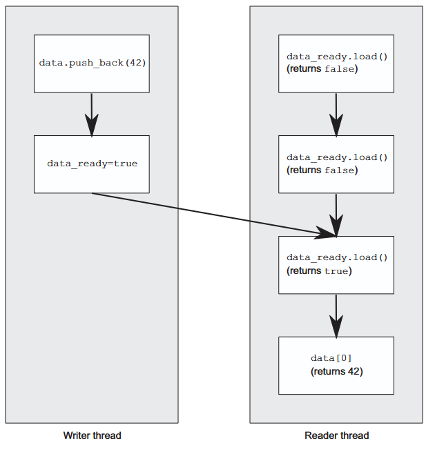
  <figcaption class="fig-caption">Garantire l'ordinamento tra operazioni non atomiche mediante operazioni atomiche.</figcaption>
</figure>

#### Oltre la Sequential Consistency: Analisi Approfondita dei Memory Orders

Di default, tutte le operazioni atomiche in C++ utilizzano il modello di memoria più restrittivo e sicuro: **`std::memory_order_seq_cst`** (*Sequential Consistency*).

Sotto questo regime, il sistema garantisce un ordine globale totale: tutti i thread vedono le modifiche alla memoria nello stesso identico ordine cronologico, come se esistesse un unico switch centrale che esegue un'operazione alla volta. Sebbene questo eviti qualsiasi bug logico, la *Sequential Consistency* introduce pesanti penalità prestazionali: sulle moderne CPU multi-core, costringe l'hardware a svuotare continuamente i buffer di scrittura (*Store Buffers*) e ad applicare costose barriere hardware (*Memory Fences*) per invalidare le cache dei core concorrenti.

<figure class="fig-float center" style="width: 80%;">
  
  <figcaption class="fig-caption">Figura 5.3: Sequential consistency e relazioni happens-before tra thread diversi.</figcaption>
</figure>

Per massimizzare le performance, il C++ permetti di rilassare questo vincolo specificando espressamente l'enumerazione **`std::memory_order`**. I tre modelli principali sono:

1. **`std::memory_order_relaxed`**: È il vincolo più debole. Garantisce esclusivamente l'atomicità dell'operazione (la cella di memoria non verrà corrotta), ma **non impone alcun ordine di sincronizzazione** tra thread diversi. Il compilatore e la CPU sono liberi di riordinare le istruzioni circostanti a piacimento. È ideale per contatori statistici o globali che non condizionano il flusso logico del programma.

   Per comprenderne l'esito intuitivamente, è utile l'analogia dell' *"Omino nel Box"*: si immagini che ogni variabile atomica sia un operatore seduto in un box con un blocco note su cui annota, dall'alto verso il basso, la sequenza cronologica di tutti i valori assegnati a quella specifica variabile (il suo *Modification Order*). Ogni thread telefona all'omino per leggere o scrivere. L'omino tiene traccia con un segnaposto personalizzato del punto a cui è arrivato ogni singolo thread. Un thread può solo scendere lungo la lista (non leggerà mai un valore passato rispetto a uno già visto), ma thread diversi si trovano in punti totalmente distinti del foglio. Inoltre, l'omino di una variabile non comunica in alcun modo con l'omino di un'altra variabile.

<figure class="fig-float center" style="width: 70%;">
  
  <figcaption class="fig-caption">Figura 5.5: Il blocco note dell'omino nel box: i segnaposto indicano la posizione attuale di lettura/scrittura di ciascun thread.</figcaption>
</figure>

   Di conseguenza, se un thread esegue `x.store(true, relaxed)` e poi `y.store(true, relaxed)`, un altro thread potrebbe leggere `y == true` ma continuare a leggere `x == false`, poiché la visibilità dei fogli note di X e Y si propaga in modo del tutto asincrono. Per questa ragione, le operazioni *relaxed* vanno evitate se non per contatori isolati o previa un'estrema cautela.

<figure class="fig-float center" style="width: 80%;">
  
  <figcaption class="fig-caption">Figura 5.4: Relazioni happens-before ed eventuale riordinamento delle operazioni con memoria relaxed.</figcaption>
</figure>

2. **`std::memory_order_release`**: Si applica tassativamente alle operazioni di **scrittura**. Garantisce che nessuna scrittura o lettura precedente all'istruzione corrente possa essere spostata dal compilatore (o dalla CPU) a una posizione successiva ad essa. Tutte le modifiche in memoria effettuate dal thread produttore vengono "impacchettate" e consolidate in questo punto.

3. **`std::memory_order_acquire`**: Si applica tassativamente alle operazioni di **lettura**. Garantisce che nessuna lettura o scrittura successiva possa essere riordinata a una posizione precedente ad essa. Quando un thread esegue una lettura *acquire* sulla medesima variabile atomica modificata da un secondo thread tramite un rilascio *release*, si attiva la relazione di **Synchronizes-With**.

   **Differenza fondamentale tra Acquire-Release e Sequential Consistency**: 
   L'Acquire-Release non garantisce un ordine globale visibile allo stesso modo da tutti i thread se le variabili atomiche sono distinte. Se il Thread A esegue una *release* su X e il Thread B una *release* su Y, due thread lettori C e D possono comunque osservare le due scritture in ordini opposti.

<figure class="fig-float center" style="width: 80%;">
  
  <figcaption class="fig-caption">Figura 5.6: Relazioni acquire-release su variabili distinte: ciascun thread lettore può percepire una sequenza di eventi differente.</figcaption>
</figure>

Grazie alla combinazione *Acquire-Release*, tutto ciò che il thread produttore ha scritto prima della *release* diventa istantaneamente e matematicamente visibile al thread consumatore subito dopo la sua *acquire*.

Nel listato che segue viene mostrato come implementare un canale di segnalazione a bassissimo livello (senza lock software) sfruttando la sincronizzazione fine del modello di memoria:


```cpp
#include <iostream>
#include <thread>
#include <atomic>
#include <vector>
#include <cassert>

// Struttura dati non atomica (protetta dall'ordine di memoria)
std::vector<int> data;
// Variabile atomica di controllo e sincronizzazione
std::atomic<bool> data_ready{false}; 

void writer_thread() 
{
    // Operazione sulla memoria non atomica
    data.push_back(42);
    
    // Scrittura atomica con semantica RELEASE.
    // Garantisce che la scrittura su 'data' sia consolidata prima che 'data_ready' diventi true.
    data_ready.store(true, std::memory_order_release);
}

void reader_thread() 
{
    // Lettura atomica in ciclo continuo con semantica ACQUIRE.
    // Impedisce che la lettura di data[0] venga anticipata prima che il flag sia letto come true.
    while (!data_ready.load(std::memory_order_acquire)) {
        // Attesa passiva di basso livello
        std::this_thread::yield();
    }
    
    // Avvenuta la sincronizzazione (Synchronizes-With), 
    // l'accesso a data[0] e' sicuro al 100% (non si verifica alcuna Data Race).
    std::cout << "[Consumatore] Dati letti in sicurezza: " << data[0] << "\n";
}

int main() 
{
    std::thread t1(writer_thread);
    std::thread t2(reader_thread);
    t1.join(); t2.join();
    return 0;
}
```

#### Release Sequences e Sincronizzazione a Più Consumatori

Fino a questo punto abbiamo analizzato la sincronizzazione diretta tra una singola scrittura *release* e un'unica lettura *acquire*. Tuttavia, nei sistemi reali (come le code di lavoro concorrenti), una singola scrittura atomica effettuata da un produttore deve spesso sincronizzare più thread consumatori che elaborano i dati in sequenza. Questa proprietà è garantita dal concetto di **Release Sequence** (Sequenza di Release).

Una *Release Sequence* si forma quando un'iniziale scrittura atomica con semantica `memory_order_release` (oppure `acq_rel` o `seq_cst`) viene seguita da una catena ininterrotta di operazioni **Read-Modify-Write (RMW)** (come `fetch_sub`, `fetch_add`, `compare_exchange_weak`) sulla medesima variabile atomica. Ciascuna operazione RMW nella catena legge il valore modificato dall'operazione precedente.

La caratteristica essenziale della *Release Sequence* è che l'iniziale scrittura *release* instaura una relazione di **Synchronizes-With** (e quindi di *Happens-Before*) con **qualsiasi** thread che esegua una successiva lettura o operazione RMW dotata di semantica `memory_order_acquire` lungo la catena, indipendentemente da quanti passaggi intermedi si siano verificati. Inoltre, gli anelli RMW intermedi della catena possono utilizzare qualsiasi ordinamento di memoria, persino `std::memory_order_relaxed`.

```cpp
#include <atomic>
#include <thread>
#include <vector>
#include <iostream>

std::vector<int> queue_data;
std::atomic<int> count{0};

void populate_queue()
{
    unsigned const number_of_items = 20;
    queue_data.clear();
    for (unsigned i = 0; i < number_of_items; ++i) {
        queue_data.push_back(i);
    }
    // Scrittura iniziale RELEASE: avvia la Release Sequence
    count.store(number_of_items, std::memory_order_release);
}

void consume_queue_items()
{
    while (true) {
        int item_index;
        // Operazione RMW (fetch_sub) con semantica ACQUIRE.
        // Ogni consumatore partecipa alla Release Sequence iniziata da populate_queue()
        if ((item_index = count.fetch_sub(1, std::memory_order_acquire)) <= 0) {
            break; // Nessun altro elemento disponibile
        }
        
        // La Release Sequence garantisce che l'accesso a queue_data sia privo di Data Race
        // per TUTTI i consumatori, anche per quelli che leggono modifiche fatte da altri consumatori.
        std::cout << "Elaborato elemento: " << queue_data[item_index - 1] << "\n";
    }
}

int main()
{
    std::thread producer(populate_queue);
    producer.join();

    std::thread consumer1(consume_queue_items);
    std::thread consumer2(consume_queue_items);
    
    consumer1.join();
    consumer2.join();
    return 0;
}
```

Senza la regola della *Release Sequence*, solo il primo consumatore che esegue `fetch_sub` si sincronizzerebbe con il `store` del produttore. Il secondo consumatore, leggendo il valore già decrementato dal primo consumatore e non quello scritto originariamente dal produttore, non avrebbe alcuna relazione di *Happens-Before* con quest'ultimo, generando una pericolosa *Data Race* nell'accesso al vettore `queue_data`.

<figure class="fig-float center" style="width: 80%;">
  
  <figcaption class="fig-caption">Figura 5.7: La Release Sequence (linee tratteggiate) propaga la relazione di Synchronizes-With e Happens-Before (linee continue) a tutti i consumatori lungo la catena di operazioni RMW.</figcaption>
</figure>

#### Le Barriere di Memoria (`std::atomic_thread_fence`)

Un modello di sincronizzazione basato sulle operazioni atomiche non sarebbe completo senza l'introduzione delle barriere di memoria (*fences* o *memory barriers*). Una barriera di memoria è un'operazione globale che impone vincoli sull'ordinamento degli accessi in memoria senza modificare direttamente alcun dato atomico o variabile.

In genere, le barriere vengono abbinate a operazioni atomiche con vincolo `std::memory_order_relaxed`. Esse fungono da "linea di demarcazione" all'interno del codice che determinate operazioni di lettura o scrittura non possono scavalcare. Mentre l'hardware o il compilatore possono liberamente riordinare operazioni *relaxed* su variabili distinte, l'inserimento di una barriera restringe questa libertà, introducendo relazioni di *Happens-Before* e *Synchronizes-With* che altrimenti non esisterebbero.

Consideriamo l'uso delle barriere tra due operazioni atomiche *relaxed* eseguite in thread distinti:

```cpp
#include <atomic>
#include <thread>
#include <cassert>

std::atomic<bool> x{false};
std::atomic<bool> y{false};
std::atomic<int> z{0};

void write_x_then_y()
{
    x.store(true, std::memory_order_relaxed);
    // Barriera di RELEASE: impedisce che la scrittura su x venga spostata dopo la barriera
    std::atomic_thread_fence(std::memory_order_release);
    y.store(true, std::memory_order_relaxed);
}

void read_y_then_x()
{
    while (!y.load(std::memory_order_relaxed)); // Attende che y diventi true
    // Barriera di ACQUIRE: impedisce che la lettura di x venga anticipata prima della barriera
    std::atomic_thread_fence(std::memory_order_acquire);
    if (x.load(std::memory_order_relaxed)) {
        ++z;
    }
}

int main()
{
    std::thread a(write_x_then_y);
    std::thread b(read_y_then_x);
    a.join();
    b.join();
    assert(z.load() != 0); // L'assert non fallirà mai
}
```

La barriera *release* inserita nel primo thread si sincronizza con la barriera *acquire* del secondo thread. Questo avviene perché la lettura *relaxed* di `y` osserva il valore scritto dal punto successivo alla barriera *release*. Di conseguenza, la scrittura su `x` avviene tassativamente *before* la lettura di `x`, e l'assert non può mai fallire.

#### Ordinamento di Operazioni Non Atomiche mediante Variabili Atomiche e Fences

La vera potenza del modello di memoria del C++ risiede nella capacità delle operazioni atomiche e delle barriere di coordinare anche le normali variabili non atomiche, prevenendo le *Data Race* e l'*Undefined Behavior* senza dover rendere atomico ogni singolo byte di memoria.

Se sostituiamo la variabile atomica `x` dell'esempio precedente con una semplice variabile booleana non atomica, il comportamento del programma rimane del tutto corretto e sicuro:

```cpp
#include <atomic>
#include <thread>
#include <cassert>

bool x = false; // Variabile ordinaria NON atomica
std::atomic<bool> y{false};
std::atomic<int> z{0};

void write_x_then_y()
{
    x = true; // Scrittura ordinaria prima della barriera
    std::atomic_thread_fence(std::memory_order_release);
    y.store(true, std::memory_order_relaxed); // Scrittura atomica dopo la barriera
}

void read_y_then_x()
{
    while (!y.load(std::memory_order_relaxed)); // Lettura atomica prima della barriera
    std::atomic_thread_fence(std::memory_order_acquire);
    if (x) { // Lettura ordinaria dopo la barriera: SICURA (No Data Race)
        ++z;
    }
}

int main()
{
    std::thread a(write_x_then_y);
    std::thread b(read_y_then_x);
    a.join();
    b.join();
    assert(z.load() != 0); // Garantito: l'assert non fallirà mai
}
```

Le barriere continuano a garantire l'ordine rigoroso tra le operazioni. Se la lettura atomica *relaxed* di `y` osserva la scrittura di `y` avvenuta dopo la barriera *release*, scatta la relazione di *Inter-Thread Happens-Before*. La modifica ordinaria a `x` (sequenziata prima della barriera) diventa totalmente visibile alla lettura di `x` nel secondo thread (sequenziata dopo la barriera *acquire*), eliminando ogni possibilità di *Data Race*.

L'ordinamento delle operazioni non atomiche attraverso primitive atomiche sfrutta la proprietà transitiva di *Sequenced-Before* all'interno di ciascun thread:
$$\text{Operazione Non Atomica A} \xrightarrow{\text{Sequenced-Before}} \text{Atomica B} \xrightarrow{\text{Synchronizes-With}} \text{Atomica C} \xrightarrow{\text{Sequenced-Before}} \text{Operazione Non Atomica D}$$

Questo meccanismo rappresenta la spina dorsale di tutte le astrazioni ad alto livello della libreria standard, comprese le primitive di sincronizzazione esplicite come i **mutex**. Un'operazione `lock()` su un mutex equivale a un'operazione *Acquire* su uno stato atomico interno, mentre una `unlock()` corrisponde a un'operazione *Release*. Le modifiche ai dati protetti, essendo sequenziate prima della `unlock()`, diventano visibili al thread successivo solo dopo che questo ha completato con successo la `lock()`.

#### Quadro Sintetico delle Garanzie di Sincronizzazione della Libreria Standard

Oltre alle primitive atomiche e ai mutex, tutte le strutture e i meccanismi della Libreria Standard C++ forniscono garanzie d'ordine formali definite in termini di relazioni *Synchronizes-With*:

* **Gestione dei Thread (`std::thread`)**:
  * Il completamento del costruttore di un oggetto `std::thread` *synchronizes-with* l'invocazione della funzione target sul nuovo thread.
  * La conclusione dell'esecuzione del thread *synchronizes-with* il ritorno con successo dalla chiamata a `join()` sul relativo oggetto `std::thread`.

* **Mutex e Locking (`std::mutex`, `std::shared_mutex`, ecc.)**:
  * Tutte le chiamate a `lock()`, `unlock()`, `lock_shared()` e le chiamate riuscite a `try_lock()` formano un unico ordine globale totale (*Lock Order*) per quel determinato mutex.
  * Una chiamata a `unlock()` su un mutex *synchronizes-with* qualsiasi successiva chiamata a `lock()` (o `try_lock()` riuscita) sullo stesso oggetto. Le chiamate fallite a `try_lock()` non partecipano ad alcuna relazione di sincronizzazione.

* **Oggetti Asincroni (`std::promise`, `std::future`, `std::packaged_task`, `std::async`)**:
  * Il completamento con successo dell'impostazione di un valore o di un'eccezione (`set_value()`, `set_exception()`) su una `std::promise`, oppure l'esecuzione di una `std::packaged_task` o il termine di un task avviato tramite `std::async(std::launch::async)`, *synchronizes-with* il ritorno con successo da una chiamata a `wait()` o `get()` (o `wait_for()` che restituisce `ready`) sulla `std::future` associata.

* **Primitive di Sincronizzazione Concorrente (Latch e Barrier)**:
  * Ognuna delle chiamate a `count_down()` su un oggetto `std::latch` o `arrive_and_wait()` su un `std::barrier` *synchronizes-with* il completamento della relativa chiamata di attesa `wait()` sul medesimo oggetto.

* **Variabili di Condizione (`std::condition_variable`)**:
  * Le variabili di condizione **non instaurano direttamente alcuna relazione di *Synchronizes-With***. Servono esclusivamente ad ottimizzare i cicli di attesa attiva (*busy-wait*); tutte le garanzie di ordinamento di memoria sono interamente fornite dalle operazioni sul mutex ad esse associato.

### Visibilità della Memoria e Fenomeno del False Sharing 

Fino a questo punto, l'analisi delle prestazioni nei sistemi concorrenti si è concentrata sul fronte software, come l'overhead dei mutex o lo stallo logico dei thread. Esiste tuttavia una classe di **degradi prestazionali** particolarmente insidiosa legata alla topologia hardware dei processori moderni. 

Una delle forme più note e problematiche di questa categoria è generata dal modo in cui i processori multi-core si interfacciano con la memoria centrale (RAM). Le CPU non leggono né scrivono singoli byte di dati; al contrario, caricano la memoria all'interno di blocchi hardware a dimensione fissa denominati **Cache Lines** (linee di cache), la cui ampiezza standard sulle moderne architetture x86 e ARM è tipicamente di 64 byte. Quando un thread richiede l'accesso a una variabile di 4 byte (ad esempio un intero), l'intero blocco di 64 byte che contiene quella variabile viene copiato dalla RAM alla cache di livello 1 o 2 ($L1$/$L2$) dedicata a quel core specifico. 

Per garantire che tutti i core elaborino dati aggiornati, l'hardware implementa a basso livello un **Protocollo di Coerenza delle Cache** (come il protocollo MESI). Questo protocollo stabilisce una regola ferrea: non appena un core modifica anche un singolo bit all'interno di una determinata linea di cache, quella linea viene contrassegnata globalmente come *Invalid* (invalida). Di conseguenza, tutti gli altri core che detengono una copia di quella stessa linea sono costretti a scartarla e a ricaricarla forzatamente dalla memoria centrale o dalle cache condivise di livello superiore ($L3$), operazione che richiede centinaia di cicli di clock di ritardo (*cache miss*).

Il **False Sharing** (falsa condivisione) è un bug di prestazione nei sistemi multithread che si manifesta quando due o più thread, in esecuzione su core differenti, modificano simultaneamente variabili *distinte e indipendenti dal punto punto di vista logico*, le quali si trovano tuttavia allocate *all'interno della stessa linea di cache fisica* (ovvero entro la medesima finestra di 64 byte).

Sebbene il codice sia perfettamente corretto, privo di *Data Race* e non utilizzi alcun lock software bloccante, i core della CPU si scontrano a livello hardware. Ciascun core invaliderà simmetricamente la cache dell'altro in un ciclo continuo ad alta frequenza, un fenomeno noto come *Cache Line Bouncing*. Le prestazioni dell'applicazione crollano verticalmente, saturando il bus di comunicazione hardware per gestire un conflitto interamente fittizio.

```cpp
#include <iostream>
#include <thread>
#include <vector>
#include <chrono>

// Struttura dati vulnerabile: i membri sono allocati in memoria in modo contiguo
struct DatiCondivisi {
    unsigned long long contatore_t1 = 0; // 8 byte
    unsigned long long contatore_t2 = 0; // 8 byte
}; // Totale 16 byte: risiedono matematicamente nella stessa cache line di 64 byte

DatiCondivisi dati;

void incremento_massivo_uno() {
    for (int i = 0; i < 100000000; ++i) {
        dati.contatore_t1++; // Invalida continuamente la cache line del Thread 2
    }
}

void incremento_massivo_due() {
    for (int i = 0; i < 100000000; ++i) {
        dati.contatore_t2++; // Invalida continuamente la cache line del Thread 1
    }
}

int main() {
    auto inizio = std::chrono::high_resolution_clock::now();

    std::thread t1(incremento_massivo_uno);
    std::thread t2(incremento_massivo_due);
    t1.join(); t2.join();

    auto fine = std::chrono::high_resolution_clock::now();
    std::chrono::duration<double, std::milli> tempo = fine - inizio;
    
    std::cout << "Tempo di esecuzione con False Sharing: " << tempo.count() << " ms\n";
    return 0;
}
```

In passato i programmatori avevano poche strategie per risolvere il *False Sharing*. Le due più note erano il **Padding** manuale e l'utilizzo di estensioni specifiche del compilatore. Il C++ moderno ha standardizzato questo processo introducendo:

* **La specifica `alignas`**: Una parola chiave che impone al compilatore di allineare l'allocazione di una struttura o di una variabile a un confine di memoria multiplo del valore espresso in byte.
* **`std::hardware_destructive_interference_size`**: Una costante introdotta in C++17 all'interno dell'header `<new>` che restituisce a tempo di compilazione la dimensione esatta in byte della linea di cache dell'architettura target (garantendo la portabilità assoluta del codice tra x86, ARM o piattaforme custom).

Applicando queste direttive, la struttura dati viene modificata inserendo uno spazio vuoto calcolato direttamente in base all'hardware, garantendo l'isolamento assoluto dei core e il massimo parallelismo reale.

```cpp
#include <iostream>
#include <thread>
#include <chrono>
#include <new>

// Struttura dati ottimizzata contro l'interferenza distruttiva dell'hardware
struct alignas(std::hardware_destructive_interference_size) DatiOttimizzati {
    // Forza la variabile successiva a risiedere in una cache line distinta
    alignas(std::hardware_destructive_interference_size) unsigned long long contatore_t1 = 0;
    alignas(std::hardware_destructive_interference_size) unsigned long long contatore_t2 = 0;
}; 

DatiOttimizzati dati_safe;

void incremento_ottimizzato_uno() {
    for (int i = 0; i < 100000000; ++i) {
        dati_safe.contatore_t1++; // Lavora sulla propria cache line senza interferire
    }
}

void incremento_ottimizzato_due() {
    for (int i = 0; i < 100000000; ++i) {
        dati_safe.contatore_t2++; // Lavora sulla propria cache line senza interferire
    }
}

int main() {
    auto inizio = std::chrono::high_resolution_clock::now();

    std::thread t1(incremento_ottimizzato_uno);
    std::thread t2(incremento_ottimizzato_due);
    t1.join(); t2.join();

    auto fine = std::chrono::high_resolution_clock::now();
    std::chrono::duration<double, std::milli> tempo = fine - inizio;
    
    std::cout << "Tempo di esecuzione ottimizzato (No False Sharing): " << tempo.count() << " ms\n";
    return 0;
}
```

### Operazioni Atomiche

#### Caratterizzazione delle Operazioni Atomiche

Nel passaggio dalla programmazione basata sui lock a quella lock-free, la perdita dei tradizionali meccanismi di sincronizzazione esporrebbe l'applicazione multithread a gravi rischi di *Undefined Behavior* e *Data Race*. Nel paradigma lock-free si rende quindi indispensabile l'adozione di un nuovo strumento fondamentale per la protezione dei dati: le **Operazioni Atomiche**.

Una **Operazione Atomica** è un'azione indivisibile il cui stato intermedio non è osservabile da alcun thread. Considerando ad esempio operazioni atomiche di lettura e scrittura, la lettura fornirà sempre ed esclusivamente il valore iniziale dell'oggetto oppure quello memorizzato a valle della modifica, senza che sia mai possibile osservare stati parziali o corrotti.

Introdotto l'uso degli atomici, potrebbe sorgere nel programmatore l'idea errata che tale strumento renda automaticamente l'intera applicazione *Lock-Free*. Tuttavia, definire una singola variabile come atomica garantisce esclusivamente che le sue letture e scritture avvengano senza corruzione della memoria. Una struttura dati complessa composta da oggetti atomici e non atomici non beneficia automaticamente dell'atomicità per l'intero stato logico.

Per supportare nativamente questo paradigma, il C++11 ha introdotto l'header `<atomic>`, all'interno del quale la libreria standard mappa le operazioni ad alto livello sulle istruzioni atomiche native messe a disposizione dall'architettura CPU sottostante (come l'istruzione `LOCK CMPXCHG` su architetture x86).

È fondamentale sottolineare che se l'architettura hardware target non supporta istruzioni atomiche dirette per la dimensione o per la tipologia di dato specificata, la libreria standard implementa l'atomicità racchiudendo l'operazione all'interno di un *mutex interno gestito dal compilatore*. In questa situazione i vantaggi prestazionali e le garanzie della programmazione lock-free svaniscono completamente. Per verificare il comportamento dell'hardware si utilizzano due strumenti forniti dallo standard:

* **`x.is_lock_free()`**: Metodo invocabile a tempo di esecuzione che restituisce `true` se l'oggetto atomico `x` opera tramite istruzioni hardware senza lock, oppure `false` se utilizza un mutex interno.
* **`is_always_lock_free` (C++17)**: Costante `constexpr` valutata a tempo di compilazione. Restituisce `true` solo se il tipo specificato è garantito essere lock-free su qualsiasi istanza dell'architettura target per la quale si sta compilando.

Un altro aspetto fondamentale dell'interfaccia degli atomici riguarda il fatto che **non sono né copiabili né assegnabili nel senso convenzionale**: non forniscono né un costruttore di copia né un operatore di assegnamento che restituisca un riferimento (`T&`).

Se l'assegnamento (ad esempio `x = y`) includesse il ritorno di un riferimento a `x`, per leggerne il valore aggiornato il codice dovrebbe eseguire una successiva operazione di lettura in memoria. Nel contesto multithread, un secondo thread potrebbe modificare `x` esattamente nell'intervallo compreso tra l'assegnamento e la lettura, introducendo una *Data Race*. Per prevenire questa criticità, le operazioni atomiche restituiscono sempre **il valore direttamente modificato o il valore precedente**, evitando del tutto il ritorno di riferimenti all'oggetto.

Per coprire ogni esigenza architetturale — dalla primitiva hardware di più basso livello fino ai tipi definiti dall'utente — lo standard C++ organizza i tipi atomici in una gerarchia progressiva di complessità e funzionalità:

* **`std::atomic_flag`**: La primitiva atomica fondamentale. Rappresenta un flag booleano essenziale ed è l'unico tipo garantito per essere incondizionatamente lock-free su qualsiasi architettura.
* **`std::atomic<bool>`**: Estende le capacità del flag fornendo un tipo booleano completo di operazioni di lettura (`load`), scrittura (`store`), scambio (`exchange`) e confronto-e-scambio (*Compare-Exchange*).
* **`std::atomic<T*>` (Puntatori)**: Specializzazione per i tipi puntatore che introduce le primitive di aritmetica degli indirizzi atomica (`fetch_add`, `fetch_sub`).
* **Specializzazioni Integrali (`std::atomic<int>`, `std::atomic<size_t>`, ecc.)**: Forniscono il set di funzionalità più ricco per i tipi numerici interi, integrando operazioni aritmetiche complesse e manipolazioni bitwise (`fetch_and`, `fetch_or`, `fetch_xor`).
* **Template Generico Primario `std::atomic<T>`**: Permette di rendere atomiche strutture dati e tipi definiti dall'utente (*User-Defined Types*), a patto che soddisfino precisi requisiti di struttura (*Trivially Copyable*).

Nei paragrafi che seguono analizzeremo nel dettaglio ciascuna di queste componenti, partendo dalle primitive di base per risalire fino all'astrazione generica.

#### Il Tipo std::atomic_flag

std::atomic_flag è il tipo atomico standard più semplice: rappresenta un flag booleano in grado di assumere unicamente lo stato di set (true) o clear (false). È stato concepito essencialmente come primitiva hardware di base, motivo per cui raramente viene impiegato direttamente nell'applicazione, se non in contesti specifici a bassissimo livello. Si tratta dell'unico tipo nello standard C++ garantito per essere sempre ed incondizionatamente lock-free su qualsiasi architettura target. 

Fino al C++17, gli oggetti std::atomic_flag richiedevano un'inizializzazione esplicita allo stato clear tramite la macro ATOMIC_FLAG_INIT:

```cpp
std::atomic_flag f = ATOMIC_FLAG_INIT;
```

A partire da C++20, la macro ATOMIC_FLAG_INIT è stata deprecata in favore del costruttore predefinito, il quale garantisce automaticamente che l'oggetto sia inizializzato allo stato clear (false):

```cpp
std::atomic_flag f;
```

Come per tutti gli altri tipi atomici, la copia e l'assegnamento non sono consentiti: il costruttore di copia e l'operatore di assegnamento sono stati eliminati (= delete). Un'assegnazione o una copia coinvolgerebbero due oggetti distinti in memoria (una lettura da uno e una scrittura sull'altro), rendendo impossibile eseguire l'operazione in un unico ciclo atomico indivisibile. 

Una volta inizializzato il flag, l'interfaccia mette a disposizione tre sole operazioni:

1. Distruzione: eseguita tramite il normale distruttore dell'oggetto.
2. Reset tramite clear(): azzera il flag portandolo allo stato false. Trattandosi di un'operazione di sola scrittura (store), non può accettare tag di memoria con semantica di acquisizione (std::memory_order_acquire o std::memory_order_acq_rel):
   f.clear(std::memory_order_release);
3. Test e Modifica tramite test_and_set(): imposta il flag a true e restituisce il valore booleano che il flag possedeva prima della chiamata. Trattandosi di un'operazione di lettura-modifica-scrittura (Read-Modify-Write), accetta qualsiasi tag di ordinamento della memoria (il valore predefinito è std::memory_order_seq_cst):
```cpp   
bool x = f.test_and_set();
```

L'interfaccia minimale rende std::atomic_flag l'astrazione ideale per realizzare uno Spinlock Mutex:

```cpp
class spinlock_mutex
{
    std::atomic_flag flag = ATOMIC_FLAG_INIT; // In C++20: std::atomic_flag flag;

public:
    spinlock_mutex() = default;

    void lock()
    {
        // Attesa attiva (busy-wait): cicla finché il valore precedente era true
        while (flag.test_and_set(std::memory_order_acquire));
    }

    void unlock()
    {
        flag.clear(std::memory_order_release);
    }
};
```

Questo mutex offre le funzionalità di base ed è pienamente compatibile con i gestori RAII come std::lock_guard. Tuttavia, eseguendo un'attesa attiva (busy-waiting) all'interno di lock(), rappresenta una scelta inefficiente in presenza di un'elevata contesa tra thread.

A causa della sua estrema essenzialità, std::atomic_flag non dispone di una funzione di sola lettura (non esiste un metodo .load() né una conversione implicita a bool). Per questo motivo non può essere impiegato come flag booleano di uso generale; in tali contesti si ricorre a std::atomic<bool>.

#### Il Tipo std::atomic_bool

std::atomic<bool> rappresenta una versione di flag booleano decisamente più completa rispetto a std::atomic_flag. Sebbene non sia copiabile né assegnabile da un altro atomico, può essere costruito a partire da un valore bool non atomico ed è possibile assegnargli valori booleani tradizionali:

```cpp
std::atomic<bool> b(true); 
b = false;
```

L'operatore di assegnamento da un tipo non atomico si discosta dalla convenzione C++ standard: anziché restituire un riferimento al contenitore atomico (std::atomic<bool>&), restituisce per copia il valore scalare assegnato (di tipo bool). Questa scelta progettuale evita sottili problemi di concorrenza. Se l'operatore restituisse un riferimento all'oggetto atomico, il codice che utilizza il risultato dell'assegnamento dovrebbe eseguire una seconda lettura in memoria per valutarne il contenuto. In quel brevissimo intervallo temporale, un altro thread potrebbe modificare la variabile atomica, alterando l'esito dell'operazione. Restituendo direttamente il valore scalare scritto, si garantisce che il valore ottenuto dal chiamante sia esattamente quello memorizzato nell'operazione di scrittura, senza richiedere una lettura aggiuntiva.

Anziché limitarsi alle primitive restrittive di std::atomic_flag, std::atomic<bool> mette a disposizione un set di operazioni più generico:

* Scrittura tramite store(): Sovrascrive il valore corrente con true o false (sostituendo la clear()), permettendo di specificare il tag di ordinamento della memoria.
* Lettura tramite load() o conversione implicita: Consente una query non modificante del valore corrente per copia. È inoltre possibile sfruttare la conversione implicita a bool (ad esempio all'interno di un'istruzione if (b)).
* Scambio atomico tramite exchange(): Sostituisce la test_and_set(), consentendo di sovrascrivere il valore memorizzato con un nuovo valore a scelta e restituendo atomicamente il valore precedente.

```cpp
std::atomic<bool> b(false);

// Operazione di Load (Lettura) con semantica Acquire
bool x = b.load(std::memory_order_acquire);

// Operazione di Store (Scrittura) con semantica Release
b.store(true, std::memory_order_release);

// Operazione Read-Modify-Write (RMW): imposta a false e restituisce il valore precedente
x = b.exchange(false, std::memory_order_acq_rel);
```

A differenza di std::atomic_flag, std::atomic<bool> potrebbe non essere lock-free su alcune architetture hardware specifiche. In tali contesti, la libreria standard implementa l'atomicità racchiudendo le operazioni all'interno di un mutex gestito internamente dal compilatore. Per verificare l'assenza di lock a tempo di esecuzione, è possibile invocare la funzione membro .is_lock_free().

Oltre alla exchange(), std::atomic<bool> introduce la famiglia di operazioni Read-Modify-Write più importante dell'intero paradigma Lock-Free: le primitive di Compare-Exchange.

L'operazione di Compare-Exchange costituisce la pietra angolare della programmazione Lock-Free. La sua funzione è quella di aggiornare il valore di una variabile atomica solo ed esclusivamente a condizione che il valore attualmente memorizzato corrisponda a un valore atteso fornito dall'utente.

Nello standard C++, questa operazione è esposta tramite due funzioni membro: compare_exchange_weak() e compare_exchange_strong(). Entrambe le funzioni accettano come parametri (passati per riferimento) un valore atteso (expected) e un valore desiderato (desired):

1. La funzione confronta il valore memorizzato nell'oggetto atomico con il valore contenuto in expected.
2. Se i valori coincidono (Successo): la funzione scrive il valore desired nell'oggetto atomico e restituisce true.
3. Se i valori differiscono (Fallimento): l'operazione di scrittura viene annullata, la funzione restituisce false e sovrascrive automaticamente la variabile expected con il valore corrente dell'oggetto atomico.

L'aggiornamento automatico di expected in caso di fallimento evita di dover rileggere manualmente l'atomico tramite una .load(): se l'operazione fallisce perché un altro thread ha modificato la variabile, expected viene riazzerato con il valore più recente, consentendo di ritentare immediatamente l'operazione all'interno di un ciclo.

La distinzione tra le due varianti risiede nella gestione dei comportamenti hardware sottostanti:

* compare_exchange_weak(): Può manifestare un fallimento spurio (spurious failure). Ovvero, la chiamata può restituire false e annullare la scrittura anche se il valore memorizzato era identico a expected. Questo accade su architetture hardware che privano di un'istruzione nativa compare-and-swap (come le architetture RISC/ARM basate su istruzioni Load-Linked/Store-Conditional), qualora si verifichi un'interruzione di contesto (context switch) durante la sequenza. A causa di questo comportamento, compare_exchange_weak() deve sempre essere utilizzata all'interno di un ciclo while:

```cpp
bool expected = false;
extern std::atomic<bool> b;

// Continua il ciclo se la chiamata fallisce spuriamente e expected è ancora false
while (!b.compare_exchange_weak(expected, true) && !expected);
```

* compare_exchange_strong(): Garantisce di restituire false solo ed esclusivamente se il valore reale in memoria differiva da quello atteso, eliminando la gestione dei fallimenti spuri dell'hardware.

Se l'algoritmo richiede comunque un ciclo di ricalcolo (ad esempio perché il nuovo valore da memorizzare dipende dal valore appena letto e deve essere ricalcolato a ogni tentativo), è preferibile utilizzare compare_exchange_weak(). Sulle architetture soggette a fallimenti spuri, compare_exchange_strong() deve generare un ciclo interno aggiuntivo per mascherare il fallimento spurio; usare la variante weak evita questo doppio ciclo annidato, ottimizzando le prestazioni.

Se invece il calcolo del valore da memorizzare è complesso o costoso, oppure se si vuole verificare una singola volta se un thread ha completato con successo la modifica, si utilizza compare_exchange_strong() per evitare di ripetere il calcolo a causa di una fluttuazione temporanea dell'hardware.

Le funzioni di Compare-Exchange consentono inoltre di specificare due parametri distinti di ordinamento della memoria: uno applicato in caso di successo e uno in caso di fallimento.

```cpp
b.compare_exchange_weak(expected, true, 
                        std::memory_order_acq_rel, 
                        std::memory_order_acquire);
```

Questa flessibilità permette di ottimizzare le prestazioni: in caso di successo si può richiedere una semantica di sincronizzazione stringente (es. acq_rel), mentre in caso di fallimento si può degradare a una semantica più blanda (es. relaxed o acquire).

Tre regole fondamentali vincolano la specifica degli ordini di memoria nel Compare-Exchange:

1. Poiché un fallimento non esegue alcuna operazione di scrittura (store), l'ordinamento specificato per il fallimento non può contenere semantica di scrittura (std::memory_order_release o std::memory_order_acq_rel).
2. L'ordinamento di fallimento non può mai essere più restrittivo di quello impostato per il successo (ad esempio, non è consentito richiedere seq_cst per il fallimento e relaxed per il successo).
3. Se viene specificato un solo tag di memoria, questo viene applicato al successo, mentre per il fallimento viene usata la stessa semantica ma privata della componente di rilascio (memory_order_release diventa relaxed, acq_rel diventa acquire). Se non si specifica alcun tag, entrambe le fasi adottano per default std::memory_order_seq_cst.

#### Il Tipo std::atomic<T*>

La specializzazione per i tipi puntatore std::atomic<T*> rappresenta la forma atomica di un puntatore a un tipo T. Analogamente a std::atomic<bool>, l'interfaccia condivide tutte le operazioni fondamentali (load(), store(), exchange(), compare_exchange_weak(), compare_exchange_strong() e la query .is_lock_free()), lavorando con istanze di tipo T* anziché bool.

Anche std::atomic<T*> non è né copiabile né assegnabile tra tipi atomici, ma supporta la costruzione e l'assegnamento a partire da valori puntatore nativi (T*).

La caratteristica distintiva di std::atomic<T*> è il supporto per le operazioni di aritmetica dei puntatori. L'hardware esegue il calcolo considerando la dimensione dell'oggetto puntato (sizeof(T)), esattamente come avviene per i puntatori nativi C++:

* fetch_add() e fetch_sub(): Eseguono l'addizione o la sottrazione atomica sull'indirizzo memorizzato. Trattandosi di operazioni di lettura-modifica-scrittura (Read-Modify-Write o exchange-and-add), restituiscono il valore originale del puntatore presente prima della modifica.
* Operatori +=, -=, ++ e --: Fungono da wrapper sintattici attorno a fetch_add() e fetch_sub(). A differenza delle funzioni fetch_, gli operatori sovraccaricati restituiscono il nuovo valore del puntatore aggiornato, ma sempre rigorosamente per copia (come tipo scalare T*) e mai come riferimento all'oggetto atomico.

```cpp
class Foo {};
Foo array_elementi[5];

std::atomic<Foo*> p(array_elementi);

// fetch_add(2) aggiunge 2 a p ma restituisce il VECCHIO valore (array_elementi[0])
Foo* x = p.fetch_add(2);
assert(x == &array_elementi[0]);
assert(p.load() == &array_elementi[2]);

// L'operatore -= modifica p e restituisce il NUOVO valore aggiornato (array_elementi[1])
x = (p -= 1);
assert(x == &array_elementi[1]);
assert(p.load() == &array_elementi[1]);
```

Poiché fetch_add() e fetch_sub() sono operazioni Read-Modify-Write a tutti gli effetti, possono essere integrate in una release sequence e accettano qualsiasi tag di ordinamento della memoria (std::memory_order):

```cpp
p.fetch_add(3, std::memory_order_release);
```

Al contrario, gli operatori sovraccaricati (+=, -=, ++, --) non offrono una sintassi per passare il parametro del modello di memoria; di conseguenza, le loro invocazioni adottano sempre e ridondantemente la semantica più restrittiva di default: std::memory_order_seq_cst.

#### Specializzazioni Integrali e Alias C-Style

Le specializzazioni del template per i tipi integrali nativi del linguaggio (come `std::atomic<int>`, `std::atomic<long>`, `std::atomic<size_t>` o `std::atomic<uint64_t>`) offrono l'interfaccia più ricca e completa tra tutti i tipi atomici standard. 

Oltre al set di funzioni base (`load()`, `store()`, `exchange()`, `compare_exchange_*()` e `.is_lock_free()`), i tipi integrali mettono a disposizione un'ampia suite di operazioni aritmetiche e di manipolazione a livello di singoli bit (bitwise), eseguite direttamente tramite istruzioni hardware native senza l'overhead di addormentamento o risveglio dei thread tipico dei mutex.

Per facilitare l'interoperabilità con il codice C e garantire la retrocompatibilità, la libreria standard mette a disposizione una serie di alias per i tipi integrali e booleani più comuni:

| Type Alias (C-Style / Legacy) | Specializzazione Standard `std::atomic<T>` |
| :--- | :--- |
| `atomic_bool` | `std::atomic<bool>` |
| `atomic_char` | `std::atomic<char>` |
| `atomic_schar` | `std::atomic<signed char>` |
| `atomic_uchar` | `std::atomic<unsigned char>` |
| `atomic_int` | `std::atomic<int>` |
| `atomic_uint` | `std::atomic<unsigned int>` |
| `atomic_long` | `std::atomic<long>` |

Le operazioni atomiche sugli integrali si dividono in due famiglie principali:

* **Funzioni membro con nome (Read-Modify-Write)**:
  - *Aritmetica*: `fetch_add()`, `fetch_sub()`
  - *Operazioni Bitwise*: `fetch_and()`, `fetch_or()`, `fetch_xor()`
  - *Comportamento*: Eseguono l'operazione atomicamente e restituiscono il **vecchio valore** presente nella variabile prima della modifica.
* **Operatori di assegnamento composto e incremento/decremento**:
  - *Assegnamento composto*: `+=`, `-=`, `&=`, `|=`, `^=`
  - *Incremento e decremento*: prefissi (`++x`, `--x`) e postfissi (`x++`, `x--`)
  - *Comportamento*: Gli operatori di assegnamento e l'incremento/decremento prefisso restituiscono il **nuovo valore** aggiornato. L'incremento/decremento postfisso restituisce il **vecchio valore**.

```cpp
    std::atomic<int> contatore(10);

    // fetch_add(5) aggiunge 5 e restituisce il VECCHIO valore (10)
    int vecchio = contatore.fetch_add(5, std::memory_order_relaxed); 

    // L'operatore += aggiunge 5 e restituisce il NUOVO valore (20)
    int nuovo = (contatore += 5); 

    // Operazione Bitwise Masking atomica
    std::atomic<uint8_t> flags(0b0000'1111);
    flags.fetch_or(0b1000'0000, std::memory_order_release);
```

Il set di operatori composti per i tipi integrali non copre la totalità delle operazioni matematiche del C++: mancano gli operatori di moltiplicazione (`*`), divisione (`/`) e shift di bit (`<<`, `>>`).

Questa omissione è intenzionale: nei contesti concorrenti le variabili atomiche integrali vengono utilizzate quasi esclusivamente come contatori di riferimenti, indici di array o maschere di flag bitwise. Qualora si rendesse necessaria un'operazione non prevista (come una moltiplicazione atomica), la si può implementare facilmente sfruttando un ciclo con `compare_exchange_weak()`:

```cpp
    void moltiplica_atomico(std::atomic<int>& atomico, int fattore)
    {
        int atteso = atomico.load(std::memory_order_relaxed);
        
        while (!atomico.compare_exchange_weak(atteso, atteso * fattore,
                                              std::memory_order_release,
                                              std::memory_order_relaxed))
        {
            // 'atteso' viene automaticamente riaggiornato da compare_exchange_weak in caso di fallimento
        }
    }
```

Come per i puntatori, le funzioni con nome (`fetch_add`, `fetch_or`, ecc.) accettano come parametro opzionale il tag di ordinamento della memoria (`std::memory_order`) e possono partecipare a una release sequence. Gli operatori sovraccaricati (`+=`, `++`, `&=`, ecc.) non offrono la possibilità di specificare un parametro di memoria e adottano sempre la semantica predefinita `std::memory_order_seq_cst`.

---

#### Il Template Primario Generico `std::atomic<T>` e i Tipi Definiti dall'Utente (UDT)

Oltre alle specializzazioni per i tipi fondamentali e i puntatori, il C++ fornisce il template primario generico `std::atomic<T>`. Questo consente di rendere atomica qualsiasi struttura o tipo personalizzato definito dall'utente (*User-Defined Type* o *UDT*).

L'interfaccia di `std::atomic<UDT>` rispecchia esattamente quella di `std::atomic<bool>`: offre unicamente le operazioni fondamentali (`load()`, `store()`, `exchange()`, `compare_exchange_weak()`, `compare_exchange_strong()` e la query `.is_lock_free()`), lavorando con istanze del tipo `UDT` anziché valori booleani.

Non è possibile istanziare `std::atomic<T>` con un tipo generico qualsiasi. Per garantire l'atomicità senza violare l'incapsulamento, il tipo `UDT` deve soddisfare vincoli rigorosi di struttura (*Trivially Copyable*):

* **Assegnamento per copia banale**: La classe deve utilizzare l'operatore di assegnamento generato automaticamente dal compilatore. Non sono ammessi operatori di assegnamento o costruttori di copia definiti dall'utente.
* **Assenza di polimorfismo**: La classe **non deve contenere funzioni virtuali né ereditare da basi virtuali** (per evitare la presenza del puntatore alla *vtable*).
* **Membri dati triviali**: Tutti i membri dati non statici e le eventuali classi base devono a loro volta possedere un assegnamento per copia banale.

Questi vincoli consentono al compilatore di manipolare l'oggetto in memoria tramite operazioni equivalenti a `memcpy()` o `memcmp()`, trattando la struttura dati come un blocco di byte grezzi. Di conseguenza, tipi complessi come `std::string` o `std::vector<int>` non possono essere usati con `std::atomic<T>`.

**Confronti Bit per Bit (`memcmp`) e Problemi con i Padding Bits**

Un dettaglio critico riguarda l'esecuzione delle primitive di **Compare-Exchange**: il confronto tra il valore memorizzato e il valore *expected* viene eseguito tramite un **confronto bit per bit (stile `memcmp`)**, anziché invocare l'operatore di uguaglianza `operator==` eventualmente definito nella classe.

Questo comportamento introduce due potenziali insidie:

1. **Bit di Padding (Imbottitura)**: Se la struttura dati contiene byte di padding inseriti dal compilatore per l'allineamento della memoria, questi byte inutilizzati possono contenere valori spazzatura differenti. In tal caso, la `compare_exchange_strong()` potrebbe restituire `false` (fallimento) anche se tutti i membri dati effettivi della struttura sono identici.
2. **Tipi Floating-Point (`float`, `double`)**: I tipi a virgola mobile soddisfano i requisiti triviali e possono essere usati con `std::atomic<>` (da C++20 sono integrate anche le operazioni aritmetiche). Tuttavia, valori che sono logicamente uguali in aritmetica FP potrebbero avere rappresentazioni binarie differenti (es. `+0.0` e `-0.0`, oppure rappresentazioni diverse di `NaN`), causando il fallimento imprevisto delle operazioni di Compare-Exchange.

**Ragioni Architetturali delle Restrizioni**

Il divieto di eseguire codice utente (come costruttori di copia o operatori `==` personalizzati) risponde a due esigenze fondamentali di concorrenza:

* **Prevenzione dei Deadlock**: Se il compilatore non può tradurre la struttura in un'istruzione hardware atomica, deve racchiudere l'operazione all'interno di un mutex interno. Se venisse eseguito codice scritto dall'utente mentre si detiene tale mutex interno, una funzione lenta o bloccante causerebbe un degrado devastante delle prestazioni o persino un **Deadlock**.
* **Massimizzazione dell'Hardware Lock-Free**: Trattare la struttura dati come byte grezzi aumenta la probabilità che il compilatore riesca a mapparla direttamente su istruzioni hardware native atomiche (come `DWCAS` - *Double-Word Compare-And-Swap*), se la dimensione del tipo `UDT` è pari o inferiore alla dimensione supportata dalla CPU (solitamente 64 o 128 bit).

#### Funzioni Libere per le Operazioni Atomiche (C-Compatibility)

Oltre ai metodi membro offerti dalle classi atomiche, la libreria standard C++ mette a disposizione un insieme equivalente di **funzioni libere** (*non-member functions*) per l'esecuzione di tutte le operazioni sui tipi atomici.

Queste funzioni sono state progettate primariamente per garantire la **compatibilità con il linguaggio C**, consentendo di condividere codice o interfacce di basso livello tra i due linguaggi.

La nomenclatura delle funzioni libere segue convenzioni precise rispetto alle controparti membro:

1. **Prefisso `atomic_`**: Il nome della funzione rispecchia il metodo membro corrispondente anticipato da `atomic_` (es. `a.load()` diventa `std::atomic_load(&a)`).
2. **Puntatore come Primo Argomento**: Poiché le funzioni libere non dispongono dell'oggetto implicito `this`, il primo parametro è **sempre un puntatore** all'oggetto atomico da manipolare (es. `&a`).
3. **Varianti `_explicit` per il Memory Order**: Per ogni funzione libera esistono due versioni:
   * La versione base (senza suffisso), che applica per default la semantica `std::memory_order_seq_cst`.
   * La versione con suffisso **`_explicit`**, che accetta come parametri aggiuntivi i tag di ordinamento della memoria.

    std::atomic<int> a(0);

    // Chiamata membro con memory order
    a.store(10, std::memory_order_release);

    // Equivalente con funzione libera base (default seq_cst)
    std::atomic_store(&a, 10);

    // Equivalente con funzione libera e memory order esplicito
    std::atomic_store_explicit(&a, 10, std::memory_order_release);


* **`std::atomic_flag`**: Le funzioni libere dedicate a `std::atomic_flag` mantengono il nome esteso del tipo: `std::atomic_flag_test_and_set()` e `std::atomic_flag_clear()` (con le relative varianti `_explicit`).
* **`compare_exchange_*`**: Mentre i metodi membro accettano il parametro `expected` per riferimento (`T&`), le funzioni libere richiedono che `expected` sia passato come puntatore (`T*`). Inoltre, la versione `std::atomic_compare_exchange_weak_explicit()` impone di specificare entrambi i parametri di ordinamento della memoria (sia per il successo che per il fallimento).

`std::shared_ptr<>` rappresenta un'eccezione fondamentale al principio secondo cui solo i tipi atomici supportano operazioni atomiche. Un'istanza standard di `std::shared_ptr` non è un tipo atomico: le modifiche concorrenti allo stesso puntatore da parte di più thread senza sincronizzazione esterna causano Data Race e Undefined Behavior.

Per ovviare a questo limite, la libreria include sovraccarichi delle funzioni libere atomiche dedicati a `std::shared_ptr<T>`:

    std::shared_ptr<MyData> global_ptr;

    void process_data()
    {
        // Lettura atomica del puntatore condiviso
        std::shared_ptr<MyData> local = std::atomic_load(&global_ptr);
        use_data(local);
    }

    void update_data()
    {
        auto local = std::make_shared<MyData>();
        // Scrittura atomica del puntatore condiviso
        std::atomic_store(&global_ptr, local);
    }

L'utilizzo delle funzioni libere su un normale `std::shared_ptr` presenta forti criticità: se anche un solo thread dimentica di usare la funzione libera `std::atomic_*` ed accede al puntatore in modo diretto, l'intera garanzia di sicurezza cade generandosi una Data Race.

Per risolvere questo problema alla radice, gli standard C++ moderni (a partire da C++20) hanno formalmente introdotto la specializzazione di tipo `std::atomic<std::shared_ptr<T>>` (e `std::atomic<std::weak_ptr<T>>`):

* Incapsula la gestione atomica direttamente all'interno del tipo.
* Sostituisce l'uso delle funzioni libere con metodi membro sicuri (`load()`, `store()`, `compare_exchange_*`).
* Garantisce l'impossibilità di accedere accidentalmente al puntatore senza atomicità, convertendo eventuali errori di sincronizzazione in errori di compilazione.

Ogni operazione atomica (membro o funzione libera) accetta come parametro opzionale un valore dell'enumeratore `std::memory_order`. Se omesso, viene applicato di default il livello più restrittivo: `std::memory_order_seq_cst`.

I vincoli di memoria applicabili variano in base alla natura dell'operazione:

* **Operazioni di Store (Scrittura)**: Accettano solo `memory_order_relaxed`, `memory_order_release` o `memory_order_seq_cst`.
* **Operazioni di Load (Lettura)**: Accettano solo `memory_order_relaxed`, `memory_order_consume`, `memory_order_acquire` o `memory_order_seq_cst`.
* **Operazioni Read-Modify-Write (RMW)**: Eseguendo sia una lettura sia una scrittura, accettano qualsiasi livello (`relaxed`, `consume`, `acquire`, `release`, `acq_rel`, `seq_cst`).

L'atomicità garantisce esclusivamente l'indivisibilità della singola operazione hardware sulla specifica variabile atomica.

Una sequenza composta da più operazioni atomiche distinte **non è atomica nel suo complesso**. Nell'intervallo tra un'operazione e la successiva, altri thread possono intervenire alterando lo stato globale. Quando l'impostazione di un algoritmo richiede il coordinamento indivisibile di più variabili, l'uso di soli atomici singoli non previene le race condition logiche; in tali contesti è necessario ricorrere a sincronizzazioni tramite **mutex** o riprogettare la logica mediante cicli di Compare-Exchange.

#### Tabella Riassuntiva delle Operazioni per Tipo Atomico

La tabella seguente sintetizza il set di operazioni e metodi messi a disposizione da ciascuna categoria di tipo atomico nello standard C++:

| Operazione | `atomic_flag` | `atomic<bool>` | `atomic<T*>` | `atomic<integral>` | `atomic<other-type>` |
| :--- | :---: | :---: | :---: | :---: | :---: |
| `test_and_set` | **Sì** | | | | |
| `clear` | **Sì** | | | | |
| `is_lock_free` | | **Sì** | **Sì** | **Sì** | **Sì** |
| `load` | | **Sì** | **Sì** | **Sì** | **Sì** |
| `store` | | **Sì** | **Sì** | **Sì** | **Sì** |
| `exchange` | | **Sì** | **Sì** | **Sì** | **Sì** |
| `compare_exchange_weak`, `compare_exchange_strong` | | **Sì** | **Sì** | **Sì** | **Sì** |
| `fetch_add`, `+=` | | | **Sì** | **Sì** | |
| `fetch_sub`, `-=` | | | **Sì** | **Sì** | |
| `fetch_or`, `|=` | | | | **Sì** | |
| `fetch_and`, `&=` | | | | **Sì** | |
| `fetch_xor`, `^=` | | | | **Sì** | |
| `++`, `--` | | | **Sì** | **Sì** | |

### Stack Lock-Free

#### Progettazione di uno Stack Lock-Free
Questa sezione è dedicata alla progettazione di una vera e propria struttura dati *lock-free*, ponendo particolare attenzione alle sue peculiarità. Anzitutto bisogna ricordare che tali strutture si basano sull'utilizzo delle operazioni atomiche e sulle garanzie di ordinamento della memoria (*memory ordering*) per assicurare che i dati diventino visibili agli altri thread nell'ordine corretto. In particolare si partirà da una prima implementazione che adotta per semplicità concettuale l'ordinamento predefinito `std::memory_order_seq_cst` per tutte le operazioni atomiche. Nei successivi sviluppi si potrà procedere con il rilassamento di alcuni vincoli verso `std::memory_order_acquire`, `std::memory_order_release` o persino `std::memory_order_relaxed`. 

L'obiettivo chiave di questo paragrafo è la realizzazione di uno **Stack Lock-Free**, ovvero una struttura dati con politica LIFO (*Last In, First Out*) in cui i nodi vengono recuperati nell'ordine inverso rispetto al loro inserimento. Bisogna garantire che qualsiasi thread possa recuperare immediatamente e in sicurezza un nodo aggiunto allo stack. Lo stack più semplice da realizzare è rappresentato da una lista concatenata caratterizzata da un puntatore `head` (testa) che identifica il primo nodo da recuperare, mentre ogni nodo contiene un puntatore che punta a quello sottostante. L'aggiunta di un nodo allo stack richiede tre passaggi:

1. Creare il nodo;
2. Impostare il suo puntatore al nodo successivo (*next*) in modo che punti all'attuale nodo di testa;
3. Aggiornare il nodo di testa affinché punti al nuovo nodo.

Questo approccio funziona correttamente in un contesto a singolo thread, ma nel caso multithread sussiste un serio rischio di *race condition*. Si supponga che un Thread A legga `head` (ad esempio il nodo $N_1$) e la imposti come `new_node->next`. Prima che il Thread A aggiorni `head`, interviene il Thread B che esegue una `push()` di un nodo $N_2$ e aggiorna `head = N_2`. Se il Thread A sovrascrivesse semplicemente `head = new_node`, il nodo $N_2$ appena inserito dal Thread B andrebbe completamente perso (scollegato dalla lista).

Per comprendere le ragioni dell'insorgere di questa race condition, occorre ricordare che in uno stack la `head` punta in cima, il puntatore `next` punta al nodo sottostante e la base della pila punta a `nullptr`. Si consideri una situazione iniziale in cui la `head` punta al nodo $N_1$, mentre il `next` di quest'ultimo punta alla base rappresentata da `nullptr`:

$$[ head ] ---> [ N_1 ] ---> nullptr$$

Due thread A e B intendono inserire contemporaneamente i rispettivi nodi $N_A$ e $N_B$:

1. Il Thread A legge la `head` e vede $N_1$. Prepara il nuovo nodo $N_A$ facendo puntare il suo `next` verso il nodo sottostante $N_1$ (`N_A->next = N_1`).
2. Prima che il Thread A riesca a notificare allo stack *"ora la cima sono io"*, la CPU lo sospende momentaneamente.
3. Il Thread B esegue la `push()` del suo nodo $N_B$ e la porta a termine con successo. Ora la cima dello stack (`head`) è $N_B$, e il nodo ad esso sottostante ($N_B\text{->next}$) è $N_1$:

$$[ head ] ---> [ N_B ] ---> [ N_1 ] ---> nullptr$$

4. Il Thread A si risveglia ignaro dell'inserimento di $N_B$. Se scrivesse ciecamente `head = N_A`, lo stack assumerebbe il seguente stato compromesso, in cui il nodo $N_B$ viene scavalcato ed eliminato dalla catena:

$$[ head ] ---> [ N_A ] ---> [ N_1 ] ---> nullptr$$

La soluzione a questa race condition consiste nell'eseguire un'operazione atomica CAS (*Compare-And-Swap*) prima di aggiornare la `head`. In sostanza, il Thread A chiederà all'hardware se la `head` corrisponde ancora al nodo $N_1$ letto in precedenza. Nel caso dell'esempio l'operazione fallisce (`false`), per cui `head` non viene sovrascritta; il puntatore interno `N_A->next` viene invece aggiornato automaticamente dal sistema affinché punti a $N_B$. Al successivo tentativo, la chiamata CAS ha successo, ottenendo lo stato corretto dello stack:

$$[ head ] ---> [ N_A ] ---> [ N_B ] ---> [ N_1 ] ---> nullptr$$

```cpp
#include <atomic>
#include <memory>

template<typename T>
class lock_free_stack
{
private:
    struct node
    {
        std::shared_ptr<T> data;
        node* next;

        node(T const& data_) :
            data(std::make_shared<T>(data_)), next(nullptr) {}
    };

    std::atomic<node*> head{nullptr};

public:
    void push(T const& data)
    {
        // Creazione del nuovo nodo
        node* const new_node = new node(data);
        // Aggiornamento del puntatore al prossimo nodo con la head
        new_node->next = head.load();
        // Utilizzo di compare_exchange_weak() per verificare che 
        // la testa mantenga lo stesso valore memorizzato.
        // In caso positivo la imposta su new_node.
        while(!head.compare_exchange_weak(new_node->next, new_node));
    }
};
```

L'aspetto fondamentale è che se `compare_exchange_weak` restituisce `false` (indicando che la testa è stata modificata da un altro thread), il valore fornito come primo parametro (`new_node->next`) viene aggiornato istantaneamente con il valore corrente della testa. Non è quindi necessario ricaricare la testa a ogni iterazione del ciclo, poiché se ne occupa l'hardware. Inoltre, dato che l'operazione è inserita in un ciclo di tentativi, si utilizza `compare_exchange_weak`, la quale su alcune architetture genera codice macchina nettamente più efficiente rispetto a `compare_exchange_strong`.

Analizzata la `push()`, si passa all'operazione di `pop()` per la rimozione dei nodi dallo stack. Questa funzione prevede i seguenti passaggi concettuali:

1. Leggere il valore corrente di `head`;
2. Leggere `head->next`;
3. Impostare `head` a `head->next`;
4. Restituire i dati del nodo recuperato;
5. Eliminare il nodo recuperato.

Anche per la `pop()`, l'approccio ingenuo funziona esclusivamente in contesto monothread. Rispetto alla `push()`, la rimozione presenta tre principali problematiche di concorrenza e sicurezza:

* **Problema 1 (Race Condition sull'estrazione)**: È del tutto analogo a quello della `push()` e viene risolto integrando `compare_exchange_weak`.

```cpp
#include <atomic>
#include <memory>

template<typename T>
class lock_free_stack
{
public:
    void pop(T& result)
    {
        node* old_head = head.load();
        while(!head.compare_exchange_weak(old_head, old_head->next));
        result = *(old_head->data);
    }
};
```

* **Problema 2 (Undefined Behavior su Stack Vuoto)**: In caso di lista vuota, `head` sarà un puntatore nullo (`nullptr`). Il tentativo di accedere a `old_head->next` provoca la dereferenziazione di un puntatore nullo con conseguente crash. Il problema si risolve inserendo un controllo nel ciclo `while` per verificare che `old_head` non sia `nullptr`.

* **Problema 3 (Exception Safety)**: In C++, restituire un oggetto per valore da una funzione (`T pop()`) implica l'invocazione del costruttore di copia di `T`. Se tale costruttore lancia un'eccezione *dopo* che il nodo è già stato rimosso dalla lista, l'elemento estratto va perso per sempre e lo stack risulta corrotto. L'uso di un riferimento mutabile (`void pop(T& result)`) risolve solo parzialmente il problema, poiché impone al chiamante di istanziare preventivamente un oggetto di tipo `T`, operazione non sempre possibile o conveniente. La soluzione ideale prevede l'adozione di Smart Pointer: si allocano i dati nell'heap con `std::shared_ptr<T>` direttamente durante la `push()`, cosicché la `pop()` debba unicamente copiare lo `std::shared_ptr` (operazione garantita `noexcept`). Restituire uno `std::shared_ptr<T>` consente inoltre di indicare chiaramente l'assenza di elementi (stack vuoto) ritornando `nullptr`.

Risolti questi tre aspetti, si ottiene la seguente implementazione dello stack:

```cpp
#include <atomic>
#include <memory>

template<typename T>
class lock_free_stack
{
private:
    struct node
    {
        std::shared_ptr<T> data;
        node* next;

        node(T const& data_) :
            data(std::make_shared<T>(data_)), next(nullptr) {}
    };

    std::atomic<node*> head{nullptr};

public:
    void push(T const& data)
    {
        node* const new_node = new node(data);
        new_node->next = head.load();
        while(!head.compare_exchange_weak(new_node->next, new_node));
    }

    std::shared_ptr<T> pop()
    {
        node* old_head = head.load();
        while(old_head && 
              !head.compare_exchange_weak(old_head, old_head->next));
        
        return old_head ? old_head->data : std::shared_ptr<T>();
    }
};
```

È importante notare che l'implementazione così strutturata rientra a tutti gli effetti nella categoria **Lock-Free**, ma non garantisce il livello **Wait-Free**. I cicli `while` presenti sia nella `push()` sia nella `pop()` assicurano che l'intero sistema compia sempre un progresso globale, poiché ad ogni ciclo di contesa almeno un thread completa con successo la propria operazione CAS. Tuttavia, in condizioni di elevata contesa sulla memoria, un singolo thread particolarmente sfortunato potrebbe vedere fallire continuamente il proprio confronto atomico, rimanendo soggetto a una situazione di starvation temporanea.

Per concludere, si noterà che in questa trattazione è stata volutamente omessa la risoluzione di una quarta grande criticità: la gestione sicura della memoria e dei puntatori pendenti (dangling pointers) che si verifica quando più thread eseguono la pop() in modo concorrente. La complessità di tale problema e le relative tecniche di risoluzione, quali il *Reference Counting Atomico* e gli *Hazard Pointers*, necessitano infatti di una trattazione separata.

#### Gestione Sicura della Memoria

Nell'implementazione dello stack lock-free l'operazione di `pop()`, ovvero l'eliminazione della testa corrente (`head`), è soggetta al complesso problema dei puntatori pendenti (*dangling pointers*). Durante questa operazione, infatti, un thread potrebbe tentare di accedere alla memoria di un nodo (`old_head->next`) un istante dopo che un altro thread lo ha deallocato con `delete old_head`, causando un errore di *Use-After-Free* e il conseguente crash del programma. Qualora nessun altro thread stia eseguendo la `pop()`, i nodi estratti possono essere deallocati in totale sicurezza.

Si comprende dunque che il primo passo verso la risoluzione di questo problema consiste nell'individuare quanti e quali thread stiano eseguendo contemporaneamente la `pop()`. Il modo più semplice per raggiungere tale obiettivo è l'uso di un contatore atomico (`threads_in_pop`), il quale viene incrementato all'inizio di `pop()` e decrementato all'interno della funzione ausiliaria `try_reclaim()`, deputata all'effettiva bonifica dei nodi. Nella seguente implementazione parziale del codice della `pop()` è stata introdotta anche la lista atomica `to_be_deleted` per accumulare temporaneamente i nodi in attesa di deallocazione.

Nella funzione `pop()` dapprima viene incrementato il contatore all'ingresso per segnalare la presenza del thread nella `pop()`. Successivamente viene caricata la `head` corrente dello stack per preparare l'operazione di estrazione. Dopodiché, nel ciclo `while`, si verifica che lo stack non sia vuoto e viene spostata atomicamente la testa al nodo successivo. Se la testa cambia nel frattempo, il *compare-and-swap* la aggiorna e ritenta l'operazione. Viene dichiarato poi lo smart pointer che conterrà il dato estratto e che, in caso di stack vuoto, ritornerà `nullptr`. Se un nodo è stato estratto con successo dalla cima dello stack (`if(old_head)`), si esegue lo swap del dato. L'operazione `res.swap(old_head->data)` trasferisce la proprietà del dato nel valore di ritorno locale azzerando il puntatore dentro il nodo. Questo permette di liberare la memoria della risorsa non appena `res` esce dallo scope, evitando che il dato rimanga bloccato indefinitamente se la deallocazione fisica del nodo viene rinviata. Viene richiamata la funzione di bonifica della memoria `try_reclaim()` per il nodo appena estratto. Infine, viene restituito il valore gestito dallo smart pointer garantendo l'assenza di eccezioni.

```cpp
template<typename T>
class lock_free_stack
{
private:
    std::atomic<unsigned> threads_in_pop;
    std::atomic<node*> to_be_deleted;

    void try_reclaim(node* old_head);

public:
    std::shared_ptr<T> pop()
    {
        ++threads_in_pop;
        node* old_head = head.load();
        while(old_head &&
              !head.compare_exchange_weak(old_head, old_head->next));
        
        std::shared_ptr<T> res;
        if(old_head)
        {
            res.swap(old_head->data);
        }
        
        try_reclaim(old_head);
        return res;
    }
};
```

Bisogna ora dettagliare la funzione `try_reclaim()` dedicata al meccanismo di bonifica e recupero della memoria per lo stack lock-free. In altre parole, è la funzione centrale che decide se un nodo estratto dalla `pop()` può essere deallocato subito o se deve essere momentaneamente conservato:

* **Se `threads_in_pop == 1`**: il thread corrente è l'unico presente nella `pop()`. Prende la lista dei nodi in attesa `to_be_deleted` tramite un'operazione atomica `exchange(nullptr)`. Dopodiché decrementa di nuovo il contatore: se scende a 0 (`!--threads_in_pop`), conferma che non sono entrati nuovi thread nel frattempo ed effettua la `delete` di tutta la lista e di `old_head`. Se invece sono entrati altri thread, ri-accoda la lista a `to_be_deleted` per evitare errori di *Use-After-Free*.
* **Se `threads_in_pop > 1`**: significa che altri thread sono contemporaneamente all'interno della `pop()` e potrebbero ancora accedere al nodo estratto. Il nodo viene quindi inserito nella lista `to_be_deleted` tramite l'ausilio di `chain_pending_node` (che sfrutta un ciclo `compare_exchange_weak` per evitare la perdita di nodi accodati in parallelo), il contatore dei thread viene decrementato e la deallocazione viene rinviata.

```cpp
template<typename T>
class lock_free_stack
{
private:
    static void delete_nodes(node* nodes)
    {
        while(nodes)
        {
            node* next = nodes->next;
            delete nodes;
            nodes = next;
        }
    }

    void try_reclaim(node* old_head)
    {
        if(threads_in_pop == 1)
        {
            node* nodes_to_delete = to_be_deleted.exchange(nullptr);
            if(!--threads_in_pop)
            {
                delete_nodes(nodes_to_delete);
            }
            else if(nodes_to_delete)
            {
                chain_pending_nodes(nodes_to_delete);
            }
            delete old_head;
        }
        else
        {
            chain_pending_node(old_head);
            --threads_in_pop;
        }
    }

    void chain_pending_nodes(node* nodes)
    {
        node* last = nodes;
        while(node* const next = last->next)
        {
            last = next;
        }
        chain_pending_nodes(nodes, last);
    }

    void chain_pending_nodes(node* first, node* last)
    {
        last->next = to_be_deleted;
        while(!to_be_deleted.compare_exchange_weak(last->next, first));
    }

    void chain_pending_node(node* n)
    {
        chain_pending_nodes(n, n);
    }
};
```

Nonostante la validità del conteggio dei thread, questo approccio fallisce ad alto carico per la mancanza di periodi di stasi, causando la crescita indefinita della lista `to_be_deleted`. Per garantire la bonifica della memoria senza dipendere dal traffico di rete, occorre tracciare i nodi in uso tramite la tecnica degli *Hazard Pointer*.

#### Gestione del Carico e Hazard Pointer

L'approccio basato sul conteggio dei thread e sulla lista di attesa funziona in modo soddisfacente in contesti a basso carico, dove si verificano frequenti periodi di quiescenza in cui nessun thread si trova all'interno della funzione `pop()`. Tuttavia, la presenza di tali periodi è una condizione puramente transitoria ma indispensabile per poter verificare che il contatore `threads_in_pop` scenda a zero prima di procedere con il recupero finale ed l'eliminazione fisica del nodo estratto. Un altro problema riguarda il tempo richiesto per la deallocazione del nodo: sarebbe opportuno ridurlo il più possibile poiché, maggiore è la durata di tale operazione, superiore sarà la probabilità che altri thread intervengano eseguendo la `pop()`. In questo scenario di alto carico, la lista `to_be_deleted` crescerebbe indefinitamente, provocando nuovamente perdite di memoria (*memory leak*). Se non sono previsti periodi di quiescenza, è necessario individuare un meccanismo alternativo per il recupero dei nodi. La chiave sta nell'individuare il momento esatto in cui nessun thread sta più accedendo a un determinato nodo, così da poterne recuperare la memoria in sicurezza. La tecnica più lineare ed efficace per raggiungere questo obiettivo è rappresentata dagli *Hazard Pointer*.

Gli **Hazard Pointer** affrontano il problema della gestione sicura della memoria nelle strutture dati lock-free segnalando a tutti i thread concorrenti quali nodi sono attualmente in fase di lettura. L'aggettivo *hazard* ("rischioso") deriva dal fatto che eliminare un nodo mentre un altro thread ne conserva un puntatore da dereferenziare genera un comportamento indefinito (*undefined behavior*).

L'idea fondamentale consiste nel far registrare a ogni thread l'indirizzo del nodo a cui intende accedere all'interno di una locazione di memoria visibile a tutti: l'Hazard Pointer. Finché il puntatore a quel nodo è attivo nel registro di un thread, gli altri thread non possono deallocarlo. Quando il nodo non è più necessario, l'Hazard Pointer viene azzerato (`nullptr`). Se un thread rimuove un nodo e rileva che nessun altro Hazard Pointer lo protegge, può deallocarlo immediatamente; in caso contrario, il nodo viene accodato in una lista di memoria da recuperare in seguito.

#### Implementazione della pop() con Ciclo di Convalida

Per applicare questo principio, occorre innanzitutto una locazione visibile a tutti i thread in cui memorizzare l'Hazard Pointer attivo. Ipotizzando l'esistenza della funzione `get_hazard_pointer_for_current_thread()`, la `pop()` imposta il registro prima di dereferenziare il puntatore estratto. Durante la finestra temporale tra la lettura di `head` e l'impostazione dell'Hazard Pointer, un altro thread potrebbe aver già eliminato il nodo. È quindi necessario un ciclo interno di convalida per garantire che l'indirizzo memorizzato nell'Hazard Pointer corrisponda ancora al valore attuale di `head`.

Durante tale intervallo, nessun altro thread sa che si sta accedendo a quel particolare nodo. Fortunatamente, se il vecchio nodo di testa sta per essere eliminato, la testa stessa deve essere cambiata; è quindi possibile verificare questa condizione e continuare a ciclare finché non si ha la certezza che il puntatore di testa abbia ancora lo stesso valore impostato nell'Hazard Pointer. L'utilizzo degli Hazard Pointer in questo modo si basa sul presupposto che sia sicuro usare il valore di un puntatore anche dopo che l'oggetto a cui esso fa riferimento è stato eliminato (comportamento che richiede supporto dall'allocatore o l'uso di un allocatore personalizzato).

Nel ciclo interno, la funzione imposta `hp` al valore di `old_head` e subito dopo rilegge `head.load()`. Se `head` è cambiato nel frattempo, la procedura ritenta finché la pubblicazione non coincide con il valore corrente. Si impiega `compare_exchange_strong` nel ciclo esterno per evitare fallimenti spuri che azzererebbero inutilmente la pubblicazione già effettuata. Una volta scollegato il nodo dalla testa con la CAS, l'Hazard Pointer locale viene rilasciato (`hp.store(nullptr)`). Infine, tramite `outstanding_hazard_pointers_for`, si verifica se il nodo può essere eliminato direttamente con `delete` o se va parcheggiato via `reclaim_later`, eseguendo in ultimo `delete_nodes_with_no_hazards()` per la pulizia dei nodi accumulati.

```cpp
std::shared_ptr<T> pop()
{
    std::atomic<void*>& hp = get_hazard_pointer_for_current_thread();
    node* old_head = head.load();
    do
    {
        node* temp;
        do
        {
            temp = old_head;
            hp.store(old_head);
            old_head = head.load();
        } while(old_head != temp);
    }
    while(old_head &&
          !head.compare_exchange_strong(old_head, old_head->next));

    hp.store(nullptr);
    std::shared_ptr<T> res;
    if(old_head)
    {
        res.swap(old_head->data);
        if(outstanding_hazard_pointers_for(old_head))
        {
            reclaim_later(old_head);
        }
        else
        {
            delete old_head;
        }
        delete_nodes_with_no_hazards();
    }
    return res;
}
```

#### Infrastruttura e Gestione Avanzata degli Hazard Pointer

Per rendere operativo l'uso degli Hazard Pointer, è necessario allocare uno spazio condiviso in cui ciascun thread possa pubblicare il proprio puntatore attivo. La logica del programma non dipende dallo schema di allocazione scelto, ma per motivi di semplicità si adotta una struttura fissa: un array globale di dimensione predefinita contenente coppie di ID di thread e relativi puntatori atomici.

La funzione `get_hazard_pointer_for_current_thread` sfrutta il pattern RAII mediante la classe di supporto `hp_owner` dichiarata come variabile `thread_local`. Al primo accesso da parte di un thread, l'istanza `thread_local` viene costruita. Il relativo costruttore scandisce l'array globale `hazard_pointers` per trovare uno slot libero la cui variabile `id` sia vuota. Tramite `compare_exchange_strong`, tenta di associarvi l'ID del thread corrente in modo atomico. Se la CAS ha successo, lo slot viene acquisito; se il ciclo termina senza trovare slot disponibili, viene sollevata un'eccezione. Per tutti i successivi accessi dello stesso thread, il puntatore risulta già memorizzato nella variabile locale, garantendo un costo computazionale minimo. Alla terminazione del thread, il distruttore di `hp_owner` azzera prima il puntatore e successivamente l'ID del proprietario, rendendo lo slot nuovamente disponibile per altri thread.

```cpp
unsigned const max_hazard_pointers = 100;

struct hazard_pointer
{
    std::atomic<std::thread::id> id;
    std::atomic<void*> pointer;
};

hazard_pointer hazard_pointers[max_hazard_pointers];

class hp_owner
{
    hazard_pointer* hp;

public:
    hp_owner(hp_owner const&) = delete;
    hp_owner& operator=(hp_owner const&) = delete;

    hp_owner() : hp(nullptr)
    {
        for(unsigned i = 0; i < max_hazard_pointers; ++i)
        {
            std::thread::id old_id;
            if(hazard_pointers[i].id.compare_exchange_strong(
                old_id, std::this_thread::get_id()))
            {
                hp = &hazard_pointers[i];
                break;
            }
        }
        if(!hp)
        {
            throw std::runtime_error("No hazard pointers available");
        }
    }

    std::atomic<void*>& get_pointer()
    {
        return hp->pointer;
    }

    ~hp_owner()
    {
        hp->pointer.store(nullptr);
        hp->id.store(std::thread::id());
    }
};

std::atomic<void*>& get_hazard_pointer_for_current_thread()
{
    thread_local static hp_owner hazard;
    return hazard.get_pointer();
}
```

Una volta assegnato un registro ad ogni thread, la verifica dell'esistenza di Hazard Pointer attivi su un determinato nodo si riduce a una semplice scansione dell'array globale.

Non è necessario verificare preliminarmente se ciascuno slot sia effettivamente posseduto da un thread: gli slot non assegnati contengono `nullptr`, per cui il confronto con l'indirizzo valido di un nodo restituirà sempre `false`, mantenendo la scansione lineare e snella.

```cpp
bool outstanding_hazard_pointers_for(void* p)
{
    for(unsigned i = 0; i < max_hazard_pointers; ++i)
    {
        if(hazard_pointers[i].pointer.load() == p)
        {
            return true;
        }
    }
    return false;
}
```cpp

#### Differimento, Bonifica Dinamica e Polimorfismo di Cancellazione

Per quanto riguarda il differimento e la bonifica dei nodi non ancora deallocabili, le funzioni `reclaim_later` e `delete_nodes_with_no_hazards` operano su una lista concatenata gestita in modo atomico tramite la struttura `data_to_reclaim`.

La struttura `data_to_reclaim` consente di racchiudere il puntatore al nodo e il rispettivo deleter generico basato su `std::function`, permettendo di deallocare correttamente la memoria senza dover conoscere il tipo preciso all'interno della routine di pulizia. Poiché gli Hazard Pointer costituiscono un'utilità generica, il tracciamento degli indirizzi avviene tramite `void*`; tuttavia, l'operatore `delete` richiede il tipo concreto per invocare il distruttore corretto. A questo scopo risponde il costruttore template di `data_to_reclaim`: esso memorizza il puntatore come `void*` e registra un puntatore alla funzione helper `do_delete` che effettua il cast al tipo originale.

Quando viene invocata `reclaim_later`, il nodo viene incapsulato e inserito in testa alla lista atomica `nodes_to_reclaim` tramite un ciclo CAS (`add_to_reclaim_list`). La funzione `delete_nodes_with_no_hazards` preleva l'intera lista pendente azzerando l'origine con una singola operazione atomica `exchange(nullptr)`. Questo passaggio garantisce che il thread corrente sia l'unico a processare quel determinato blocco di nodi. La funzione scorre la lista elemento per elemento: se `outstanding_hazard_pointers_for` conferma che non vi sono più Hazard Pointer associati al dato, il wrapper viene distrutto rilasciando anche la memoria sottostante; in caso contrario, il nodo viene ri-aggiunto alla lista `nodes_to_reclaim` per essere elaborato durante le successive chiamate a `pop()`.

```cpp
template<typename T>
void do_delete(void* p)
{
    delete static_cast<T*>(p);
}

struct data_to_reclaim
{
    void* data;
    std::function<void(void*)> deleter;
    data_to_reclaim* next;

    template<typename T>
    data_to_reclaim(T* p) :
        data(p),
        deleter(&do_delete<T>),
        next(nullptr)
    {}

    ~data_to_reclaim()
    {
        deleter(data);
    }
};

std::atomic<data_to_reclaim*> nodes_to_reclaim;

void add_to_reclaim_list(data_to_reclaim* node)
{
    node->next = nodes_to_reclaim.load();
    while(!nodes_to_reclaim.compare_exchange_weak(node->next, node));
}

template<typename T>
void reclaim_later(T* data)
{
    add_to_reclaim_list(new data_to_reclaim(data));
}

void delete_nodes_with_no_hazards()
{
    data_to_reclaim* current = nodes_to_reclaim.exchange(nullptr);
    while(current)
    {
        data_to_reclaim* const next = current->next;
        if(!outstanding_hazard_pointers_for(current->data))
        {
            delete current;
        }
        else
        {
            add_to_reclaim_list(current);
        }
        current = next;
    }
}
```


Analizzando il funzionamento interno delle strutture di supporto, si nota che `reclaim_later` è definita come una *function template* anziché come una funzione semplice. Questa scelta deriva dal fatto che gli Hazard Pointers costituiscono un'utilità generica, non vincolata esclusivamente ai nodi dello stack. Sebbene il tracciamento degli indirizzi avvenga tramite `std::atomic<void*>`, per eseguire la deallocazione finale è necessario conoscere il tipo reale dell'oggetto, in quanto l'operatore `delete` richiede il tipo concreto per invocare il distruttore corretto.

A questo scopo risponde il costruttore template di `data_to_reclaim`: esso memorizza il puntatore come `void*` e contestualmente registra un puntatore ad un'istanza opportuna della funzione helper `do_delete`. Quest'ultima effettua il *cast* dal `void*` al tipo originale e libera l'oggetto. Incapsulando tale funzione all'interno di un oggetto `std::function`, la struttura può successivamente distruggere il dato corretto al momento della chiamata al proprio distruttore, senza che la routine di pulizia debba conoscere il tipo originale a tempo di compilazione.

La funzione `delete_nodes_with_no_hazards` opera prendendo in carico l'intera lista dei nodi da bonificare attraverso una singola operazione atomica `exchange(nullptr)`. Questo passaggio è fondamentale in quanto garantisce che il thread corrente sia l'unico a processare quel determinato blocco di nodi, lasciando gli altri thread liberi di accodare nuovi elementi o avviare autonomamente ulteriori cicli di recupero. Ciascun nodo prelevato viene quindi verificato mediante `outstanding_hazard_pointers_for`: se non vi sono piu Hazard Pointers attivi l'elemento viene eliminato, altrimenti viene reinserito nella lista per i controlli successivi.

---

Sebbene la versione base descritta funzioni correttamente, l'approccio ingenuo introduce un overhead prestazionale significativo. Verificare l'array degli Hazard Pointer richiede di ispezionare un numero pari a `max_hazard_pointers` di variabili atomiche ad ogni singola chiamata di `pop()`. Poiché le operazioni atomiche hardware possono risultare fino a 100 volte più lente rispetto a quelle tradizionali su architetture desktop, la scansione continua finisce per rendere la `pop()` un'operazione estremamente onerosa.

Per mitigare il problema è possibile scambiare un maggior consumo di memoria con un incremento sensibile delle prestazioni, differendo la fase di pulizia:
* **Soglia di Accumulo**: ANZICHÉ tentare il recupero ad ogni chiamata, il thread avvia la scansione soltanto quando la lista dei nodi pendenti raggiunge una dimensione critica (ad esempio `2 * max_hazard_pointers`).
* **Riduzione degli Accessi Atomici**: In questo modo, su un totale di `2 * max_hazard_pointers` nodi presenti nella lista, al massimo `max_hazard_pointers` risulteranno attivi. Questo garantisce di poterne deallocare almeno la metà in un unico blocco, riducendo la frequenza di scansione a una sola volta ogni `max_hazard_pointers` chiamate alla `pop()`.

Un'ulteriore ottimizzazione consiste nel dotare ciascun thread di una propria *free-list* locale gestita in memoria `thread_local`. Eliminando la contesa sulla lista globale di recupero, si evita l'uso di contatori e sincronizzazioni atomiche per l'accesso ai nodi pendenti, allocando i nodi locali in blocchi e trasferendoli alla lista globale solo alla chiusura del thread.

---

Un elemento storico importante da considerare nell'adozione degli Hazard Pointers riguarda l'ambito della proprietà intellettuale: la tecnica è stata originariamente oggetto di brevetti depositati da IBM (come la richiesta US20040107227A di Maged Michael). Sebbene molti di questi brevetti siano scaduti o coperti da dichiarazioni di non aggressione (*non-assertion statements*) per il software libero (es. licenza GPL), per lo sviluppo di software commerciale in determinate giurisdizioni è sempre opportuno verificare lo stato delle tutele legali o attendere l'adozione ufficiale all'interno dei componenti standard del linguaggio.

L'analisi degli Hazard Pointers rimane tuttavia di primaria importanza didattica ed ingegneristica, sia perché illustra le dinamiche di costo legate alla memoria atomica nei contesti Lock-Free, sia in vista dell'integrazione del concetto negli standard moderni di C++.

Per le applicazioni in cui si desidera evitare del tutto possibili complicazioni brevettuali o l'overhead di scansione degli array di puntatori, esistono tecniche alternative prive di brevetto altrettanto efficaci, la principale delle quali è rappresentata dal **conteggio atomico dei riferimenti** (*Reference Counting*).


#### Reference Counting e std::shared_ptr Atomici

Nelle versioni di C++ antecedenti agli standard moderni, la gestione di `std::shared_ptr` in contesti atomici richiedeva l'impiego esplicito di funzioni libere come `std::atomic_load` e `std::atomic_store`.

```cpp
template<typename T>
class lock_free_stack
{
private:
    struct node
    {
        std::shared_ptr<T> data;
        std::shared_ptr<node> next;
        node(T const& data_):
            data(std::make_shared<T>(data_))
        {}
    };
    std::shared_ptr<node> head;

public:
    void push(T const& data)
    {
        std::shared_ptr<node> const new_node = std::make_shared<node>(data);
        new_node->next = std::atomic_load(&head);
        while(!std::atomic_compare_exchange_weak(&head,
            &new_node->next, new_node));
    }

    std::shared_ptr<T> pop()
    {
        std::shared_ptr<node> old_head = std::atomic_load(&head);
        while(old_head && !std::atomic_compare_exchange_weak(&head,
            &old_head, std::atomic_load(&old_head->next)));
        if(old_head) {
            std::atomic_store(&old_head->next, std::shared_ptr<node>());
            return old_head->data;
        }
        return std::shared_ptr<T>();
    }

    ~lock_free_stack(){
        while(pop());
    }
};
```
Il limite principale di questo approccio non è solo la scarsa diffusione di implementazioni realmente Lock-Free di tali funzioni sulle varie architetture, ma anche l'elevato rischio di errore umano: dimenticare un singolo invocazione di std::atomic_load o std::atomic_store durante un accesso concorrente porta immediatamente a data race e comportamenti indefiniti.

L'estensione std::experimental::atomic_shared_ptr (introdotta nel Concurrency TS e inclusa sotto forma di std::atomic<std::shared_ptr<T>> nelle revisioni più recenti dello standard C++) risolve l'ambiguità incapsulando direttamente l'atomicità e la gestione dei riferimenti senza la necessità di chiamate libere esterne.
```cpp
template<typename T>
class lock_free_stack
{
private:
    struct node
    {
        std::shared_ptr<T> data;
        std::experimental::atomic_shared_ptr<node> next;
        node(T const& data_):
            data(std::make_shared<T>(data_))
        {}
    };
    std::experimental::atomic_shared_ptr<node> head;

public:
    void push(T const& data)
    {
        std::shared_ptr<node> const new_node = std::make_shared<node>(data);
        new_node->next = head.load();
        while(!head.compare_exchange_weak(new_node->next, new_node));
    }

    std::shared_ptr<T> pop()
    {
        std::shared_ptr<node> old_head = head.load();
        while(old_head && !head.compare_exchange_weak(
            old_head, old_head->next.load()));
        if(old_head) {
            old_head->next = std::shared_ptr<node>();
            return old_head->data;
        }
        return std::shared_ptr<T>();
    }

    ~lock_free_stack(){
        while(pop());
    }
};
```
Sottostando all'interfaccia convenzionale di std::atomic, la sintassi per push e pop diventa più chiara e pulita, demandando l'incremento o il decremento atomico dei contatori direttamente al tipo incapsulato.
Conteggio Manuale con Riferimenti Interni ed Esterni

Quando la piattaforma di destinazione non offre supporto Lock-Free per i shared_ptr atomici, si rende necessario gestire il conteggio dei riferimenti manualmente. Una tecnica consolidata consiste nel suddividere la tracciabilità di ogni nodo in due distinti contatori:

    Contatore Esterno (External Count): Accoppiato direttamente al puntatore al nodo, viene incrementato ogni volta che un thread inizia la lettura del puntatore stesso.

    Contatore Interno (Internal Count): Posizionato all'interno del nodo ed incrementato/decrementato man mano che le operazioni sui dati finiscono o i riferimenti esterni scadono.

La somma tra il contatore esterno e quello interno rappresenta il numero complessivo di riferimenti attivi al nodo. Quando la coppia (puntatore, contatore esterno) non è più accessibile agli altri thread (ad esempio perché il nodo è stato scollegato dalla testa della lista con una CAS), il contatore interno viene aggiornato sommando ad esso il valore del contatore esterno (meno uno). Quando il contatore interno raggiunge lo zero, il nodo è privo di qualsiasi riferimento pendente e può essere deallocato in modo sicuro.

```cpp
template<typename T>
class lock_free_stack
{
private:
    struct node;

    struct counted_node_ptr
    {
        int external_count;
        node* ptr;
    };

    struct node
    {
        std::shared_ptr<T> data;
        std::atomic<int> internal_count;
        counted_node_ptr next;

        node(T const& data_):
            data(std::make_shared<T>(data_)),
            internal_count(0)
        {}
    };

    std::atomic<counted_node_ptr> head;

public:
    ~lock_free_stack()
    {
        while(pop());
    }

    void push(T const& data)
    {
        counted_node_ptr new_node;
        new_node.ptr = new node(data);
        new_node.external_count = 1;
        new_node.ptr->next = head.load();
        while(!head.compare_exchange_weak(new_node.ptr->next, new_node));
    }
};
```

Nello schema sopra riportato, la struttura counted_node_ptr raggruppa il puntatore grezzo al nodo ed il rispettivo external_count. Poiché counted_node_ptr è un tipo POD (Plain Old Data), può essere avvolto nel template std::atomic<counted_node_ptr>. Sugli hardware che supportano l'istruzione di aggiornamento atomico a doppia parola (Double-Word Compare-And-Swap, DWCAS), questa struttura risulta sufficientemente piccola da garantire che std::atomic<counted_node_ptr> sia nativamente Lock-Free.

Qualora l'architettura target non supporti atomiche a doppia parola, std::atomic<> ripiegherà internamente sull'uso di un mutex rendendo l'algoritmo di fatto basato su lock. In alternativa, su sistemi in cui gli indirizzi di memoria utilizzano solo una porzione dei bit del puntatore (ad esempio 48 bit su architetture a 64 bit), è possibile memorizzare il contatore esterno all'interno dei bit inutilizzati del puntatore stesso (pointer tagging), riducendo la struttura ad una singola parola macchina a costo di logiche di estrazione dipendenti dall'hardware.

#### Divided Counts

Come osservato in precedenza, il problema fondamentale legato alla deallocazione sicura della memoria riguarda la capacità di individuare quali nodi siano ancora sottoposti a lettura o accesso da parte dei thread concorrenti. Mentre la tecnica degli Hazard Pointers risolve la questione registrando direttamente gli indirizzi dei nodi in uso all'interno di un registro condiviso, il **Reference Counting** affronta la criticità mantenendo un contatore numerico dei riferimenti attivi associato a ciascun singolo nodo.

In teoria, il concetto appare lineare: ogni volta che un thread inizia ad accedere ad un nodo, il relativo contatore di riferimenti viene incrementato; non appena l'accesso termina, il contatore viene decrementato. Quando il conteggio raggiunge lo zero, il nodo può essere distrutto in totale sicurezza.

Nell'ecosistema C++, la prima soluzione spontanea per gestire i riferimenti potrebbe sembrare l'impiego del tipo standard `std::shared_ptr`, essendo questo un puntatore a conteggio di riferimenti nativo. Tuttavia, l'applicazione diretta di `std::shared_ptr` in contesti Lock-Free presenta ostacoli pratici importanti:

* **Sincronizzazione Atomica non Garantita Lock-Free**: Sebbene le operazioni sui contatori interni di `std::shared_ptr` siano thread-safe per la gestione della memoria, le operazioni atomiche sul puntatore stesso (come la modifica simultanea del target) non sono garantite essere prive di lock su tutte le piattaforme e architetture.
* **Overhead della Classe Standard**: Poiché `std::shared_ptr` è progettato per un uso generico, rendere le sue operazioni atomiche strettamente Lock-Free imporrebbe un costo prestazionale ingiustificato a tutti gli utilizzi convenzionali della classe.

Qualora l'implementazione della libreria standard fornita dalla piattaforma garantisca che `std::atomic_is_lock_free(&some_shared_ptr)` restituisca `true`, la gestione della memoria si semplificherebbe notevolmente, permettendo di utilizzare direttamente `std::shared_ptr<node>` per l'intera struttura della lista.

È fondamentale notare che, qualora si utilizzi `std::shared_ptr` per la lista, prima della distruzione di un nodo estratto tramite `pop()` occorre azzerarne esplicitamente il puntatore al nodo successivo (`next = nullptr`). Questa precauzione impedisce che la distruzione dell'ultimo `std::shared_ptr` riferito ad un nodo scateni una distruzione ricorsiva profonda e inaspettata dell'intera catena rimanente, evitando possibili fenomeni di *stack overflow*.


L'implementazione dell'operazione `push()` imposta inizialmente `internal_count` a zero ed `external_count` ad 1, riflettendo il fatto che l'unico riferimento attivo al nuovo nodo è quello mantenuto da `head`. La complessità principale dell'algoritmo si concentra quindi nell'operazione `pop()`, in cui è necessario garantire che il contatore esterno venga incrementato *prima* di dereferenziare il puntatore al nodo, per impedire che un altro thread deallochi la memoria durante l'accesso.

```cpp
template<typename T>
class lock_free_stack
{
private:
    void increase_head_count(counted_node_ptr& old_counter)
    {
        counted_node_ptr new_counter;
        do
        {
            new_counter = old_counter;
            ++new_counter.external_count;
        }
        while(!head.compare_exchange_strong(old_counter, new_counter));
        old_counter.external_count = new_counter.external_count;
    }

public:
    std::shared_ptr<T> pop()
    {
        counted_node_ptr old_head = head.load();
        for(;;)
        {
            increase_head_count(old_head);
            node* const ptr = old_head.ptr;
            if(!ptr)
            {
                return std::shared_ptr<T>();
            }
            if(head.compare_exchange_strong(old_head, ptr->next))
            {
                std::shared_ptr<T> res;
                res.swap(ptr->data);
                int const count_increase = old_head.external_count - 2;
                if(ptr->internal_count.fetch_add(count_increase) == 
                   -count_increase)
                {
                    delete ptr;
                }
                return res;
            }
            else if(ptr->internal_count.fetch_sub(1) == 1)
            {
                delete ptr;
            }
        }
    }
};
```
Il flusso di esecuzione della funzione pop() si articola attraverso i seguenti passaggi fondamentali:

    Incremento Preventivo del Contatore Esterno: Tramite increase_head_count, il thread esegue un ciclo con compare_exchange_strong per incrementare external_count direttamente sulla variabile head. In questo modo segnala agli altri thread di stare accedendo al nodo, rendendo sicura la successiva dereferenziazione del puntatore ptr.

    Estrazione e Rimozione del Nodo: Se ptr non è nullo, il thread tenta di disconnettere il nodo dalla testa dello stack chiamando head.compare_exchange_strong(old_head, ptr->next).

    Gestione in caso di CAS con Successo:

        Se la CAS va a buon fine, il thread ha acquisito la proprietà del nodo ed estrae i dati tramite res.swap(ptr->data).

        Il thread deve ora aggiornare il contatore interno del nodo sommando l'incremento netto tramite fetch_add. La quantità da sommare è pari a old_head.external_count - 2: si sottrae 1 per riflettere il fatto che il nodo è stato rimosso dalla lista di testa (head non lo punta più), e un ulteriore 1 perché il thread corrente sta terminando l'accesso al nodo.

        Se il valore restituito da fetch_add è esattamente l'opposto di count_increase (ossia se la somma algebrica finale di internal_count ed external_count raggiunge zero), significa che nessun altro thread sta accedendo al nodo e questo viene deallocato con delete ptr.

    Gestione in caso di CAS con Fallimento:

        Se la CAS fallisce, un altro thread ha modificato la testa dello stack (estraendo lo stesso nodo o inserendone uno nuovo).

        Il thread corrente non accederà più a quel nodo, quindi decrementa il valore di internal_count con fetch_sub(1).

        Se fetch_sub restituisce 1, il thread corrente era l'ultimo a mantenere un riferimento attivo al nodo rimosso da un altro thread, ed è quindi tenuto a deallocare ptr prima di ripetere il ciclo per il nuovo valore di head.

Razionalizzazione dell'Ordinamento di Memoria (Memory Ordering)

Finora, tutte le operazioni atomiche analizzate hanno utilizzato l'ordinamento di memoria predefinito std::memory_order_seq_cst (Sequentially Consistent). Sebbene garantisca la massima correttezza intuitiva, la consistenza sequenziale introduce un overhead di sincronizzazione rilevante a livello hardware e di barriere di memoria su molte architetture di processori.

Una volta consolidata la correttezza logica degli algoritmi Lock-Free, il passo successivo nella progettazione consiste nell'analizzare le singole operazioni atomiche per valutare se sia possibile rilassare i vincoli di ordinamento (ad esempio adottando semantics Acquire-Release o Relaxed), riducendo l'impatto prestazionale senza compromettere la thread-safety della struttura dati.

#### Memory Ordering

Prima di sostituire le operazioni atomiche predefinite (`std::memory_order_seq_cst`) con vincoli di sincronizzazione più rilassati, è necessario analizzare le relazioni di dipendenza e ordinamento (*happens-before* e *synchronizes-with*) richieste tra le varie operazioni svolte dai thread concorrenti.

L'analisi parte dal caso d'uso più semplice: un thread inserisce un elemento nello stack tramite `push()`, e successivamente un altro thread lo estrae mediante `pop()`. In questo scenario intervengono tre entità di dati principali:
1. La struttura `head` di tipo `counted_node_ptr`, usata per coordinare l'accesso.
2. La struttura `node` a cui si riferisce `head`.
3. Il dato effettivo `data` contenuto all'interno del nodo.

Nel metodo `push()`, il thread alloca il nodo, ne inizializza i campi non atomici (incluso `next`) e infine aggiorna `head`. Nel metodo `pop()`, il thread deve poter leggere il campo `next` in totale sicurezza: trattandosi di un membro non atomico, deve sussistere una relazione *happens-before* tra la scrittura eseguita da `push()` e la lettura effettuata da `pop()`.

Per stabilire un legame *synchronizes-with* tra i thread:
* L'operazione atomica di scrittura in `push()` deve utilizzare la semantica **Release** (`std::memory_order_release`).
* In caso di fallimento della CAS in `push()`, non viene apportata alcuna modifica alla memoria condivisa, per cui è sufficiente l'ordinamento **Relaxed** (`std::memory_order_relaxed`).
* La lettura iniziale di `head.load()` in `push()` non necessita di garanzie di sincronizzazione forti, per cui può adottare anch'essa `std::memory_order_relaxed`.

```cpp
void push(T const& data)
{
    counted_node_ptr new_node;
    new_node.ptr = new node(data);
    new_node.external_count = 1;
    new_node.ptr->next = head.load(std::memory_order_relaxed);
    while(!head.compare_exchange_weak(new_node.ptr->next, new_node,
        std::memory_order_release, std::memory_order_relaxed));
}
```

Dall'altro lato, all'interno di pop(), la funzione increase_head_count() incrementa il contatore dei riferimenti esterni prima di accedere ai membri del nodo. Per completare la catena di sincronizzazione con la scrittura Release della push(), la CAS che ha successo in increase_head_count() deve adottare la semantica Acquire (std::memory_order_acquire):

```cpp
void increase_head_count(counted_node_ptr& old_counter)
{
    counted_node_ptr new_counter;
    do
    {
        new_counter = old_counter;
        ++new_counter.external_count;
    }
    while(!head.compare_exchange_strong(old_counter, new_counter,
        std::memory_order_acquire, std::memory_order_relaxed));
    old_counter.external_count = new_counter.external_count;
}
```

Con l'accoppiamento tra std::memory_order_release in push() e std::memory_order_acquire nella CAS di increase_head_count(), la scrittura del puntatore ptr e dei suoi dati in push() precede temporalmente (happens-before) la dereferenziazione e la lettura di ptr->next in pop(), eliminando qualsiasi rischio di data race.
Rilassamento delle Operazioni Atomiche Intermedie

Analizzando la successiva operazione compare_exchange_strong presente in pop() (quella usata per far avanzare head a old_head.ptr->next), ci si chiede quale ordinamento di memoria sia strettamente necessario.

Se questa CAS ha successo, il thread procede all'estrazione del dato con res.swap(ptr->data). La garanzia che la scrittura originaria del dato in push() sia visibile è tuttavia già fornita dall'operazione Acquire precedentemente eseguita in increase_head_count(). Poiché:

    La scrittura del dato in push() precede (sequenced-before) l'aggiornamento Release di head.

    La chiamata a increase_head_count() (Acquire) precede la lettura di ptr->data.

Si evince che la relazione happens-before è già consolidata. Di conseguenza, la CAS principale in pop() per lo scollegamento del nodo dalla testa può utilizzare in modo del tutto sicuro l'ordinamento Relaxed sia per il caso di successo che per quello di fallimento. Nessun altro thread può modificare o accedere a ptr->data contemporaneamente, poiché l'esclusività dell'accesso è garantita dall'esito positivo della CAS stessa.


Nel caso in cui la chiamata a `head.compare_exchange_strong` all'interno di `pop()` fallisca, il valore aggiornato di `old_head` non viene dereferenziato né modificato prima di essere processato nel successivo ciclo del loop. Di conseguenza, le garanzie già fornite da `std::memory_order_acquire` dentro `increase_head_count()` risultano sufficienti, rendendo del tutto sicuro l'impiego di `std::memory_order_relaxed` anche nel ramo di fallimento della CAS.

Per quanto riguarda l'interazione tra thread concorrenti multipli, non occorre introdurre vincoli più stringenti. Poiché la variabile atomica `head` viene aggiornata esclusivamente tramite operazioni di *Read-Modify-Write* (RMW) come le compare-and-swap, tali operazioni formano una **Release Sequence** che ha origine dall'operazione *Release* eseguita in `push()`. Pertanto, l'aggiornamento atomico in `push()` si sincronizza con successo con qualsiasi successiva chiamata `acquire` in `increase_head_count()`, indipendentemente da quanti altri thread abbiano interposto modifiche a `head` nel frattempo.


L'ultimo aspetto cruciale riguarda la sincronizzazione delle operazioni atomiche di modifica del contatore interno (`fetch_add`). 

Il thread che rimuove con successo il nodo estrae i dati memorizzati tramite `swap(ptr->data)`. È indispensabile garantire una relazione *happens-before* tra questa operazione di `swap()` e la distruzione fisica del nodo (`delete ptr`), così da evitare *data race* con altri thread che potrebbero tentare la deallocazione.

Per raggiungere questo obiettivo in modo ottimale senza ricorrere ad un sovraccarico di barriere atomiche:
1. **Ramo con Successo nella CAS**: La modifica al contatore interno `ptr->internal_count.fetch_add(count_increase, std::memory_order_release)` utilizza la semantica **Release**. In questo modo, l'estrazione dei dati tramite `swap()` è sincronizzata prima della decrementazione finale del contatore. Se il contatore raggiunge zero, il thread stesso cancella il nodo.
2. **Ramo con Fallimento nella CAS**: I thread che non riescono a rimuovere il nodo decrementano il contatore tramite `fetch_add(-1, std::memory_order_relaxed)`. Trattandosi di un'operazione RMW, essa entra a far parte della catena di *Release*.
3. **Lettura Acquire Finale per la Deallocazione**: Qualora l'operazione `fetch_add(-1)` di un thread perdente restituisca 1 (indicando che questo thread è l'ultimo in assoluto a detenere un riferimento al nodo rimosso), viene eseguita una lettura esplicita `ptr->internal_count.load(std::memory_order_acquire)`. Questa ricarica con semantica **Acquire** stabilisce il legame *synchronizes-with* con la scrittura *Release* del thread vincente, garantendo che lo `swap()` dei dati sia completato prima dell'esecuzione della `delete ptr`.

```cpp
template<typename T>
class lock_free_stack
{
private:
    struct node;

    struct counted_node_ptr
    {
        int external_count;
        node* ptr;
    };

    struct node
    {
        std::shared_ptr<T> data;
        std::atomic<int> internal_count;
        counted_node_ptr next;

        node(T const& data_):
            data(std::make_shared<T>(data_)),
            internal_count(0)
        {}
    };

    std::atomic<counted_node_ptr> head;

    void increase_head_count(counted_node_ptr& old_counter)
    {
        counted_node_ptr new_counter;
        do
        {
            new_counter = old_counter;
            ++new_counter.external_count;
        }
        while(!head.compare_exchange_strong(old_counter, new_counter,
            std::memory_order_acquire,
            std::memory_order_relaxed));
        old_counter.external_count = new_counter.external_count;
    }

public:
    ~lock_free_stack()
    {
        while(pop());
    }

    void push(T const& data)
    {
        counted_node_ptr new_node;
        new_node.ptr = new node(data);
        new_node.external_count = 1;
        new_node.ptr->next = head.load(std::memory_order_relaxed);
        while(!head.compare_exchange_weak(new_node.ptr->next, new_node,
            std::memory_order_release,
            std::memory_order_relaxed));
    }

    std::shared_ptr<T> pop()
    {
        counted_node_ptr old_head = 
            head.load(std::memory_order_relaxed);
        for(;;)
        {
            increase_head_count(old_head);
            node* const ptr = old_head.ptr;
            if(!ptr)
            {
                return std::shared_ptr<T>();
            }
            if(head.compare_exchange_strong(old_head, ptr->next,
                std::memory_order_relaxed))
            {
                std::shared_ptr<T> res;
                res.swap(ptr->data);
                int const count_increase = old_head.external_count - 2;
                if(ptr->internal_count.fetch_add(count_increase,
                    std::memory_order_release) == -count_increase)
                {
                    delete ptr;
                }
                return res;
            }
            else if(ptr->internal_count.fetch_add(-1,
                std::memory_order_relaxed) == 1)
            {
                ptr->internal_count.load(std::memory_order_acquire);
                delete ptr;
            }
        }
    }
};
```

### Coda Lock-Free

La progettazione di una coda (*queue*) Lock-Free presenta sfide sostanzialmente diverse rispetto a quelle di uno stack. In uno stack, sia l'operazione di inserimento (`push`) che quella di estrazione (`pop`) interagiscono con lo stesso nodo di testa (`head`). In una coda, invece, `push` e `pop` operano su due estremità opposte della struttura dati: l'inserimento avviene in coda (`tail`) e l'estrazione avviene in testa (`head`). Di conseguenza, le esigenze di sincronizzazione differiscono: è necessario garantire che le modifiche effettuate a un'estremità siano correttamente visibili alle operazioni eseguite all'altra estremità, evitando contese non necessarie tra produttori e consumatori.

Prendendo come riferimento le strutture basate su puntatori dummy (nodi fantasma), è possibile convertire i puntatori di testa e di coda in variabili atomiche (`std::atomic<node*>`). La prima implementazione elementare definisce una coda operabile correttamente a patto che vi sia un solo thread produttore e un solo thread consumatore (SPSC).

```cpp
template<typename T>
class lock_free_queue
{
private:
    struct node
    {
        std::shared_ptr<T> data;
        node* next;
        node(): next(nullptr) {}
    };

    std::atomic<node*> head;
    std::atomic<node*> tail;

    node* pop_head()
    {
        node* const old_head = head.load();
        if(old_head == tail.load())
        {
            return nullptr;
        }
        head.store(old_head->next);
        return old_head;
    }

public:
    lock_free_queue(): head(new node), tail(head.load()) {}
    lock_free_queue(const lock_free_queue& other) = delete;
    lock_free_queue& operator=(const lock_free_queue& other) = delete;

    ~lock_free_queue()
    {
        while(node* const old_head = head.load())
        {
            head.store(old_head->next);
            delete old_head;
        }
    }

    std::shared_ptr<T> pop()
    {
        node* old_head = pop_head();
        if(!old_head)
        {
            return std::shared_ptr<T>();
        }
        std::shared_ptr<T> const res(old_head->data);
        delete old_head;
        return res;
    }

    void push(T new_value)
    {
        std::shared_ptr<T> new_data(std::make_shared<T>(new_value));
        node* p = new node;
        node* const old_tail = tail.load();
        old_tail->data.swap(new_data);
        old_tail->next = p;
        tail.store(p);
    }
};
```

Nel contesto Single-Producer, Single-Consumer, questa struttura garantisce la corretta relazione *happens-before*: la scrittura su `tail` tramite `tail.store(p)` nella `push` si sincronizza con la lettura `tail.load()` eseguita all'interno di `pop_head()`, e l'aggiornamento del puntatore ai dati del vecchio nodo di coda (`old_tail->data.swap`) precede l'assegnazione di `tail`. Di conseguenza, il consumatore legge i dati registrati dal produttore in modo totalmente sicuro e privo di *data race*.

Tuttavia, l'implementazione SPSC fallisce non appena più thread tentano di chiamare simultaneamente le funzioni `push()` o `pop()`. Se due thread invocano contemporaneamente la `push()`:
- Entrambi allocano un nuovo nodo dummy.
- Entrambi leggono lo stesso valore per `tail` chiamando `tail.load()`.
- Entrambi tentano di sovrascrivere `old_tail->data` e `old_tail->next`.

Questo comportamento genera immediatamente una *data race* critica sulla memoria non atomica del nodo puntato da `tail`, provocando la perdita di dati o la corruzione dell'intera lista concatenata.

#### Contesa Multi-Thread e Strategie per la push()

Analogamente a quanto accade nella `push()`, l'operazione `pop_head()` della coda naive presenta gravi problemi di concorrenza quando viene invocata da più thread contemporaneamente. Se due thread leggono lo stesso valore di `head`, entrambi sovrascriveranno la testa con il medesimo puntatore al nodo successivo (`next`), ritenendo entrambi di aver estratto lo stesso elemento. Per risolvere la competizione in lettura si possono adottare le medesime tecniche impiegate per lo stack Lock-Free (come gli Hazard Pointers o il Reference Counting).

Tuttavia, rendere concorrente l'operazione di `push()` presenta una difficoltà ulteriore: per garantire la corretta relazione *happens-before* con la `pop()`, è necessario impostare i dati del nodo prima di aggiornare `tail`. Se più thread leggono lo stesso puntatore `tail`, concorrono nell'aggiornare i medesimi campi dati.

Per gestire più thread in scrittura nella `push()` esistono diverse strategie:
- Nodi Dummy Intermedi: Inserire un nodo fantasma tra ogni nodo reale. In questo modo l'unico campo da aggiornare sul nodo di coda corrente è il puntatore `next` atomico. Se una CAS su `next` ha successo, l'elemento è accodato; altrimenti il thread ritenta. Lo svantaggio risiede nel raddoppio delle allocazioni di memoria e nella necessità per la `pop()` di scartare i nodi privi di dati.
- Puntatore ai Dati Atomico: Rendere atomico il puntatore ai dati all'interno del nodo (`std::atomic<T*>`). Il thread tenta di impostare il dato del nodo dummy di coda tramite `compare_exchange_strong`. Chi vince la CAS acquisisce il nodo, imposta il puntatore al nodo successivo e aggiorna `tail`.

Adottando la seconda strategia e memorizzando i dati come puntatori grezzi gestiti esternamente tramite `std::unique_ptr<T>`, una prima riorganizzazione della `push()` assume la struttura seguente:

```cpp
void push(T new_value)
{
    std::unique_ptr<T> new_data(new T(new_value));
    counted_node_ptr new_next;
    new_next.ptr = new node;
    new_next.external_count = 1;
    for(;;)
    {
        node* const old_tail = tail.load();
        T* old_data = nullptr;
        if(old_tail->data.compare_exchange_strong(
            old_data, new_data.get()))
        {
            old_tail->next = new_next;
            tail.store(new_next.ptr);
            new_data.release();
            break;
        }
    }
}
```

Sebbene questa formulazione risolva la contesa diretta sulla scrittura del dato, introduce una pericolosa *race condition* sulla memoria: un thread legge `old_tail = tail.load()` e si appresta a dereferenziarlo (`old_tail->data`). Se in quel preciso istante un altro thread completa una `pop()` ed elimina il nodo puntato da `old_tail`, il primo thread accederà a memoria deallocata (*dangling pointer*), scatenando un comportamento indefinito.

#### Gestione del Conteggio Riferimenti e la pop() con Contatori Integrati

Per evitare la deallocazione prematura di un nodo di coda mentre altri thread lo stanno dereferenziando nella `push()`, occorre estendere lo schema di conteggio dei riferimenti. A differenza dello stack, in una coda un nodo può essere riferito sia da `head` che da `tail` o dal puntatore `next` del nodo precedente. Per coordinare questi molteplici riferimenti senza distruggere la memoria prematuramente, si suddivide il conteggio interno e si traccia esplicitamente il numero di contatori esterni attivi mediante la struttura `node_counter`.

La struttura `head` e la struttura `tail` sono entrambe definite come `std::atomic<counted_node_ptr>`. L'uso dei *bit fields* permette di racchiudere la struttura `node_counter` all'interno di un unico intero a 32 bit:
- `internal_count` (30 bit): consente di tracciare un numero elevatissimo di riferimenti interni.
- `external_counters` (2 bit): limita a un massimo di 2 i contatori esterni attivi (`head`, `tail` o `next`).

Mantenere la dimensione totale di `node_counter` entro una singola parola macchina è un requisito fondamentale: in questo modo le operazioni atomiche su di essa possono essere implementate tramite istruzioni nativamente Lock-Free su pressoché qualsiasi architettura a 32 o 64 bit. Ogni nuovo nodo viene inizializzato con `internal_count = 0` ed `external_counters = 2`, poiché al momento dell'inserimento il nodo risulta tracciato sia da `tail` sia dal puntatore `next` del nodo precedente (schema ispirato al progetto Atomic Ptr Plus di Joe Seigh).

Prima di dereferenziare `old_tail.ptr`, la `push()` invoca `increase_external_count(tail, old_tail)`, garantendo che il nodo rimanga in vita per tutta la durata dell'operazione. Se la CAS sul dato ha successo, il thread aggiorna `next`, sostituisce `tail` in modo atomico tramite `exchange` e rilascia il contatore esterno con `free_external_counter`. Se la CAS fallisce, il thread rilascia il riferimento tramite `release_ref()` e ritenta il ciclo.

L'operazione `pop()` unisce la logica di estrazione FIFO con la gestione dei riferimenti integrati:

```cpp
template<typename T>
class lock_free_queue
{
private:
    struct node;

    struct counted_node_ptr
    {
        int external_count;
        node* ptr;
    };

    std::atomic<counted_node_ptr> head;
    std::atomic<counted_node_ptr> tail;

    struct node_counter
    {
        unsigned internal_count:30;
        unsigned external_counters:2;
    };

    struct node
    {
        std::atomic<T*> data;
        std::atomic<node_counter> count;
        counted_node_ptr next;

        node()
        {
            node_counter new_count;
            new_count.internal_count = 0;
            new_count.external_counters = 2;
            count.store(new_count);
            next.ptr = nullptr;
            next.external_count = 0;
        }

        void release_ref();
    };

    static void increase_external_count(
        std::atomic<counted_node_ptr>& counter,
        counted_node_ptr& old_counter)
    {
        counted_node_ptr new_counter;
        do
        {
            new_counter = old_counter;
            ++new_counter.external_count;
        }
        while(!counter.compare_exchange_strong(
            old_counter, new_counter,
            std::memory_order_acquire, std::memory_order_relaxed));
        old_counter.external_count = new_counter.external_count;
    }

    static void free_external_counter(counted_node_ptr &old_node_ptr)
    {
        node* const ptr = old_node_ptr.ptr;
        int const count_increase = old_node_ptr.external_count - 2;
        node_counter old_counter = 
            ptr->count.load(std::memory_order_relaxed);
        node_counter new_counter;
        do
        {
            new_counter = old_counter;
            --new_counter.external_counters;
            new_counter.internal_count += count_increase;
        }
        while(!ptr->count.compare_exchange_strong(
            old_counter, new_counter,
            std::memory_order_acquire, std::memory_order_relaxed));

        if(!new_counter.internal_count && 
           !new_counter.external_counters)
        {
            delete ptr;
        }
    }

public:
    void push(T new_value)
    {
        std::unique_ptr<T> new_data(new T(new_value));
        counted_node_ptr new_next;
        new_next.ptr = new node;
        new_next.external_count = 1;
        counted_node_ptr old_tail = tail.load();
        for(;;)
        {
            increase_external_count(tail, old_tail);
            T* old_data = nullptr;
            if(old_tail.ptr->data.compare_exchange_strong(
                old_data, new_data.get()))
            {
                old_tail.ptr->next = new_next;
                old_tail = tail.exchange(new_next);
                free_external_counter(old_tail);
                new_data.release();
                break;
            }
            old_tail.ptr->release_ref();
        }
    }

    std::unique_ptr<T> pop()
    {
        counted_node_ptr old_head = head.load(std::memory_order_relaxed);
        for(;;)
        {
            increase_external_count(head, old_head);
            node* const ptr = old_head.ptr;
            if(ptr == tail.load().ptr)
            {
                ptr->release_ref();
                return std::unique_ptr<T>();
            }
            if(head.compare_exchange_strong(old_head, ptr->next))
            {
                T* const res = ptr->data.exchange(nullptr);
                free_external_counter(old_head);
                return std::unique_ptr<T>(res);
            }
            ptr->release_ref();
        }
    }
};
```

In `free_external_counter()`, la funzione calcola `count_increase` (pari a `external_count - 2`), decrementa `external_counters` di uno ed aggiorna atomicamente `internal_count`. Se la combinazione dei due contatori all'interno di `new_counter` risulta pari a zero, il nodo `ptr` viene distrutto definitivamente.

#### La Tecnica del Helping e Implementazione Completa della Coda Lock-Free

Nonostante la versione con conteggio dei riferimenti integrato risulti corretta e priva di *data race*, presenta un problema di prestazioni: una volta che un thread avvia una `push()` impostando con successo il dato su `old_tail.ptr->data`, nessun altro thread può completare una `push()`. Gli altri thread che tentano l'inserimento troveranno un puntatore diverso da `nullptr`, falliranno la loro CAS e rimarranno bloccati in un ciclo di attesa attiva (*busy wait*).

Questo comportamento trasforma l'algoritmo in un sistema di fatto bloccante. Per ripristinare la vera natura Lock-Free, si applica il paradigma del **Helping** (aiuto cooperativo): un thread in attesa, anziché sprecare cicli di CPU in un ciclo vuoto, aiuta il thread bloccato o più lento a completare l'operazione di aggiornamento di `next` e `tail`.

Per consentire il meccanismo di aiuto durante l'inserimento, il membro `next` all'interno della struttura `node` deve diventare una variabile atomica (`std::atomic<counted_node_ptr>`). Nella nuova `push()`, il tentativo di far avanzare il puntatore di coda viene estratto nella funzione ausiliaria `set_new_tail()`. Se un thread non riesce a impostare il proprio dato perché un altro inserimento è in corso, entra nel ramo `else` per aiutare a completare l'impostazione di `next` e `tail`.

```cpp
template<typename T>
class lock_free_queue
{
private:
    struct node;

    struct counted_node_ptr
    {
        int external_count;
        node* ptr;
    };

    struct node_counter
    {
        unsigned internal_count:30;
        unsigned external_counters:2;
    };

    struct node
    {
        std::atomic<T*> data;
        std::atomic<node_counter> count;
        std::atomic<counted_node_ptr> next;

        node()
        {
            node_counter new_count;
            new_count.internal_count = 0;
            new_count.external_counters = 2;
            count.store(new_count);
            counted_node_ptr dummy_next = {0, nullptr};
            next.store(dummy_next);
        }

        void release_ref();
    };

    std::atomic<counted_node_ptr> head;
    std::atomic<counted_node_ptr> tail;

    static void increase_external_count(
        std::atomic<counted_node_ptr>& counter,
        counted_node_ptr& old_counter)
    {
        counted_node_ptr new_counter;
        do
        {
            new_counter = old_counter;
            ++new_counter.external_count;
        }
        while(!counter.compare_exchange_strong(
            old_counter, new_counter,
            std::memory_order_acquire, std::memory_order_relaxed));
        old_counter.external_count = new_counter.external_count;
    }

    static void free_external_counter(counted_node_ptr &old_node_ptr)
    {
        node* const ptr = old_node_ptr.ptr;
        int const count_increase = old_node_ptr.external_count - 2;
        node_counter old_counter = 
            ptr->count.load(std::memory_order_relaxed);
        node_counter new_counter;
        do
        {
            new_counter = old_counter;
            --new_counter.external_counters;
            new_counter.internal_count += count_increase;
        }
        while(!ptr->count.compare_exchange_strong(
            old_counter, new_counter,
            std::memory_order_acquire, std::memory_order_relaxed));

        if(!new_counter.internal_count && 
           !new_counter.external_counters)
        {
            delete ptr;
        }
    }

    void set_new_tail(counted_node_ptr &old_tail,
                      counted_node_ptr const &new_tail)
    {
        node* const current_tail_ptr = old_tail.ptr;
        while(!tail.compare_exchange_weak(old_tail, new_tail) &&
              old_tail.ptr == current_tail_ptr);
        if(old_tail.ptr == current_tail_ptr)
            free_external_counter(old_tail);
        else
            current_tail_ptr->release_ref();
    }

public:
    std::unique_ptr<T> pop()
    {
        counted_node_ptr old_head = head.load(std::memory_order_relaxed);
        for(;;)
        {
            increase_external_count(head, old_head);
            node* const ptr = old_head.ptr;
            if(ptr == tail.load().ptr)
            {
                return std::unique_ptr<T>();
            }
            counted_node_ptr next = ptr->next.load();
            if(head.compare_exchange_strong(old_head, next))
            {
                T* const res = ptr->data.exchange(nullptr);
                free_external_counter(old_head);
                return std::unique_ptr<T>(res);
            }
            ptr->release_ref();
        }
    }

    void push(T new_value)
    {
        std::unique_ptr<T> new_data(new T(new_value));
        counted_node_ptr new_next;
        new_next.ptr = new node;
        new_next.external_count = 1;
        counted_node_ptr old_tail = tail.load();
        for(;;)
        {
            increase_external_count(tail, old_tail);
            T* old_data = nullptr;
            if(old_tail.ptr->data.compare_exchange_strong(
                old_data, new_data.get()))
            {
                counted_node_ptr old_next = {0};
                if(!old_tail.ptr->next.compare_exchange_strong(
                    old_next, new_next))
                {
                    delete new_next.ptr;
                    new_next = old_next;
                }
                set_new_tail(old_tail, new_next);
                new_data.release();
                break;
            }
            else
            {
                counted_node_ptr old_next = {0};
                if(old_tail.ptr->next.compare_exchange_strong(
                    old_next, new_next))
                {
                    old_next = new_next;
                    new_next.ptr = new node;
                }
                set_new_tail(old_tail, old_next);
            }
        }
    }
};
```

Il funzionamento dettagliato della `push()` cooperativa si articola così:
- Vincitore della CAS sul Dato: Il thread che riesce a memorizzare `new_data.get()` aggiorna `next` tramite `compare_exchange_strong`. Se un altro thread lo ha già aiutato a impostare `next`, la CAS fallisce: il thread corrente dealloca il nodo dummy superfluo (`delete new_next.ptr`) e adotta il valore impostato dall'altro thread per aggiornare la coda tramite `set_new_tail()`.
- Ramo di Aiuto (Helping Branch): Se la CAS sul dato fallisce, il thread corrente tenta di impostare il puntatore `next` del nodo di coda corrente utilizzandone uno proprio. Se la CAS ha successo, promuove quel nodo a nuovo nodo di coda con `set_new_tail()` e ne alloca uno nuovo per il successivo tentativo di inserimento.
- Aggiornamento Sicuro con `set_new_tail()`: La funzione esegue un ciclo con `compare_exchange_weak` garantendo che il puntatore grezzo `ptr` di `tail` rimanga invariato. Se la coda è avanzata correttamente, rilascia il contatore esterno (`free_external_counter`); altrimenti rilascia il singolo riferimento tenuto dal thread (`release_ref`).

Con l'introduzione dell'algoritmo completo, si nota un numero elevato di chiamate a `new` e `delete` (allocazioni ad ogni `push` e deallocazioni ad ogni `pop`). L'efficienza dell'allocatore di memoria sottostante ha un impatto determinante sulle prestazioni complessive della struttura dati: un allocatore generico non ottimizzato per scenari multi-thread può diventare il principale collo di bottiglia, vanificando i benefici della progettazione Lock-Free. Per ottimizzare la gestione della memoria in contenitori ad alte prestazioni si ricorre comunemente ad Allocatori dedicati per thread (Thread-Local Allocators) o a Liste di riciclo nodi (Free Lists / Memory Pools).

### Linea Guida Per La Scrittura di Strutture Dati Lock-Free e il Problema ABA

La progettazione e l'implementazione di strutture dati Lock-Free rappresenta una delle sfide più complesse nella programmazione concorrente in C++. Per garantire la correttezza del codice senza ricorrere ai lock, la maggior parte delle strutture dati Lock-Free si affida all'impiego intensivo della primitiva atomica hardware **Compare-And-Swap (CAS)**, fornita in C++ tramite la funzione membro `compare_exchange_weak` o `compare_exchange_strong` presente nelle variabili `std::atomic`.

#### La Primitiva Compare-And-Swap (CAS)
La primitiva CAS esegue un controllo e un aggiornamento in un unico passo atomico e indivisibile a livello di processore. L'operazione confronta il valore contenuto in una variabile atomica con un valore *atteso* (*expected*): se i due valori coincidono, la CPU sovrascrive la variabile atomica con il nuovo valore *desiderato* (*desired*) e restituisce `true`. Se invece i due valori differiscono — segnalando che un altro thread ha modificato la variabile nel frattempo — la scrittura viene annullata, la CAS restituisce `false` e il parametro *expected* viene aggiornato con il valore corrente registrato nella variabile atomica, consentendo al thread di ricalcolare l'operazione e ritentare all'interno di un ciclo di *retry*.

#### La Vulnerabilità del Problema ABA
Nonostante la CAS sia fondamentale per la costruzione di algoritmi Lock-Free, essa è intrinsecamente vulnerabile al cosiddetto **Problema ABA**. Questa criticità si verifica quando un thread legge un valore $A$ da un puntatore o da una variabile atomica, ma viene deschedulato dallo scheduler prima di poter completare la sua operazione di CAS. Durante questa pausa:
1. Un secondo thread modifica la variabile portandola da $A$ a un valore $B$.
2. Successivamente, la risorsa originale associata ad $A$ viene deallocata, modificata o riutilizzata.
3. Un terzo thread (o lo stesso secondo thread) ripristina la variabile riportandola esattamente al valore $A$ (ad esempio riallocando un nuovo nodo di memoria che casualmente ottiene il medesimo indirizzo del nodo $A$ precedente).

Quando il primo thread viene risvegliato ed esegue la CAS confrontando il valore attuale con l'originale $A$, il controllo ha successo perché il valore in memoria coincide effettivamente con $A$. Tuttavia, si tratta del "valore $A$ sbagliato": lo stato sottostante della struttura dati è cambiato e i dati o i puntatori letti inizialmente dal primo thread non sono più validi, portando inevitabilmente alla corruzione della memoria o a comportamenti indefiniti. Il problema ABA è particolarmente frequente negli algoritmi che adottano l'ottimizzazione del riuso dei nodi o le *free-list* anziché restituire la memoria all'allocatore di sistema.

#### Soluzioni: Tagged Pointers e Hazard Pointers
Per prevenire il problema ABA e gestire in sicurezza la memoria senza bloccaggi, si ricorre a specifiche tecniche architetturali:

* **Tagged Pointers (o ABA Counters)**: Questa tecnica risolve il problema ABA affiancando al puntatore (o al valore atomico) un contatore di versione incrementale. L'operazione di `compare_exchange` viene applicata in un'unica istruzione atomica di ampiezza doppia (sfruttando istruzioni hardware come `CMPXCHG16B` su architetture x86-64) sul blocco indivisibile formato da *Puntatore + Contatore*. Ogni volta che un valore viene aggiornato o riutilizzato, il contatore viene incrementato. In questo modo, anche se il valore del puntatore torna ad essere $A$, la CAS fallirà perché il contatore di versione sarà differente, sventando la corruzione dei dati.

* **Hazard Pointers**: Questo schema garantisce la deallocazione sicura della memoria prevenendo il problema ABA alla radice. Quando un thread intende accedere a un nodo, ne registra l'indirizzo all'interno di un registro globale condiviso denominato *Hazard Pointer*. Prima che un qualsiasi altro thread possa deallocare o riciclare un nodo rimosso dalla struttura dati, deve scansione tutti gli Hazard Pointer attivi dei thread concorrenti: se il nodo risulta protetto da almeno un Hazard Pointer, la sua deallocazione o il suo riutilizzo vengono posticipati. In questo modo si garantisce che un indirizzo $A$ non possa mai essere deallocato e riassegnato a un nuovo nodo finché vi è un thread con un'operazione pendente su di esso.

---

## Testing e Debugging di Sistemi Concorrenti

Il presente sezione affronta l'analisi del codice multithread nell'ottica del testing e del debugging. Il contesto multithreading introduce ulteriori complicazioni rispetto al caso single-thread, le quali rendono poco adeguati gli strumenti di analisi tradizionali come i debugger. Si procederà dapprima con l'analisi statica, incentrata sulla revisione del codice e sui principali quesiti che l'autore di software concorrente dovrebbe porsi per realizzare un'applicazione predisposta al test. Successivamente si passerà all'analisi dinamica, illustrando i principali strumenti impiegati per analizzare e correggere il codice in fase di esecuzione.

### Determinismo e Bug di Concorrenza

La scrittura del codice per applicazioni multithread rappresenta solo la prima metà del ciclo di sviluppo: l'altra metà — spesso la più complessa — è costituita dalle fasi di testing e debugging.

A differenza della programmazione sequenziale, dove l'esecuzione è deterministica e riproducibile a parità di dati di input, il multithreading introduce un livello di indeterminismo dovuto alla pianificazione (*scheduling*) dei thread gestita dal sistema operativo. Questo rende inefficaci o fuorvianti i metodi di diagnostica tradizionali.

Prima di analizzare le tecniche di test, è necessario classificare le due macro-categorie di bug tipiche del codice concorrente:

* **Blocchi Indesiderati (*Unintended Blocking*)**: Si verificano quando un thread sospende la propria esecuzione o rimane bloccato nell'attesa di una risorsa, di una variabile di condizione o di un `std::future`.

    * **Deadlock**: Si verifica quando due o più thread si attendono a vicenda in una dipendenza circolare di risorse (es. il Thread A attende il Mutex B detenuto dal Thread B, che a sua volta attende il Mutex A). Se il blocco coinvolge il thread principale dell'interfaccia utente (UI), l'applicazione smette di rispondere; se coinvolge thread di background, l'applicazione rimane reattiva ma determinati task non verranno mai portati a termine.
    * **Livelock**: È analogo al deadlock nella struttura logica (nessun thread riesce a procedere), ma differisce nella modalità di attesa. I thread non sono sospesi, bensì bloccati in un ciclo di controllo attivo (*spin lock*). Il sintomo principale è l'incapacità dell'applicazione di avanzare associata a un consumo della CPU che schizza al 100%. In alcuni casi il livelock si risolve autonomamente per via dello scheduling casuale, ma causa enormi latenze di esecuzione.
    * **Blocco su I/O o Input Esterni**: Un thread si sospende a tempo indeterminato in attesa di un'operazione di I/O o di un segnale di rete che potrebbe non pervenire mai.

* **Condizioni di Gara (*Race Condition*)**: Si verificano quando il comportamento dell'applicazione dipende dall'ordine relativo di esecuzione dei thread. I casi più critici si suddividono in:

    * **Data Race**: Tipo specifico di race condition che porta a comportamento indefinito (*Undefined Behavior*). Si verifica quando due o più thread accedono simultaneamente alla stessa locazione di memoria non atomica senza sincronizzazione, e almeno uno degli accessi è in scrittura. È una violazione diretta del modello di memoria C++.
    * **Invarianti Violate**: Si manifestano quando un thread legge o elabora dati che si trovano in uno stato temporaneamente incoerente a causa dell'aggiornamento parziale eseguito da un altro thread. Possono provocare corruzione della memoria, letture errate o problemi di doppia deallocazione (*double free*).
    * **Problemi di Durata (*Lifetime Issues*)**: Si verificano quando un thread sopravvive ai dati condivisi a cui fa riferimento (es. un thread che accede a variabili locali create sullo stack del thread principale quando quest'ultimo è già uscito dall'ambito della funzione). Se un thread accesses a memoria già deallocata o riassegnata a nuovi oggetti, si generano crash imprevedibili.

Dinanzi a questi bug, la reazione d'impatto dello sviluppatore è spesso quella di lanciare l'applicazione all'interno di un debugger interattivo (come GDB, LLDB o Visual Studio Debugger) e posizionare dei breakpoint. Tuttavia, in un contesto multithread, questo approccio presenta un limite strutturale noto come *Probe Effect* (o effetto sonda): il semplice fatto di osservare o misurare un sistema concorrente ne altera lo stato. Quando il debugger interrompe l'esecuzione di un thread tramite un breakpoint, modifica temporaneamente le tempistiche di esecuzione di tutti gli altri thread e le decisioni dello scheduler.

Di conseguenza, posizionare un breakpoint o inserire log espliciti di testo (`std::cout`) spesso modifica la finestra temporale critica (*race window*), facendo temporaneamente scomparire il bug durante la sessione di debug per poi farlo ripresentare puntualmente in produzione.

Questi bug "sfuggenti" prendono il nome di *Heisenbug*. Per intercettarli è dunque necessario abbandonare il solo debug "passo-passo" e strutturare l'analisi attraverso tecniche di Analisi Statica e strumenti avanzati di Analisi Dinamica.

### Analisi Statica

L'**Analisi Statica** consiste nel validare il codice multithread dell'applicazione in esame senza però eseguirlo. Si tratta della prima metodologia da adottare per evitare le insidie introdotte dal contesto multithreading. Questa analisi, pur non essendo da sola sempre sufficiente a validare il codice, risulta essere un approccio complementare all'analisi dinamica: non soffre infatti dell'effetto sonda e costituisce un valido supporto, poiché una buona analisi statica non può che semplificare quella dinamica individuando in anticipo i difetti strutturali. 

Una corretta metodologia di progettazione e una rigorosa revisione del codice (**code review**) sono i primi elementi chiave dell'analisi statica. Il progettista di codice multithread, in fase di scrittura del codice, dovrebbe non solo adottare le classiche buone regole di programmazione ma, in aggiunta, porsi una serie di domande volte proprio alla concorrenza. Da una parte dovrebbe porsi quesiti legati all'effettivo sviluppo, come:

- Quali dati devono essere protetti da mutex e quali thread hanno la responsabilità di gestirli?
- Se esistono vincoli rigidi sull'ordine in cui le operazioni devono essere eseguite?
- Qual è il livello di validità dei dati su cui ciascun thread lavora?
- Cosa accade se un thread modifica i dati condivisi mentre un altro li sta leggendo o elaborando, e come è possibile impedirlo?

Dall'altra parte dovrebbe guardare già in ottica futura alla fase di testing, proprio perché il codice dovrà essere fortemente predisposto a quest'ultima. Data la natura sfuggente dei bug tipici del contesto multithread, l'architettura dei test dovrà essere progettata con cura:
* **Granularità Minima**: Ogni test dovrebbe eseguire la quantità minima di codice necessaria a evidenziare un problema, in modo da isolare rapidamente il componente difettoso.
* **Disaccoppiamento della Concorrenza**: Il codice dovrebbe essere strutturato in modo che le singole unità logiche possano funzionare e venire testate inizialmente in modalità single-thread. Questo permette di escludere preventivamente i bug di logica sequenziale prima di introdurre la complessità del multithreading.
* **Modularità e Funzioni Brevi**: Rispettare il principio di responsabilità singola, scrivendo funzioni brevi e con ruoli ben definiti per limitare il raggio d'azione dell'analisi.

Infine, tutto il codice prodotto dovrà essere soggetto, come accennato inizialmente, a una rigorosa fase di revisione. Soprattutto in questo contesto è fortemente consigliato che questa fase venga eseguita da un soggetto terzo non autore del codice, affinché sia costretto a comprendere il codice e a valutare in maniera più critica le politiche di gestione della concorrenza adottate. Qualora non sia possibile richiedere una revisione a un soggetto terzo, conviene riguardare il codice dopo un lungo intervallo di tempo, in modo che a una seconda occhiata sia meno familiare e si possano dunque rivalutare le scelte prese in passato.

Sebbene la revisione umana sia fondamentale per la logica di dominio, violazioni sottili possono sfuggire all'occhio dell'analista. In questo contesto intervengono gli analizzatori statici automatici, che esaminano il codice sorgente o l'Albero Sintattico Astratto (*AST*) generato dal compilatore senza eseguire il programma:

* **Warning e Thread Safety Analysis dei Compilatori:** I compilatori moderni (GCC, Clang, MSVC) integrano verifiche avanzate. Un esempio eccellente è la *Thread Safety Analysis* di Clang, che permette di annotare il codice dichiarando quali variabili sono protette da quali lock (es. `GUARDED_BY(mutex)`). Se si accede a una variabile senza aver prima acquisito il mutex dichiarato, il compilatore interrompe il processo segnalando un errore di compilazione.
* **Linter Dedicati (Clang-Tidy, Cppcheck):** Strumenti come *Cppcheck* o i moduli `concurrency-` di *Clang-Tidy* analizzano i percorsi d'esecuzione per individuare anti-pattern specifici. Rilevano l'omissione di `join()` o `detach()` sui thread (che causerebbe un `std::terminate`), l'uso errato di costrutti `volatile` al posto degli atomici, e implementazioni errate del *double-checked locking*.
* **Strumenti Enterprise (SonarQube, Coverity):** Analizzano la complessità del codebase su vasta scala, rilevando condizioni di gara nell'accesso a risorse di sistema (come file o socket) e violazioni delle linee guida di codifica sicura.

L'analisi statica presenta due limitazioni strutturali principali: soffre di **falsi positivi**, quando segnala anomalie in punti in cui l'ordine temporale è in realtà garantito esternamente da logiche che il linter non comprende, e di **falsi negativi**, poiché non può prevedere l'impatto del riordinamento delle istruzioni eseguito dall'hardware o il comportamento di librerie terze precompilate. Per queste ragioni, l'analisi statica è una condizione preliminare fondamentale, ma deve essere necessariamente affiancata dall'analisi dinamica.

---

### Analisi Dinamica 

L'**Analisi Dinamica** rappresenta la fase di verifica in cui il codice multithread viene valutato durante la sua effettiva esecuzione a runtime. Se da un lato l'analisi statica individua i difetti strutturali prima dell'avvio, dall'altro non può prevedere con certezza le dinamiche temporali complesse che si verificano quando più thread interagiscono sul sistema operativo.

A differenza del software sequenziale (*single-thread*) — in cui a parità di input corrisponde quasi sempre una sequenza di istruzioni deterministica —, il software concorrente è caratterizzato dall'indeterminismo dello scheduler. L'ordine preciso con cui i thread vengono alternati o eseguiti in parallelo sui core varia a ogni singola esecuzione, dipendendo da fattori esterni non controllabili come il carico di CPU, i ritardi di I/O e le interruzioni di sistema.

Questo comportamento mutevole dà origine ai cosiddetti *Heisenbug*: difetti di sincronizzazione, condizioni di gara (*race condition*) e deadlock che si manifestano in modo intermittente e spesso scompaiono non appena si tenta di analizzarli o isolarli (ad esempio aggiungendo log o usando un debugger), a causa della variazione dei tempi di esecuzione (*Probe Effect*).

Lo scopo prioritario dell'Analisi Dinamica è quindi quello di sollecitare e monitorare il programma in fase di esecuzione. A questo fine, la trattazione si scompone in tre macro-argomenti: l'adozione di metodologie di test mirate, l'impiego di strumenti avanzati di diagnostica a runtime (come *ThreadSanitizer* o la suite *Valgrind*) e la valutazione finale delle prestazioni.

#### Metodologie di Test Concorrente

Per verificare a runtime il codice multithread e far emergere gli *Heisenbug*, le strategie di test esecutivo si dividono in tre approcci complementari:

* **Test Probabilistici**: Non avendo il controllo deterministico sul kernel, questi test tentano di far emergere le race condition aumentando statisticamente i cambi di contesto (*context switch*):
    
    * **Forza Bruta (*Brute Force*)**: Incrementa progressivamente il numero di thread e il carico per trovare il punto di rottura. Il limite di questo approccio è il conferire una falsa sicurezza. Se l'ambiente di test impedisce il verificarsi della sequenza temporale critica, il test passerà sempre con successo, per poi fallire in produzione sotto condizioni impercettibilmente diverse. Un esempio classico è il test di un'applicazione multithread eseguito su una macchina a singolo core o su architetture x86 (che hanno un modello di memoria forte *Strongly-Ordered*). Questi ambienti di test potrebbero mascherare race condition o problemi di *Cache Ping-Pong*, che invece si mostrerebbero in architetture *Weakly-Ordered* come ARM o SPARC. Motivo per cui i test *brute force* dovrebbero essere eseguiti sempre su ambienti hardware realmente rappresentativi dei target di destinazione.
    * **Stress Test**: Mantiene l'applicazione sotto carico massimo costante. In fase di test si inseriscono micro-pause casuali (`std::this_thread::yield()` o `sleep_for`) dentro le sezioni critiche per esasperare l'interleaving e scovare bug intermittenti.

* **Test Sistematici - Matrice Combinatoria**: Per evitare di testare "a caso", la progettazione dei casi di test per una struttura dati thread-safe (es. una coda *Bounded Buffer*) deve coprire sistematicamente tutte le combinazioni di stato e contesa. Riguardo agli stati si parla di coda vuota, parzialmente piena o piena. Riguardo alle operazioni:
    
    * **Single-thread**: `push()` o `pop()` isolate (baseline).
    * **Contesa semplice**: 1 `push()` vs 1 `pop()` contemporanei su coda vuota/piena.
    * **Contesa omogenea**: Multi-`push()` o Multi-`pop()` simultanei.
    * **Contesa incrociata**: Multi-`push()` e Multi-`pop()` contemporanei. 

* **Test Deterministici - Pattern a Barriera**: Un test unitario classico fallisce nel testare la concorrenza perché la creazione di un thread richiede tempo: il Thread A completa l'operazione prima ancora che il Thread B sia nato dal kernel, trasformando il test in una banale esecuzione seriale. 
Per testare efficacemente le sezioni critiche di un'applicazione multithread, è necessario garantire che i thread rilevanti eseguano le rispettive porzioni di codice nello **stesso preciso istante temporale**. L'obiettivo primario consiste nel sincronizzare la fase d'avvio di un gruppo di thread per forzare un *interleaving* controllato delle operazioni. Per forzare la vera esecuzione simultanea di uno scenario della matrice (es. 1 `push()` vs 1 `pop()`), si applica il Pattern a Barriera in 4 Fasi:

    1. **Inizializzazione Generale (*General Setup*)**: Codice di configurazione eseguito in modalità single-thread prima dell'avvio del test (es. istanziazione della struttura dati).
    2. **Inizializzazione Specifica per Thread (*Thread-specific Setup*)**: Operazioni preliminari eseguite ciascuna dal proprio thread dedicato (es. allocazione di oggetti complessi o calcolo di dati locali). È fondamentale completare questa fase *prima* dell'avvio della misurazione, per evitare che costi di allocazione distorcano la sincronizzazione.
    3. **Esecuzione Concorrente (*Concurrent Execution*)**: Il blocco atomico di codice oggetto del test (es. l'invocazione simultanea di `push()` e `pop()`), che deve essere eseguito contemporaneamente dai vari thread.
    4. **Verifica e Asserzioni (*After-completion & Assertions*)**: Fase finale di controllo dello stato risultante della struttura dati e dei valori restituiti dai thread per confermare la correttezza della transazione.

    Di seguito viene mostrata la struttura idiomatica del test implementata in C++ moderno:
    
    ```cpp
    #include <iostream>
    #include <future>
    #include <cassert>

    // Si assume la presenza di una classe threadsafe_queue<T> precedentemente definita
    template <typename T>
    class threadsafe_queue;

    void test_concurrent_push_and_pop_on_empty_queue()
    {
        // (1) Inizializzazione Generale: Creazione della coda oggetto del test
        threadsafe_queue<int> q;

        // (2) Promesse per il coordinamento del segnale di start e di pronti
        std::promise<void> go, push_ready, pop_ready;

        // (3) Future condiviso per notificare il segnale di "GO" a tutti i thread simultaneamente
        std::shared_future<void> ready(go.get_future());

        // (4) Future per catturare la terminazione dei task e i valori restituiti
        std::future<void> push_done;
        std::future<int> pop_done;

        try
        {
            // (5) Avvio asincrono del thread Produttore (push)
            push_done = std::async(std::launch::async,
                [&q, ready, &push_ready]()
                {
                    push_ready.set_value(); // Segnala che il setup del thread e' completato
                    ready.wait();           // Attende il segnale globale di "GO"
                    q.push(42);             // --- Esecuzione Concorrente ---
                }
            );

            // (6) Avvio asincrono del thread Consumatore (pop)
            pop_done = std::async(std::launch::async,
                [&q, ready, &pop_ready]()
                {
                    pop_ready.set_value(); // Segnala che il setup del thread e' completato
                    ready.wait();          // Attende il segnale globale di "GO"
                    return q.pop();        // --- Esecuzione Concorrente --- (7)
                }
            );

            // (8) Il thread principale attende che entrambi i thread abbiano completato il setup
            push_ready.get_future().wait();
            pop_ready.get_future().wait();

            // (9) Invio del segnale di START simultaneo a tutti i thread in attesa
            go.set_value();

            // (10) Attesa della terminazione dell'operazione di push
            push_done.get();

            // (11) Verifica delle Asserzioni sullo stato finale e sul valore estratto
            assert(pop_done.get() == 42);
            assert(q.empty());
        }
        catch (...)
        {
            // (12) Gestione delle eccezioni: Sblocca eventuali thread pendenti per evitare stalli permanentemente
            go.set_value();
            throw;
        }
    }
    ```

#### Tools per l'Analisi Dinamica

Sebbene l'importanza di un debugger sia innegabile, tuttavia, per osservare aspetti relativi all'utilizzo o alla perdita di memoria e alla diagnostica del multithreading, sono necessari strumenti più sofisticati. L'analisi dinamica del codice multithread può essere realizzata mediante alcuni tra i più noti e diffusi strumenti di diagnostica:

* **ThreadSanitizer (TSan)**: Strumento basato su strumentazione del codice in fase di compilazione (disponibile in GCC e Clang tramite il flag `-fsanitize=thread`). A differenza di strumenti basati su emulazione, TSan presenta un overhead contenuto (rallentamento stimato tra 2x e 5x), rendendolo ideale per l'integrazione nelle pipeline di *Continuous Integration* (CI/CD). È progettato per rilevare a runtime *data race*, accessi non sincronizzati e problemi sui mutex.

* **Memcheck**: È lo strumento predefinito della suite Valgrind quando non viene specificato alcun altro tool nei parametri del suo eseguibile. Si tratta di un rilevatore di errori di memoria che consente di individuare perdite di memoria (*memory leak*), scritture illegali, problemi di allocazione/deallocazione, overflow dello stack e accessi a blocchi di memoria precedentemente liberati. Utilizzando un debugger o un semplice gestore di attività, è praticamente impossibile rilevare problemi come quelli elencati in precedenza. Il valore di Memcheck risiede nella capacità di rilevare e correggere i problemi nelle prime fasi dello sviluppo, evitando dati corrotti e arresti anomali inspiegabili. Memcheck intercetta e segnala diverse categorie di anomalie a runtime:

    * **Letture e Scritture Illegali (*Invalid Read / Write*)**: Si verificano quando si tenta di accedere a locazioni di memoria non autorizzate (es. *dangling pointer*, memoria già liberata o accessi oltre i limiti di un array). Causano la corruzione dei dati o il crash dell'applicazione.
    * **Uso di Valori Non Inizializzati**: Avviene quando una variabile viene utilizzata prima di averle assegnato un valore. Memcheck rileva anche quando questi valori spuri vengono passati a chiamate di sistema (es. parametri di `write` o `exit`). 
        * *Nota*: L'opzione `--track-origins=yes` consente di risalire al punto esatto d'origine della variabile non inizializzata.
    * **Liberazioni Illegali (*Illegal Free*)**: Tentativi di chiamare `free()` o `delete` su blocchi di memoria già deallocati (*double free*) oppure su puntatori modificati tramite aritmetica dei puntatori (che non puntano più all'inizio del blocco).
    * **Deallocazioni Incoerenti (*Mismatched Deallocation*)**: Mancata corrispondenza tra le API di allocazione e deallocazione (es. liberare con `free` memoria allocata con `new`, o usare `delete` al posto di `delete[]` per gli array). Genera comportamento indefinito o *memory leak*.
    * **Sovrapposizione tra Sorgente e Destinazione**: Utilizzo di buffer che si sovrappongono in operazioni di copia dove è richiesta memoria distinta, provocando la corruzione dei dati.
    * **Argomenti Anomali (*Fishy Arguments*)**: Passaggio di valori non validi o insensati alle funzioni di allocazione (es. richiedere un numero negativo di byte a `malloc`).

    **Categorizzazione dei Memory Leak (`--leak-check=full`)**  
    Quando si analizzano le perdite di memoria, Memcheck suddivide i report in tre livelli di certezza:
    1. **Definitely lost**: La memoria è persa al 100%; non esiste più alcun puntatore per poterla liberare.
    2. **Indirectly lost**: La memoria è persa indirettamente perché è stato smarrito il puntatore alla struttura radice che la conteneva (es. l'albero o la lista principale).
    3. **Possibly lost**: Memcheck rileva puntatori interni (es. ereditarietà multipla o strutture dati particolari), ma non è in grado di determinare con certezza se la memoria sia ancora raggiungibile o meno.

* **Helgrind**: È uno strumento della suite Valgrind progettato per rilevare tre categorie principali di problemi nei programmi multithread:

    * **Abuso delle API POSIX/pthreads**: Rileva errori comuni nell'uso delle primitive di sincronizzazione, tra cui:
        * Sblocco di mutex non bloccati, invalidi o posseduti da altri thread.
        * Distruzione o deallocazione di memoria contenente mutex ancora bloccati.
        * Locking ricorsivo di mutex non ricorsivi.
        * Thread che terminano senza aver rilasciato i mutex acquisiti.
        * Utilizzo errato o incoerente delle Condition Variable (es. `pthread_cond_wait` senza mutex bloccato).
        * Inizializzazione errata o distruzione prematura di *Barrier* POSIX.
    * **Problemi nell'Ordine dei Lock (*Lock Order Violations*)**: Analizza le sequenze di acquisizione dei mutex per prevenire potenziali **deadlock**. 
        * *Limite*: Può generare **falsi positivi**, soprattutto con strutture come le condition variable dove gli intervalli di acquisizione differiscono per natura.
    * **Data Races**: Rileva accessi simultanei e non sincronizzati (lettura/scrittura o scrittura/scrittura) alla stessa locazione di memoria. 
        * *Limite*: Non distingue gli accessi atomici dalle operazioni ordinarie, richiedendo al programmatore di analizzare i report per scartare i falsi positivi.

* **DRD (*Data Race Detector*)**: È un'alternativa più leggera (*lightweight*) a Helgrind per il rilevamento delle race condition e degli errori di sincronizzazione.

    * **Differenze rispetto a Helgrind**:
        * Consuma meno memoria.
        * Supporta i thread in stato *detached*.
        * Non rileva le violazioni nell'ordine dei lock (non previene i deadlock).
    * **Best Practice**: È consigliabile eseguire sia Helgrind sia DRD per confrontare i log: data la natura non deterministica dei bug di concorrenza, l'uso combinato dei due tool aumenta la probabilità di individuare criticità nascoste.

Questi tool, seppur molto sofisticati, presentano diverse limitazioni:
- **Compatibilità con il C++ moderno**: L'uso di `std::thread` con i tool di Valgrind può talvolta generare numerosi falsi positivi legati alla sincronizzazione interna di `std::shared_ptr`. Nelle versioni meno recenti di GCC/Valgrind, la risoluzione richiedeva l'inserimento manuale delle macro d'annotazione `ANNOTATE_HAPPENS_BEFORE` / `AFTER` fornite dall'header `<valgrind/drd.h>`. Tuttavia, con compilatori recenti (es. GCC 5.4+ e Valgrind 3.11+), queste problematiche sono ampiamente risolte in modo nativo.
- **Scarsa portabilità multipiattaforma**: Richiedono una stretta integrazione con il sistema operativo host; di conseguenza, strumenti come Valgrind sono focalizzati sui thread POSIX e non funzionano nativamente su Windows.
- **Complessità di esecuzione su piattaforme non native**: Sebbene sia possibile analizzare applicazioni Windows eseguendole tramite simulazione o emulazione su Linux, il processo risulta complesso e poco agevole.
- **Supporto incompleto sui sistemi Apple**: Pur funzionando su macOS, la compatibilità con le versioni più recenti del sistema operativo di Apple può risultare lacunosa a causa delle continue modifiche introdotte nel sistema.
- **Dipendenza dagli aggiornamenti e dai gestori di pacchetti**: Per garantire un funzionamento corretto e mitigare le incompatibilità, è necessario mantenere gli strumenti sempre aggiornati all'ultima versione, affidandosi ai package manager delle distribuzioni Linux o a tool di terze parti come Homebrew su macOS.
---

#### Profiling e Test delle Prestazioni

Una volta garantita la correttezza logica del codice e l'assenza di race condition, la fase conclusiva dell'analisi riguarda l'ottimizzazione e la verifica delle prestazioni. Il multithreading viene adottato principalmente per incrementare il *throughput* sfruttando i processori *multicore*; è quindi fondamentale quantificare la reale scalabilità del sistema.

La scalabilità misura la capacità dell'applicazione di incrementare le prestazioni in modo proporzionale al numero di core disponibili (es. un'accelerazione di 24x su 24 core). Come stabilito dalla Legge di Amdahl, la presenza di sezioni di codice strettamente seriali (eseguibili da un solo thread alla volta) impone un limite teorico massimo all'accelerazione complessiva, non superabile semplicemente aumentando il numero di processori.

Oltre alle sezioni seriali, le prestazioni possono decadere drasticamente a causa della contesa per l'accesso alle medesime risorse di memoria. All'aumentare dei thread, l'accesso simultaneo alle stesse linee di cache provoca un fenomeno noto come *Cache Ping-Pong*, in cui i core spendono più tempo a invalidare e sincronizzare le cache L1/L2 sul bus di memoria che a eseguire istruzioni utili.

Per tracciare la curva di scalabilità reale, i test prestazionali devono essere condotti su diverse topologie hardware, garantendo come requisiti minimi:

* **Un sistema *Single-Core*:** Per quantificare l'overhead netto introdotto dalla creazione dei thread e dalle primitive di sincronizzazione.
* **Un sistema con il massimo numero di Core Fisici:** Per individuare precocemente i colli di bottiglia causati dalla contesa e valutare il punto di saturazione dell'architettura.

## Estensioni del Parallelismo

### Multithreading e Calcolo Distribuito

Fino a questo punto, l'intera trattazione sul multithreading ha operato all'interno di un singolo sistema fisico basato sul modello a memoria condivisa (Shared Memory Model). In questa architettura, tutti i thread creati da un processo condividono il medesimo spazio di indirizzamento RAM virtuale e comunicano direttamente tramite letture e scritture in memoria, sincronizzate da primitive quali std::mutex, variabili di condizione o operazioni atomiche.

Quando la dimensione del problema computazionale supera le capacità di una singola macchina (in termini di numero di core o memoria fisica disponibile), si passa al paradigma del calcolo distribuito su cluster. In un sistema distribuito, le risorse sono organizzate su nodi distinti interconnessi via rete, ciascuno caratterizzato da un proprio spazio di memoria fisicamente isolato (Distributed Memory Model).

#### Dal Modello a Memoria Condivisa al Modello a Memoria Distribuita

Nel passaggio da un'architettura locale a una distribuita, il meccanismo fondamentale di coordinamento dei dati cambia radicalmente.

* Modello a Memoria Condivisa (Shared Memory):
I thread comunicano tramite puntatori e riferimenti condivisi nella stessa memoria locale. La sincronizzazione serve ad prevenire la contesa di accesso (Data Race) e a garantire l'ordinamento temporale degli accessi.

* Modello a Memoria Distribuita (Distributed Memory):
I processi residenti su nodi diversi non possono accedere direttamente alla RAM reciproca. La comunicazione avviene esplicitamente tramite invio e ricezione di messaggi di rete (Message Passing). Ogni nodo deve impacchettare i dati, inviarli attraverso la rete e attenderne la ricezione.

Nelle applicazioni moderne ad alte prestazioni (HPC), questi due modelli non si escludono a vicenda, ma vengono combinati in un'architettura ibrida:
all'interno di ciascun nodo si sfrutta il multithreading nativo C++ per saturare i core della CPU e condividere la RAM locale, mentre tra nodi diversi si impiegano protocolli di rete per coordinare il calcolo su larga scala.

#### Parallelismo basato su Direttive: OpenMP

Prima di esaminare la comunicazione di rete tra nodi, è utile comprendere come il parallelismo a livello di singolo nodo possa essere implementato a diversi livelli di astrazione. Oltre alla gestione manuale dei thread tramite la Libreria Standard C++ (o tramite Thread Pool personalizzati), un approccio ampiamente diffuso in ambito scientifico è rappresentato da OpenMP.

OpenMP è un'estensione per i linguaggi C, C++ e Fortran basata su direttive del compilatore (#pragma). Anziché richiedere la ristrutturazione dell'architettura del software o la creazione esplicita di oggetti thread, OpenMP consente di contrassegnare blocchi di codice o cicli for per l'esecuzione parallela secondo un modello Fork-Join.

Quando la funzione principale (Master Thread) incontra una direttiva parallela, la libreria genera o risveglia un gruppo di thread secondari (Slave Threads) che eseguono concorrentemente il blocco di codice contrassegnato:

```cpp
#include <omp.h>
#include <stdio.h>

int main() {
    #pragma omp parallel
    {
        int tid = omp_get_thread_num();
        printf("Hello World dal thread = %d\n", tid);
    }
    return 0;
}
```

* Vantaggi di OpenMP:
Permette di parallelizzare rapidamente codice sequenziale preesistente con modifiche minime, lasciando al compilatore e al runtime la gestione del ciclo di vita dei thread e della ripartizione dei cicli.

* Limiti rispetto al C++ Nativo:
OpenMP impone un modello di esecuzione rigido e basato su blocchi strutturati. Non offre il livello di granularità, controllo sulle strutture dati lock-free, o gestione fine delle eccezioni e dei futures garantito dalle API native C++.

#### Architettura e Primitive del Message Passing (MPI)

Per connettere e coordinare più macchine distribuite in un cluster, lo standard industriale di riferimento è rappresentato da MPI (Message Passing Interface). MPI non è un linguaggio né un compilatore, ma uno standard di comunicazione che stabilisce la sintassi e la semantica per lo scambio di messaggi tra processi indipendenti.

A differenza del multithreading nativo, dove un singolo eseguibile crea molteplici thread, un'applicazione MPI viene avviata generando molteplici istanze del processo (una o più per ciascun nodo del cluster).

L'architettura di un'applicazione MPI si fonda su concetti chiave:

* Communicator e World:
Un Communicator (rappresentato da MPI_COMM_WORLD) è un oggetto che racchiude un gruppo di processi in grado di comunicare tra loro durante una sessione MPI.

* Rank:
Ogni processo all'interno di un Communicator riceve un identificatore numerico unico e progressivo, denominato Rank. Attraverso il Rank, ciascun processo determina quale porzione del dataset globale deve elaborare e a quali altri nodi deve inviare o da quali deve ricevere dati.

* Tipologie di Comunicazione:
  * Comunicazioni Punto-a-Punto (Point-to-Point): Invio e ricezione diretti tra un nodo mittente e un nodo destinatario specifico.
  * Operazioni Collettive (Collective Operations): Operazioni di sincronizzazione o trasferimento che coinvolgono tutti i nodi del Communicator. Esempi includono la trasmissione in broadcast (un nodo invia un dato a tutti gli altri), lo Scatter (distribuzione di porzioni di un array a nodi diversi), il Gather (raccolta dei risultati parziali su un singolo nodo) e la Reduce distribuita (aggregazione parallela dei dati locali, come il calcolo di una somma complessiva su tutto il cluster).

Di seguito viene illustrata la struttura fondamentale di una sequenza di identificazione in MPI:

```cpp
#include <mpi.h>
#include <stdio.h>

int main(int argc, char** argv) {
    // Inizializzazione dell'ambiente MPI
    MPI_Init(&argc, &argv);

    int world_size;
    // Ottiene il numero totale di processi nel cluster
    MPI_Comm_size(MPI_COMM_WORLD, &world_size);

    int world_rank;
    // Ottiene l'identificatore unico (Rank) del processo corrente
    MPI_Comm_rank(MPI_COMM_WORLD, &world_rank);

    printf("Processo con Rank %d su %d nodi totali.\n", world_rank, world_size);

    // Chiusura e pulizia delle risorse dell'ambiente MPI
    MPI_Finalize();
    return 0;
}
```

#### Funzionalità Avanzate e Comunicazione Asincrona

Con l'evoluzione dello standard (MPI-2 e MPI-3), il modello di comunicazione distribuita si è arricchito di funzionalità destinate a ridurre i colli di bottiglia e la latenza della rete:

* Comunicazione Monodirezionale (One-Sided Communication / RMA):
Consente a un nodo di leggere o scrivere direttamente in una porzione di memoria riservata su un nodo remoto (Remote Memory Access) senza richiedere che il nodo remoto debba eseguire un'istruzione esplicita di ricezione, riducendo l'overhead di sincronizzazione.

* Parallel I/O (MPI-IO):
Fornisce un'astrazione per l'accesso e la scrittura concorrente di grandi quantità di dati direttamente su file system distribuiti, evitando che tutti i nodi debbano inviare i propri risultati a un unico nodo master prima del salvataggio su disco.

La comprensione del passaggio dal modello a memoria condivisa a quello a memoria distribuita evidenzia come le tecniche di programmazione concorrente locale (Thread Pool, Work Stealing, strutture dati thread-safe) costituiscano il mattoncino base per costruire i singoli nodi elaborativi di architetture di calcolo distribuito su vasta scala.

#### Architettura di Esecuzione e Orchestrazione nei Cluster Distribuiti

L'esecuzione di un'applicazione basata su MPI richiede un'infrastruttura di orchestrazione in grado di allocare le risorse, avviare i processi su nodi remoti e coordinarne il ciclo di vita. Mentre l'architettura multithread locale gestisce i thread all'interno del singolo spazio di memoria per mezzo del sistema operativo o di un Thread Pool interno, in un sistema distribuito l'ambiente di runtime (MPI Launcher) si occupa di istanziare ed eseguire le singole copie dell'applicazione sui vari nodi della rete.

<figure class="fig-float center" style="width: 80%;">
  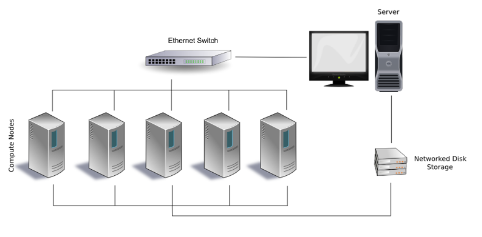
  <figcaption class="fig-caption">Architettura di un cluster distribuito con nodo master, nodi di calcolo, rete interconnessa e storage condivisibile via NFS.</figcaption>
</figure>

#### Requisiti di Rete e Autenticazione tra Nodi

Per consentire al nodo primario (Master Node) di coordinare i nodi di calcolo (Compute Nodes), il runtime MPI fa affidamento su meccanismi di esecuzione remota sicura e senza interazione manuale (Password-less SSH):

* Autenticazione tramite Chiavi Asimmetriche:
Il nodo master condivide le proprie chiavi pubbliche SSH con tutti i nodi di calcolo del cluster. Ciò permette al launcher MPI di effettuare il login remoto automatico ed eseguire comandi sui nodi remoti senza richiedere l'inserimento di password a runtime.

* Omogeneità dell'Ambiente e Gestione Utenti:
È fondamentale che l'ambiente di esecuzione e i permessi sui file siano identici su tutti i nodi. In contesti ad alte prestazioni, questo risultato si ottiene attraverso la configurazione di un account utente comune e l'adozione di file system distribuiti (come NFS) per la condivisone della cartella home e dei binari dell'applicazione.

#### Mappatura delle Risorse: L'Host File e la Gestione degli Slot

Per istruire il launcher MPI su quali macchine utilizzare e quanta capacità computazionale allocare su ciascuna di esse, si utilizza un file di configurazione descrittivo noto come Host File.

L'Host File associa i nomi logici dei nodi (risolti tramite il file hosts di sistema) al numero di slot computazionali disponibili. In questo contesto, un uno slot rappresenta un'unità di esecuzione (tipicamente un core fisico o un thread logico della CPU):

```text
# Esempio di configurazione Host File per MPI
master
node0 slots=2
node1 slots=4
```

Attraverso questa configurazione, il runtime MPI ripartisce i processi tra i nodi specificati:

* Senza specifica del parametro slots, il runtime occupa automaticamente tutti i processi/core disponibili sul nodo remoto.
* Indicando esplicitamente il parametro slots, è possibile limitare il numero di processi MPI allocati su una specifica macchina, lasciando i core rimanenti liberi per la gestione del multithreading locale nativo (modello ibrido MPI + std::thread).

L'avvio dell'applicazione su tutto il cluster avviene tramite comandi di orchestrazione dedicati (come mpirun o mpiexec), indicando il file di configurazione e l'eseguibile da distribuire:

```bash
mpirun --hostfile my_hostfile my_mpi_application
```

#### Gestione Avanzata dei Carichi tramite Cluster Scheduler (Slurm)

Nei cluster di grandi dimensioni, in cui più utenti o processi competono per le medesime risorse hardware, l'avvio manuale tramite Host File viene sostituito da un gestore di risorse centralizzato (Cluster Scheduler o Workload Manager).

Il software di riferimento nel settore HPC è Slurm (Slurm Workload Manager). Un cluster scheduler si compone di daemon di monitoraggio attivi su ciascun nodo e assolve a tre funzioni primarie:

* Allocazione delle Risorse:
Assegna agli utenti un accesso esclusivo o condiviso a specifici nodi o frazioni di CPU/GPU per un intervallo di tempo determinato.

* Orchestrazione dei Job:
Fornisce il quadro di esecuzione per avviare, monitorare e raccogliere i risultati di applicazioni parallele e distribuite su una griglia di nodi allocata.

* Gestione delle Code di Lavoro:
Mantiene una coda centralizzata delle richieste di calcolo pendenti, arbitrando la contesa delle risorse e ottimizzando la saturazione hardware complessiva del cluster.

L'integrazione tra schedulatori di cluster e applicazioni multithread/distribuite consente di scalare la capacità di elaborazione da singoli task locali a simulazioni su migliaia di nodi di calcolo interconnessi.

#### Meccanismi di Comunicazione nel Protocollo MPI

Dopo aver allocato le risorse e avviato la griglia di calcolo distribuita, il coordinamento dei nodi si basa sull'infrastruttura di passaggio di messaggi (Message Passing). Un messaggio MPI rappresenta l'unità fondamentale di scambio ed è definito in modo rigoroso dalle seguenti proprietà:

* Mittente e Destinatario (Sender/Receiver): Identificati mediante i relativi Rank all'interno del Communicator.
* Identificativo (Message Tag): Un intero numerico associato al messaggio che consente al ricevente di filtrare, categorizzare o dare priorità ai pacchetti in ingresso.
* Numero di Elementi (Count): Indica la quantità esatta di elementi trasmessi durante l'invio, oppure la capacità massima accettabile del buffer durante la ricezione.
* Tipo di Dato (MPI Datatype): Specifica la struttura della memoria trasmessa per consentire la corretta conversione hardware.

#### Tipizzazione dei Dati e Astrazione della Memoria

Un aspetto critico della comunicazione di rete tra macchine eterogenee è rappresentato dal layout di memoria e dall'ordinamento dei byte (Endianness). MPI risolve questa problematica astenendosi dal trasmettere semplici blocchi di byte untyped, imponendo l'uso dei tipi di dato MPI:

* Tipi Primitivi Integrati:
MPI fornisce una mappatura diretta per tutti i tipi nativi del C/C++ (es. MPI_INT per int, MPI_DOUBLE per double, MPI_BYTE per char). Il runtime si occupa automaticamente di effettuare eventuali conversioni di endianness e allineamento tra macchine con architetture differenti.

* Tipi Strutturati Personalizzati (Custom Types):
Per evitare l'overhead di serializzazione manuale di strutture dati complesse (come le struct C++), MPI permette di definire tipi derivati tramite funzioni di riflessione del layout di memoria come MPI_Type_create_struct.

L'esempio seguente mostra come mappiamo una struct C++ in un tipo di dato MPI riconosciuto dal runtime:

```cpp
#include <mpi.h>
#include <cstddef>

struct DataPacket {
    int id;
    double value;
};

void register_mpi_type(MPI_Datatype* mpi_packet_type) {
    const int count = 2;
    int blocklengths[2] = {1, 1};
    MPI_Datatype types[2] = {MPI_INT, MPI_DOUBLE};
    MPI_Aint offsets[2];

    offsets[0] = offsetof(DataPacket, id);
    offsets[1] = offsetof(DataPacket, value);

    // Creazione e commit del nuovo tipo di dato MPI
    MPI_Type_create_struct(count, blocklengths, offsets, types, mpi_packet_type);
    MPI_Type_commit(mpi_packet_type);
}
```

La registrazione del tipo (MPI_Type_commit) consente al motore di rete di accedere ai campi della struct direttamente per offset, trasferendo i dati in un'unica operazione di I/O senza copie intermedie.

#### Modelli di Comunicazione: Punto-a-Punto, Broadcast e Scatter/Gather

La comunicazione in MPI si articola in due paradigmi principali:

* Comunicazione Punto-a-Punto (Blocking Send/Recv):
Istanziata tramite MPI_Send e MPI_Recv, realizza un canale di trasmissione diretto tra due nodi specifici. Le primitive bloccanti impongono che la funzione d'invio non ritorni finché il buffer non è stato preso in carico dallo stack di rete, mentre la ricezione attende fino all'arrivo effettivo del pacchetto.

* Operazioni Collettive (Broadcast, Scatter, Gather):
Invece di iterare manualmente chiamate punto-a-Punto (che genererebbero saturazione della banda), le operazioni collettive utilizzano algoritmi ad albero o ad anello per distribuire le comunicazioni su più link di rete simultaneamente.
  * MPI_Bcast: Trasmette la medesima porzione di memoria da un nodo master a tutti i nodi appartenenti al Communicator.
  * MPI_Scatter: Mantiene un unico array sul nodo master, ne suddivide la memoria in fette omogenee e invia ciascuna fetta ad un nodo differente in base al suo Rank.
  * MPI_Gather: Esegue l'operazione inversa rispetto allo Scatter; raccoglie i vettori parziali provenienti dai nodi del cluster e li ricompone in un unico array sul nodo radice ordinandoli per Rank.

#### L'Architettura Ibrida: MPI + Multithreading C++

L'approccio più efficiente ed avanzato nei cluster ad alte prestazioni non consiste nell'allocare un processo MPI isolato per ogni singolo core della CPU, ma nell'adottare un'architettura ibrida (Hybrid Parallelism).

Allocare un processo MPI distinto per ciascun core comporta notevoli svantaggi: duplicazione dei dati in memoria RAM, contesa delle risorse e un volume enorme di messaggi di rete inter-processo.

Nell'architettura ibrida:
1. Viene avviato un unico processo MPI per ciascun nodo fisico o socket del cluster.
2. Ciascun processo MPI rileva il numero di core locali e crea un pool di thread nativi (utilizzando la Standard Library C++ o OpenMP) per saturare l'hardware locale.

```cpp
#include <mpi.h>
#include <omp.h>
#include <stdio.h>

int main(int argc, char* argv[]) {
    int rank, numprocs;

    MPI_Init(&argc, &argv);
    MPI_Comm_rank(MPI_COMM_WORLD, &rank);
    MPI_Comm_size(MPI_COMM_WORLD, &numprocs);

    // Regione parallela locale per ciascun nodo MPI
    #pragma omp parallel
    {
        int thread_id = omp_get_thread_num();
        int total_threads = omp_get_num_threads();

        printf("Nodo MPI Rank %d/%d -> Thread locale %d/%d\n",
               rank, numprocs, thread_id, total_threads);
    }

    MPI_Finalize();
    return 0;
}
```

I vantaggi del modello ibrido includono:
* Comunicazione In-Memory Rapida: I thread all'interno dello stesso nodo scambiano dati alla velocità del bus di memoria (tramite puntatori e strutture condivisibili) anziché transitare per il protocollo di rete.
* Riduzione del Traffico di Rete: Il numero complessivo di messaggi MPI e l'overhead delle intestazioni dei pacchetti viene ridotto di un fattore pari al numero di thread locali.
* Zero Duplicazione dei Dati: I dataset di sola lettura vengono allocati una sola volta per nodo e letti simultaneamente dai vari thread.

#### Pitfall e Sincronizzazione nei Sistemi Distribuiti

La programmazione distribuita eredita tutte le problematiche classiche della concorrenza locale (Data Race, Deadlock), introducendo criticità legate alla natura del mezzo trasmissivo:

* Deadlock da Accumulo di Send (Buffer Exhaustion):
Poiché la chiamata MPI_Send è bloccante, inviare una sequenza di messaggi senza che il nodo ricevente abbia già invocato la rispettiva MPI_Recv può causare il riempimento dei buffer di rete interni. Se due nodi eseguono entrambi un'operazione di invio reciproco prima di porsi in ascolto, il sistema entra in una condizione di Deadlock distribuito. Per prevenire questo fenomeno si adottano chiamate non bloccanti (MPI_Isend, MPI_Irecv) o meccanismi di controllo del flusso tramite code di feedback.

* Barriere di Sincronizzazione Distribuiti (MPI_Barrier):
Lo strumento di sincronizzazione esplicito tra nodi è rappresentato da MPI_Barrier. Essa blocca l'avanzamento di ciascun processo finché tutti gli altri membri del Communicator non hanno raggiunto il medesimo punto. L'uso eccessivo di barriere di rete degrada pesantemente le prestazioni, poiché la velocità dell'intero cluster viene vincolata al nodo più lento (straggler effect).

### Multithreading with GPGPU

Negli ultimi decenni, il calcolo ad alte prestazioni ha visto una convergenza fondamentale verso le architetture eterogenee (Heterogeneous Computing). Mentre le CPU moderne sono progettate per ridurre al minimo la latenza di esecuzione di singoli flussi di istruzioni complessi tramite grandi memorie cache e sofisticati predittori di salto, le GPU (Graphics Processing Units) sono ottimizzate per massimizzare il throughput di calcolo parallelo su un grande volume di dati.

L'uso della GPU per scopi computazionali generali (GPGPU - General-Purpose Computing on Graphics Processing Units) estende i concetti di multithreading appresi finora, consentendo di accelerare l'elaborazione di dataset imponenti in ambiti quali simulazioni scientifiche, elaborazione di immagini e video (Photoshop, Blender, FFmpeg), analisi finanziarie e crittografia.

#### Differenze Architetturali: Scalari SISD vs Vettoriali SIMD

Per comprendere appieno la differenza tra un cluster CPU distribuito e un acceleratore GPU, occorre analizzare il paradigma di esecuzione sottostante:

* Paradigma CPU (SISD - Single Instruction, Single Data):
I nodi CPU tradizionali eccellono nei task scalari. Ogni core esegue sequenze di istruzioni complesse su singoli insiemi di dati, facendo affidamento su sofisticate logiche di controllo e gerarchie di cache avanzate (L1, L2, L3) per minimizzare la latenza.

* Paradigma GPU (SIMD / SIMT - Single Instruction, Multiple Data):
Le GPU nascono come elaboratori vettoriali. Un singolo set di istruzioni viene inviato e applicato simultaneamente a porzioni diverse di un grande dataset distribuito su centinaia o migliaia di piccolissimi core di calcolo. Da questo punto di vista, una GPU può essere considerata come un cluster hardware altamente specializzato e stipato in un unico chip.

<figure class="fig-float center" style="width: 80%;">
  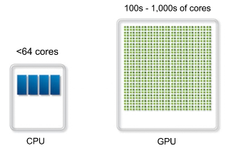
  <figcaption class="fig-caption">Confronto concettuale tra la struttura a pochi core ad alte prestazioni delle CPU e l'architettura a migliaia di core paralleli delle GPU.</figcaption>
</figure> 

In un’applicazione eterogenea, il sistema si articola in due entità distinte:

* Host: La CPU e la memoria di sistema (RAM), responsabili dell'orchestrazione, delle operazioni di I/O e della logica di controllo.
* Device: La GPU (o acceleratore) con la propria memoria ad altissima banda (VRAM), responsabile dell'esecuzione massivamente parallela.


#### Evoluzione delle API e lo Standard OpenCL

Storicamente (intorno al 2001), le prime tecniche GPGPU sfruttavano i linguaggi di shading grafici come GLSL (OpenGL Shading Language). Successivamente sono emersi framework dedicati: soluzioni proprietarie come NVIDIA CUDA (limitata ad hardware specifico) e standard aperti vendor-neutral come OpenCL (Open Computing Language), gestito dal Khronos Group.

OpenCL rappresenta un'astrazione di prim'ordine per l'eterogeneità hardware poiché definisce il sistema in termini di Compute Devices generici, consentendo l'esecuzione dello stesso modello di calcolo su GPU (AMD, Intel, NVIDIA), CPU tradizionali (molto utile in fase di debugging) o acceleratori FPGA.

L'evoluzione dello standard OpenCL evidenzia il progressivo avvicinamento alla programmazione moderna:

* OpenCL 1.x: Ha introdotto le basi per l'elaborazione di buffer 1D/2D/3D, la gestione di comandi asincroni da più thread dell'Host e la ripartizione dei device in sub-device.
* OpenCL 2.0: Ha rivoluzionato la gestione della memoria introducendo la Shared Virtual Memory (SVM), che consente a Host e Device di condividere direttamente strutture dati a puntatori (come alberi o liste concatenate), ed il Parallelismo Dinamico (capacità dei Kernel di accodare altri Kernel direttamente sulla GPU senza intervento della CPU).
* OpenCL 2.1 / 2.2: Ha integrato il linguaggio Kernel basato su un sottoinsieme statico dello standard C++14 (classi, template, lambda e overloads), supportato dal formato binario intermedio portabile SPIR-V.


#### Modello di Esecuzione SIMT e Astrazione dei Thread

A livello hardware, le GPU raggruppano i thread in gruppi esecutivi minimi coordinati (denominati Warp nelle architetture NVIDIA o Wavefront nelle architetture AMD, tipicamente composti da 32 thread). 

Se all'interno dello stesso Warp si verificano ramificazioni condizionali differenti (`if/else`), si genera il fenomeno della Divergenza del Warp (Warp Divergence): i due rami vengono eseguiti in sequenza, disattivando temporaneamente i thread non interessati e riducendo l'efficienza parallela.

L'organizzazione logica software dei thread si sviluppa su tre livelli gerarchici:

* Thread (Work-item): L'unità minimale che esegue il Kernel sul singolo dato.
* Thread Block (Work-group): Un insieme di thread inviati al medesimo multiprocessore della GPU, in grado di sincronizzarsi e condividere una memoria locale (Shared Memory) ad altissima velocità.
* Grid (ND-Range): La griglia globale di blocchi generata per completare la chiamata parallela.


#### Ciclo di Vita della Memoria e Trasferimento Host/Device

Poiché la memoria RAM dell'Host e la VRAM del Device sono distinte e collegate dal bus PCIe, il trasferimento dei dati costituisce il principale collo di bottiglia prestazionale. Il flusso operativo standard di un'applicazione GPGPU prevede:

1. Allocazione dei buffer speculari su memoria RAM (Host) e VRAM (Device).
2. Trasferimento dati Host-to-Device (H2D) via bus PCIe.
3. Lancio del Kernel da parte dell'Host ed esecuzione parallela sulla GPU.
4. Trasferimento dei risultati Device-to-Host (D2H).
5. Rilascio delle risorse.

Per minimizzare la latenza di trasferimento, si adottano strategie avanzate quali la Pinned Memory (memoria RAM non paginabile che attiva il Direct Memory Access - DMA) e l'utilizzo di esecuzioni asincrone mediante flussi di comandi (Command Queues), consentendo alla CPU di sovrapporre il calcolo locale al trasferimento dati sulla GPU.

### Integrazione di OpenCL in Applicazioni C++ Multithreaded

Nei paragrafi precedenti abbiamo analizzato il funzionamento di un'applicazione OpenCL essenziale in un contesto a singolo thread sull'Host. Nelle applicazioni reali ad alte prestazioni, tuttavia, il calcolo su GPU non opera in modo isolato: viene integrato all'interno di architetture C++ multithreaded strutturate (come quelle basate su Thread Pool o librerie di tasking).

L'integrazione tra il multithreading CPU e le pipeline GPGPU introduce sfide architetturali specifiche legate alla concorrenza nell'accesso ai contesti, alla gestione della latenza di trasferimento e al coordinamento asincrono degli eventi.

#### Modelli di Concorrenza tra Host Thread e OpenCL

L'API di OpenCL è progettata nativamente per essere thread-safe a livello di oggetti principali (cl_context, cl_command_queue, cl_mem, cl_event). Questo consente a più thread nativi C++ (std::thread) di interagire contemporaneamente con la GPU, a patto di adottare una corretta strategia di progettazione:

* Contesto Condiviso e Code Dettate (Shared Context, Multiple Queues):
Un singolo cl_context viene creato all'avvio dell'applicazione e condiviso tra tutti i thread dell'Host. Ciascun thread worker gestisce la propria cl_command_queue indipendente. Questa architettura minimizza l'overhead di creazione del contesto e consente alla GPU di sovrapporre ed eseguire in parallelo i comandi provenienti da thread diversi.

* Coda di Comandi Unificata con Sincronizzazione Locale:
Un'unica cl_command_queue viene protetta da una primitiva di sincronizzazione locale (es. std::mutex) o gestita da un singolo thread dedicato all'I/O verso la GPU (Producer-Consumer Pattern). Sebbene più semplice da implementare, questo approccio rischia di serializzare le richieste dei thread CPU, vanificando i vantaggi del multithreading sul client.

#### Gestione Asincrona e Sovrapposizione I/O-Calcolo

Il principale fattore limitante delle prestazioni nelle applicazioni GPGPU è la latenza del bus PCIe durante il trasferimento dei dati tra RAM e VRAM. Per raggiungere l'efficienza massima, l'applicazione C++ deve sovrapporre il trasferimento dati di un task con l'esecuzione del Kernel del task precedente.

Questa sovrapposizione si ottiene combinando le primitive asincrone di OpenCL con i meccanismi di sincronizzazione del C++ moderno:

1. Chiamate Non Bloccanti (Non-blocking Transfers):
I comandi di lettura/scrittura sui buffer (clEnqueueReadBuffer, clEnqueueWriteBuffer) vengono invocati con il parametro blocking_read/write = CL_FALSE. La chiamata ritorna immediatamente al thread CPU, consentendogli di proseguire con altri calcoli locali mentre il controller DMA trasferisce i dati in background.

2. Sincronizzazione basata su Eventi (cl_event e std::future):
Ogni operazione accodata in OpenCL restituisce un oggetto cl_event. I thread C++ possono registrarsi su tali eventi o associare ad essi delle callback (clSetEventCallback) che risvegliano un std::promise o notificano una std::condition_variable al completamento del task hardware.

```cpp
#include <CL/cl.h>
#include <thread>
#include <future>
#include <vector>

void process_data_async(cl_context context, 
                        cl_command_queue queue, 
                        cl_kernel kernel, 
                        const std::vector<float>& host_input, 
                        std::promise<std::vector<float>> result_promise) {

    size_t data_size = host_input.size() * sizeof(float);

    // Allocazione buffer e copia non bloccante Host-to-Device
    cl_mem in_buf = clCreateBuffer(context, CL_MEM_READ_ONLY | CL_MEM_COPY_HOST_PTR, data_size, (void*)host_input.data(), NULL);
    cl_mem out_buf = clCreateBuffer(context, CL_MEM_WRITE_ONLY, data_size, NULL, NULL);

    clSetKernelArg(kernel, 0, sizeof(cl_mem), &in_buf);
    clSetKernelArg(kernel, 1, sizeof(cl_mem), &out_buf);

    size_t global_size = host_input.size();
    cl_event kernel_event, read_event;

    // Esecuzione del Kernel asincrona
    clEnqueueNDRangeKernel(queue, kernel, 1, NULL, &global_size, NULL, 0, NULL, &kernel_event);

    // Allocazione memoria di output sul client C++
    std::vector<float> host_output(host_input.size());

    // Lettura asincrona vincolata al completamento del Kernel (Event Dependency)
    clEnqueueReadBuffer(queue, out_buf, CL_FALSE, 0, data_size, host_output.data(), 1, &kernel_event, &read_event);

    // Callback scatenata dal runtime OpenCL al termine del trasferimento D2H
    clSetEventCallback(read_event, CL_COMPLETE, [](cl_event event, cl_int status, void* user_data) {
        auto* prom = static_cast<std::promise<std::vector<float>>*>(user_data);
        // Si completa la promessa per sbloccare il thread C++ in attesa sul future
        prom->set_value(std::move(*prom_data));
    }, &result_promise);

    // Rilascio dei riferimenti locali ai buffer
    clReleaseMemObject(in_buf);
    clReleaseMemObject(out_buf);
}
```

#### Problematiche e Criticità del Calcolo Eterogeneo Multithreaded

L'integrazione di pipeline GPU all'interno di architetture concorrenti complesse richiede particolare attenzione per evitare colli di bottiglia e comportamenti indefiniti:

* Resource Contention sulla VRAM:
A differenza della RAM dell'Host, la VRAM della GPU è limitata e non può essere espansa tramite memoria virtuale su disco. Se molteplici thread C++ allocano contemporaneamente grandi buffer di memoria sulla GPU (clCreateBuffer), si possono verificare fallimenti di allocazione (CL_OUT_OF_RESOURCES) o un drastico decadimento delle prestazioni dovuto al trashing di memoria.

* Impatto dei Cambi di Contesto Hardware (Scheduling Latency):
Inviare migliaia di piccoli Kernel da thread differenti genera un elevato overhead di scheduling sia lato driver CPU sia lato microcode GPU. È buona norma aggregare i dati (batching) a livello C++ prima di effettuare l'invio alla GPU.

* Sincronizzazione Implicita tra Code:
Alcune operazioni OpenCL (come la ricompilazione di un programma o l'accesso a risorse condivise con OpenGL/DirectX) possono costringere il driver ad eseguire uno flush completo delle pipeline e un blocco di sincronizzazione globale (implicit barrier), congelando temporaneamente l'esecuzione di tutti i thread Host che condividono il medesimo contesto.

### Gestione della Memoria e Gerarchie Hardware nella GPU

Un aspetto cruciale nello sviluppo di applicazioni GPGPU è la gestione della memoria. Esattamente come avviene nelle architetture CPU (dove si spazia dalla memoria di sistema lenta alle cache veloci e ai registri), anche la GPU presenta una gerarchia rigida in cui ogni livello impatta notevolmente sulle prestazioni finali.

<figure class="fig-float center" style="width: 80%;">
  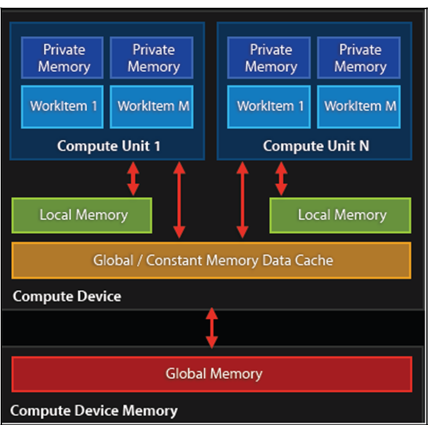
  <figcaption class="fig-caption">Architettura di memoria tipica per dispositivi GPU dedicate (AMD, NVIDIA).</figcaption>
</figure> 

#### Gerarchia della Memoria GPU e Latene

Dalla risorsa più rapida a quella più lenta, la memoria in un'architettura GPU si articola nei seguenti livelli:

1. Registri (Private Memory): La memoria più veloce in assoluto. Ogni Work-Item dispone di uno spazio di registri riservato molto più ampio rispetto a quello presente su una normale CPU.
2. Memoria Locale (Shared Memory): Condivisa tra i vari elementi di calcolo all'interno dello stesso Compute Unit (Work-Group). Ha una latenza molto ridotta (circa 45 cicli su architetture come NVIDIA Kepler).
3. Memoria Costante / Data Cache: Cache dedicata per dati in sola lettura, con latenze intermedie (45–125 cicli).
4. Memoria Globale (VRAM): Situata sulla scheda grafica (es. GDDR5/GDDR6/HBM). Offre un'elevata ampiezza di banda ma soffre di un'alta latenza di accesso (circa 450 cicli di clock).
5. Memoria dell'Host (RAM di sistema): L'accesso più lento in assoluto. Il passaggio dei dati deve attraversare il bus PCIe, introducendo un ritardo misurabile nell'ordine dei microsecondi per singolo trasferimento e millisecondi per blocchi di grande dimensione.

A causa di questa struttura, è fondamentale ottimizzare i trasferimenti minimizzando i passaggi sul bus PCIe, spostando i dati in grandi blocchi indivisi e sfruttando le operazioni asincrone.

#### Flusso Operativo del Calcolo GPGPU

L'integrazione del calcolo parallelo su GPU all'interno di un'applicazione multithreaded si basa su quattro fasi principali:

* Preparazione Dati: Trasferimento iniziale dei dataset (immagini, matrici, segnali) dalla RAM dell'Host alla VRAM della GPU.
* Preparazione Kernel: Caricamento e compilazione dinamica (JIT) del codice OpenCL o CUDA.
* Esecuzione Kernel: Invio del codice alla GPU e avvio dell'elaborazione parallela.
* Lettura Risultati: Recupero dei dati rielaborati dai buffer di output al termine dell'esecuzione.

Dal punto di vista dell'Host, la GPU può essere gestita come un worker thread asincrono. Tuttavia, la sfida principale risiede nella scrittura del Kernel, che deve coordinare l'uso della memoria locale e globale evitando fenomeni di stallo o starvation dei dati.

#### Errori Comuni e Debugging

Un errore frequente nella programmazione GPGPU consiste nel tentativo di accedere al buffer dei risultati prima che la GPU abbia completato l'elaborazione. Per prevenire corruzioni dei dati, freeze o blocchi dell'applicazione, è necessario inserire appositi punti di sincronizzazione (preferibilmente asincroni) tramite eventi.

<figure class="fig-float center" style="width: 80%;">
  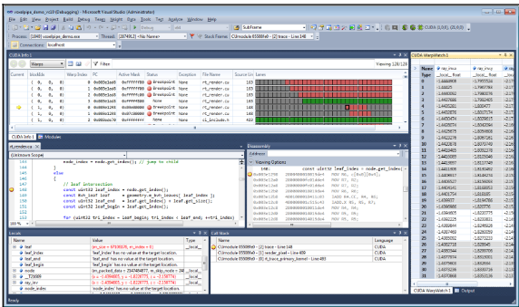
  <figcaption class="fig-caption">Sessione di debug CUDA all'interno di NVIDIA Nsight Visual Studio Edition.</figcaption>
</figure> 

Il debugging dei Kernel rappresenta una delle attività più complesse del calcolo eterogeneo. Oltre alla possibilità offerte da OpenCL di eseguire i Kernel direttamente su CPU per isolare la logica di controllo, vengono impiegati strumenti avanzati come **NVIDIA Nsight** (disponibile per Visual Studio ed Eclipse). Tali tool consentono di ispezionare lo stato dei singoli Warp, analizzare i registri, impostare breakpoint sull'hardware GPU ed eseguire il profiling dei tempi di esecuzione.